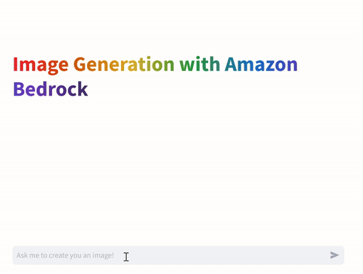
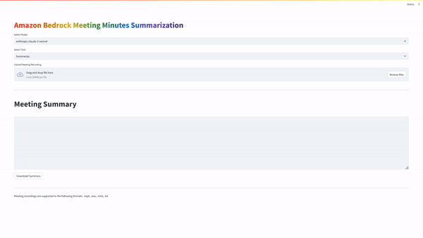
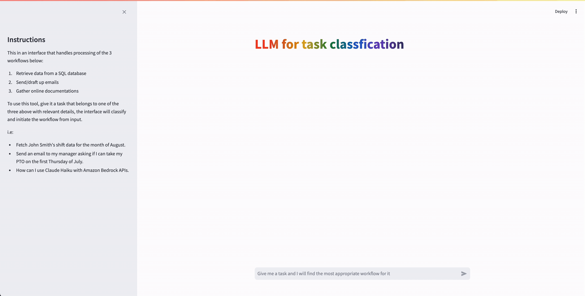
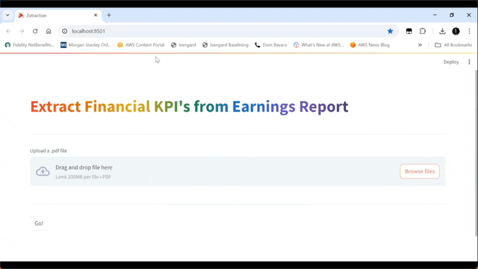
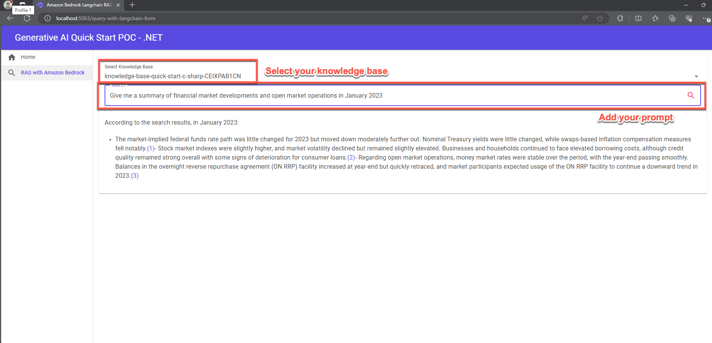
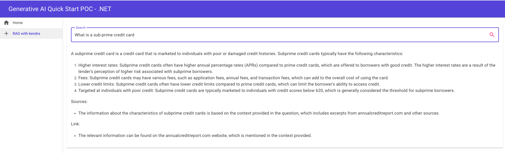

# GenAI Quick Start PoCs

This repository contains sample code demonstrating various use cases leveraging Amazon Bedrock and Generative AI. Each sample is a separate project with its own directory, and includes a basic Streamlit frontend to help users quickly set up a proof of concept.

##### Authors: Brian Maguire, Dom Bavaro, Ryan Doty, Sudeesh Sasidharan, Tarik Makota, Addie Rudy

## Sample Proof of Concepts - Python

1. **Amazon Bedrock Alt Text Generator**
    This POC demonstrates how to use the Amazon Bedrock Alt Text Generator to generate alt text for images in PDF documents.
    

1. **Amazon Bedrock Amazon Athena POC**
    This is sample code demonstrating the use of Amazon Bedrock and Generative AI to use natural language questions to query relational data stores, specifically Amazon Athena. This example leverages the MOMA Open Source Database: https://github.com/MuseumofModernArt/collection.
    
    
    

1. **Amazon Bedrock &amp; Amazon RDS POC**
    This is sample code demonstrating the use of Amazon Bedrock and Generative AI to use natural language questions to query relational data stores, specifically Amazon RDS. This example leverages the MOMA Open Source Database: https://github.com/MuseumofModernArt/collection.
    
    
    

1. **Amazon Bedrock &amp; Amazon Redshift POC**
    This is sample code demonstrating the use of Amazon Bedrock and Generative AI to use natural language questions to query relational data stores, specifically Amazon Redshift. This example leverages the MOMA Open Source Database: https://github.com/MuseumofModernArt/collection.

 	**Please Note: If you don&#39;t want to build this from scratch, Amazon Redshift now supports GenAI capabilities natively, more information on that can be found [here](https://aws.amazon.com/blogs/aws/amazon-redshift-adds-new-ai-capabilities-to-boost-efficiency-and-productivity/).**
    
    
    

1. **Amazon Bedrock Asynchronous Invocation POC**
    This is sample code demonstrating the use of Amazon Bedrock and Generative AI to perform asynchronous invocations of large language models. The application is constructed with a simple streamlit frontend where users can input zero shot requests directly against the LLM of their choice, leveraging asynchronous invocations, to invoke 3 models simultaneously to reduce overall latency.
    
    
    

1. **Amazon Bedrock Chat POC**
    Amazon Bedrock Chat POC
    
    
    

1. **Amazon Bedrock Claude 3 Image Analysis POC**
    This is sample code demonstrating the use of Amazon Bedrock and Multi-Modal Generative AI models from Anthropic to implement an image analysis use case. The application is constructed with a simple streamlit frontend where users can upload a 1 page jpeg, png or PDF and get a description of the image.
    
    
    

1. **Amazon Bedrock Claude 3 Long Form Output POC**
    This is sample code demonstrating the use of Amazon Bedrock and Generative AI to translate text from a source to target language.
    
    
    

1. **Amazon Bedrock Claude 3 Multi-Modal POC**
    This is sample code demonstrating the use of Amazon Bedrock and Anthropic Claude 3 to satisfy multi-modal use cases. The application is constructed with a simple streamlit frontend where users can input zero shot requests to satisfy a broad range of use cases, including image to text multi-modal style use cases.
    
    
    

1. **Amazon Bedrock Claude 3 Streaming Response POC**
    This is sample code demonstrating the use of Amazon Bedrock and Generative AI to implement streaming responses. The application is constructed with a simple streamlit frontend where users can input zero shot requests directly against the LLM of their choice, leveraging a streaming response technique.
    

1. **Amazon Bedrock Converse API POC**
    This is sample code demonstrating the use of the Amazon Bedrock Converse API to help with conversation oriented use cases that require context preservation. The application is constructed with a simple streamlit frontend where users can input zero shot requests to Claude 3, with the Amazon Bedrock Converse API in place to allow users to ask context aware questions.
    
    
    

1. **Amazon Bedrock Converse Stream API POC**
    This is sample code demonstrating the use of the Amazon Bedrock ConverseStream API to help with conversation oriented use cases that require context preservation. The application is constructed with a simple streamlit frontend where users can input zero shot requests to Claude 3, with the Amazon Bedrock ConverseConverseStream API in place to allow users to ask context aware questions and stream the response back.
    
    
    

1. **Amazon Bedrock CSV Chatbot POC**
    This is sample code demonstrating the use of Amazon Bedrock and Generative AI to implement a chatbot is able to converse with the user based on CSV data provided by the user. The application is constructed with a simple streamlit frontend where users can upload large CSV files and get them analyzed or start chatbot interactions.
    
    
    

1. **Amazon Bedrock Document Comparison POC**
    This is sample code demonstrating the use of Amazon Bedrock and Generative AI to implement a document comparison use case. The application is constructed with a simple streamlit frontend where users can upload 2 versions of a document and get all changes between documents listed.
    
    
    

1. **Aamazon Bedrock Document Generator POC**
    This is sample code demonstrating the use of Amazon Bedrock and Generative AI to implement a document generation use case. The application is constructed with a simple streamlit frontend where users can provide details and create a document in the exact format that the you specify.
    
    
    

1. **Amazon Bedrock GenAI Dynamic Prompt Explained POC**
    This is sample code that can be used to provide a hands on explanation as to how Dynamic Prompting works in relation to Gen AI. The application is constructed with a simple streamlit frontend where users can ask questions against a Amazon Bedrock supported LLM and get a deeper understanding of how few-shot and dynamic prompting works.
    
    
    

1. **Amazon Bedrock Guardrails POC**
    This is sample code demonstrating the use of Amazon Bedrock Guardrails to help prevent prompt-injection attacks and prevent unintended responses from the LLM. The application is constructed with a simple streamlit frontend where users can input zero shot requests to Claude 3, with Amazon Bedrock Guardrails in place to prevent malicious prompts and responses.
    
    
    

1. **Amazon Bedrock Image Generation POC**
    This is sample code demonstrating the use of Amazon Bedrock and Generative AI to implement an image generation use case. The application is constructed with a simple streamlit frontend where users can input text requests to generate images based on the text input.
    
    
    

1. **Amazon Bedrock Image Generation with Guardrails**
    This sample code demonstrates using Amazon Bedrock Guardrails to prevent Stability Diffusion LLM from generating harmful, obscene, or violent images. The application features a streamlit frontend where users input zero-shot requests to Claude 3. Amazon Bedrock Guardrails determine whether to proceed with generating images using the Stability Diffusion model.
    
    
    

1. **Amazon Bedrock Intelligent Document Processing (IDP) POC**
    This is sample code demonstrating the use of Amazon Bedrock and Generative AI incorporated into an Intelligent Document Processing (IDP) pipeline using user-uploaded documents. The application is constructed with a simple streamlit frontend where users can upload various document formats and perform different IDP actions such as text extraction, document summarization and classification, entity recognition, and Q&amp;A to satisfy a broad range of use cases.
    
    
    

1. **Amazon Bedrock Knowledgebases RAG POC**
    This is sample code demonstrating the use of Amazon Bedrock and Generative AI to create vector embeddings for your data sources using Amazon Bedrock Knowledge bases with the ability ask questions against the stored documents. The application is constructed with a RAG based architecture where users can ask questions against the Knowledge bases.
    

1. **Amazon Bedrock LangChain RAG POC**
    This is sample code demonstrating the use of Amazon Bedrock and Generative AI using Langchain as orchestrator with the ability ask questions against the stored documents. This sample uses Knowledge bases as to retrieve the stored documents, however you can extend or update this sample to retrieve your stored documents from any Vector DB.
    
    
    

1. **Amazon Bedrock Meeting Minutes Summarization POC**
    This application demonstrates using Amazon Bedrock and Amazon Transcribe to summarize meeting recordings. The streamlit frontend allows users to upload audio, video, or text files of meeting recording. Amazon Transcribe generates a transcript of recording and sent it Amazon Bedrock for summarization of the key discussion points. Users can then download the  generated summarized meeting notes.
    
    
    

1. **Amazon Bedrock Model Customization**
    This sample leverages Jupyter Notebooks to demonstrate how to customize bedrock models.
    

1. **Amazon Bedrock Model Evaluation Data Prep Tool**
    This is sample code aimed to accelerate customers aiming to leverage [Amazon Bedrock Model Evaluator](https://docs.aws.amazon.com/bedrock/latest/userguide/model-evaluation.html) with custom prompt data. This Proof-of-Concept (POC) enables users to provide a CSV containing data that should be used with Amazon Bedrock Model Evaluator. The user then maps the CSV columns to the appropriate fields depending on which type of Model Evaluation being executed. This will generate one or more `.jsonl` formatted files, ready for use with Amazon Bedrock Model Evaluator.
    

1. **Amazon Bedrock Model Playground POC**
    This is sample code demonstrating the use of Amazon Bedrock and Generative AI to implement a Gen AI model playground. The application is constructed with a simple streamlit frontend where users can input zero shot requests and select any LLM offered by Amazon Bedrock.
    
    
    

1. **Amazon Bedrock PowerPoint Generator**
    This is sample code demonstrates the use of Amazon Bedrock and Generative AI to implement a PowerPoint generator. The application is constructed with a simple streamlit frontend where users can input a topic and get a PowerPoint generated based on the topic. Using Generative AI, the solution creates relevant Wikipedia queries to perform in-depth research on the presentation content.
    

1. **Amazon Bedrock RAG with Kendra POC**
    This is sample code demonstrating the use of Amazon Bedrock and Generative AI to implement a RAG based architecture with Amazon Kendra. The application is constructed with a simple streamlit frontend where users can ask questions against documents stored in Amazon Kendra.
    
    
    

1. **Amazon Bedrock RAG with OpenSearch Serverless POC**
    This is sample code demonstrating the use of Amazon Bedrock and Generative AI to create custom embeddings stored in Amazon OpenSearch Serverless with the ability ask questions against the stored documents. The application is constructed with a RAG based architecture where users can ask questions against the indexed embeddings within OpenSearch Serverless.
    
    
    

1. **Amazon Bedrock Semantic Cache POC**
    This project demonstrates a Retrieval-Augmented Generation (RAG) system using Amazon Bedrock for knowledge retrieval and OpenSearch for semantic caching. It provides a Streamlit-based user interface for asking questions about data stored in Amazon Knowledge Bases.
    
    
    

1. **Amazon Bedrock Speech to Text POC**
    This is sample code demonstrating the use of Amazon Bedrock and Generative AI to implement a ChatGPT alternative using speech-to-text prompts. The application is constructed with a simple streamlit frontend where users can provide zero shot requests using their computer’s microphone and listen to responses to satisfy a broad range of use cases.
    
    
    

1. **Amazon Bedrock Streaming Response POC**
    This is sample code demonstrating the use of Amazon Bedrock and Generative AI to implement streaming responses. The application is constructed with a simple streamlit frontend where users can input zero shot requests directly against the LLM of their choice, leveraging a streaming response technique.
    
    
    

1. **Amazon Bedrock Summarization of Long Documents POC**
    This is sample code demonstrating the use of Amazon Bedrock and Generative AI to implement a long document summarization use case. The application is constructed with a simple streamlit frontend where users can upload large documents and get them summarized.
    
    
    

1. **Amazon Bedrock Task Classification POC**
    This sample code demonstrates how to use Amazon Bedrock and Generative AI to implement a task classification bot. The application is constructed with a simple streamlit frontend where users can input a task and get the correct classification which then trigger appropriate downstream workflows to process the task inputted. 
    
    
    

1. **Amazon Bedrock Text Extraction POC**
    This is sample code demonstrating the use of Amazon Bedrock and Generative AI to extract text from a document. The application is constructed with a simple streamlit frontend where users leverage Bedrock Agents to extract and summarize key information from a document like a financial earnings report. 
    
    
    

1. **Amazon Bedrock Translation POC**
    This is sample code demonstrating the use of Amazon Bedrock and Generative AI to translate text from a source to target language. Additionally, this demo also includes an Amazon Translate usecase.
    
    
    

1. **Amazon Bedrock Video Chapter Creator POC**
    This is sample code demonstrating the use of Amazon Transcribe, Amazon OpenSearch Serverless, Amazon Bedrock and Generative AI, to a implement video chapter generator and video search sample.
    The application is constructed with a simple streamlit frontend where users can upload a video that will be stored, transcribed and have searchable chapters generated. Additionally, if you have videos already uploaded to S3 and have subtitles for the video already created in `.srt` format, you can skip transcribing and jump straight into generating chapters.

    The sample also includes a second UI that allows the user to ask about a topic. This will search the video chapters from the videos you&#39;ve provided and provide a video, set to a specific chapter, that was the closest match to the inquiry.
    
    
    

1. **Sales Analyst Bedrock Databricks POC**
    This is sample code demonstrating the use of Amazon Bedrock and Generative AI to create an intelligent sales data analyst that uses natural language questions to query relational data stores, specifically Databricks. This example leverages the complete Northwind sample database with realistic sales scenarios containing customers, orders, and order details.
    
    
    

## Sample Proof of Concepts - .NET

1. **Amazon Bedrock Converse API POC**
    This repository contains sample code demonstrating various use cases leveraging Amazon Bedrock and Generative AI using Amazon Bedrock SDK for .NET. Each sample is a separate page within a Visual Studio Solutions, and includes a basic Blazor frontend to help users quickly set up a proof of concept.
    
    
    

1. **Amazon Bedrock Document Generator POC**
    This is sample code demonstrating the use of Amazon Bedrock and Generative AI to create content for documents.
    
    
    

1. **Amazon Bedrock Guardrail POC**
    This is sample code demonstrating the use of Amazon Bedrock Guardrails to help prevent prompt-injection attacks and prevent unintended responses from the LLM. The application is constructed with a simple ASP.NET Blazor frontend where users can input zero shot requests to Claude 3, with Amazon Bedrock Guardrails in place to prevent malicious prompts and responses.
    
    
    

1. **Amazon Bedrock Knowledgebases RAG POC**
    This repository contains sample code demonstrating various use cases leveraging Amazon Bedrock and Generative AI. Each sample is a separate project with its own directory, and includes a basic Streamlit frontend to help users quickly set up a proof of concept.
    
    
    

1. **Amazon Bedrock RAG Kendra POC**
    This is sample code demonstrating the use of Amazon Bedrock and Generative AI to implement a RAG based architecture with Amazon Kendra.using Amazon Bedrock SDK for .NET. The application is constructed with a simple blazor front-end where users can ask questions against documents stored in Amazon Kendra.
    
    
    

## Agent & Model Context Protocol POC - Python

1. **Model Context Protocol (MCP) based Shipment management System** MCP based system that monitors weather conditions to proactively identify and notify customers about potential shipping delays. This microservices architecture combines weather data from the National Weather Service with shipment tracking to ensure timely communication about weather-related delivery impacts.

## Prerequisites - Python

- Amazon Bedrock Access and CLI Credentials
- Python 3.10 installed on your machine
- Additional prerequisites specific to each sample (e.g., RDS Database, Amazon Kendra index, etc.)

## Prerequisites - .NET

- Amazon Bedrock Access and CLI Credentials (Please ensure your AWS CLI Profile has access to Amazon Bedrock!)
- .NET 8.0
- Visual Studio installed on your machine
- Additional prerequisites specific to each sample (e.g., RDS Database, Amazon Kendra index, etc.)
- Configure the necessary environment variables (e.g., AWS credentials, database connections, etc.).
- Access to Claude 3 haiku model. Please follow this [AWS Documentation](https://docs.aws.amazon.com/bedrock/latest/userguide/model-access.html) to get access to the model.
- Run Blazor app

## Getting Started

1. Clone the repository.
2. Navigate to the desired sample directory.
3. Set up a Python virtual environment and install the required dependencies.
4. Configure the necessary environment variables (e.g., AWS credentials, database connections, etc.).
5. Run the Streamlit application using the provided command.

Detailed instructions for each sample are provided in their respective directories.

## Security

See [CONTRIBUTING](CONTRIBUTING.md#security-issue-notifications) for more information.

## License

This library is licensed under the MIT-0 License. See the LICENSE file.
