# GenAI Quick Start PoCs

This repository contains sample code demonstrating various use cases leveraging Amazon Bedrock and Generative AI. Each sample is a separate project with its own directory, and includes a basic Streamlit frontend to help users quickly set up a proof of concept.

##### Authors: Brian Maguire, Dom Bavaro, Ryan Doty, Sudeesh Sasidharan, Tarik Makota

## Sample Proof of Concepts - Python

1. **Amazon-Bedrock-Summarization-Long-Document-POC:**
   This sample demonstrates using Amazon Bedrock and Generative AI to implement a long document summarization use case. Users can upload large PDF documents, which are chunked and summarized using Amazon Bedrock.
   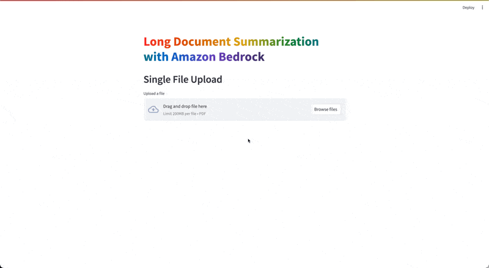
2. **Amazon-Bedrock-RAG-OpenSearchServerless-POC:**
   This sample demonstrates creating custom embeddings stored in Amazon OpenSearch Serverless, and answering questions against the indexed embeddings using a Retrieval-Augmented Generation (RAG) architecture with Amazon Bedrock.
   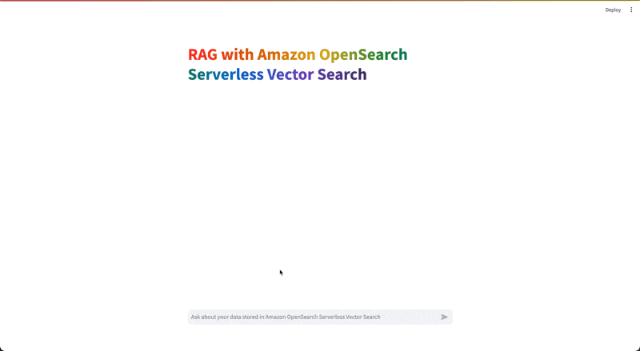
3. **Amazon-Bedrock-RAG-Kendra-POC:**
   This sample implements a RAG-based architecture with Amazon Kendra, allowing users to ask questions against documents stored in an Amazon Kendra index using Amazon Bedrock.
   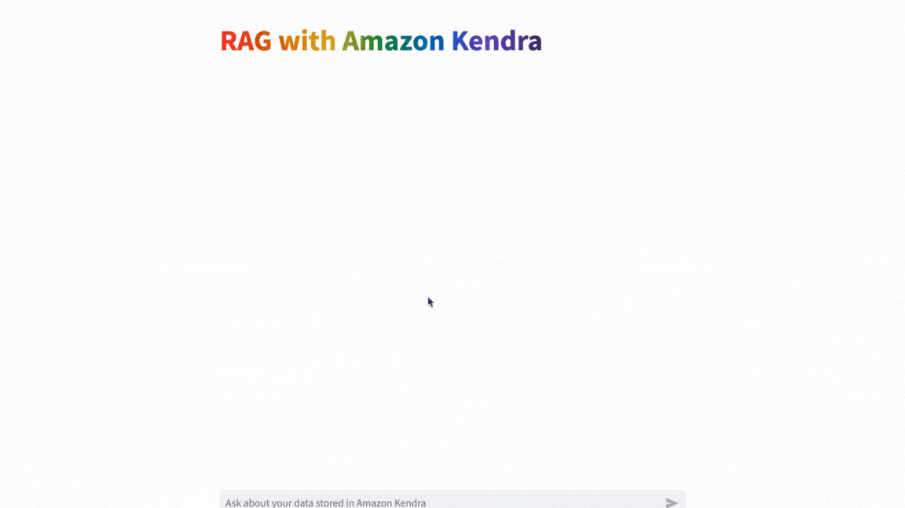
4. **Amazon-Bedrock-Image-Generation-POC:**
   This sample demonstrates using Amazon Bedrock and Generative AI to generate images based on text input requests.
   
5. **Amazon-Bedrock-GenAI-Dynamic-Prompting-Explained-POC:**
   This sample provides a hands-on explanation of how dynamic prompting works in relation to Generative AI, using Amazon Bedrock.
   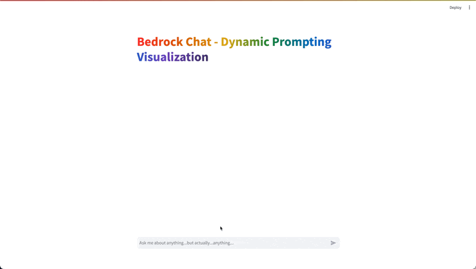
6. **Amazon-Bedrock-Document-Generator:**
   This sample demonstrates using Amazon Bedrock and Generative AI to perform document generation based on a document template and user-provided details.
   
7. **Amazon-Bedrock-Document-Comparison-POC:**
   This sample allows users to upload two PDF documents and get a list of all changes between them using Amazon Bedrock and Generative AI.
   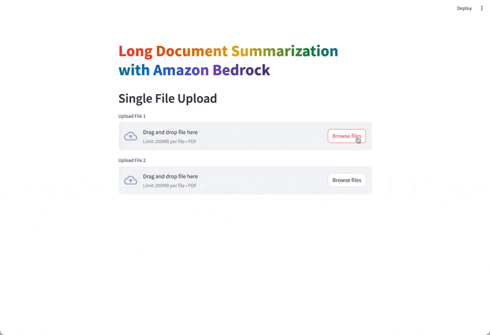
8. **Amazon-Bedrock-Claude3-Multi-Modal-Sample:**
   This sample showcases the multi-modal capabilities of Amazon Bedrock (specifically Anthropic Claude 3), allowing users to input text questions, images, or both to get comprehensive descriptions or answers.
   
9. **Amazon-Bedrock-Chat-POC:**
   This sample provides a ChatGPT alternative using Amazon Bedrock and Generative AI, allowing users to ask zero-shot questions and receive responses.
   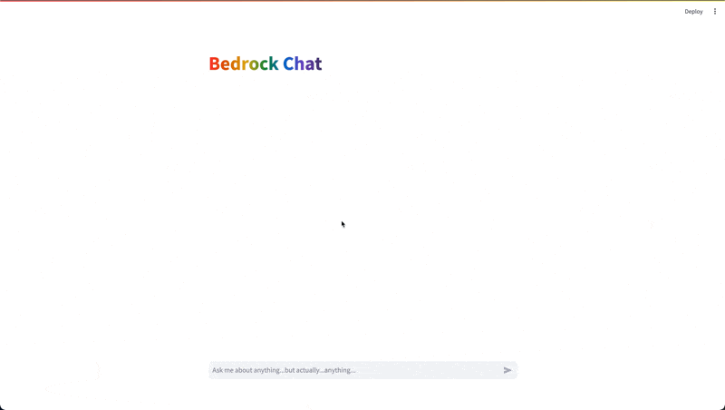
10. **Amazon-Bedrock-Amazon-Redshift-POC:**
    This sample demonstrates using Amazon Bedrock and Generative AI to ask natural language questions and transform them into SQL queries against Amazon Redshift databases.
    
11. **Amazon-Bedrock-Amazon-RDS-POC:**
    This sample allows users to ask natural language questions and transform them into SQL queries against Amazon RDS databases using Amazon Bedrock and Generative AI.
    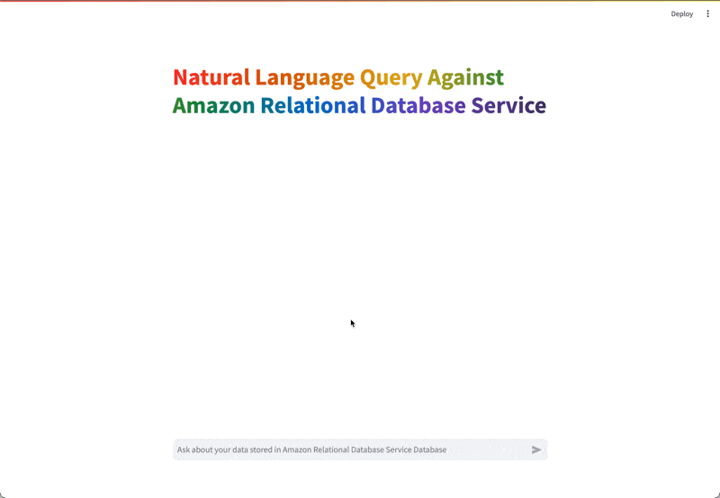
12. **Amazon-Bedrock-Amazon-Athena-POC:**
    This sample demonstrates using Amazon Bedrock and Generative AI to ask natural language questions and transform them into SQL queries against Amazon Athena databases.
    
13. **Amazon-Bedrock-Streaming-Response-POC:** 
    This sample illustrates the utilization of Amazon Bedrock and Generative AI to implement streaming responses. The application is designed with a straightforward Streamlit frontend, enabling users to input zero-shot requests directly against the Large Language Model (LLM) of their choice, utilizing a streaming response technique with majority of Amazon Bedrock models.
    
14. **Amazon-Bedrock-Claude3-Streaming-Response-POC:** 
    This sample illustrates the utilization of Amazon Bedrock and Generative AI to implement streaming responses. The application is designed with a straightforward Streamlit frontend, enabling users to input zero-shot requests directly against Claude 3, utilizing a streaming response technique while leveraging the Anthropic Messages API structure.
    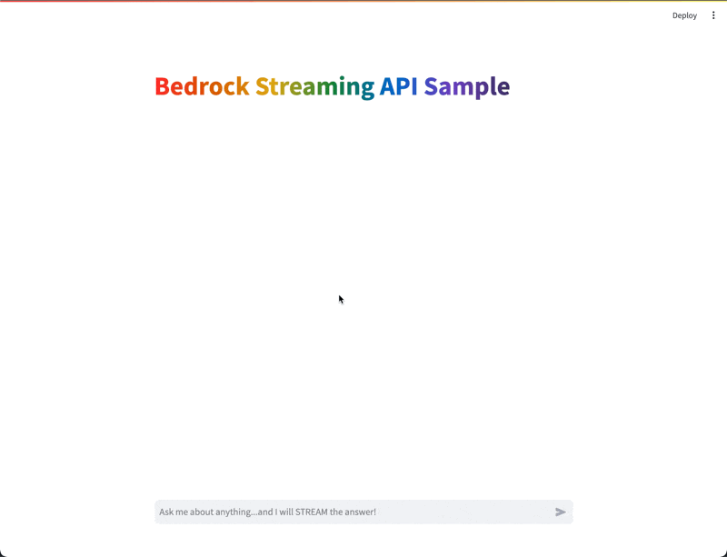
15. **Amazon-Bedrock-Knowledgebases-RAG-POC:** 
    This sample implements a RAG-based architecture with Amazon Bedrock Knowledge Bases, allowing users to ask questions against documents stored in an Amazon Bedrock Knowledge Base using Amazon Bedrock.
    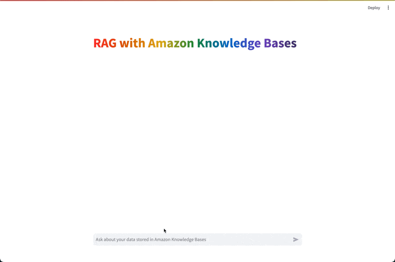
16. **Amazon-Bedrock-Langchain-RAG-POC:** 
    This sample implements a RAG-based architecture with Amazon Bedrock Knowledge Bases using Langchain to help orchestrate the retrieval of information from the knowledge base. This allows users to ask questions against documents stored in an Amazon Bedrock Knowledge Base using Amazon Bedrock, and Langchain as an orchestrator.
    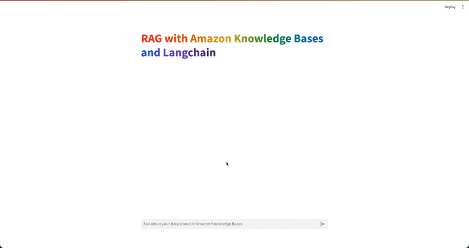
17. **Amazon-Bedrock-Asynchronous-Invocation-POC:** 
    This sample implements asynchronous invocations with Amazon Bedrock allowing users to make multiple simultaneous calls to Bedrock models to decrease overall latency. This allows users to ask questions against 3+ models simultaneously, demonstrating the decrease in latency by doing it asynchronously vs sequentially.
    
18. **Amazon-Bedrock-Model-Playground-POC:** 
    This sample implements an Amazon Bedrock Gen AI Model playground that allows users to select any LLM offered by Amazon Bedrock and ask zero shot questions directly against it. This provides business users the ability to experiment with different Amazon Bedrock LLMs without having access to the AWS console.
    
19. **Amazon-Bedrock-Claude3-Image-Analysis-POC:** 
    This sample implements an image analysis app that uses Amazon Bedrock and Claude3 to collect data from an image and return as JSON. This provides users the ability to quickly experiment with image analysis use-cases and customize the JSON response to the needs of their image analysis use-case.
    
20. **Amazon-Bedrock-Guardrails-POC**
    This sample implements Amazon Bedrock Guardrails to demonstrate how you can leverage guardrails to prevent malicious prompts and repsonse from your generative AI applications built with Amazon Bedrock.
    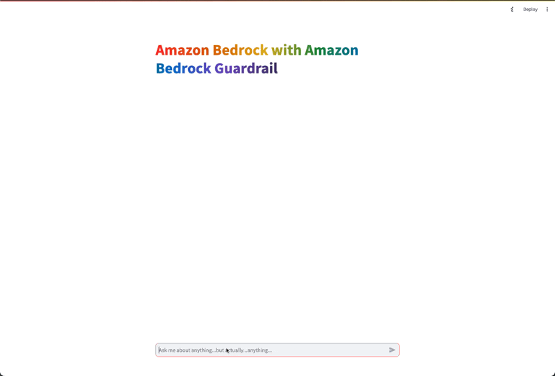
21. **Amazon-Bedrock-Video-Chapter-Search-POC:**
    This is sample code demonstrating the use of Amazon Transcribe, Amazon Bedrock and Generative AI, to implement a video chapter generator and video search sample.
    
22. **Amazon-Bedrock-Model-Customization-POC**
    The sample notebooks provide guidance on fine-tuning and pre-training models in Bedrock.
    The sample data used in the notebooks can be replaced with any data in csv files to create  fine-tuned and pre-trained models using Amazon Titan Express as the base model.
23. **Amazon-Bedrock-Speech-to-Text-Chat-POC:**
    This sample provides a ChatGPT alternative using Amazon Transcribe, Amazon Polly, Amazon Bedrock and Generative AI, allowing users to ask zero-shot questions using speech-to-text prompts and listen to responses.
    
24. **Amazon-Bedrock-CSV-Chatbot-POC:**
    This is sample code demonstrating the use of Amazon Bedrock and Generative AI to implement a chatbot is able to converse with the user based on CSV data provided by the user.
    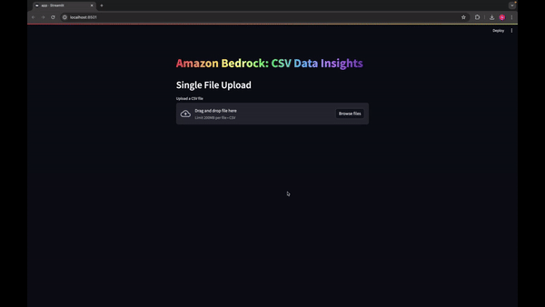
25. **Amazon-Bedrock-Translation-POC:**
    This is sample code demonstrating the use of Amazon Bedrock and Generative AI to translate text from a source to target language.
    

## Sample Proof of Concepts - .NET

1. **Amazon-Bedrock-Summarization-Long-Document-POC:**
   Amazon-Bedrock-Document-Generator: This sample demonstrates using Amazon Bedrock and Generative AI to perform document generation based on a document template and user-provided details.
   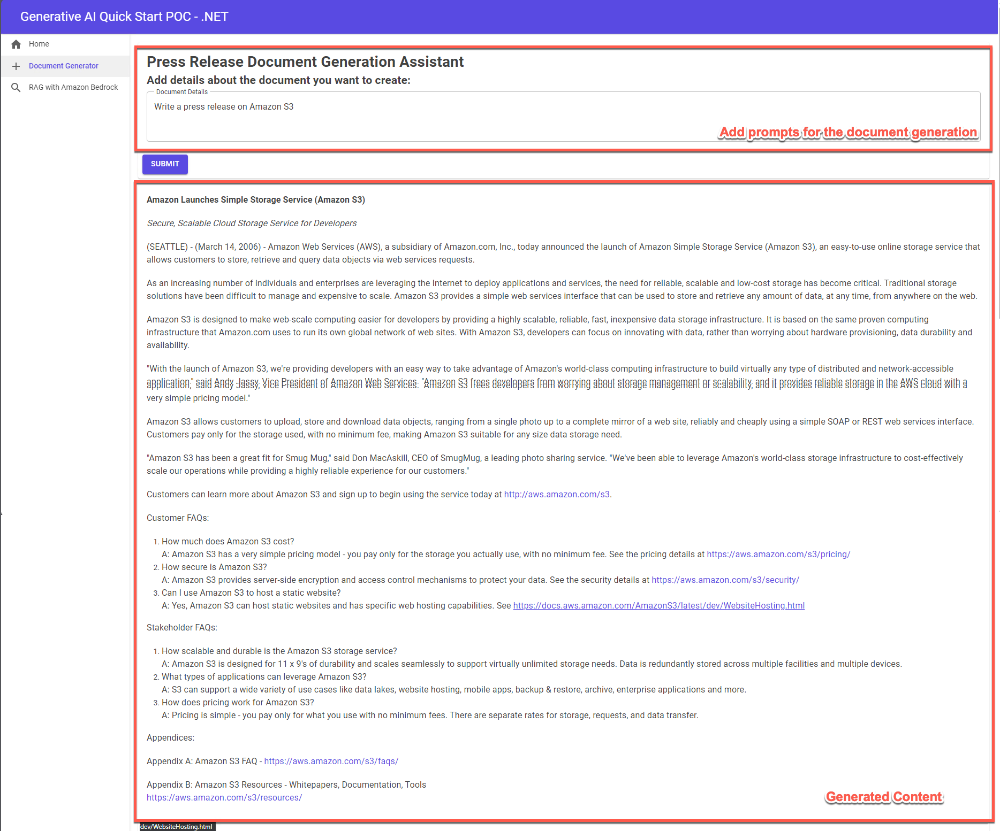
2. **Amazon-Bedrock-Knowledgebases-RAG-POC:**
   This sample implements a RAG-based architecture with Amazon Bedrock Knowledge Bases, allowing users to ask questions against documents stored in an Amazon Bedrock Knowledge Base using Amazon Bedrock.
   
3. **Amazon-Bedrock-Kendra-RAG-POC:** 
    This sample implements a RAG-based architecture with Amazon Kendra, allowing users to ask questions against documents stored in a Kendra index and allowing users to do q&a using Amazon Bedrock models.
    

    
## Prerequisites - Python

- Amazon Bedrock Access and CLI Credentials
- Python 3.10 installed on your machine
- Additional prerequisites specific to each sample (e.g., RDS Database, Amazon Kendra index, etc.)

## Prerequisites - .NET

- Amazon Bedrock Access and CLI Credentials (Please ensure your AWS CLI Profile has access to Amazon Bedrock!)
- .NET 8.0
- Visual Studio installed on your machine
- Additional prerequisites specific to each sample (e.g., RDS Database, Amazon Kendra index, etc.)
- Configure the necessary environment variables (e.g., AWS credentials, database connections, etc.).
- Access to Claude 3 haiku model. Please follow this [AWS Documentation](https://docs.aws.amazon.com/bedrock/latest/userguide/model-access.html) to get access to the model.
- Run Blazor app

## Getting Started

1. Clone the repository.
2. Navigate to the desired sample directory.
3. Set up a Python virtual environment and install the required dependencies.
4. Configure the necessary environment variables (e.g., AWS credentials, database connections, etc.).
5. Run the Streamlit application using the provided command.

Detailed instructions for each sample are provided in their respective directories.

## Security

See [CONTRIBUTING](CONTRIBUTING.md#security-issue-notifications) for more information.

## License

This library is licensed under the MIT-0 License. See the LICENSE file.
