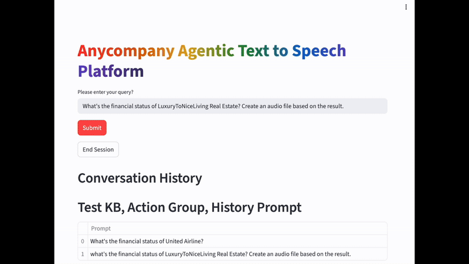
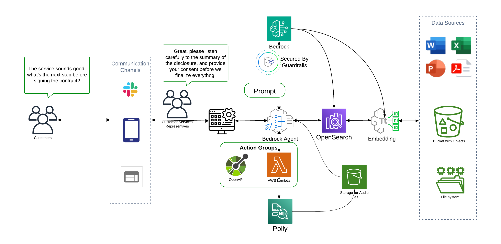

# Amazon Bedrock Agentic Text-to-Speech

## Overview

This PoC demonstrates how to combine Amazon Bedrock agents with text-to-speech capabilities to create an intelligent document summarization and audio generation system. The solution uses agentic-powered RAG to identify relevant policies, disclaimers, and instructions from an internal knowledge base, then leverages large language models to create concise summaries that can be converted to professional-grade audio.

### Use Cases

- **Compliance Requirements**: Industries with strict compliance requirements can provide audible information and confirmations to customers for documentation purposes
- **Hands-Free Operations**: Customer service representatives can access information without manual interaction when multitasking or when hands are occupied
- **Consistent Communication**: Ensures policies, disclaimers, and instructions are delivered consistently and professionally across all customer interactions, maintaining brand voice and improving customer experience





## Prerequisites

- [AWS CLI](https://docs.aws.amazon.com/cli/latest/userguide/getting-started-install.html) installed and configured with access to Amazon Bedrock
- [Python](https://www.python.org/downloads/) v3.12 or greater
- AWS account with appropriate permissions for Bedrock, Lambda, S3, and Polly services 


## Getting Started

### 1. Clone the Repository

```bash
git clone https://github.com/aws-samples/genai-quickstart-pocs.git
cd genai-quickstart-pocs/agents-quickstart-pocs/amazon-bedrock-agent-text-to-speech-poc
```

#### Project Structure

- `streamlit_app/` - Streamlit application with agent invocation and text-to-speech logic
- `agent/` - Lambda function and schema definitions for the Bedrock Agent
- `cnf/` - CloudFormation template for EC2 server hosting
- `sample_data/` - Sample knowledge base data


### 2. Configure Lambda Function

Create a Lambda function using the code from `agent/ActionLambda.py`:
   - Lambda Runtime with Python v3.12+   
   - Configure AWS Region and S3 Bucket for synthesized speech audio data

#### Resource-Based Policy
Follow the sample and add the resource-based policy to allow Bedrock Agent access:

```json
{
  "Version": "2012-10-17",
  "Id": "default",
  "Statement": [
    {
      "Sid": "allow-bedrock-agent",
      "Effect": "Allow",
      "Principal": {
        "Service": "bedrock.amazonaws.com"
      },
      "Action": "lambda:InvokeFunction",
      "Resource": "arn:aws:lambda:<AWS-Region>:<AWS-Account-ID>:function:<Lambda-Function-Name>",
      "Condition": {
        "ArnLike": {
          "AWS:SourceArn": "arn:aws:bedrock:<AWS-Region>:<AWS-Account-ID>:agent/*"
        }
      }
    }
  ]
}
```

#### Execution Role Permissions
Follow the sample and ensure the Lambda execution role includes:
- Amazon S3 access permissions
- Amazon Polly access permissions  
- CloudWatch Logs permissions


```json
{
  "Version": "2012-10-17",
  "Statement": [
    {
      "Effect": "Allow",
      "Action": "logs:CreateLogGroup",
      "Resource": "arn:aws:logs:<AWS-Region>:<AWS-Account-ID>:*"
    },
    {
      "Effect": "Allow",
      "Action": [
        "logs:CreateLogStream",
        "logs:PutLogEvents"
      ],
      "Resource": [
        "arn:aws:logs:<AWS-Region>:<AWS-Account-ID>:log-group:/aws/lambda/<Lambda-Function-Name>:*"
      ]
    },
    {
      "Effect": "Allow",
      "Action": [
        "s3:*",
        "s3-object-lambda:*"
      ],
      "Resource": "*"
    },
    {
      "Effect": "Allow",
      "Action": [
        "polly:*"
      ],
      "Resource": "*"
    }
  ]
}
```

### 3. Setup Amazon Bedrock Agent

#### Create the Agent
1. **Model Selection**: Choose Claude 3.5 Haiku
2. **Agent Instructions**: Use the following prompt:

```
You are an intelligent agent designed to assist customer service representatives with accurate information retrieval, document summarization, and speech synthesis.

Follow these steps:

1. Document Research and Summarization:
   - Conduct detailed research to gather relevant information
   - If "Annual Report" is mentioned, retrieve information from the knowledge base first
   - Provide concise, accurate summaries
   - If no information is available, respond with "Information is not available"

2. Speech Synthesis:
   - When users request audio output, use the synthesis tools
   - Include the file name and S3 presigned URL in the response
   - Format URLs with XML tags: <url>COMPLETE_S3_URL</url>
   
Example response:
"I've generated an audio file with the summary. The audio file [filename] is available at: <url>[Complete S3 presigned URL]</url>"
```

#### Configure Action Group
- Define Action Group Name `AnycompanyIntelligentAgentAction`
- Choose action group type `Define with API schemas`
   - Action Group Invocation: Choose `Select an existing Lambda Function` and select the Lambda function created in step 2
   - Action Group Schema:  Choose `Define via in-line schema editor` and use the API schema from `agent/ActionSchema.json`

#### Configure Knowledge Base
- Create a Bedrock Knowledge Base 
   - [S3 as Bedrock data source](https://docs.aws.amazon.com/bedrock/latest/userguide/s3-data-source-connector.html) 
   - Upload Sample Data provided under `sample_data/` to the S3 data source bucket
   - [Sync sample data with Bedrock Knowlege Base](https://docs.aws.amazon.com/bedrock/latest/userguide/kb-data-source-sync-ingest.html)
-  Link the Bedrock Knowledge Base to Bedrock Agent

### 4. Deploy and Configure Streamlit Application

#### Option A: Deploy on EC2 (Recommended for Production)
1. Deploy the CloudFormation template: `cnf/ec2-streamlit-template.yaml`

2. Update the configuration with your agent details:
   ```bash
   sudo vi app/streamlit_app/invoke_agent.py
   ```
   Update: `agentId`, `agentAliasId`, and `region`. When you first create an Amazon Bedrock agent, you have a working draft version (DRAFT) and a test alias (TSTALIASID) that points to the working draft version. When you make changes to your agent, the changes apply to the working draft. Documentation for [deploying an agent](https://docs.aws.amazon.com/bedrock/latest/userguide/deploy-agent.html).

3. Start the application:
   ```bash
   streamlit run app.py
   ```

#### Option B: Run Locally
1. Navigate to the streamlit app directory:
   ```bash
   cd streamlit_app
   ```

2. Create and activate virtual environment:
   ```bash
   python -m venv .env
   source .env/bin/activate  
   ```

3. Install dependencies:
   ```bash
   pip install -r requirements.txt
   ```

4. Update configuration in `invoke_agent.py` with your agent details

5. Start the application:
   ```bash
   streamlit run app.py
   ```

The application will open in your default browser. 

## Architecture Diagram


