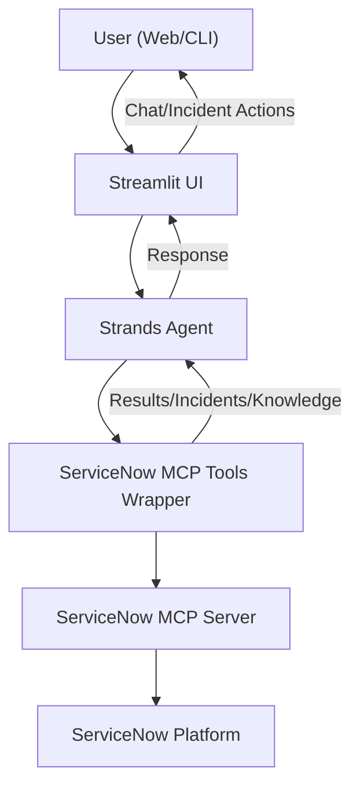

# MCP ServiceNow Helpdesk Assistant with strands and ServiceNow

A modern, AI-powered chatbot interface for ServiceNow incident management, built with Streamlit and powered by Strands Agents and MCP (Model Context Protocol).

## 🚀 Features

### Core Capabilities
- **🤖 Intelligent Chatbot Interface**: Natural language processing for incident management
- **📝 Incident Management**: Create, search, update, and resolve incidents
- **📊 Analytics & Trends**: Analyze incident patterns and generate reports
- **📚 Knowledge Base Search**: Find solutions and troubleshooting guides
- **💬 Conversation History**: Maintain context across multiple interactions
- **🎨 Modern UI**: Clean, responsive Streamlit interface

### MCP Tools Integration
The chatbot uses 6 core ServiceNow MCP tools:
1. **Create Incident** - Create new incidents with proper categorization
2. **Search Incidents** - Find existing incidents based on various criteria
3. **Update Incident** - Modify incident details, status, and assignments
4. **Get Incident Details** - Retrieve comprehensive incident information
5. **Search Knowledge Base** - Find solutions and knowledge articles
6. **List Recent Incidents** - Analyze trends and patterns

## 🛠️ Installation

### Prerequisites
- Python 3.8+
- ServiceNow instance with API access
- AWS Bedrock access (for Claude model)

### Setup

1. **Clone and navigate to the project**:
   ```bash
   cd mcp-servicenow-helpdesk-assistant
   ```

2. **Install dependencies**:
   ```bash
   pip install -r requirements.txt
   ```

3. **Configure environment**:
   - Copy the `env` file and update with your ServiceNow credentials
   - Update AWS credentials if needed

4. **Verify ServiceNow MCP server**:
   - Ensure the ServiceNow MCP server is running and accessible
   - Update the path in `config.py` if needed

## 🚀 Usage

### Streamlit Web Interface (Recommended)
```bash
python main.py streamlit
# or
streamlit run chatbot_app.py
```

### Command Line Interface
```bash
python main.py cli
# or
python main.py
```

### Test Connection
```bash
python main.py test
```

## 💬 Example Interactions

### Creating Incidents
```
User: "Create an incident for email system down"
Assistant: "I'll create an incident for the email system issue. Let me gather the details and create it in ServiceNow..."

User: "Create a high priority incident for VPN connection problems affecting the sales team"
Assistant: "I'll create a high priority incident for the VPN connection issues. This will be assigned to the appropriate team..."
```

### Searching and Updating
```
User: "Search for incidents related to VPN"
Assistant: "I found 5 recent incidents related to VPN issues. Here are the details..."

User: "Update incident INC0012345 status to resolved"
Assistant: "I'll update incident INC0012345 to resolved status. Let me make that change for you..."
```

### Analytics and Trends
```
User: "Show me recent incident trends"
Assistant: "Here's an analysis of recent incident trends. I can see that email-related incidents have increased by 25%..."

User: "What are the most common issues this month?"
Assistant: "Based on the data, the most common issues this month are: 1. Password resets (40%), 2. VPN connectivity (25%)..."
```

### Knowledge Base Search
```
User: "Find solutions for password reset issues"
Assistant: "I found several knowledge articles about password reset procedures. Here are the most relevant solutions..."

User: "Search knowledge base for network troubleshooting"
Assistant: "I'll search the knowledge base for network troubleshooting guides. Here are the available resources..."
```

## ��️ Architecture



**Flow:**
- The user interacts with the chatbot via a web (Streamlit) or CLI interface.
- The UI sends user queries to the Strands Agent.
- The agent uses the ServiceNow MCP Tools Wrapper to perform actions (create/search/update incidents, etc.).
- The tools communicate with the ServiceNow MCP Server, which in turn interacts with the ServiceNow Platform.
- Results are returned back up the chain to the user.

## 🔧 Configuration

### ServiceNow Settings
Update `config.py` with your ServiceNow instance details:
```python
SERVICENOW_MCP_CONFIG = {
    "command": "path/to/servicenow-mcp/python.exe",
    "args": ["-m", "servicenow_mcp.cli"],
    "env": {
        "SERVICENOW_INSTANCE_URL": "https://your-instance.service-now.com",
        "SERVICENOW_USERNAME": "your-username",
        "SERVICENOW_PASSWORD": "your-password",
        "SERVICENOW_AUTH_TYPE": "basic"
    }
}
```

### AWS Bedrock Settings
Configure AWS credentials for Claude model access:
```python
AWS_CONFIG = {
    "region": "us-west-2",
    "access_key_id": "your-access-key",
    "secret_access_key": "your-secret-key"
}
```

## 🎯 Use Cases

### For IT Support Teams
- **Quick Incident Creation**: Create incidents through natural conversation
- **Efficient Search**: Find related incidents and solutions quickly
- **Trend Analysis**: Understand patterns and improve service delivery
- **Knowledge Sharing**: Access and share troubleshooting guides

### For End Users
- **Self-Service**: Get help without waiting for human support
- **Status Updates**: Check incident status and progress
- **Solution Finding**: Access knowledge base for common issues
- **Easy Communication**: Natural language interaction

### For Management
- **Analytics**: View trends and performance metrics
- **Reporting**: Generate incident reports and summaries
- **Process Improvement**: Identify areas for automation and optimization

## 🔒 Security

- **Environment Variables**: Sensitive credentials stored in `.env` file
- **MCP Protocol**: Secure communication with ServiceNow
- **Session Management**: Secure conversation handling
- **Access Control**: ServiceNow authentication and authorization

## 🚀 Deployment

### Local Development
```bash
# Install dependencies
pip install -r requirements.txt

# Run in development mode
streamlit run chatbot_app.py --server.port 8501
```

### Production Deployment
1. Set up proper environment variables
2. Configure ServiceNow MCP server
3. Deploy to your preferred platform (AWS, Azure, GCP)
4. Set up monitoring and logging

## 🤝 Contributing

1. Fork the repository
2. Create a feature branch
3. Make your changes
4. Add tests if applicable
5. Submit a pull request


## 🆘 Support

For support and questions:
- Check the documentation
- Review the example interactions
- Test the connection using `python main.py test`
- Ensure ServiceNow MCP server is running

## 🔄 Updates

- **v1.0.0**: Initial release with core chatbot functionality
- Future versions will include additional features and improvements

---

**Built with ❤️ using Strands Agents, ServiceNow MCP, and Streamlit** 