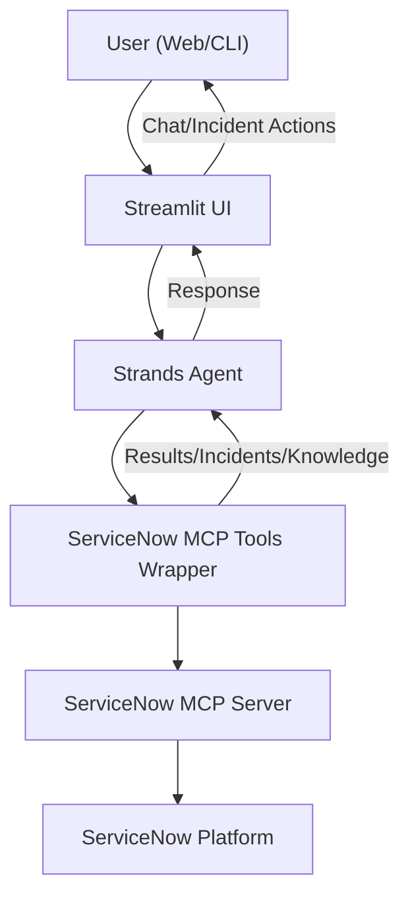

# MCP ServiceNow Helpdesk Assistant with strands and ServiceNow

## 📚 Table of Contents
- [Overview](#overview)
- [Introduction](#introduction)
- [Architecture](#architecture)
- [Features](#features)
- [Configuration](#configuration)
- [Installation](#installation)
- [Usage](#usage)
- [Example Interactions](#example-interactions)

## Overview
A modern, AI-powered chatbot interface for ServiceNow incident management, built with Strands Agents and MCP (Model Context Protocol).

---

## Introduction

**MCP ServiceNow Helpdesk Assistant** is an enterprise-grade, AI-powered chatbot designed to streamline IT service management by integrating ServiceNow with advanced conversational AI. Built using [AWS Strands Agents](https://strandsagents.com/) and the Model Context Protocol (MCP), this application enables natural, context-aware interactions for incident management, knowledge retrieval, and IT support automation.

### What is AWS Strands Agents?
AWS Strands Agents is an open-source, model-driven framework for building intelligent, autonomous agents. It allows developers to:
- Integrate large language models (LLMs) with external tools and APIs
- Orchestrate complex workflows and multi-step reasoning
- Build agents that can plan, reason, and act autonomously
- Support multi-agent collaboration and advanced tool use

Strands Agents provides a simple, code-first interface for connecting LLMs (such as those on Amazon Bedrock) to real-world actions, making it ideal for enterprise automation and AI-driven assistants.

### What is MCP (Model Context Protocol)?
Model Context Protocol (MCP) is a secure, extensible protocol for connecting AI agents to external systems and tools. In this application, MCP is used to bridge the Strands Agent with ServiceNow, enabling the agent to:
- Create, update, and search incidents in ServiceNow
- Retrieve knowledge base articles and recent activity
- Perform secure, auditable operations on enterprise IT systems

MCP ensures that all tool invocations are structured, authenticated, and traceable, making it suitable for enterprise environments.

### About This Application
This assistant provides a modern, conversational interface for ServiceNow, allowing users to:
- Create and manage incidents using natural language
- Search for solutions and knowledge base articles
- Analyze incident trends and generate reports
- Interact via web (Streamlit) or CLI
- Integrate with enterprise authentication and security controls

**Key Features:**
- Seamless integration with ServiceNow via MCP
- Powered by AWS Strands Agents for advanced reasoning and tool use
- Modular architecture for easy extension and customization
- Secure, auditable, and production-ready
- User-friendly Streamlit web interface

Whether you're an IT support agent, end user, or manager, the MCP ServiceNow Helpdesk Assistant accelerates support workflows, reduces manual effort, and brings the power of generative AI to your ITSM operations.

---

## Architecture 🏗️



**Flow:**
- The user interacts with the chatbot via a web (Streamlit) or CLI interface.
- The UI sends user queries to the Strands Agent.
- The agent uses the ServiceNow MCP Tools Wrapper to perform actions (create/search/update incidents, etc.).
- The tools communicate with the ServiceNow MCP Server, which in turn interacts with the ServiceNow Platform.
- Results are returned back up the chain to the user.

### MCP ServiceNow Integration
The application is designed to integrate with ServiceNow using the Model Context Protocol (MCP). The core components are:
- **Strands Agent**: An intelligent agent that uses large language models (LLMs) to understand and generate natural language. It can plan, reason, and act autonomously.
- **MCP Server**: A secure, scalable backend that manages connections, authentication, and tool invocations. It acts as a bridge between the Strands Agent and ServiceNow.
- **ServiceNow Instance**: The enterprise IT service management system that provides incident, knowledge base, and other data.

### Strands Agent Architecture
The Strands Agent is built using the Model Context Protocol (MCP) and interacts with external tools and APIs. It can:
- **Plan**: Use LLMs to understand the user's request and formulate a plan.
- **Reason**: Analyze relevant data (incidents, knowledge base, recent activity) to refine the plan.
- **Act**: Execute the plan by invoking tools (MCP) to interact with ServiceNow.

### MCP Server Architecture
The MCP Server handles:
- **Connection Management**: Manages secure, encrypted connections to ServiceNow.
- **Authentication**: Verifies user credentials and ServiceNow API tokens.
- **Tool Invocation**: Orchestrates the execution of MCP tools (Create Incident, Search Incident, etc.) and manages their results.
- **Error Handling**: Provides robust error handling and logging for debugging.

## Features 🚀

### Core Capabilities
- **🤖 Intelligent Chatbot Interface**: Natural language processing for incident management
- **📝 Incident Management**: Create, search, update, and resolve incidents
- **📊 Analytics & Trends**: Analyze incident patterns and generate reports
- **📚 Knowledge Base Search**: Find solutions and troubleshooting guides
- **💬 Conversation History**: Maintain context across multiple interactions
- **🎨 Modern UI**: Clean, responsive Streamlit interface

### MCP Tools Integration
The chatbot uses 6 core ServiceNow MCP tools:
1. **Create Incident** - Create new incidents with proper categorization
2. **Search Incidents** - Find existing incidents based on various criteria
3. **Update Incident** - Modify incident details, status, and assignments
4. **Get Incident Details** - Retrieve comprehensive incident information
5. **Search Knowledge Base** - Find solutions and knowledge articles
6. **List Recent Incidents** - Analyze trends and patterns

## Configuration 🔧

### Prerequisites
- Python 3.8+
- ServiceNow instance with API access
- AWS Bedrock access (for Claude model)

### Setup

1. **Clone and navigate to the project**:
   ```bash
   cd mcp-servicenow-helpdesk-assistant
   ```

2. **Install dependencies**:
   ```bash
   pip install -r requirements.txt
   ```

3. **Configure environment**:
   - Copy the `env` file and update with your ServiceNow credentials
   - Update AWS credentials if needed

4. **Verify ServiceNow MCP server**:
   - Ensure the ServiceNow MCP server is running and accessible
   - Update the path in `config.py` if needed

## Installation 🛠️

### Prerequisites
- Python 3.8+
- ServiceNow instance with API access
- AWS Bedrock access (for Claude model)

### Setup

1. **Clone and navigate to the project**:
   ```bash
   cd mcp-servicenow-helpdesk-assistant
   ```

2. **Install dependencies**:
   ```bash
   pip install -r requirements.txt
   ```

3. **Configure environment**:
   - Copy the `env` file and update with your ServiceNow credentials
   - Update AWS credentials if needed

4. **Verify ServiceNow MCP server**:
   - Ensure the ServiceNow MCP server is running and accessible
   - Update the path in `config.py` if needed

## Usage ▶️

### Streamlit Web Interface (Recommended)
```bash
python main.py streamlit
# or
streamlit run chatbot_app.py
```

### Command Line Interface
```bash
python main.py cli
# or
python main.py
```

### Test Connection
```bash
python main.py test
```

## Example Interactions

### Creating Incidents
```
User: "Create an incident for email system down"
Assistant: "I'll create an incident for the email system issue. Let me gather the details and create it in ServiceNow..."

User: "Create a high priority incident for VPN connection problems affecting the sales team"
Assistant: "I'll create a high priority incident for the VPN connection issues. This will be assigned to the appropriate team..."
```

### Searching and Updating
```
User: "Search for incidents related to VPN"
Assistant: "I found 5 recent incidents related to VPN issues. Here are the details..."

User: "Update incident INC0012345 status to resolved"
Assistant: "I'll update incident INC0012345 to resolved status. Let me make that change for you..."
```

### Analytics and Trends
```
User: "Show me recent incident trends"
Assistant: "Here's an analysis of recent incident trends. I can see that email-related incidents have increased by 25%..."

User: "What are the most common issues this month?"
Assistant: "Based on the data, the most common issues this month are: 1. Password resets (40%), 2. VPN connectivity (25%)..."
```

### Knowledge Base Search
```
User: "Find solutions for password reset issues"
Assistant: "I found several knowledge articles about password reset procedures. Here are the most relevant solutions..."

User: "Search knowledge base for network troubleshooting"
Assistant: "I'll search the knowledge base for network troubleshooting guides. Here are the available resources..."
```

---

**Built with ❤️ by hdhanoa** 