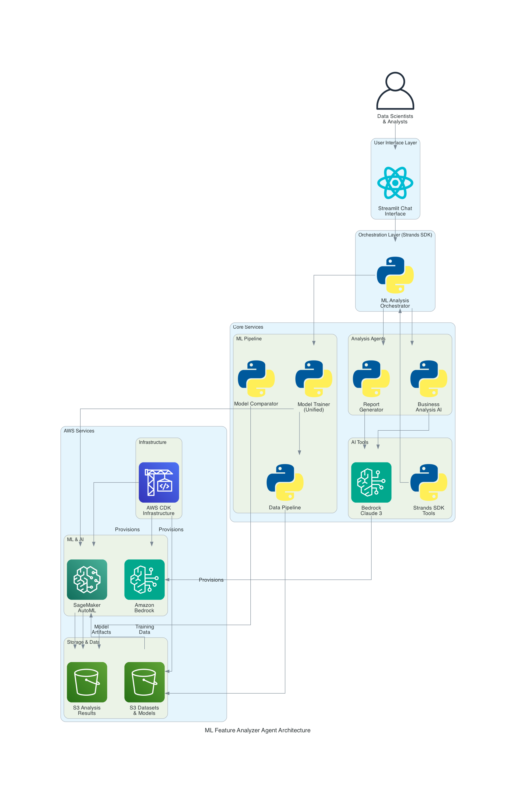

# ML Feature Analyzer Agent

A GenAI-powered solution that helps financial data providers and their customers evaluate the business value of premium data attributes in machine learning models. Built with AWS services and the **Strands SDK**, this solution includes a **Feature Analysis Agent** equipped with **two core tools**:

1. **`compare_models`** - Analyzes performance differences across model tiers (Baseline, Bronze, Silver, Gold, Custom)
2. **`train_model`** - Trains custom models with user-selected premium attributes via natural language

**Use Case**: Financial data providers offer thousands of premium attributes, and customers need a way to quickly discover, test, and quantify their value to make informed purchasing decisions.

### Key Features

- **🎭 Demo Mode**: The project includes sample results from pre-trained models to get started quickly
- **Multi-tier Model Training**: Baseline, Bronze, Silver, and Gold models with increasing attribute sets
- **Custom Model Training**: Train models with specific attribute combinations
- **GenAI-Powered Analysis**: Automated recommendations using Amazon Bedrock and Strands SDK
- **Interactive Chat Interface**: Conversational analysis and model exploration

## 🖥️ User Interface


## 🏗️ Architecture


*System architecture showing AWS services integration and data flow*

### AWS Services
- **Amazon SageMaker**: Automated model training with AutoML
- **Amazon Bedrock and Strands SDK**: AI-powered analysis and report generation
- **Amazon S3**: Dataset and model artifact storage
- **AWS CDK**: Infrastructure as code deployment

### Core Components
- **Model Trainer**: Unified training system for all model tiers
- **Analysis Agent**: GenAI agent for performance comparison and recommendations
- **Orchestrator**: Coordinates workflows between ML training and AI analysis
- **Chat Interface**: Interactive model exploration and custom training

## 📊 Model Tiers

| Tier | Attributes | Description |
|------|------------|-------------|
| **Baseline** | 5 basic | Age, duration, credit amount, installment rate, employment |
| **Bronze** | 10 total | Baseline + 5 premium attributes |
| **Silver** | 15 total | Baseline + 10 premium attributes |
| **Gold** | 20 total | Baseline + all 15 premium attributes |
| **Custom** | Variable | User-selected attribute combinations |

## 🚀 Quick Start

### Demo Mode (Immediate - No Training Required)

**For instant demo with sample data:**

```bash
# Clone and setup
git clone <repository-url>
cd ml-feature-analyzer-agent

# Install dependencies
python -m venv .venv
source .venv/bin/activate
pip install -r requirements.txt

# Configure AWS for Bedrock access
cp .env.example .env
# Edit .env with your AWS region and Bedrock model ID

# Run with demo model results
streamlit run app.py
```

---

### Live Training Mode

**For live model training with results:**

#### Prerequisites
- Python 3.8+
- AWS CLI configured with appropriate permissions
- AWS CDK installed
- Access to Amazon Bedrock (Claude models)
- Access to Amazon SageMaker (for model training)

#### Configuration

```bash
cp .env.example .env
```

Edit `.env` with your AWS configuration:
```bash
# AWS Configuration
AWS_REGION=us-east-1
AWS_PROFILE=your-aws-profile

# Bedrock Configuration
BEDROCK_MODEL_ID=anthropic.claude-3-sonnet-20240229-v1:0
```

#### Deploy Infrastructure

```bash
cd infrastructure
cdk bootstrap
cdk deploy

# Load and process dataset
cd ..
python ml/data_pipeline.py
```

#### Train Models (Optional)

```bash
# Train all models sequentially (~25-30 minutes)
python ml/model_trainer.py --model-type all

# Or train individual models
python ml/model_trainer.py --model-type baseline
python ml/model_trainer.py --model-type bronze
python ml/model_trainer.py --model-type silver
python ml/model_trainer.py --model-type gold
```

#### Run Application

```bash
# App automatically uses live results when available,
# falls back to sample data for untrained models
streamlit run app.py
```


## 📁 Project Structure

```
├── app.py                        # Main Streamlit application
├── bedrock_processor.py          # Bedrock AI operations
├── model_service.py              # Model operations and file handling
├── config.py                     # Configuration and constants
├── utils.py                      # AWS client utilities and caching
├── .env.example                  # Environment configuration template
├── feature_analyzer/             # AI analysis framework
│   ├── agents/                   # AI agents and orchestration
│   │   └── orchestrator.py       # Workflow orchestration agent
│   ├── core/                     # Core analysis logic
│   └── tools/                    # Strands SDK tool wrappers
├── ml/                           # ML pipeline
│   ├── model_trainer.py          # Unified model training
│   └── data_pipeline.py          # Dataset processing and download
├── infrastructure/               # AWS CDK infrastructure
├── data/                         # German Credit Dataset (auto-downloaded)
├── model_results/                # Training results by tier
│   └── samples/                  # Pre-generated sample results for demo
└── docs/                         # Documentation
```

## ⚙️ Environment Variables

| Variable | Description | Default |
|----------|-------------|---------||
| `AWS_REGION` | AWS region for services | `us-east-1` |
| `AWS_PROFILE` | AWS CLI profile to use | `default` |
| `BEDROCK_MODEL_ID` | Bedrock model for analysis | `anthropic.claude-3-sonnet-20240229-v1:0` |
| `APP_TITLE` | Application title | `ML Feature Analyzer` |
| `DEBUG` | Enable debug mode | `false` |

## 📊 Dataset Information

This project uses the **German Credit Dataset** from the UCI Machine Learning Repository:

- **Source**: [UCI ML Repository - German Credit Data](https://archive.ics.uci.edu/ml/datasets/statlog+(german+credit+data))
- **Citation**: Hofmann, Hans. (1994). Statlog (German Credit Data). UCI Machine Learning Repository. https://doi.org/10.24432/C5NC77
- **Description**: 1000 instances with 20 attributes for credit risk assessment
- **Auto-download**: The `data_pipeline.py` script automatically downloads the dataset on first run
- **Local path**: `data/german.data` (created automatically)

### Dataset Attribution
This dataset is made available under the terms of the UCI Machine Learning Repository. Please cite the original source when using this dataset in research or publications.

### Available Premium Attributes

- `checking_account_status` - Checking account status
- `credit_history` - Credit payment history
- `purpose` - Loan purpose
- `savings_account_status` - Savings account balance
- `personal_status_sex` - Personal status and gender
- `other_debtors` - Other debtors/guarantors
- `present_residence_since` - Years at current residence
- `property` - Property ownership
- `other_installment_plans` - Other installment plans
- `housing` - Housing situation
- `existing_credits_count` - Number of existing credits
- `job` - Employment category
- `dependents_count` - Number of dependents
- `telephone` - Telephone registration
- `foreign_worker` - Foreign worker status

## 📈 Sample Results

```
=== MODEL PERFORMANCE COMPARISON ===

BASELINE MODEL (5 attributes):
• AUC: 0.635
• Attributes: Basic demographics only

GOLD MODEL (20 attributes):
• AUC: 0.847
• Improvement: +33.4%
• Additional attributes: 15 premium features

BUSINESS IMPACT:
• Accuracy improvement: 21.2%
• Risk reduction: 44% fewer bad loans
• Estimated annual savings: $156,000
• Premium data ROI: 367%
```

## 🤖 AI Analysis Features

### Automated Report Generation
- Performance comparison across all model tiers
- Business impact analysis
- Technical insights and recommendations
- Executive-ready summaries

### Interactive Chat
- Natural language queries about model performance
- Custom model training assistance
- Attribute selection guidance
- Business case development


## 🧹 Cleanup

**Demo Mode**: No cleanup required - no AWS resources created.
**Live Mode**: Remove AWS resources to avoid ongoing charges:

```bash
cd infrastructure
cdk destroy
```

## 📚 Documentation
- [Architecture Overview](docs/ARCHITECTURE.md)

---

**Built with AWS, SageMaker, Bedrock, and the Strands SDK**