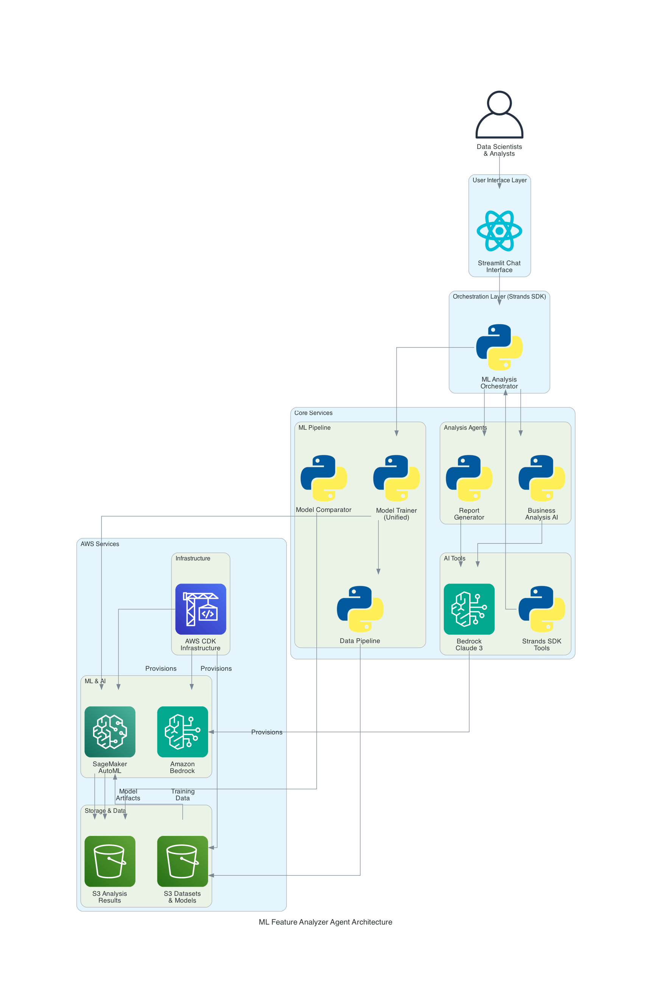
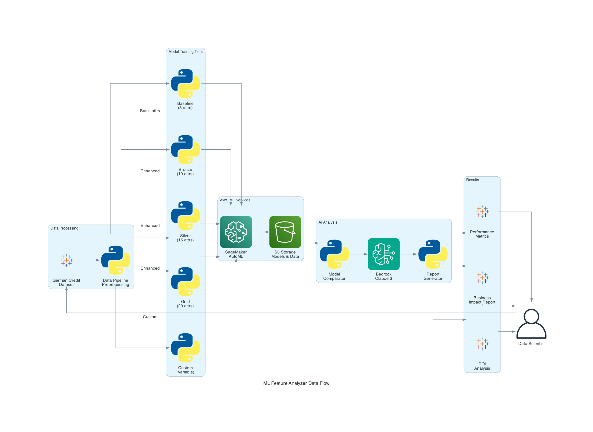

# ML Feature Analyzer Agent - Architecture Overview

## High-Level Architecture



## Core Components

### 1. ML Pipeline (`ml/`)

#### Model Trainer (`model_trainer.py`)
- **Purpose**: Model training tool
- **Technology**: SageMaker Core SDK with AutoML
- **Features**:
  - Multi-tier training (Baseline, Bronze, Silver, Gold)
  - Custom attribute selection

```python
# Model Configuration
ModelConfig(
    model_type='silver',
    max_candidates=1,           # Optimized for speed and proof of concept
    max_runtime_per_job=300,    # 5 minutes per job
    max_total_runtime=900,      # 15 minutes total
    objective_metric='AUC'
)
```

#### Data Pipeline (`data_pipeline.py`)
- **Purpose**: Data preprocessing and feature engineering
- **Dataset**: German Credit Dataset (1,000 records, 20 attributes)
- **Processing**: Train/test splits, feature selection, data validation

### 2. Feature Analysis Agent (`feature_analyzer/`)

#### Orchestrator (`agents/orchestrator.py`)
- **Purpose**: Central coordination service using Strands SDK
- **Features**:
  - Multi-modal analysis workflows
  - Conversation management
  - Tool integration
  - Security validation

```python
# Analysis Types
authorized_analysis_types = {
    'model_comparison',    # Performance analysis
    'custom_training',     # Interactive model creation
    'chat'                # Conversational interface
}
```

#### Core Business Logic (`core/`)
- **Model Comparator (`model_comparator.py`)**: Core engine for performance comparison across model tiers
- **Report Generator (`report_generator.py`)**: Business logic for AI-powered analysis using Amazon Bedrock

#### Strands SDK Tools (`tools/ml_tools.py`)
- **Purpose**: Strands SDK wrapper layer that exposes core functionality as agent tools
- **Architecture**: Uses `@tool` decorator to wrap core business logic for agent consumption
- **Tools Provided**:
  - `compare_models` → calls `ModelComparator.compare_all_tiers()`
  - `train_model` → calls ML training pipeline
  - `generate_report` → calls `ReportGenerator` (future enhancement)

### 3. Application Layer

#### Streamlit Application (`app.py`)
- **Purpose**: Interactive web interface for analysis and training
- **Features**:
  - Real-time model comparison
  - Custom model training wizard
  - Natural language queries
  - Business report generation

#### Service Layer
- **Bedrock Processor (`bedrock_processor.py`)**: Bedrock AI operations
- **Model Service (`model_service.py`)**: Model operations and file handling
- **Utils (`utils.py`)**: AWS client utilities and caching
- **Config (`config.py`)**: Configuration and constants

## Data Architecture

### Data Flow



### Attribute Architecture

#### Basic Attributes (5)
```python
BASIC_ATTRIBUTES = [
    'age',
    'duration_months', 
    'credit_amount',
    'installment_rate',
    'employment_status'
]
```

#### Premium Attributes (15)
```python
PREMIUM_ATTRIBUTES = [
    'checking_account_status',    # Financial history
    'credit_history',            # Payment behavior
    'savings_account_status',    # Financial stability
    'personal_status_sex',       # Demographics
    'other_debtors',            # Risk factors
    'present_residence_since',   # Stability indicators
    'property',                 # Asset ownership
    'other_installment_plans',  # Existing obligations
    'housing',                  # Living situation
    'existing_credits_count',   # Credit exposure
    'job',                      # Employment category
    'dependents_count',         # Financial obligations
    'telephone',                # Contact verification
    'foreign_worker',           # Risk classification
    'purpose'                   # Loan purpose
]
```

#### Tier Mapping
- **Baseline**: 5 basic attributes
- **Bronze**: Basic + 5 premium (10 total)
- **Silver**: Basic + 10 premium (15 total)
- **Gold**: Basic + 15 premium (20 total)
- **Custom**: Basic + user-selected premium

#### Amazon S3
```
ml-feature-analyzer-bucket/
├── datasets/
│   ├── baseline_train.csv
│   ├── baseline_test.csv
│   ├── enhanced_train.csv
│   └── enhanced_test.csv
├── models/
│   ├── baseline/
│   ├── bronze/
│   ├── silver/
│   ├── gold/
│   └── custom/
└── analysis/
    ├── reports/
    └── comparisons/
```

### Infrastructure as Code (CDK)

#### Stack Components (`infrastructure/ml_stack.py`)
```python
class MLFeatureAnalyzerStack:
    - S3 Bucket (with versioning, encryption)
    - SageMaker Execution Role
    - Bedrock Access Policies
    - VPC Configuration (optional)
    - CloudWatch Logging
    - IAM Roles and Policies
```

