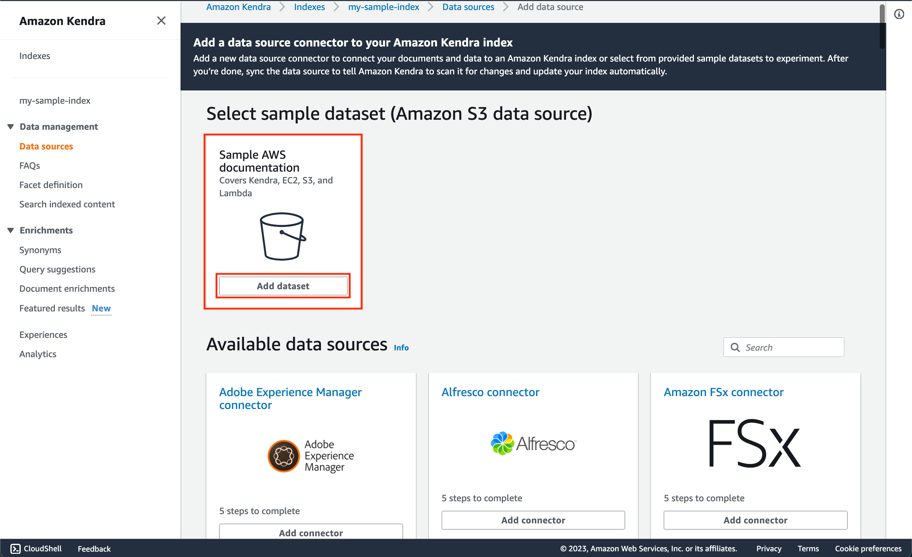

# Amazon-Bedrock-RAG-Kendra-POC

This is sample code demonstrating the use of Amazon Bedrock and Generative AI to implement a RAG based architecture with Amazon Kendra. The application is constructed with a simple streamlit frontend where users can ask questions against documents stored in Amazon Kendra.

# **Goal of this Repo:**

The goal of this repo is to provide users the ability to use Amazon Bedrock and generative AI to take natural language questions, and answer questions against indexed documents in Amazon Kendra.
This repo comes with a basic frontend to help users stand up a proof of concept in just a few minutes.

The architecture and flow of the sample application will be:


When a user interacts with the GenAI app, the flow is as follows:

1. The user makes a request to the GenAI app (app.py).
2. The app issues a search query to the Amazon Kendra index based on the user request. (kendra_bedrock_query.py)
3. The index returns search results with excerpts of relevant documents from the ingested data. (kendra_bedrock_query.py)
4. The app sends the user request and along with the data retrieved from the index as context in the LLM prompt. (kendra_bedrock_query.py)
5. The LLM returns a succinct response to the user request based on the retrieved data. (kendra_bedrock_query.py)
6. The response from the LLM is sent back to the user. (app.py)

# How to use this Repo:

## Prerequisites:

1. Amazon Kendra Index has been created (IF NOT ALREADY CREATED it is covered in step 3).
2. Amazon Kendra Index has a datasource configured and synced (IF NOT ALREADY CREATED it is covered in step 4).
3. Amazon Bedrock Access and CLI Credentials.
4. Appropriate permissions to configure Amazon Kendra Index and Amazon Kendra Data Sources.
5. Ensure Python 3.9 installed on your machine, it is the most stable version of Python for the packages we will be using, it can be downloaded [here](https://www.python.org/downloads/release/python-3911/).

## Step 1:

The first step of utilizing this repo is performing a git clone of the repository.

```
git clone git@ssh.gitlab.aws.dev:gen-ai-field-playbook-pocs/amazon-bedrock-rag-kendra-poc.git
```

After cloning the repo onto your local machine, open it up in your favorite code editor.The file structure of this repo is broken into 3 key files,
the app.py file, the kendra_bedrock_query.py file, and the requirements.txt. The app.py file houses the frontend application (a streamlit app).
The kendra_bedrock_query.py file houses the logic of the application, including the Kendra Retrieve API calls and Amazon Bedrock API invocations.
The requirements.txt file contains all necessary dependencies for this sample application to work.

## Step 2:

Set up a python virtual environment in the root directory of the repository and ensure that you are using Python 3.9. This can be done by running the following commands:

```
pip install virtualenv
python3.9 -m venv venv
```

The virtual environment will be extremely useful when you begin installing the requirements. If you need more clarification on the creation of the virtual environment please refer to this [blog](https://www.freecodecamp.org/news/how-to-setup-virtual-environments-in-python/).
After the virtual environment is created, ensure that it is activated, following the activation steps of the virtual environment tool you are using. Likely:

```
cd venv
cd bin
source activate
cd ../../
```

After your virtual environment has been created and activated, you can install all the requirements found in the requirements.txt file by running this command in the root of this repos directory in your terminal:

```
pip install -r requirements.txt
```

## Step 3:

Now that the requirements have been successfully installed in your virtual environment we can begin configuring environment variables.
You will first need to create a .env file in the root of this repo. Within the .env file you just created you will need to configure the .env to contain:

```
profile_name=<aws_cli_profile_name>
kendra_index=<kendra_index>
```

Please ensure that your AWS CLI Profile has access to Amazon Bedrock, and your Amazon Kendra Index has been created within your AWS account!

**_If you don't have your Amazon Kendra Index created yet, please follow the steps below:_**

1. Go to Amazon Kendra in your AWS Console and click on "Create an Index" 
2. Fill out the "Specify Index details" page, and provide Kendra a role that can access CloudWatch Logs. 
3. Fill out the "Configure Access Control" page 
4. Select the appropriate provisioning editions and create 
5. You can find your Kendra Index ID in the console as seen in the screenshot: 

Depending on the region and model that you are planning to use Amazon Bedrock in, you may need to reconfigure line 44 & 46 in the kendra_bedrock_query.py file:

```
bedrock = boto3.client('bedrock-runtime', 'us-east-1', endpoint_url='https://bedrock.us-east-1.amazonaws.com')

modelId = 'anthropic.claude-v2'
```

## Step 4:

Now that you have cloned the repo, created a virtual environment, set the environment variables, and provisioned your Kendra index, it is now time
to sync a data source within Kendra. As seen in the screenshot below, you can configure the specific datasource that you would like to sync. For more information
on data sources feel free to refer to this [documentation](https://docs.aws.amazon.com/kendra/latest/dg/hiw-data-source.html).


**_If you don't have your own sample data, or sample data source you can leverage the sample datasource within Amazon Kendra data sources as shown below:_**

1. On the data sources tab, click on the add dataset option as seen in the image: 
2. Then define the data sources attributes such as the data source name and click add data source: 
3. This will automatically create the data source and triggers a sync. You will now be able to ask questions against Sample AWS Documentation that covers Kendra, EC2, S3 and Lambda in your front end application.

## Step 5:

As soon as you have successfully synced your data source with your Kendra Index, your application should be ready to go. To start up the application with its basic frontend you simply need to run the following command in your terminal while in the root of the repositories' directory:

```
streamlit run app.py
```

As soon as the application is up and running in your browser of choice you can begin asking natural language questions against the documents stored within your Amazon Kendra index.
