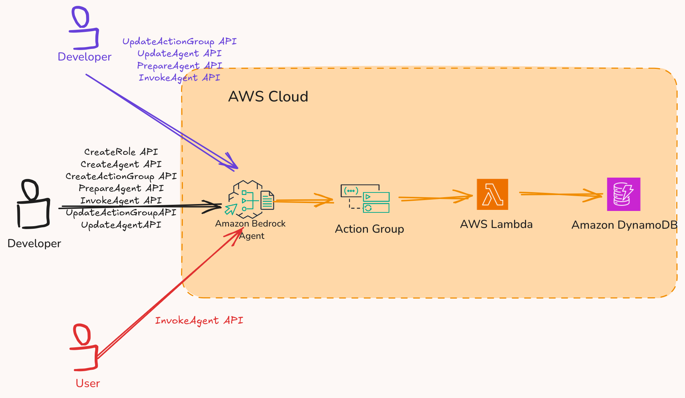
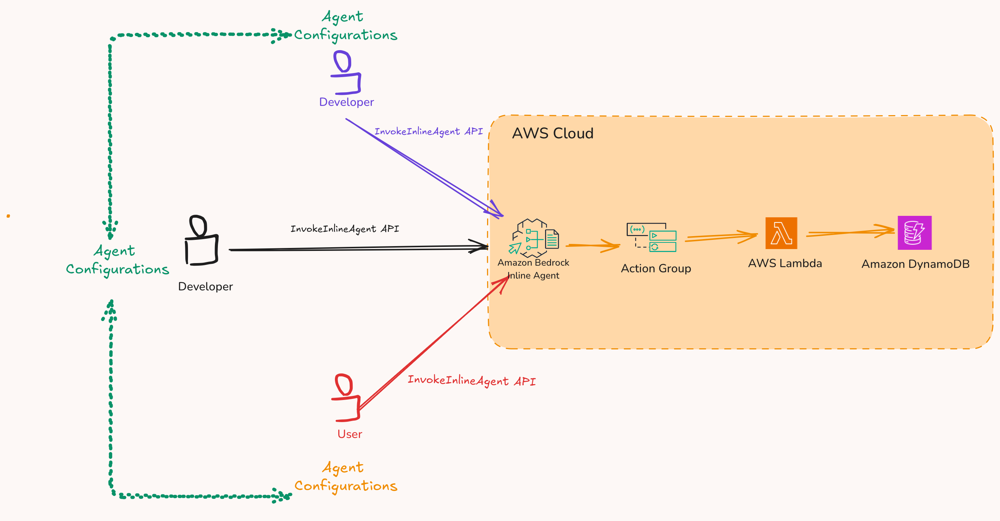
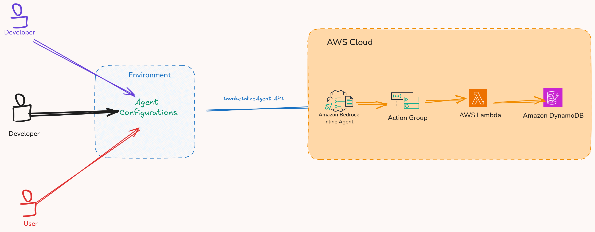
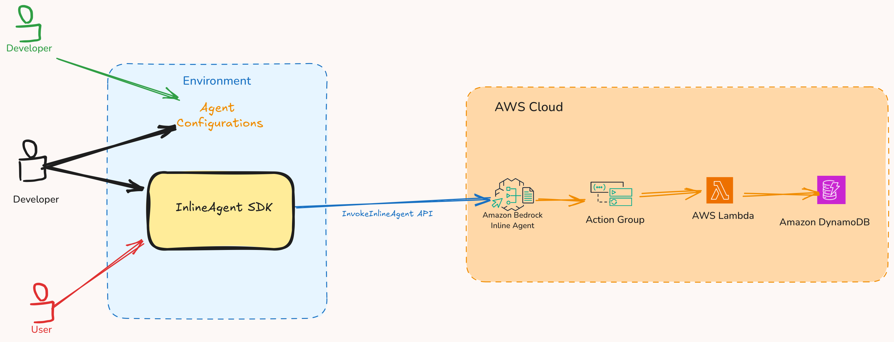
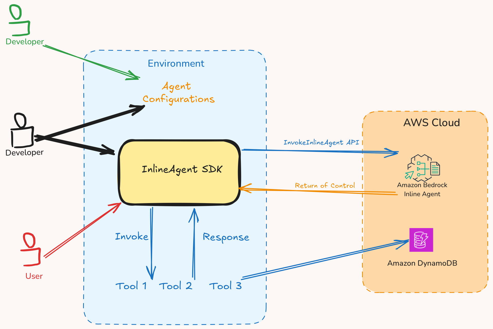
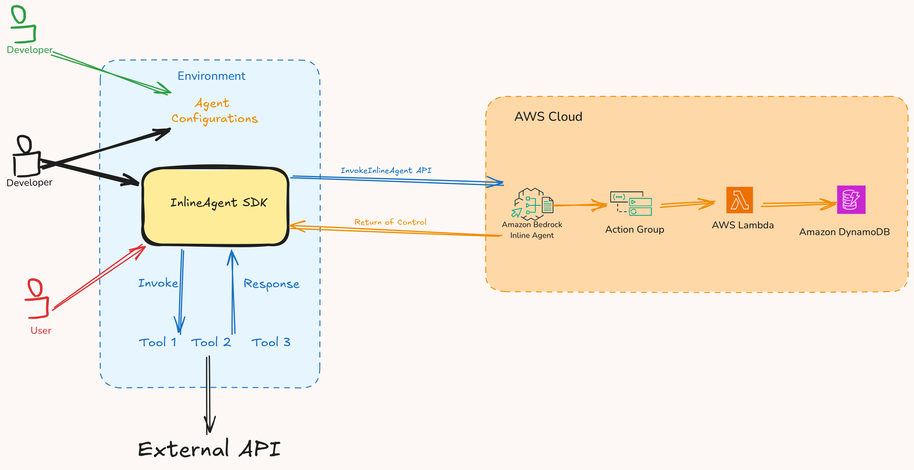
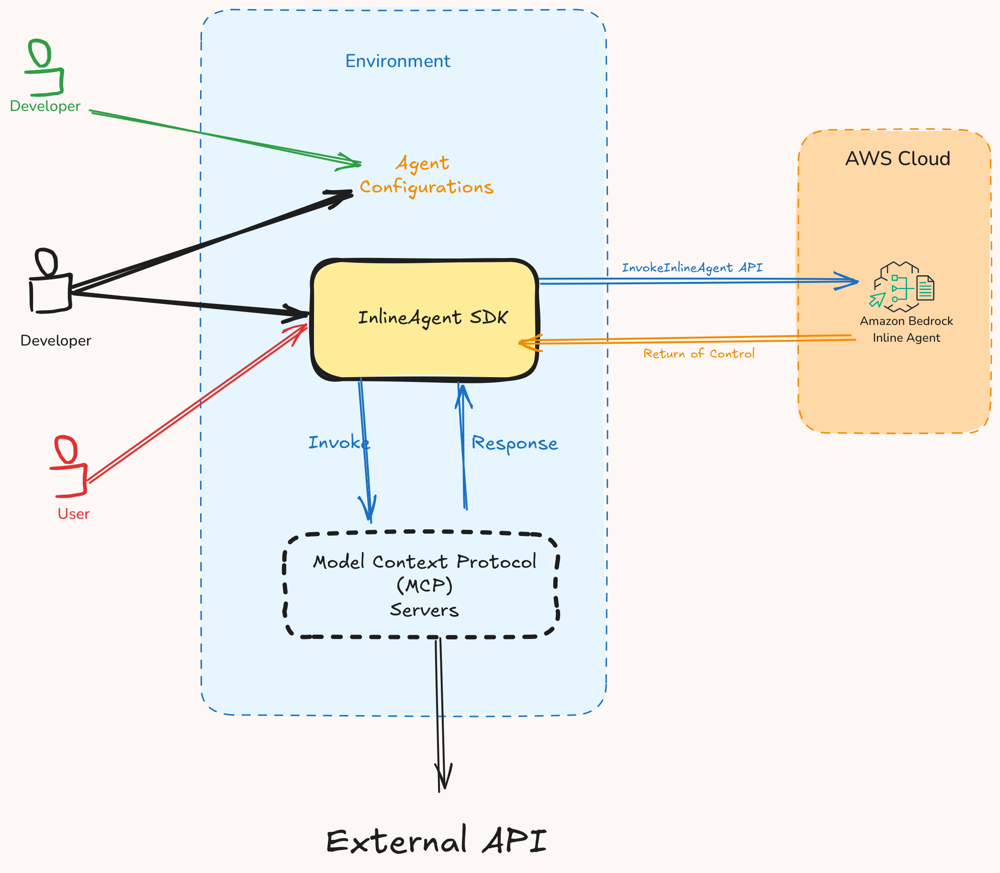
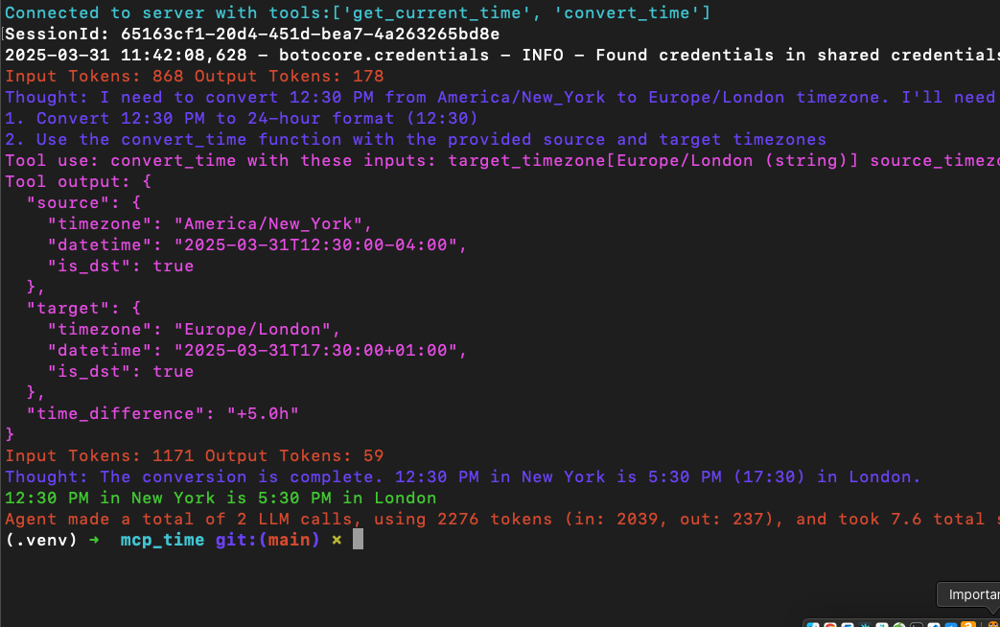
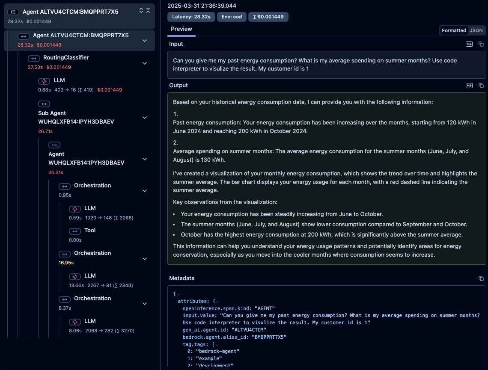
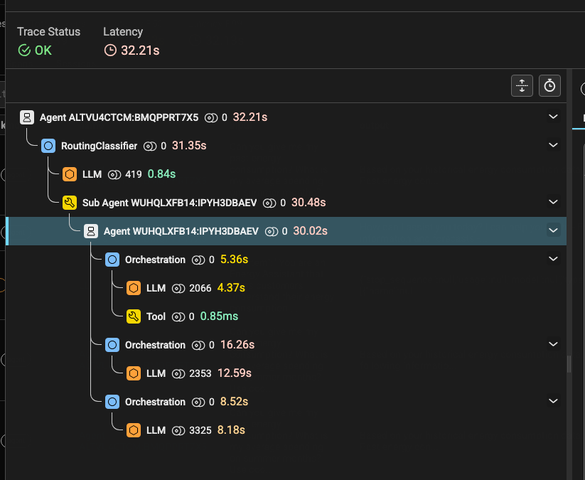

<h1 align="center">Amazon Bedrock Inline Agent SDK&nbsp;</h1>

<p align="center">
  <a href="./README.md/#getting-started-with-model-context-protocol"></a>
  <a href="./README.md/#observability-for-amazon-bedrock-agents"></a>
  <a href="./README.md/#observability-for-amazon-bedrock-agents"></a>
  <a href="./README.md/#example-agents"></a>
  <a href="./README.md/#example-agents"></a>
</p>

> [!NOTE]  
> Configuring and invoking an inline agent feature is in preview release for Amazon Bedrock and is subject to change.
> Amazon Bedrock Inline Agent SDK is currently in beta.

> [!IMPORTANT]
> Never expose AWS keys publicly, use least privilege IAM roles, and rotate credentials every 90 days. Utilize AWS Secrets Manager, implement MFA, avoid hard-coding credentials, and continuously monitor access.

- Use Amazon Bedrock Agents to orchestrate agentic workflows using tools from any MCP server [[1]](https://github.com/modelcontextprotocol/servers) [[2]](https://github.com/punkpeye/awesome-mcp-servers).
- Monitor and evaluate your Amazon Bedrock Agent responses with the `@observe` decorator using [langfuse](https://github.com/langfuse/langfuse) and [phoenix](https://phoenix.arize.com/).
- Utilize local implementations of tools with Amazon Bedrock Agents - no AWS Lambda required.
- Take advantage of the [CrewAI Toolkit](https://github.com/crewAIInc/crewAI-tools) and [Langchain Tools](https://python.langchain.com/docs/integrations/tools/) with Amazon Bedrock Agents.
- Implement easily with [Amazon Bedrock Knowledge](https://aws.amazon.com/bedrock/knowledge-bases/) for Retrieval Augmented Generation (RAG) and [Amazon Bedrock Guardrails](https://aws.amazon.com/bedrock/guardrails/).
- Give your agents the capability to write and execute code using [code interpreter](https://docs.aws.amazon.com/bedrock/latest/userguide/agents-code-interpretation.html).
- Automate UI-related tasks using computer use [[1]](https://docs.aws.amazon.com/bedrock/latest/userguide/computer-use.html) [[2]](https://aws.amazon.com/blogs/machine-learning/getting-started-with-computer-use-in-amazon-bedrock-agents/).

```python
from InlineAgent.agent import InlineAgent
from InlineAgent.action_group import ActionGroup

import asyncio

# Step 1: Define tools with Docstring
def get_current_weather(location: str, state: str, unit: str = "fahrenheit") -> dict:
    """
    Get the current weather in a given location.

    Parameters:
        location: The city, e.g., San Francisco
        state: The state eg CA
        unit: The unit to use, e.g., fahrenheit or celsius. Defaults to "fahrenheit"
    """
    return "Weather is 70 fahrenheit"

# Step 2: Logically group tools together
weather_action_group = ActionGroup(
    name="WeatherActionGroup",
    description="This is action group to get weather",
    tools=[get_current_weather],
)

# Step 3: Define agent 
agent = InlineAgent(
    foundation_model="us.anthropic.claude-3-5-haiku-20241022-v1:0",
    instruction="You are a friendly assistant that is responsible for getting the current weather.",
    action_groups=[weather_action_group],
    agent_name="MockAgent",
)

# Step 4: Invoke agent
asyncio.run(agent.invoke(input_text="What is the weather of New York City, NY?"))
```

## �� Table of Contents ��

- [Amazon Bedrock Inline Agent vs Amazon Bedrock Agent](#amazon-bedrock-inline-agent-vs-amazon-bedrock-agent)
- [Why Amazon Bedrock Inline Agent SDK?](#why-amazon-bedrock-inline-agent-sdk)
- [Getting Started](#getting-started)
- [Getting started with Model Context Protocol](#getting-started-with-model-context-protocol)
- [Observability for Amazon Bedrock Agents](#observability-for-amazon-bedrock-agents)
- [Example Agents](#example-agents)
- [Roadmap Features](#roadmap-features)
- [FAQ](#faq)
- [License](#license)

## Amazon Bedrock Inline Agent vs Amazon Bedrock Agent

<p align="center">
    <a href="url"></a>
</p>

Amazon Bedrock Agents are deployed to the AWS Cloud, which means that every time you need to modify an agent, you must invoke the [CreateAgent](https://docs.aws.amazon.com/bedrock/latest/APIReference/API_agent_CreateAgent.html) or [UpdateAgent](https://docs.aws.amazon.com/bedrock/latest/APIReference/API_agent_UpdateAgent.html) APIs. Before new Agent Configurations can replace existing configurations on the AWS Cloud, you must also invoke the [PrepareAgent](https://docs.aws.amazon.com/bedrock/latest/APIReference/API_agent_PrepareAgent.html) API.

Note: "Agent Configurations" refers to the parameters that define the agent, including foundation models, instructions, action groups, guardrails, and knowledge bases.

<p align="center">
    <a href="url"></a>
</p>

On the other hand, using an inline agent provides you with the flexibility to specify agent capabilities—such as foundation models, instructions, action groups, guardrails, and knowledge bases—at the time of invocation. You can configure and invoke an inline Amazon Bedrock agent dynamically at runtime using the [InvokeInlineAgent](https://docs.aws.amazon.com/bedrock/latest/APIReference/API_agent-runtime_InvokeInlineAgent.html) API.

This capability allows you to share Agent Configurations with other developers or users, enabling them to invoke your agent with the specified parameters.

<p align="center">
    <a href="url"></a>
</p>

To deploy inline agents effectively, consider placing the `Agent Configurations` in a shared environment. In this setup:

- Developers will have write access to the configurations
- Users will have read-only access to these configurations when calling the `InvokeInlineAgent` API

This permission structure enables centralized management while maintaining appropriate access control for your technical implementation.

## Why Amazon Bedrock Inline Agent SDK?

Amazon Bedrock Inline Agent SDK allows your to orchestracte the required flow to invoke inline agents.

<p align="center">
    <a href="url"></a>
</p>

The Amazon Bedrock Inline Agent SDK streamlines the process of invoking inline agents by managing complex workflow orchestration. Without this SDK, developers must write and maintain custom code for:

1. Parsing response streams
2. Handling Return of Control (RoC) flows
3. Managing state between agent interactions
4. Coordinating API calls

<p align="center">
    <a href="url"></a>
</p>

<p align="center">
    <a href="url"></a>
</p>

## Getting Started

### Prerequisites

1. AWS Command Line Interface (CLI), follow instructions [here](https://docs.aws.amazon.com/cli/latest/userguide/getting-started-install.html). Make sure to setup credentials, follow instructions [here](https://docs.aws.amazon.com/cli/latest/userguide/getting-started-quickstart.html).
2. Requires [Python 3.11](https://www.python.org/downloads/) or later.
3. AWS CDK CLI, follow instructions [here](https://docs.aws.amazon.com/cdk/v2/guide/getting_started.html).
4. Enable [model access](https://docs.aws.amazon.com/bedrock/latest/userguide/model-access.html).

### Setup

```bash
git clone https://github.com/awslabs/amazon-bedrock-agent-samples.git
cd amazon-bedrock-agent-samples/src/InlineAgent

python -m venv .venv
source .venv/bin/activate

python -m pip install -e .

InlineAgent_hello us.anthropic.claude-3-5-haiku-20241022-v1:0
```

> [!NOTE]  
> If you are getting `accessDeniedException` checkout [FAQ](#faq)

## Getting started with Model Context Protocol

<p align="center">
    <a href="url"></a>
</p>

### Using MCP servers

<a href="./examples/mcp/"></a>

```python
InlineAgent(
    # 1: Provide the model
    foundation_model="us.anthropic.claude-3-5-sonnet-20241022-v2:0",
    # 2: Concise instruction
    instruction="""You are a friendly assistant that is responsible for resolving user queries. """,
    # Step 3: Provide the agent name and action group
    agent_name="SampleAgent",
    action_groups=[
        ActionGroup(
            name="SampleActionGroup",
            mcp_clients=[mcp_client_1, mcp_client_2],
        )
    ],
)
```

### Example

```python
from mcp import StdioServerParameters

from InlineAgent.tools import MCPStdio
from InlineAgent.action_group import ActionGroup
from InlineAgent.agent import InlineAgent

# Step 1: Define MCP stdio parameters
server_params = StdioServerParameters(
    command="docker",
    args=["run", "-i", "--rm", "mcp/time"],
)

async def main():
    # Step 2: Create MCP Client
    time_mcp_client = await MCPStdio.create(server_params=server_params)
    
    try:
        # Step 3: Define an action group
        time_action_group = ActionGroup(
            name="TimeActionGroup",
            description="Helps user get current time and convert time.",
            mcp_clients=[time_mcp_client],
        )
        
        # Step 4: Invoke agent 
        await InlineAgent(
            # Step 4.1: Provide the model
            foundation_model="us.anthropic.claude-3-5-sonnet-20241022-v2:0",
            # Step 4.2: Concise instruction
            instruction="""You are a friendly assistant that is responsible for resolving user queries. """,
            # Step 4.3: Provide the agent name and action group
            agent_name="time_agent",
            action_groups=[time_action_group],
        ).invoke(input_text="Convert 12:30pm to Europe/London timezone? My timezone is America/New_York")
    
    finally:
        
        await time_mcp_client.cleanup()

if __name__ == "__main__":
    import asyncio

    asyncio.run(main())
```

<details>
<summary>
<h2>Example Response<h2>
</summary>
<p align="center">
    <a href="url"></a>
</p>
</details>

## Observability for Amazon Bedrock Agents

<a href="./examples/observability/"></a>

```python
import boto3
import uuid
from InlineAgent.observability import ObservabilityConfig, observe
from InlineAgent.observability import create_tracer_provider
from InlineAgent import AgentAppConfig

# Step 1: Create configurations
observe_config = ObservabilityConfig()
agent_config = AgentAppConfig()

# Step 2: Create tracer
create_tracer_provider(config=observe_config, timeout=300)

# Step 3: Use @observe
@observe(show_traces=True, save_traces=False)
def invoke_bedrock_agent(inputText: str, sessionId: str, **kwargs):
    """Invoke a Bedrock Agent with instrumentation"""

    # Create Bedrock client
    profile = kwargs.pop("profile", "default")

    bedrock_agent_runtime = boto3.Session(profile_name=profile).client(
        "bedrock-agent-runtime"
    )

    # Invoke the agent with the appropriate configuration
    response = bedrock_agent_runtime.invoke_agent(
        inputText=inputText, sessionId=sessionId, **kwargs
    )

    return response

# Step 4: Invoke the agent
agent_answer = invoke_bedrock_agent(
    agentId=agent_config.AGENT_ID,
    agentAliasId=agent_config.AGENT_ALIAS_ID,
    inputText="<Input Question>",
    sessionId=f"session-{str(uuid.uuid4())}",
    enableTrace=True,
)
```

<details>
<summary>
<h2>Langfuse<h2>
</summary>
<p align="center">
    <a href="url"></a>
</p>
</details>

<details>
<summary>
<h2>Phoenix<h2>
</summary>
<p align="center">
    <a href="url"></a>
</p>
</details>

For differences between Langfuse and Phoenix checkout this [blog post](https://langfuse.com/faq/all/best-phoenix-arize-alternatives).

## Example Agents

> [!CAUTION]
> The examples provided in this repository are for experimental and educational purposes only. They demonstrate concepts and techniques but are not intended for direct use in production environments. Make sure to have Amazon Bedrock Guardrails in place to protect against [prompt injection](https://docs.aws.amazon.com/bedrock/latest/userguide/prompt-injection.html).

### Feature Examples

1. [Generate response with citations - Amazon Bedrock Knowledgebase](./examples/feature_examples/knowledgebase/)
2. [User confirmation before invoking tools](./examples/feature_examples/user_confirmation/)
3. Guardrails `Coming Soon`
4. Multi-Agent collaboration `Coming Soon`
5. Code interpreter `Coming Soon`
6. Computer use `Coming Soon`

### MCP Examples

1. [Time MCP Server](./examples/mcp/mcp_time/)
2. [Perplexity MCP server](./examples/mcp/mcp_perplexity/)
3. [Amazon Bedrock KnowledgeBase MCP Server](./examples/mcp/mcp_aws_kb/)
4. [Connect MCP Server via SSE](./examples/mcp/mcp_sse/)
5. [Cost explorer agent](./examples/mcp/cost_explorer_agent/) - Integrate Perplexity MCP server, AWS Cost explorer MCP server, and code interpreter.

### Langchain Tools Examples
    1. [GitHub Agent](./examples/langchain_tools/github_agent/)

### Crew AI Tools Examples
    1. [Web Scrapper Agent](./examples/crewai_toolkit/web_scraper_spider/)
    2. [PDF RAG using Chroma](./examples/crewai_toolkit/pdf_rag_chroma_db/)

## Roadmap Features

- Integrations with Zapier
- Integration with Langraph
- Integration with CrewAi
- [Multi Agent collaboration](https://aws.amazon.com/blogs/machine-learning/amazon-bedrock-announces-general-availability-of-multi-agent-collaboration/) support of Supervisor and Supervisor with routing mode.
- [langfuse](https://github.com/langfuse/langfuse) and [Phoenix](https://phoenix.arize.com/) compatibility with `InvokeInlineAgent`API.
- Better console traces for `InvokeInlineAgent` and `InvokeAgent` API.
- Ready to use Amazon Bedrock Guardrails.
- Script to manage creation of Amazon Bedrock Knowledge Bases and Amazon Bedrock Guardrails.
- Publish to PyPI.
- Easy path to production using `InlineAgent` CLI. Support for `InlineAgent init`, `InlineAgent deploy`, and `InlineAgent destroy` commands.
- MCP catalog and ability to dynamically choose MCP servers at runtime.
- Replace HTTP+SSE with new "Streamable HTTP" transport for MCP compatibility, see information [here](https://github.com/modelcontextprotocol/specification/pull/206).
- Documentation for InlineAgent SDK.

## FAQ

1. Q: I am getting the following error `Exception: ('Unexpected exception: ', EventStreamError('An error occurred (accessDeniedException) when calling the InvokeInlineAgent operation: Access denied when calling Bedrock. Check your request permissions and retry the request.'))`

A: Make sure that these prerequisites are met:

- Enable model that you are using, see [model access](https://docs.aws.amazon.com/bedrock/latest/userguide/model-access.html).
- Make sure you are passing the correct profile when invoking agent:

```python
agent = InlineAgent(
    foundation_model="us.anthropic.claude-3-5-haiku-20241022-v1:0",
    instruction="You are a friendly assistant that is responsible for getting the current weather.",
    agent_name="MockAgent",
    profile="Test" # By default the SDK uses `default` profile
)
```

- Verify that your IAM role has correct permissions. See prerequisites [here](https://docs.aws.amazon.com/bedrock/latest/userguide/inline-agent-prereq.html).

## Related Links

- [Build a dynamic, role-based AI agent using Amazon Bedrock inline agents](https://aws.amazon.com/blogs/machine-learning/build-a-dynamic-role-based-ai-agent-using-amazon-bedrock-inline-agents/)
- [Create Dynamic Tooling Inline Agents](https://aws-samples.github.io/amazon-bedrock-samples/agents-and-function-calling/bedrock-agents/features-examples/15-invoke-inline-agents/inline-agent-api-usage/)

## License

This project is licensed under the Apache-2.0 License.
