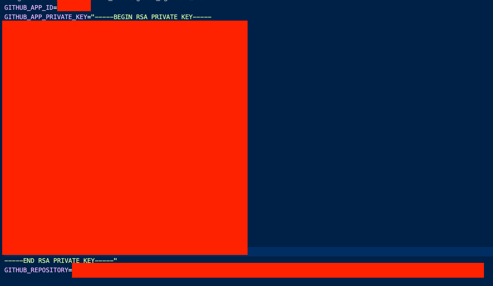
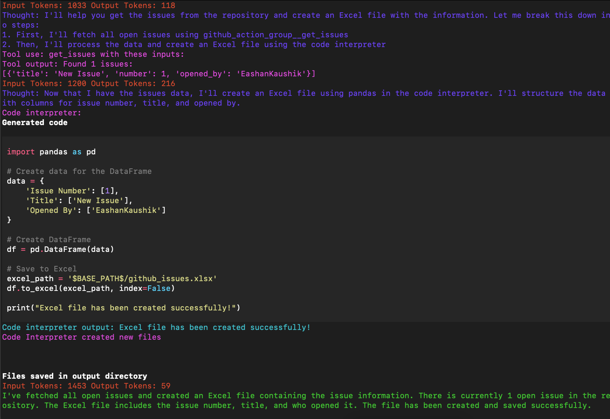

# GitHub Agent

<p align="center">
  <a href="https://python.langchain.com/docs/integrations/tools/github/"></a>
</p>

1. Follow setup instructions [here](../../../README.md#getting-started)
2. Create .env file with [.env.example](./.env.example)



3. Install requirements

```bash
pip install -r requirements
```

4. Run example `python main.py`

## Output



[Output File](./images/github_issues.xlsx)
