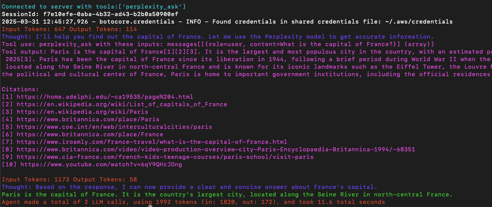

# Perplecity MCP Server with InlineAgent

  
  

1. Follow setup instructions [here](../../../README.md#getting-started)
2. Create .env file with [.env.example](./.env.example)
3. Run example `python main.py`

## Output

