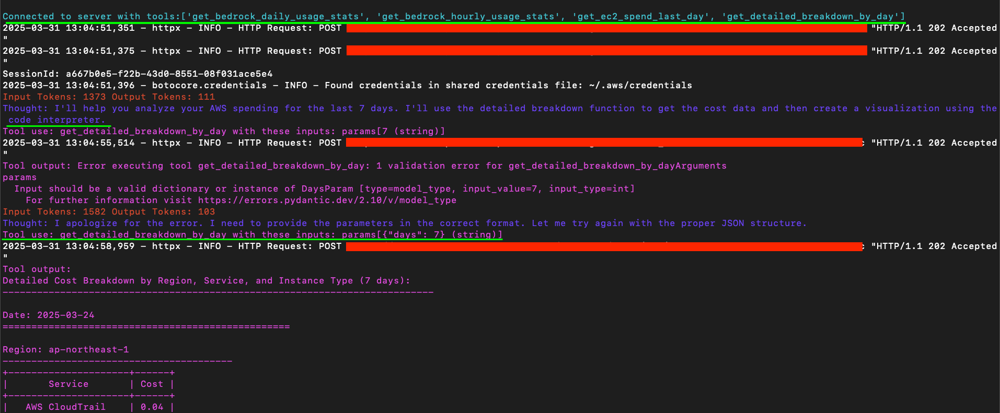
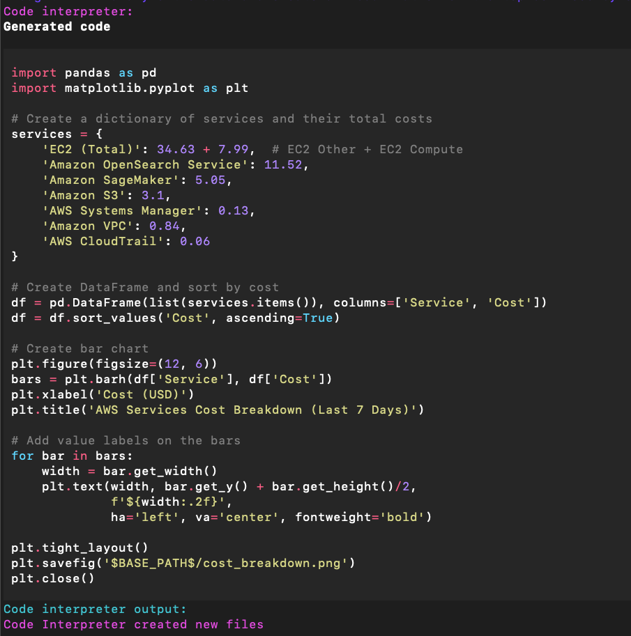
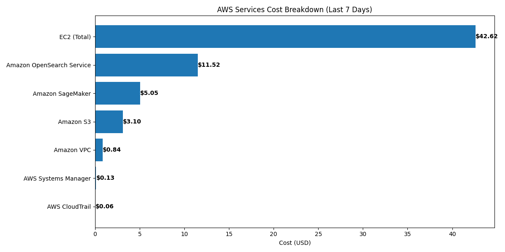
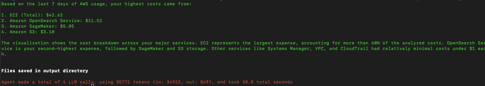

# Connect MCP servers via SSE with InlineAgent

  

> [!IMPORTANT]
> Never expose AWS keys publicly, use least privilege IAM roles, and rotate credentials every 90 days. Utilize AWS Secrets Manager, implement MFA, avoid hard-coding credentials, and continuously monitor access.

> [!NOTE]  
>  Soon HTTP+SSE will be replaces with new "Streamable HTTP", see PR [here](https://github.com/modelcontextprotocol/specification/pull/206).

1. Follow setup instructions [here](../../../README.md#getting-started)
2. Create .env file with [.env.example](./.env.example)
3. Run example `python main.py`

## Output

1. MCP connect and list_tools output

  

2. Code interpreter generated python code and output

  

  

3. Final Response

  
