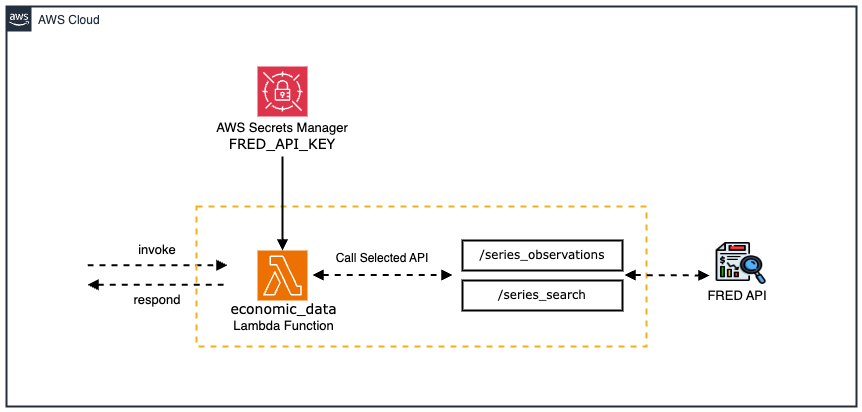

# Economic Data Tool

This tool provides access to economic data through the Federal Reserve Economic Data (FRED) API maintained by the Federal Reserve Bank of St. Louis. It enables agents to retrieve and analyse economic indicators critical for investment decisions, market analysis, and financial forecasting.

The tool currently supports two powerful FRED API endpoints:

1. **Series Observations**: Retrieves time-series data values for specific economic indicators
2. **Series Search**: Searches for economic data series matching keywords



## Prerequisites

1. Get your FRED API key by [registering](https://fred.stlouisfed.org/docs/api/api_key.html).

## Deploy [economic_data_stack.yaml](/src/shared/economic_data/cfn_stacks/economic_data_stack.yaml)

|   Region   | economic_data_stack.yaml |
| ---------- | ----------------- |
| us-east-1  | [](https://console.aws.amazon.com/cloudformation/home?region=us-east-1#/stacks/new?stackName=EconomicData&templateURL=https://ws-assets-prod-iad-r-iad-ed304a55c2ca1aee.s3.us-east-1.amazonaws.com/1031afa5-be84-4a6a-9886-4e19ce67b9c2/tools/economic_data_stack.yaml)|
| us-west-2  | [](https://console.aws.amazon.com/cloudformation/home?region=us-west-2#/stacks/new?stackName=EconomicData&templateURL=https://ws-assets-prod-iad-r-pdx-f3b3f9f1a7d6a3d0.s3.us-west-2.amazonaws.com/1031afa5-be84-4a6a-9886-4e19ce67b9c2/tools/economic_data_stack.yaml)|

## Tool Functions
---
### 1. Series Observations
Retrieves time-series data values for a specific economic indicator identified by its series ID.

**Key Parameters:**
- `series_id`: The FRED series ID for the economic indicator
- `observation_start`: Start date for observations (YYYY-MM-DD format)
- `observation_end`: End date for observations (YYYY-MM-DD format)
- `limit`: Maximum number of observations to return (default: 10)
- `sort_order`: Sort order (default: "desc" for newest first)

### 2. Series Search
Searches for economic data series that match keywords.

**Key Parameters:**
- `search_text`: The keywords to match against economic data series
- `search_type`: Type of search ("full_text" or "series_id")
- `limit`: Maximum number of series to return (default: 30)
- `order_by`: Order results by specific attribute
- `sort_order`: Sort order ("asc" or "desc")

## Key Economic Indicators for Real Estate

These are some important FRED series IDs that are particularly useful for real estate investment analysis:

| Category | Indicator | Series ID | Description |
|----------|-----------|-----------|-------------|
| Mortgage Rates | 30-Year Fixed | MORTGAGE30US | 30-Year Fixed Rate Mortgage Average |
| House Prices | State Index | [state code]STHPI | House Price Index by state (e.g., TXSTHPI for Texas) |
| Vacancy Rates | Rental Vacancy | [state code]RVAC | Rental Vacancy Rate by state (e.g., TXRVAC for Texas) |
| Inflation | Rent CPI | CUSR0000SEHA | Consumer Price Index for Rent of Primary Residence |
| Employment | Unemployment | [state code]UR | Unemployment Rate by state (e.g., TXUR for Texas) |
| Housing Market | Housing Starts | HOUST | Housing Starts: Total New Privately Owned Housing Units Started |
| Housing Market | Existing Home Sales | EXHOSLUSM495N | Existing Home Sales |
| Housing Market | New Home Sales | HSN1F | New One Family Houses Sold |
| Real Estate Market | Case-Shiller | CSUSHPINSA | S&P/Case-Shiller U.S. National Home Price Index |
| Economic | GDP | GDPC1 | Real Gross Domestic Product |
| Economic | Fed Funds Rate | FEDFUNDS | Federal Funds Effective Rate |

## Usage Examples

### Example 1: Retrieve Mortgage Rate Trend

```python
from src.utils.bedrock_agent import (
    Agent,
    region,
    account_id,
)
import uuid

economic_data_agent = Agent.create(
    name="economic_data_agent",
    role="Economic Data Specialist",
    goal="Provide accurate economic indicators and data for investment analysis.",
    instructions="Specialist in economic data analysis and forecasting.",
    tool_code=f"arn:aws:lambda:{region}:{account_id}:function:economic_data",
    tool_defs=[
        {
            "name": "series_observations",
            "description": "Gets the observations or data values for an economic data series",
            "parameters": {
                "series_id": {
                    "description": "The FRED series ID",
                    "type": "string",
                    "required": True,
                },
                "observation_start": {
                    "description": "Start date for observations (YYYY-MM-DD format)",
                    "type": "string",
                    "required": False,
                },
                "limit": {
                    "description": "Maximum number of observations to return",
                    "type": "string",
                    "required": False,
                },
                "frequency": {
                    "description": "Frequency to aggregate values to (d, w, m, q, a)",
                    "type": "string",
                    "required": False,
                },
                "units": {
                    "description": "Data value transformation (lin, chg, pch)",
                    "type": "string",
                    "required": False,
                }
            }
        }
    ],
)

# Get current mortgage rate trend
response = economic_data_agent.invoke(
    input_text="What is the current 30-year fixed mortgage rate trend?",
    session_id=str(uuid.uuid4()),
)
print(response)
```

### Example 2: Search for Economic Indicators

```python
from src.utils.bedrock_agent import (
    Agent,
    region,
    account_id,
)
import uuid

economic_researcher = Agent.create(
    name="economic_researcher",
    role="Economic Researcher",
    goal="Find relevant economic indicators for specific analyses.",
    instructions="Expert in searching and identifying economic data series.",
    tool_code=f"arn:aws:lambda:{region}:{account_id}:function:economic_data",
    tool_defs=[
        {
            "name": "series_search",
            "description": "Search for economic data series that match keywords",
            "parameters": {
                "search_text": {
                    "description": "The words to match against economic data series",
                    "type": "string",
                    "required": True,
                },
                "search_type": {
                    "description": "Type of search: 'full_text' or 'series_id'",
                    "type": "string",
                    "required": False,
                },
                "limit": {
                    "description": "Maximum number of series to return",
                    "type": "string",
                    "required": False,
                },
                "filter_variable": {
                    "description": "The attribute to filter results by",
                    "type": "string",
                    "required": False,
                },
                "filter_value": {
                    "description": "The value to filter by",
                    "type": "string",
                    "required": False,
                }
            }
        }
    ],
)

# Search for housing-related indicators
response = economic_researcher.invoke(
    input_text="Find economic indicators related to housing markets",
    session_id=str(uuid.uuid4()),
)
print(response)
```

### Example 3: Combining with Market Analysis

```python
from src.utils.bedrock_agent import (
    Agent,
    region,
    account_id,
)
import uuid

market_analyst = Agent.create(
    name="market_analyst",
    role="Market Intelligence Specialist",
    goal="Analyze market conditions using economic indicators.",
    instructions="""
    Analyze real estate market conditions by retrieving key economic indicators:
    1. Mortgage rates (MORTGAGE30US)
    2. Regional house price index (state code + STHPI)
    3. Rental vacancy rates (state code + RVAC)
    4. Consumer Price Index for rent (CUSR0000SEHA)
    5. Regional unemployment (state code + UR)
    
    Extract the state code from the location provided in the query.
    """,
    tool_code=f"arn:aws:lambda:{region}:{account_id}:function:economic_data",
    tool_defs=[
        {
            "name": "series_observations",
            "description": "Gets the observations or data values for an economic data series",
            "parameters": {
                "series_id": {
                    "description": "The FRED series ID",
                    "type": "string",
                    "required": True,
                },
                "observation_start": {
                    "description": "Start date for observations (YYYY-MM-DD format)",
                    "type": "string",
                    "required": False,
                },
                "limit": {
                    "description": "Maximum number of observations to return",
                    "type": "string",
                    "required": False,
                },
                "sort_order": {
                    "description": "Sort order (asc or desc)",
                    "type": "string",
                    "required": False,
                },
                "units": {
                    "description": "Data value transformation (lin, chg, pch)",
                    "type": "string",
                    "required": False,
                }
            }
        }
    ],
)

# Analyze market conditions in Texas
response = market_analyst.invoke(
    input_text="Analyze the real estate market conditions in Texas",
    session_id=str(uuid.uuid4()),
)
print(response)
```

## Data Transformation Options

FRED API supports various data transformations that can be useful for analysis:

- `lin`: Levels (No transformation)
- `chg`: Change
- `ch1`: Change from Year Ago
- `pch`: Percent Change
- `pc1`: Percent Change from Year Ago
- `pca`: Compounded Annual Rate of Change
- `log`: Natural Log

## Frequency Aggregation Options

Data can be aggregated to different frequencies:

- `d`: Daily
- `w`: Weekly
- `m`: Monthly
- `q`: Quarterly
- `sa`: Semiannual
- `a`: Annual

## Clean Up

- Open the CloudFormation console.
- Select the stack `EconomicData` you created, then click **Delete**. Wait for the stack to be deleted.
- Make sure to manually delete `FRED_API_KEY-*` secret key.

## References

- [FRED API Documentation](https://fred.stlouisfed.org/docs/api/fred/)
- [FRED Series Observations Documentation](https://fred.stlouisfed.org/docs/api/fred/series_observations.html)
- [FRED Series Search Documentation](https://fred.stlouisfed.org/docs/api/fred/series_search.html)
- [FRED Categories](https://fred.stlouisfed.org/categories)

## Security

See [CONTRIBUTING](/CONTRIBUTING.md#security-issue-notifications) for more information.

## License
This project is licensed under the Apache-2.0 License.
