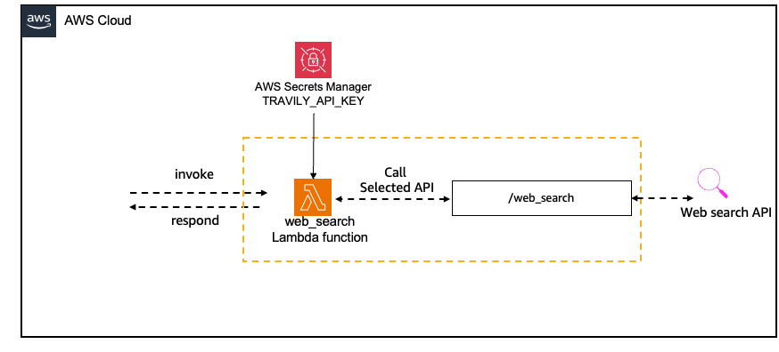

## Web Search Tool

This tool leverages an AWS Lambda function written in Python 3.12 to perform web searches using the Tavily API. It accepts parameters such as `search_query`, `target_website`, `topic`, and `days` to customize the search. Here's a breakdown:

- **Secrets Manager**: The template creates an AWS Secrets Manager secret called `TAVILY_API_KEY` to securely store the API Key.

- **AgentLambdaFunction**:  This function is named `web_search` and is designed to perform web searches using the Tavily API. It accepts parameters such as `search_query`, `target_website`, `topic`, and `days` to customize the search.

- **AgentLambdaRole**: The template creates an IAM role with the necessary permissions for the Lambda function to access the Secrets Manager and retrieve the Tavily API Key.

- **AgentAliasLambdaPermission** and **AgentLambdaPermission**: These resources grant permissions for Amazon Bedrock Agents to invoke the Lambda function.



## Prerequisite

1. Get your `TavilyApiKey` from [here](https://docs.tavily.com/docs/gpt-researcher/getting-started).

## Deploy [web_search_stack.yaml](/src/shared/web_search/cfn_stacks/web_search_stack.yaml)

|   Region   | development.yaml |
| ---------- | ----------------- |
| us-east-1  | [](https://console.aws.amazon.com/cloudformation/home?region=us-east-1#/stacks/new?stackName=WebSearch&templateURL=https://ws-assets-prod-iad-r-iad-ed304a55c2ca1aee.s3.us-east-1.amazonaws.com/1031afa5-be84-4a6a-9886-4e19ce67b9c2/tools/web_search_stack.yaml)|
| us-west-2  | [](https://console.aws.amazon.com/cloudformation/home?region=us-west-2#/stacks/new?stackName=WebSearch&templateURL=https://ws-assets-prod-iad-r-pdx-f3b3f9f1a7d6a3d0.s3.us-west-2.amazonaws.com/1031afa5-be84-4a6a-9886-4e19ce67b9c2/tools/web_search_stack.yaml)|

## Usage

```python
from src.utils.bedrock_agent import (
    Agent,
    region,
    account_id,
)
import uuid

news_agent = Agent.create(
    name="news_agent",
    role="Market News Researcher",
    goal="Fetch latest relevant news for a given stock based on a ticker.",
    instructions="Top researcher in financial markets and company announcements.",
    tool_code=f"arn:aws:lambda:{region}:{account_id}:function:web_search",
    tool_defs=[
        {
            "name": "web_search",
            "description": "Searches the web for information",
            "parameters": {
                "search_query": {
                    "description": "The query to search the web with",
                    "type": "string",
                    "required": True,
                },
                "target_website": {
                    "description": "The specific website to search including its domain name. If not provided, the most relevant website will be used",
                    "type": "string",
                    "required": False,
                },
                "topic": {
                    "description": "The topic being searched. 'news' or 'general'. Helps narrow the search when news is the focus.",
                    "type": "string",
                    "required": False,
                },
                "days": {
                    "description": "The number of days of history to search. Helps when looking for recent events or news.",
                    "type": "string",
                    "required": False,
                },
            },
        }
    ],
)

response = news_agent.invoke(
    input_text="What is the stock trend for AMZN?",
    session_id=str(uuid.uuid1()),
    enable_trace=False
)

print(response)

## Clean Up

- Open the CloudFormation console.
- Select the stack `WebSearch` you created, then click **Delete**. Wait for the stack to be deleted.
- Make sure to manually delete `TAVILY_API_KEY-*` secret key. Follow instructions [here](https://docs.aws.amazon.com/secretsmanager/latest/apireference/API_DeleteSecret.html).

## References

[1] [aws-samples/websearch_agent](https://github.com/aws-samples/websearch_agent)

## Security

See [CONTRIBUTING](CONTRIBUTING.md#security-issue-notifications) for more information.

## License

This project is licensed under the Apache-2.0 License.

