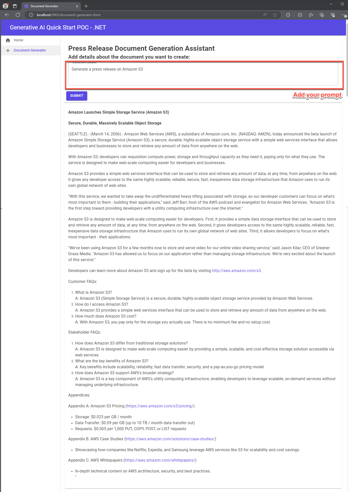
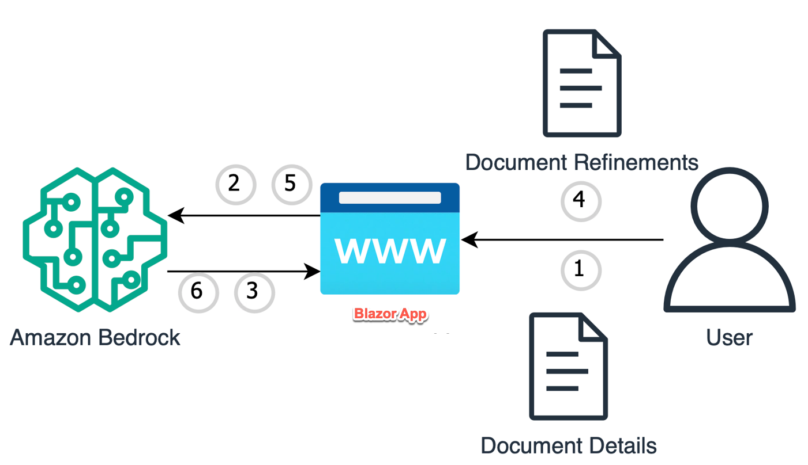

# Amazon-Bedrock-Document-Generator

This is sample code demonstrating the use of Amazon Bedrock and Generative AI to implement a document generation use case. The application is constructed with a simple Blazor frontend where users can provide details and create a document in the exact format that the you specify.



##### Authors: Pratip Bagchi

# **Goal of this Repo:**

The goal of this repo is to provide users the ability to use Amazon Bedrock and generative AI to perform document generation based on a document template and details inputted by the user.
This repo comes with a basic ASP.NET blazor frontend to help users stand up a proof of concept in just a few minutes.

The architecture and flow of the sample application will be:



When a user interacts with the GenAI app, the flow is as follows:

1. The user inserts document details that they would like included in the generated document within the ASP.NET blazor app. (DocumentGeneratorForm.razor).
2. The ASP.NET blazor app, takes the document details, and invokes Amazon Bedrock to generate sample document that matches the document structure stated in the prompt containing the inserted document details (DocumentGeneratorForm.razor).
3. Amazon Bedrock generates a first draft of the sample document and presents it to the frontend (DocumentGeneratorForm.razor).
4. The user inserts refinement details highlighting areas where they would like to add refinements to the previously generated document (DocumentGeneratorForm.razor).
5. The ASP.NET blazor app takes the refinement details, passes it to Amazon Bedrock along with the document prompt, and the original draft of the document to begin creating the refined version (DocumentGeneratorForm.razor).
6. Amazon Bedrock is used to generate the refined version of the document based on the user defined refinements and presents it on the frontend (DocumentGeneratorForm.razor).

# How to use this Repo:

## Prerequisites

- Amazon Bedrock Access and CLI Credentials (Please ensure your AWS CLI Profile has access to Amazon Bedrock!)
- .NET 8.0
- Visual Studio installed on your machine
- Additional prerequisites specific to each sample (e.g., RDS Database, Amazon Kendra index, etc.)
- Configure the necessary environment variables (e.g., AWS credentials, database connections, etc.).
- Access to Claude 3 haiku model. Please follow this [AWS Documentation](https://docs.aws.amazon.com/bedrock/latest/userguide/model-access.html) to get access to the model.
- Run Blazor app

## Step 1:

The first step of utilizing this repo is performing a git clone of the repository and navigate to genai-quickstart-pocs-dot-net\Genai.Quickstart.Pocs folder. Please open the Genai.Quickstart.Pocs.sln file to get started. 
You will be using "Amazon.Bedrock.Document.Ggenerator.Poc.csproj" project for this POC. 

```
git clone https://github.com/aws-samples/genai-quickstart-pocs.git
```

## Step 2

1. Please make Amazon.Bedrock.Document.Ggenerator.Poc.csproj, as a startup project of the solution.
2. Build the solution
3. Run the project by clicking the "Run witout Debugging button"

## Security

See [CONTRIBUTING](CONTRIBUTING.md#security-issue-notifications) for more information.

## License

This library is licensed under the MIT-0 License. See the LICENSE file.