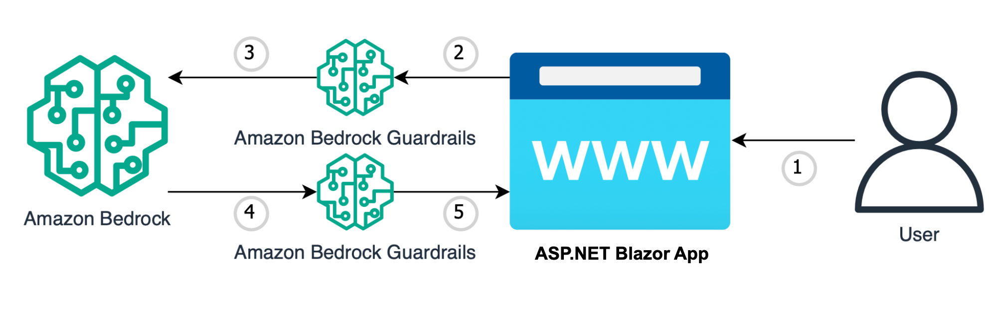

# Amazon-Bedrock-Guardrails-POC

This is sample code demonstrating the use of Amazon Bedrock Guardrails to help prevent prompt-injection attacks and prevent unintended responses from the LLM. The application is constructed with a simple ASP.NET Blazor frontend where users can input zero shot requests to Claude 3, with Amazon Bedrock Guardrails in place to prevent malicious prompts and responses.


# **Goal of this Repo:**

The goal of this repo is to provide users the ability to use Amazon Bedrock Guardrails to demonstrate its ability to prevent malicious prompts and responses.
This repo comes with a basic frontend to help users stand up a proof of concept in just a few minutes.

The architecture and flow of the sample application will be:



When a user interacts with the GenAI app, the flow is as follows:

1. The user inserts a text question into to the ASP.NET Blazor app. (BedrockGuardrail.razor).
2. The ASP.NET Blazor app , takes the text inserted by the user and is passed into an Amazon Bedrock Guardrail to check for prompt injection. If the prompt is detected as malicious or triggers the guardrail a response will be returned to the end user saying the request is blocked (BedrockGuardrail.razor.cs).
3. If the prompt does not trigger the guardrail it is passed into the bedrock model the user has specified (BedrockGuardrail.razor.cs).
4. A response is returned by the Amazon Bedrock Model of choice and is passed into the Amazon Bedrock Guardrail (BedrockGuardrail.razor.cs). If the response is detected as malicious or triggers the guardrail a response will be returned to the end user saying the request is blocked (BedrockGuardrail.razor.cs).
5. If the response does not trigger a guardrail, a natural language response is returned to the end user answering the initial text question inserted by the end user (BedrockGuardrail.razor).

# How to use this Repo:

## Prerequisites:


- Amazon Bedrock Access and CLI Credentials (Please ensure your AWS CLI Profile has access to Amazon Bedrock!)
- .NET 8.0
- Visual Studio installed on your machine
- Additional prerequisites specific to each sample (e.g., RDS Database, Amazon Kendra index, etc.)
- Configure the necessary environment variables (e.g., AWS credentials, database connections, etc.).
- Access to Claude 3 haiku model. Please follow this [AWS Documentation](https://docs.aws.amazon.com/bedrock/latest/userguide/model-access.html) to get access to the model.
- Run Blazor app

## Step 1:

The first step of utilizing this repo is performing a git clone of the repository and navigate to genai-quickstart-pocs-dot-net\Genai.Quickstart.Pocs folder. Please open the Amazon.Bedrock.Guardrail.Poc.sln file to get started. 
You will be using "Amazon.Bedrock.Guardrail.csproj" projectfor this POC. 

```
git clone https://github.com/aws-samples/genai-quickstart-pocs.git
```


## Step 2:

1. Follow this [AWS documentation](https://docs.aws.amazon.com/bedrock/latest/userguide/guardrails-create.html) to create a guardrail. Once created note the id and the version.
2. Open "appsettings.json", add your GuardrailId and GuardrailVersion.
3. Build the solution.
4. Run the "Amazon.Bedrock.Guardrail.csproj" project by clicking the "Run witout Debugging button".


As soon as the application is up and running in your browser of choice you can begin asking text questions and generating natural language responses having Amazon Bedrock Guardrails preventing malicious requests and responses.
