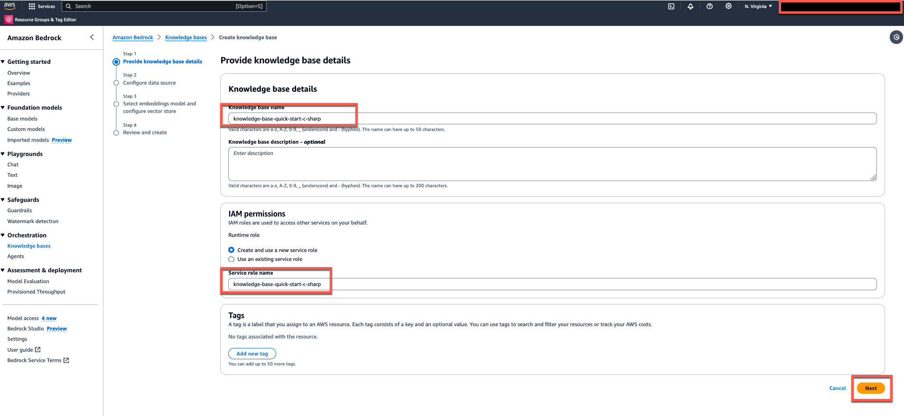
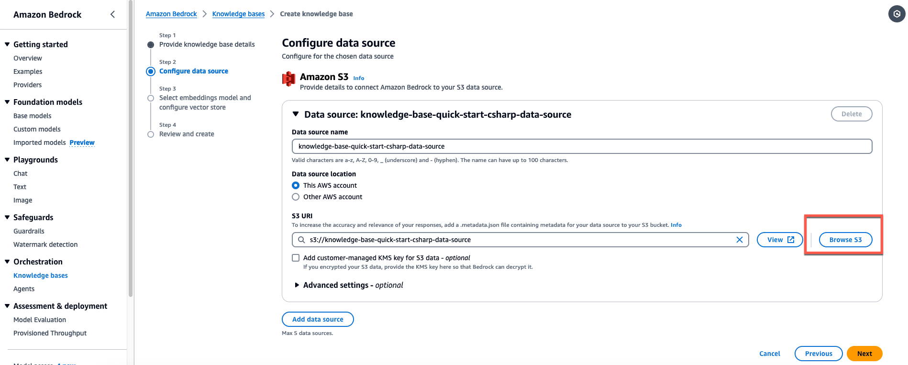
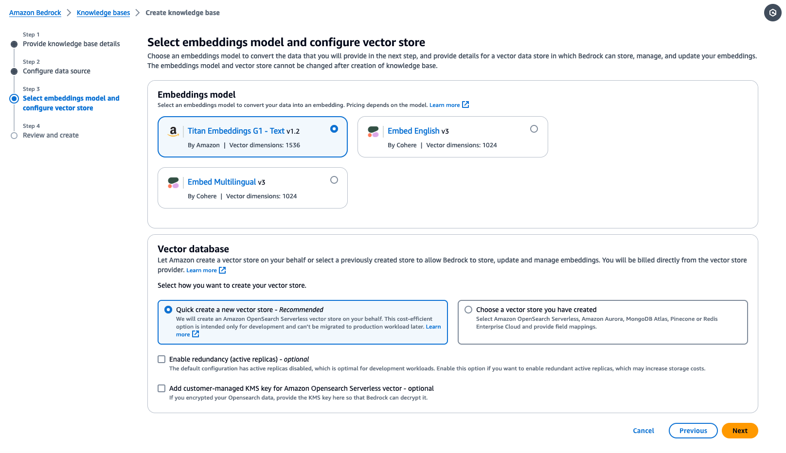

# GenAI Quick Start PoCs

This repository contains sample code demonstrating various use cases leveraging Amazon Bedrock and Generative AI using Amazon Bedrock SDK for .NET. Each sample is a separate page within a Visual Studio Solutions, and includes a basic Blazor frontend to help users quickly set up a proof of concept.

##### Authors: Pratip Bagchi

1. **Amazon-Bedrock-Knowledgebases-RAG-POC:**   
   This is sample code demonstrating the use of Amazon Bedrock and Generative AI to create vector embeddings for your data sources using Amazon Bedrock Knowledge bases with the ability ask questions against the stored documents. The application is constructed with a RAG based architecture where users can ask questions against the Knowledge bases.    

    

# **Goal of this Repo:**

The goal of this repo is to provide users the ability to use Amazon Bedrock and generative AI to take natural language questions, and answer questions against Amazon Bedrock Knowledge bases.
This repo comes with a ASP.NET blazor frontend to help users stand up a proof of concept in just a few minutes.

The architecture and flow of the sample application will be:


When a user interacts with the GenAI app, the flow is as follows:

1. The user makes a request to the GenAI app QueryWithKnowledgeBases.razor).
2. The app issues a get contexts query to the Amazon Bedrock Knowledge bases based on the user request. (QueryWithKnowledgeBases.razor)
3. The knowledge bases returns search results related to the relevant documents from the ingested data. (QueryWithKnowledgeBases.razor)
4. The app sends the user request and along with the data retrieved from the Amazon Bedrock Knowlegebases as context in the LLM prompt. (QueryWithKnowledgeBases.razor)
5. The LLM returns a succinct response to the user request based on the retrieved data. (QueryWithKnowledgeBases.razor)
6. The response from the LLM is sent back to the user. (QueryWithKnowledgeBases.razor)

# How to use this Repo:

## Prerequisites

- Amazon Bedrock Access and CLI Credentials (Please ensure your AWS CLI Profile has access to Amazon Bedrock!)
- .NET 8.0
- Visual Studio installed on your machine
- Additional prerequisites specific to each sample (e.g., RDS Database, Amazon Kendra index, etc.)
- Configure the necessary environment variables (e.g., AWS credentials, database connections, etc.).
- Access to Claude 3 haiku model. Please follow this [AWS Documentation](https://docs.aws.amazon.com/bedrock/latest/userguide/model-access.html) to get access to the model.
- Run Blazor app

## Step 1:

The first step of utilizing this repo is performing a git clone of the repository and navigate to genai-quickstart-pocs-dot-net\Genai.Quickstart.Pocs folder. Please open the Genai.Quickstart.Pocs.sln file to get started. 
You will be using "Amazon.Bedrock.Knowledgebases.Rag.Poc.csproj" project for this POC. 

```
git clone https://github.com/aws-samples/genai-quickstart-pocs.git
```

## Step 2:

Now that we have successfully cloned the repo, opened the Visual Studio Solutions and installed the necessary dependencies, it is time for us to create Amazon Bedrock Knowledge base.

To create our Amazon Bedrock Knowledge base we will:

1. Go to the Amazon Bedrock Service homepage within the AWS console and on the left-hand side we will select "Knowledge bases" under the "Orchestration" drop down 

2. We will then click on "Create knowledge base" 

3. In the Knowledge base details section, you can optionally change the default name and provide a description for your knowledge base.In the IAM permissions section, choose an AWS Identity and Access Management (IAM) role that provides Amazon Bedrock permission to access other AWS services. You can let Amazon Bedrock create the service role or choose a custom role that you have created. Optionally, add tags to your knowledge base. Select Next. 

4. On the Set up data source page, provide the information for the data source to use for the knowledge base: Optionally, change the default Data source name. Provide the S3 URI of the object containing the files for the data source that you prepared. Select Next. 

5. In the Embeddings model section, choose a supported embeddings model to convert your data into vector embeddings for the knowledge base. In the Vector database section, choose Quick create a new vector store and select Next 

6. On the Review and create page, check the configuration and details of your knowledge base. Choose Edit in any section that you need to modify. When you are satisfied, select Create knowledge base.

Detailed instructions for each sample are provided in their respective directories.

## Step 3

1. Please make Amazon.Bedrock.Knowledgebases.Rag.Poc.csproj, as a startup project of the solution.
2. Build the solution
3. Run the project by clicking the "Run witout Debugging button"


## Security

See [CONTRIBUTING](CONTRIBUTING.md#security-issue-notifications) for more information.

## License

This library is licensed under the MIT-0 License. See the LICENSE file.