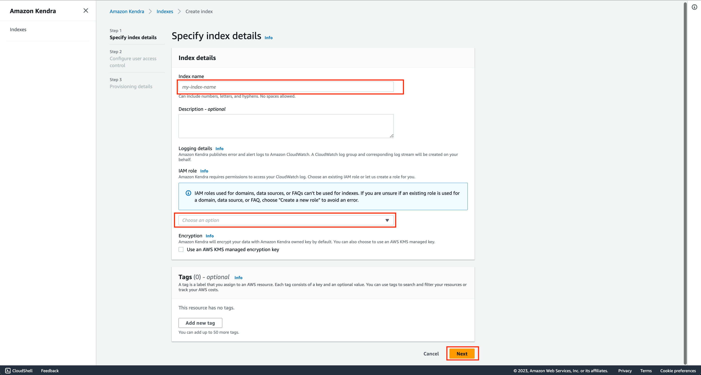
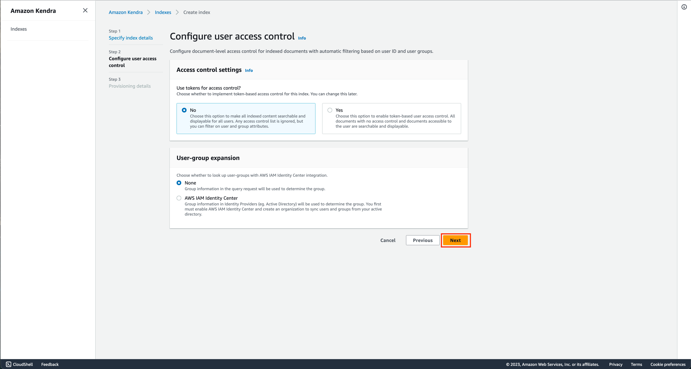

# Amazon-Bedrock-RAG-Kendra-POC

This is sample code demonstrating the use of Amazon Bedrock and Generative AI to implement a RAG based architecture with Amazon Kendra.using Amazon Bedrock SDK for .NET. The application is constructed with a simple blazor front-end where users can ask questions against documents stored in Amazon Kendra.


# **Goal of this Repo:**

The goal of this repo is to provide users the ability to use Amazon Bedrock and generative AI to take natural language questions, and answer questions against indexed documents in Amazon Kendra.
This repo comes with a basic frontend to help users stand up a proof of concept in just a few minutes.

The architecture and flow of the sample application will be:


When a user interacts with the GenAI app, the flow is as follows:

1. The user makes a request to the GenAI app (RagKendraForm.razor).
2. The app issues a search query to the Amazon Kendra index based on the user request.
3. The index returns search results with excerpts of relevant documents from the ingested data.
4. The app sends the user request and along with the data retrieved from the index as context in the LLM prompt.
5. The LLM returns a succinct response to the user request based on the retrieved data.
6. The response from the LLM is sent back to the user.

# How to use this Repo:

## Prerequisites

- Amazon Bedrock Access and CLI Credentials (Please ensure your AWS CLI Profile has access to Amazon Bedrock!)
- .NET 8.0
- Visual Studio installed on your machine
- Amazon Kendra Index has been created (IF NOT ALREADY CREATED it is covered in step 2).
- Amazon Bedrock Access and CLI Credentials. Ensure that the proper FM model access is provided in the Amazon Bedrock console
- Run Blazor app

## Step 1:

The first step of utilizing this repo is performing a git clone of the repository and navigate to genai-quickstart-pocs-dot-net\Genai.Quickstart.Pocs folder. Please open the Genai.Quickstart.Pocs.sln file to get started. 
You will be using "Amazon.Bedrock.Rag.Kendra.Poc.csproj" project for this POC. 

```
git clone https://github.com/aws-samples/genai-quickstart-pocs.git
```

The source code path is genai-quickstart-pocs-dot-net->Genai.Quickstart.Pocs->Amazon.Bedrock.Rag.Kendra.Poc

## Step 2
Please ensure that your AWS CLI Profile has access to Amazon Bedrock, and your Amazon Kendra Index has been created within your AWS account!

**_If you don't have your Amazon Kendra Index created yet, please follow the steps below:_**

1. Go to Amazon Kendra in your AWS Console and click on "Create an Index" 
2. Fill out the "Specify Index details" page, and provide Kendra a role that can access CloudWatch Logs. 
3. Fill out the "Configure Access Control" page 
4. Select the appropriate provisioning editions and create 
5. You can find your Kendra Index ID in the console as seen in the screenshot: 
6. Update the appsettings.json file under wwwroot folder for the config item: "KendraIndexId":

## Step 3
1. This repository is configured to leverage Claude 3, the prompt payload is structured in a a format suitable for Claude 3 models. To use a specific Claude 3 model update the appsettings.json file under wwwroot folder for the config item: "LLMModel"
1. Please make Amazon.Bedrock.Rag.Kendra.Poc.csproj, as a startup project of the solution.
2. Build the solution
3. Run the project by clicking the "Run without Debugging button"

## Security

See [CONTRIBUTING](CONTRIBUTING.md#security-issue-notifications) for more information.

## License

This library is licensed under the MIT-0 License. See the LICENSE file.