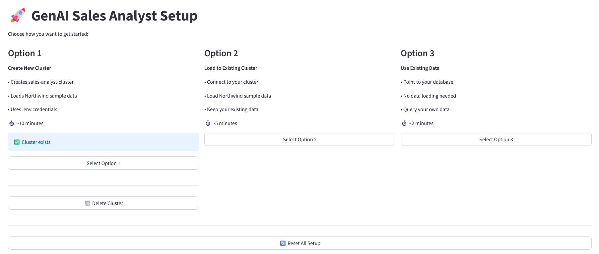
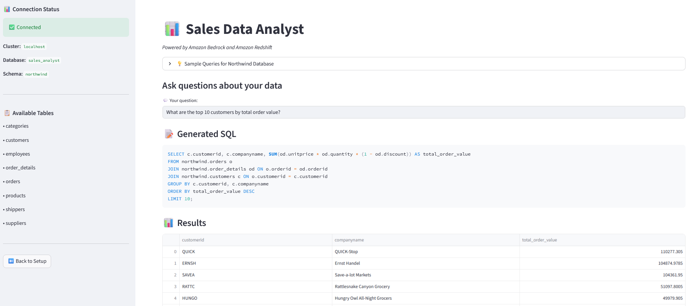

# Amazon Bedrock & Amazon Redshift Sales Analyst POC (Text to SQL)
**Authors: Senthil Kamala Rathinam, Shashi Makkapati, Jacob Scheatzle**

## Overview of Solution

This is sample code demonstrating the use of Amazon Bedrock and Generative AI to create an intelligent sales data analyst that uses natural language questions to query relational data stores, specifically Amazon Redshift. This example leverages the complete Northwind sample database with realistic sales scenarios containing customers, orders, and order details.

**Please Note: If you don&#39;t want to build this from scratch, Amazon Redshift now supports GenAI capabilities natively, more information on that can be found [here](https://aws.amazon.com/blogs/aws/amazon-redshift-adds-new-ai-capabilities-to-boost-efficiency-and-productivity/).**





## Goal of this POC
The goal of this repo is to provide users the ability to use Amazon Bedrock and generative AI to ask natural language questions about sales performance, customer behavior, and business metrics. These questions are automatically transformed into optimized SQL queries against a private Amazon Redshift cluster. This repo includes complete infrastructure automation, security hardening, and intelligent context retrieval.

The architecture & flow of the POC is as follows:


When a user interacts with the POC, the flow is as follows:

1. **Natural Language Query**: The user makes a request through the Streamlit interface, asking a natural language question about sales data in Amazon Redshift (`app.py`)

2. **Query Understanding**: The natural language question is passed to Amazon Bedrock  for intent analysis and query classification (`src/graph/workflow.py` - `understand_query()`)

3. **Context Retrieval**: The system performs semantic search using FAISS vector store to retrieve relevant database schema information and table relationships (`src/graph/workflow.py` - `retrieve_context()`)

4. **Intelligent SQL Generation**: Amazon Bedrock generates optimized SQL queries using the retrieved context, ensuring proper table joins and data type handling (`src/graph/workflow.py` - `generate_sql()`)

5. **Secure Query Execution**: The SQL query is executed against the private Redshift cluster through a secure SSM tunnel via the EC2 bastion host (`src/utils/redshift_connector_iam.py`)

6. **Result Analysis**: The retrieved data is passed back to Amazon Bedrock for intelligent analysis and insight generation (`src/graph/workflow.py` - `analyze_results()`)

7. **Natural Language Response**: The system returns comprehensive insights and explanations to the user through the Streamlit frontend (`app.py`)

# How to use this Repo:

## Prerequisites:

1. [AWS CLI](https://docs.aws.amazon.com/cli/latest/userguide/getting-started-install.html) installed and configured with access to Amazon Bedrock, EC2, Redshift, and IAM.

2. [Python](https://www.python.org/downloads/) v3.11 or greater. The POC runs on Python.

3. **AWS Authentication**: This project uses flexible AWS authentication that works in multiple environments:
   - **EC2 Instance**: Automatically uses IAM role attached to the instance (no credentials needed)
   - **Local Machine**: Uses AWS CLI credentials from `~/.aws/credentials` (run `aws configure`)
   - **Required AWS Permissions**: 
     - Bedrock: `bedrock:InvokeModel`, `bedrock-runtime:InvokeModel`
     - Redshift: `redshift:*` (for cluster management)
     - EC2: `ec2:*` (for bastion host)
     - SSM: `ssm:*` (for secure tunneling)
     - IAM: `iam:*` (for role creation)

4. AWS account with permissions to create Redshift clusters, EC2 instances, VPCs, and IAM roles.

5. **Note**: This project uses robust security with private infrastructure and no public endpoints. Ensure you're running the application on your native operating system (Windows/macOS/Linux) rather than WSL2, as the SSM tunnel functionality works more reliably on native systems.

## Steps

1. Install Git (Optional step):
    ```bash  
    # Amazon Linux / CentOS / RHEL:
    sudo yum install -y git
    # Ubuntu / Debian:
    sudo apt-get install -y git
    # Mac/Windows: Git is usually pre-installed
    ```

2. Clone the repository to your local machine.

    ```bash
    git clone https://github.com/aws-samples/amazon-bedrock-amazon-redshift-text-to-sql-poc.git
    
    ```
    
    The file structure of this POC is organized as follows:
    
    * `requirements.txt` - All dependencies needed for the application
    * `app.py` - Main Streamlit application with UI components
    * `src/bedrock/bedrock_helper_iam.py` - Amazon Bedrock client wrapper with IAM authentication
    * `src/graph/workflow.py` - LangGraph-inspired AI workflow orchestration
    * `src/vector_store/faiss_manager.py` - FAISS vector store for semantic search
    * `src/utils/redshift_cluster_manager.py` - Automatic AWS infrastructure provisioning
    * `src/utils/redshift_connector_iam.py` - Secure database connection management with IAM
    * `src/utils/northwind_bootstrapper.py` - Automatic sample data loading
    * `src/config/settings.py` - Application configuration
    * `cleanup.py` - AWS resource cleanup script

3. Open the repository in your favorite code editor. In the terminal, navigate to the POC's folder:
    ```bash
    cd amazon-bedrock-redshift-iam-text-to-sql
    ```

4. Configure the Python virtual environment, activate it:
    ```bash
    python3 -m venv .venv
    source .venv/bin/activate  # On Windows: .venv\Scripts\activate
    ```

5. Install project dependencies. This automatically detects your platform and installs the right dependencies:

    Amazon Linux 2023: Installs SQLite libraries + FAISS fixes

    Ubuntu: Installs build tools + dependencies
    
    Mac/Windows: Uses standard pip install

    ```bash
    python3 setup.py
    ```

6. **Configure AWS Credentials** (Environment-specific):

   **Option A: Running on AWS EC2 Instance**
   
   Attach an IAM role to your EC2 instance with the required permissions listed above.
   
   No additional credential configuration needed - the application automatically uses the instance's IAM role.
   
   **Option B: Running on Local Machine (Windows/Mac/Linux)**
   
   Configure AWS CLI with your credentials:
   ```bash
   aws configure
   ```
   
   Enter your AWS credentials when prompted:
   ```
   AWS Access Key ID: YOUR_ACCESS_KEY
   AWS Secret Access Key: YOUR_SECRET_KEY
   Default region name: us-east-1
   Default output format: json
   ```
   
   This creates `~/.aws/credentials` file that the application automatically uses.
   
   Verify your credentials:
   ```bash
   aws sts get-caller-identity
   ```

7. Create a `.env` file in the root folder. Copy from `.env.example` and update as needed:

    ```bash
    cp .env.example .env
    ```

    The `.env` file should contain:

    ```bash
    # AWS Configuration
    AWS_REGION=us-east-1

    # Option 1 Default Cluster Configuration (Required for Option 1)
    OPTION1_CLUSTER_ID=sales-analyst-cluster
    OPTION1_DATABASE=sales_analyst
    OPTION1_SCHEMA=northwind
    OPTION1_USER=admin
    OPTION1_PASSWORD=YourSecurePassword123!

    # SSL Configuration (Required for Redshift)
    REDSHIFT_SSL_MODE=require
    ```

    ⚠️ **Important**: 
    - Change `OPTION1_PASSWORD` to a secure password (required for Option 1)
    - Password must meet AWS Redshift requirements: 8-64 characters, at least one uppercase, one lowercase, and one number
    - Never commit `.env` file to version control

8. **EC2-Specific Configuration** (Skip if running locally):
   
   If running on an Amazon EC2 instance, configure the Security Group to access the Streamlit UI from your browser: 

    - Go to EC2 Console → Security Groups
    - Edit your EC2's security group
    - Add inbound rule: Port 8501, Source: Your IP (or 0.0.0.0/0 for public access)

9. Start the application from your terminal:
    ```bash
    streamlit run app.py
    ```

10. **Setup Options**: The application provides three setup options:

   **Option 1: Create New Cluster**
   - Creates a new private Redshift cluster with default settings from `.env`
   - Automatically loads Northwind sample data
   - Sets up secure SSM tunnel for connection
   - Takes ~10 minutes for complete setup

   **Option 2: Load to Existing Cluster**
   - Connect to your existing Redshift cluster
   - Loads Northwind sample data into your cluster
   - Indexes the schema for AI queries
   - Takes ~5 minutes

   **Option 3: Use Existing Data**
   - Connect to your existing Redshift cluster with your own data
   - No data loading - uses your existing tables
   - Indexes your schema for AI queries
   - Takes ~2 minutes

11. **Start Analyzing**: Once setup is complete, you can ask natural language questions like:
   - "What are the top 5 customers by order value?"
   - "Show me monthly sales trends for 1997"
   - "Which products have the highest profit margins?"
   - "What countries generate the most revenue?"


## Cleanup

To avoid ongoing AWS charges, run the cleanup script when finished:

```bash
python3 cleanup.py
```

This will automatically remove all created AWS resources including the Redshift cluster, EC2 instance, and associated infrastructure.

## Architecture Highlights

- **Zero Configuration**: Complete infrastructure automation
- **Context-Aware AI**: Semantic search for intelligent SQL generation
- **Multi-Step AI Pipeline**: Query understanding → Context retrieval → SQL generation → Analysis
- **Enterprise Security**: Private networking with secure tunnels
- **Flexible Authentication**: Works seamlessly on EC2 (IAM role) or local machines (AWS CLI credentials)
- **No Hardcoded Credentials**: Uses AWS credential chain for secure authentication
- **Extensible Design**: Modular architecture for easy customization


### Built with:

- Amazon Bedrock: AI/ML models for natural language processing
- Amazon Redshift: Private data warehouse for fast analytics
- EC2 + SSM: Bastion host with Session Manager tunnel
- FAISS: Vector database for semantic search
- Streamlit: Web interface
- LangGraph: Workflow orchestration

### Security Architecture:
- Your Computer → SSM Tunnel → EC2 Bastion → Private Redshift Cluster
(localhost:5439)    (AWS Session Manager)    (No public access)


## Troubleshooting
### Common Issues
- **"Permission denied" errors**:
    - Verify your EC2 instance has proper IAM role attached
    - Check IAM role has permissions for Bedrock, Redshift, EC2, and SSM

- **"Setup fails" or timeouts**:
    - Run python3 cleanup.py first
    - Try a different AWS region in .env (us-west-2, eu-west-1)
    - Ensure you have sufficient AWS service limits
    - Wait for bastion host SSM agent to come online (can take 2-3 minutes)

- **"Credentials not found" or "Unable to locate credentials"**:
    - **On EC2**: Verify IAM role is attached to instance: `aws sts get-caller-identity`
    - **On Local Machine**: Run `aws configure` to set up credentials
    - Verify credentials work: `aws bedrock list-foundation-models --region us-east-1`
    - Ensure `.env` file has `AWS_REGION` set correctly

- **"OPTION1_PASSWORD must be set" error (Option 1 only)**:
    - Open `.env` file and set `OPTION1_PASSWORD=YourSecurePassword123!`
    - Password must be 8-64 characters with uppercase, lowercase, and number
    - Restart the application after updating `.env`

- **"App won't start"**:
    - Ensure Python 3.11+ is installed: python3 --version
    - Install requirements: pip install -r requirements.txt
    - Try: python3 -m streamlit run app.py

- **"Connection failed" or "SSM tunnel failed"**:
    - The app uses a private Redshift cluster with bastion host for security
    - Connection goes through localhost:5439 via SSM tunnel
    - If connection fails, wait 2-3 minutes for SSM agent to initialize

- **"Session Manager plugin issues**:

    - The setup script automatically installs the Session Manager plugin
    - If installation fails, the app will show manual installation instructions
    - Plugin is required for secure SSM tunneling to private Redshift cluster

### Getting Help
- Check AWS CloudFormation console for detailed error messages
- Review AWS costs in Billing console
- Ensure your AWS account has no service limits blocking resource creation


## ⚠️ Important: Proof of Concept

**This is a Proof of Concept (POC) for demonstration purposes.**

This application demonstrates the art of possibility with Amazon Bedrock and Redshift. While it includes security best practices like IAM authentication and private networking, it is designed for learning and experimentation.

**Before using in production environments:**
- Replace `.env` passwords with AWS Secrets Manager
- Add input validation and rate limiting for user queries
- Enable SSL certificate validation (`verify-full`) for Redshift connections
- Review and apply principle of least privilege to IAM permissions
- Implement comprehensive logging and monitoring
- Add authentication and authorization for the Streamlit interface
- Conduct a full security audit and penetration testing
- Review AWS Well-Architected Framework guidelines

**Current Security Features (POC-appropriate):**
- ✅ IAM role-based authentication (no hardcoded AWS keys)
- ✅ Private Redshift cluster with no public access
- ✅ Secure SSM tunneling through bastion host
- ✅ Parameterized SQL queries to prevent injection
- ✅ Environment variables for configuration
- ✅ `.env` file excluded from version control


## How-To Guide
For detailed usage instructions and advanced configuration, visit [HOWTO.md](HOWTO.md)
