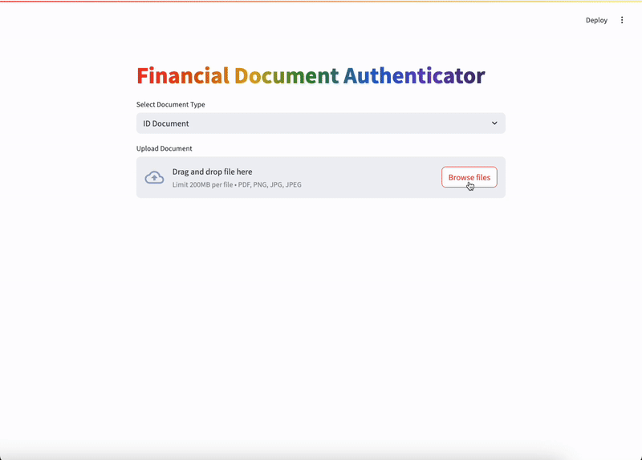

# Amazon Bedrock Document Authenticator POC

## Overview of Solution

This is a sample code demonstrating the use of Amazon Bedrock and Generative AI for document verification and information extraction. The application features a Streamlit frontend where users can upload various document types (ID Documents, Bank Statements, Utility Bills, Pay Stubs, and Employment Verification Letters) and perform automated verification and information extraction.




## Goal of this POC

The goal of this repository is to demonstrate how to leverage Amazon Bedrock's Claude model for automated document verification and information extraction. This POC provides a straightforward frontend that allows users to quickly test document verification capabilities and extract relevant information with high confidence scores.

The architecture & flow of the POC is as follows:


1. User accesses the Streamlit web application through their browser.

1. User selects document type and uploads a document (ID, Bank Statement, Utility Bill, Pay Stub, or Employment Verification Letter) through the Streamlit interface.

1. The uploaded document is processed and sent to Amazon Bedrock's Anthropic Claude 3 model for analysis.

1. Claude 3 analyzes the document and returns the extracted information and verification results back to the Streamlit application, which displays them to the user.


# How to use this Repo:

## Prerequisites

1. [AWS CLI](https://docs.aws.amazon.com/cli/latest/userguide/getting-started-install.html) installed and configured with access to Amazon Bedrock.

1. [Python](https://www.python.org/downloads/) v3.11 or greater. The POC runs on python. 

## Steps
1. Clone the repository to your local machine.

    ```
    git clone https://github.com/aws-samples/genai-quickstart-pocs.git
    ```
    
    The file structure of this POC is broken into these files
    
    * `requirements.txt` - all the requirements needed to get the sample application up and running.
    * `app.py` - The streamlit frontend
    * `document_processor.py` - Contains the logic for document processing and Bedrock integration
    
    
    

1. Open the repository in your favorite code editor. In the terminal, navigate to the POC's folder:
    ```zsh
    cd genai-quickstart-pocs-python/amazon-bedrock-document-authenticator-poc
    ```

1. Configure the python virtual environment, activate it & install project dependencies. *Note: each POC has it's own dependencies & dependency management.*
    ```zsh
    python -m venv .env
    source .env/bin/activate
    pip install -r requirements.txt
    ```

1. Start the POC from your terminal
    ```zsh
    streamlit run app.py
    ```
This should start the POC and open a browser window to the application. 

## How-To Guide
For a details how-to guide for using this poc, visit [HOWTO.md](HOWTO.md)


