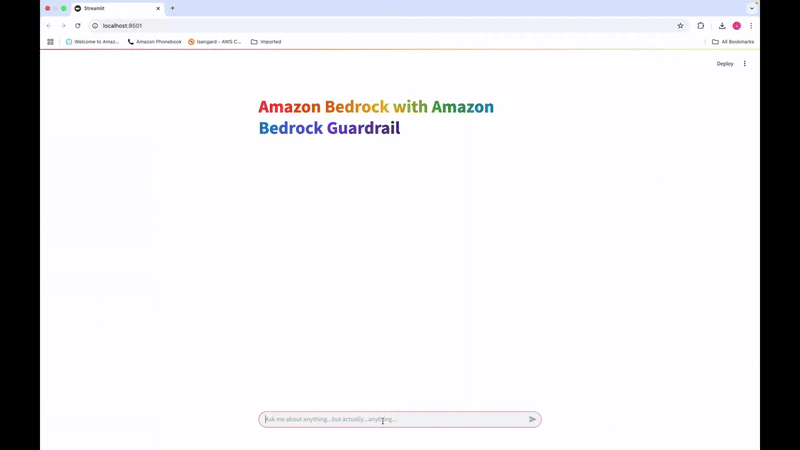

# Amazon Bedrock Guardrails POC

## Overview of Solution

"This is sample code demonstrating the use of Amazon Bedrock Guardrails to restrict a variety of conversation topics and provide targeted, personalized responses when users attempt to discuss prohibited subjects. The application features a Streamlit frontend where users can engage in open-ended conversations with Claude 3, with Bedrock Guardrails configured to block prompts for sensitive topics and generate dynamic responses based on the specific topic that was blocked.




## Goal of this POC
The goal of this repo is to provide users the ability to use Amazon Bedrock Guardrails to demonstrate its ability to prevent malicious prompts and responses. Customers have stated that they want a personlized response for blocked topics and this POC will show you how you can identify the guardrail topic that has been hit and then provide a more tailored response as to why the chat is blocked.
This repo comes with a basic frontend to help users stand up a proof of concept in just a few minutes.

The architecture & flow of the POC is as follows:


When a user interacts with the POC, the flow is as follows:

1. The user inserts a text question into to the streamlit app. (`app.py`)

1. The streamlit app, takes the text inserted by the user and is passed into an Amazon Bedrock Guardrail to check for prompt injection. If the prompt is detected as malicious or triggers the guardrail a response will be returned to the end user saying the request is blocked (`invoke_model_with_guardrails.py`)

1. If the prompt does not trigger the guardrail it is passed into the bedrock model the user has specified (`invoke_model_with_guardrails.py`)

1. A response is returned by the Amazon Bedrock Model of choice and is passed into the Amazon Bedrock Guardrail (`invoke_model_with_guardrails.py`). If the response is detected as malicious or triggers the guardrail a response will be returned to the end user saying the request is blocked (`invoke_model_with_guardrails.py`)

1. If the response does not trigger a guardrail, a natural language response is returned to the end user answering the initial text question inserted by the end user (`app.py`)


# How to use this Repo:

## Prerequisites:

1. [AWS CLI](https://docs.aws.amazon.com/cli/latest/userguide/getting-started-install.html) installed and configured with access to Amazon Bedrock.

1. [Python](https://www.python.org/downloads/) v3.11 or greater. The POC runs on python. 


## Steps
1. Clone the repository to your local machine.

    ```
    git clone https://github.com/aws-samples/genai-quickstart-pocs.git
    ```
    
    The file structure of this POC is broken into these files
    
    * `requirements.txt` - all the requirements needed to get the sample application up and running.
    * `app.py` - The streamlit frontend
    
    
    * `invoke_model_with_guardrails.py` - Houses the logic of the application, including the prompt formatting logic and Amazon Bedrock API invocations.
    
    

1. Open the repository in your favorite code editor. In the terminal, navigate to the POC's folder:
    ```zsh
    cd genai-quickstart-pocs-python/amazon-bedrock-guardrails-poc
    ```

1. Configure the python virtual environment, activate it & install project dependencies. *Note: each POC has it's own dependencies & dependency management.*
    ```zsh
    python -m venv .env
    source .env/bin/activate
    pip install -r requirements.txt
    ```

1. create a .env file in the root of this repo. Within the .env file you just created you will need to configure the .env to contain:

    ```zsh
    profile_name=<AWS_CLI_PROFILE_NAME>
        region_name=<REGION>
guardrail_identifier=<Guardrail_Identifier>
guardrail_version=<Guardrail_Version> (this is just a number i.e. 1,2,3 etc...)
    ```


1. Start the POC from your terminal
    ```zsh
    streamlit run app.py
    ```
This should start the POC and open a browser window to the application. 

## How-To Guide
For a details how-to guide for using this poc, visit [HOWTO.md](HOWTO.md)

