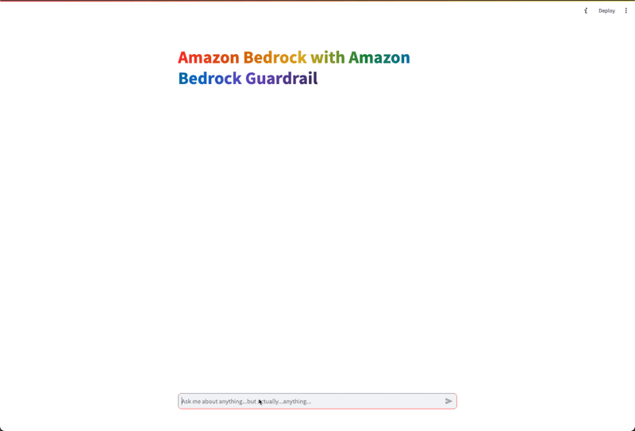

# Amazon Bedrock Guardrails POC

## Overview of Solution

This is sample code demonstrating the use of Amazon Bedrock Guardrails to help prevent prompt-injection attacks and prevent unintended responses from the LLM. The application is constructed with a simple streamlit frontend where users can input zero shot requests to Claude 3, with Amazon Bedrock Guardrails in place to prevent malicious prompts and responses.




# How to use this Repo:

## Prerequisites:

1. [AWS CLI](https://docs.aws.amazon.com/cli/latest/userguide/getting-started-install.html) installed and configured with access to Amazon Bedrock.

1. [Node](https://nodejs.org/en/download/package-manager) v20 or greater. Node is used to manage the repository and execute commands including starting the python POC. 

1. [Python](https://www.python.org/downloads/) v3.11 or greater. The POC runs on python. 


## Steps
1. Clone the repository to your local machine.

    ```
    git clone https://github.com/aws-samples/genai-quickstart-pocs.git
    ```

1. Navigate to this POC's folder in your terminal
    ```zsh
    cd 
    ```

1. Configure the python virtual environment, activate it & install project dependencies
    ```zsh
    python -m venv .env
    source .env/bin/activate
    pip install -r requirements.txt
    ```
1. Start the POC from your terminal
    ```zsh
    streamlit run app.py
    ```
This should start the POC and open a browser window to the application. 

## How-To Guide
For a details how-to guide for using this poc, visit [HOWTO.md](HOWTO.md)