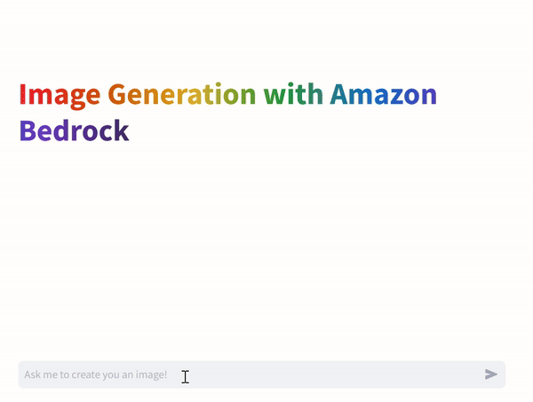
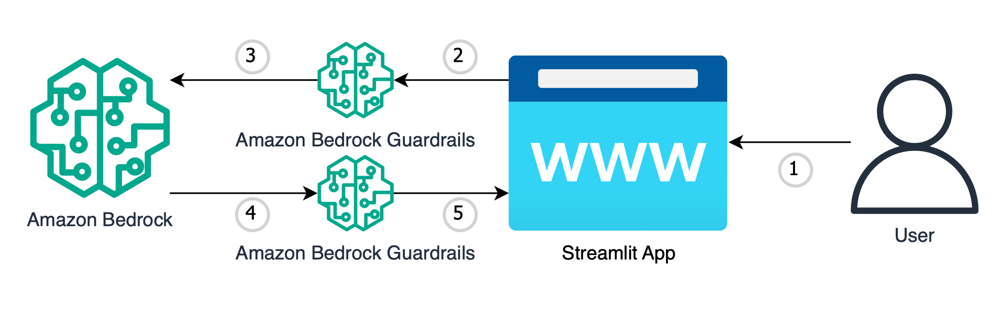

# Amazon-Bedrock-Guardrails-POC

This sample code demonstrates using Amazon Bedrock Guardrails to prevent Stability Diffusion LLM from generating harmful, obscene, or violent images. The application features a streamlit frontend where users input zero-shot requests to Claude 3. Amazon Bedrock Guardrails determine whether to proceed with generating images using the Stability Diffusion model.


# **Goal of this Repo:**

The goal of this repo is to provide users the ability to use Amazon Bedrock and generative AI to create images based on text input requests with security guardrails.
This repo comes with a basic frontend to help users stand up a proof of concept in just a few minutes.

The architecture and flow of the sample application will be:



When a user interacts with this Generative AI app, the flow is as follows:

1. The user inserts a text question into to the streamlit app. (app.py).
2. The streamlit app, takes the text inserted by the user and is passed to Claude LLM with Guardrail id to check for prompt which is acceptable. If the prompt is detected as malicious or triggers the guardrail, a response (Blocked Messaging statement on Bedrock Guardrails) will be returned to the end user saying the request is blocked with a message "Inappropriate prompt!!" (image_generation_guardrails.py).
3. If the prompt does not trigger the guardrail, it is passedto the model Stability diffusion model to generate images.

# How to use this Repo:

## Prerequisites:

1. Amazon Bedrock Access and CLI Credentials.
2. Create an Amazon Bedrock Guardrail, information on how to do that can be found [here](https://docs.aws.amazon.com/bedrock/latest/userguide/guardrails-create.html) 
Put message blocking content from Bedrock console and initialize variable "guardrail_msg" (app.py)
2. Ensure Python 3.10- installed on your machine, it is the most stable version of Python for the packages we will be using, it can be downloaded [here](https://www.python.org/downloads/release/python-3100/).

## Step 1:

The first step of utilizing this repo is performing a git clone of the repository.

```
git clone https://github.com/aws-samples/genai-quickstart-pocs.git
```

After cloning the repo onto your local machine, open it up in your favorite code editor. The file structure of this repo is broken into 3 key files,
the app.py file, the invoke_model_with_guardrails.py file, and the requirements.txt. The app.py file houses the frontend application (a streamlit app).
invoke_model_with_guardrails.py file houses the logic of the application, including the Amazon Bedrock Guardrail and Amazon Bedrock API invocations.
The requirements.txt file contains all necessary dependencies for this sample application to work.

## Step 2:

Set up a python virtual environment in the root of this specific POCs directory and ensure that you are using Python 3.10. This can be done by running the following commands:

```
pip install virtualenv
python3.10 -m venv venv
```

The virtual environment will be extremely useful when you begin installing the requirements. If you need more clarification on the creation of the virtual environment please refer to this [blog](https://www.freecodecamp.org/news/how-to-setup-virtual-environments-in-python/).
After the virtual environment is created, ensure that it is activated, following the activation steps of the virtual environment tool you are using. Likely:

```
source venv/bin/activate
```

After your virtual environment has been created and activated, you can install all the requirements found in the requirements.txt file by running this command in the root of this specific POCs directory in your terminal:

```
pip install -r requirements.txt
```

## Step 3:

Now that the requirements have been successfully installed in your virtual environment we can begin configuring environment variables.
You will first need to create a .env file in the root of this repo. Within the .env file you just created you will need to configure the .env to contain:

```
profile_name=<CLI_profile_name>
region_name=<REGION>
guardrail_identifier=<Guardrail_Identifier>
guardrail_version=<Guardrail_Version> (this is just a number i.e. 1,2,3 etc...)
```

Please ensure that your AWS CLI Profile has access to Amazon Bedrock!

## Step 4:

As soon as you have successfully cloned the repo, created a virtual environment, activated it, installed the requirements.txt, and created a .env file, your application should be ready to go.
To start up the application with its basic frontend you simply need to run the following command in your terminal while in the root of the repositories' directory:

```
streamlit run app.py
```

As soon as the application is up and running in your browser of choice you can begin asking text questions and generating natural language responses having Amazon Bedrock Guardrails preventing malicious requests and responses.
