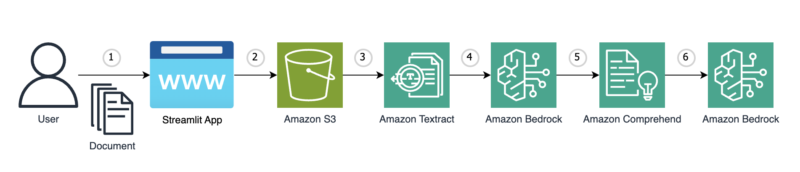

# Amazon-Bedrock-Intelligent-Document-Processing-Pipeline-POC

This is sample code demonstrating the use of Amazon Bedrock and Generative AI incorporated into an Intelligent Document Processing (IDP) pipeline using user-uploaded documents. The application is constructed with a simple streamlit frontend where users can upload various document formats and perform different IDP actions such as text extraction, document summarization and classification, entity recognition, and Q&A to satisfy a broad range of use cases.


# **Goal of this Repo:**

The goal of this repo is to provide users the ability to use various Amazon AI services utilized in an IDP pipeline combined with Amazon Bedrock to improve performance, complete tasks faster, and limit human review. This repo comes with a basic frontend to help users stand up a proof of concept in just a few minutes.

The architecture and flow of the sample application will be:




When a user interacts with the GenAI app, the flow is as follows:

1. The user selects and uploads a document to the streamlit frontend (upload_doc_to_s3.py).
2. The document is uploaded to an Amazon S3 bucket (upload_doc_to_s3.py, s3_utils.py)
3. The raw text and key-value pairs are extracted from the document using Amazon Textract (extract_text_with_textract.py, textract_utils.py)
4. The extracted key-value pairs are grammatically corrected using Amazon Bedrock, where the enriched output is saved to the local directory (enrich_doc_with_bedrock.py, bedrock_utils.py)
5. The enriched output is then analyzed by Amazon Comprehend to detect entities such as people, organizations, locations, and more (entity_recognition_with_comprehend.py, comprehend_utils.py).
6. The enriched output is then passed to Amazon Bedrock for document classification, summarization, and Q&A tasks. Bedrock’s multimodal capabilities can also be compared at each these stages by analyzing the document as is (classify_doc_with_bedrock.py, summarize_doc_with_bedrock.py, doc_qa_with_bedrock.py, bedrock_utils.py)

# How to use this Repo:

## Prerequisites:

1. Amazon Bedrock, Amazon Textract, Amazon Comprehend Access and CLI Credentials. Ensure that the proper FM model access is provided in the Amazon Bedrock console
2. Ensure Python 3.11 installed on your machine, it is the most stable version of Python for the packages we will be using, it can be downloaded [here](https://www.python.org/downloads/release/python-3911/).
3. An Amazon S3 bucket with permissions to upload and list objects. This is required to upload your document.

## Step 1:

The first step of utilizing this repo is performing a git clone of the repository.

```
git clone https://github.com/aws-samples/genai-quickstart-pocs.git
```

After cloning the repo onto your local machine, open it up in your favorite code editor. The file structure of this repo is broken into 14 key files: 
* app.py: The main streamlit app entry point.
* pages/welcome.py: The welcome page providing an overview of the IDP stages.
* pages/upload_doc_to_s3.py: The streamlit page that houses the logic to select a document or file to upload.
* pages/extract_text_with_textract.py: The streamlit page that houses the logic to invoke a new Textract job.
* pages/enrich_doc_with_bedrock.py: The streamlit page that houses the logic to read the key-value pair text file (output/key_value.txt) and invoke Bedrock to enrich the document by correcting any grammar mistakes or incorrect text extractions from the Textract job. The enriched result is saved as a local text file (output/enriched_output.txt).
* pages/entity_recognition_with_comprehend.py: The streamlit page that houses the logic to invoke Comprehend to perform entitiy recognition on the contents in the enriched output file (output/enriched_output.txt).
* pages/classify_doc_with_bedrock.py: The streamlit page that houses the logic to provide the user the option to classify the document from a select category of classes using either Bedrock's text or multimodal capabilities. A user can choose to have Bedrock read the enriched output file (output/enriched_output.txt) or read the file stored in S3 as an image to classify the document.
* pages/summarize_doc_with_bedrock.py: The streamlit page that houses the logic to provide the user the option to summarize the document using either Bedrock's text or multimodal capabilities. A user can choose to have Bedrock read the enriched output file (output/enriched_output.txt) or read the file stored in S3 as an image to summarize the document.
* pages/doc_qa_with_bedrock.py: The streamlit page that houses the logic to provide the user the option to ask questions about the document using either Bedrock's text or multimodal capabilities. A user can choose to have Bedrock read the enriched output file (output/enriched_output.txt) or read the file stored in S3 as an image to answer user queries regarding the document's contents.
* idp/bedrock_utils.py: The file containing the logic for document enrichment, classification, summarization, and question-answering by interacting with Amazon Bedrock. These interactions are performed by sending a structured prompt containing the relevant text or image data to the Bedrock model via API calls. The prompt includes instructions for the model, such as correcting grammar, classifying documents into predefined categories, or summarizing content, and the model's responses are parsed and returned as usable output.
* idp/comprehend_utils.py: The file containing the logic to invoke Amazon Comprehend, which will perform entity recognition using the default pre-trained model to detect entities such as names, dates, organizations, etc.
* idp/s3_utils.py: The file containing the logic to upload a file to S3 and list any current documents stored in the selected bucket.
* idp/textract_utils.py: The file containing the logic to start a Textract job that analyzes the document and extracts the raw text and key-value pairs from the document, saving both as local text files (extracted_text.txt and key_value.txt) to the "output" folder.
* requirements.txt: The file containing all necessary dependencies for this sample application to work.

## Step 2:

Set up a python virtual environment in the root directory of the repository and ensure that you are using Python 3.9. This can be done by running the following commands:

```
pip install virtualenv
python3.11 -m venv venv
```

The virtual environment will be extremely useful when you begin installing the requirements. If you need more clarification on the creation of the virtual environment please refer to this [blog](https://www.freecodecamp.org/news/how-to-setup-virtual-environments-in-python/).
After the virtual environment is created, ensure that it is activated, following the activation steps of the virtual environment tool you are using. Likely:

```
source venv/bin/activate
```

After your virtual environment has been created and activated, you can install all the requirements found in the requirements.txt file by running this command in the root of this repos directory in your terminal:

```
pip install -r requirements.txt
```

## Step 3:

Now that the requirements have been successfully installed in your virtual environment we can begin configuring environment variables. You will first need to create a .env file in the root of this repo. Within the .env file you just created you will need to configure the .env to contain your AWS profile, along with the name of your S3 bucket for uploaded documents, as shown below:

```
profile_name=<AWS_CLI_PROFILE_NAME>
save_folder=<YOUR_S3_BUCKET_NAME>
```

Please ensure that your AWS CLI Profile has access to Amazon Bedrock!

Depending on the region and model that you are planning to use Amazon Bedrock in, you may need to reconfigure each file that utilizes Bedrock set to the appropriate region. Each of these files are configured as shown below:

```
client = boto3.client("bedrock-runtime", region_name="us-west-2")
model_id = "anthropic.claude-3-5-sonnet-20240620-v1:0"
```

Since this repository is configured to leverage Claude 3.5 Sonnet, the prompt payload is structured in a different format compared to previous models and other model providers. If you wanted to leverage other Amazon Bedrock models you can change the Bedrock invocation function in each file, modifying the body parameters using this guide depending on the model ID.

## Step 4:

As soon as you have successfully cloned the repo, created a virtual environment, activated it, installed the requirements.txt, and created a .env file, your application should be ready to go.
To start up the application with its basic frontend you simply need to run the following command in your terminal while in the root of the repositories' directory:

```
streamlit run app.py
```

As soon as the application is up and running in your browser of choice you can begin the IDP pipeline by starting at the first stage and uploading a document to your S3 bucket.
