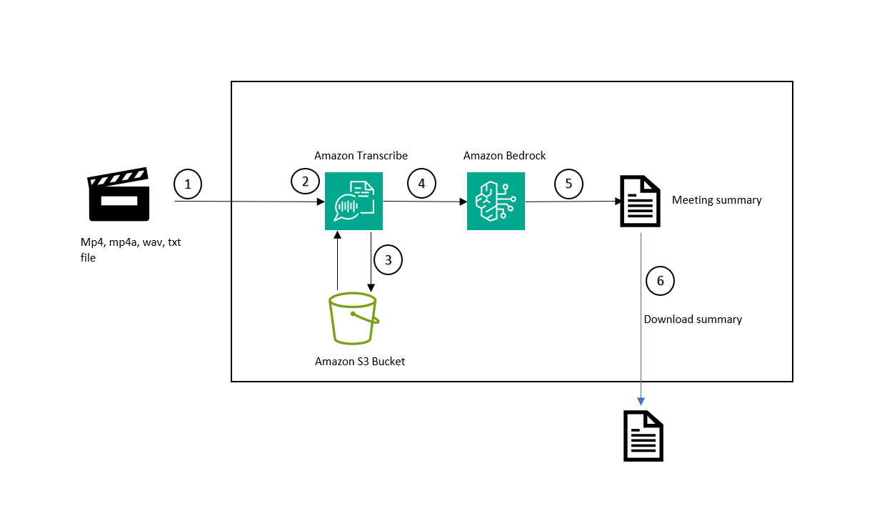

# Amazon-Bedrock-meeting-minutes-summarization

This application demonstrates using Amazon Bedrock and Amazon Transcribe to summarize meeting recordings. The streamlit frontend allows users to upload audio, video, or text files of meeting recording. Amazon Transcribe generates a transcript of recording and sent it Amazon Bedrock for summarization of the key discussion points. Users can then download the  generated summarized meeting notes.


# **Goal of this Repo:**

The goal of this repo is to provide users the ability to use Amazon Bedrock and Amazon Transcribe to create Meeting minutes from audio ,video recordings. If audio 
It show case the capablitiy to upload Audio, Video of meeting recording and create summary of meeting.

The architecture and flow of the sample application will be:



When a user interacts with the GenAI app, the flow is as follows:

1. The user uploads a meeting recording video or audio or .txt file using Upload File button.
2. Meeting recording is already present in Amazon Transcribe Job History Transcription text is retrieved from Job History
3. If Meeting recording is not present in Amazon Transcribe Job history, recording file is temporary upload on S3 and Sent to Amazon Transcribe Job to generate transcription text 
4. Transcription text is sent to Amazon Bedrock LLM for summarization
5. Summarization notes are updated in streamlit app
6. User can download the meeting notes


# How to use this Repo:

## Prerequisites:

1. Amazon Bedrock Access and CLI Credentials. Ensure that the proper FM model access is provided in the Amazon Bedrock console
2. Amazon Transcribe Access
3. S3 Bucket with permissions to upload/delete objects. This is require to upload the Transcriptions.
4. Ensure Python 3.10 installed on your machine, it is the most stable version of Python for the packages we will be using, it can be downloaded [here](https://www.python.org/downloads/release/python-3911/).

## Step 1:

The first step of utilizing this repo is performing a git clone of the repository.

```
git clone https://github.com/aws-samples/genai-quickstart-pocs.git
```

After cloning the repo onto your local machine, open it up in your favorite code editor. 
## Step 2:

Set up a python virtual environment in the root directory of the repository and ensure that you are using Python 3.9. This can be done by running the following commands:

```
pip install virtualenv
python3.10 -m venv venv
```

The virtual environment will be extremely useful when you begin installing the requirements. If you need more clarification on the creation of the virtual environment please refer to this [blog](https://www.freecodecamp.org/news/how-to-setup-virtual-environments-in-python/).
After the virtual environment is created, ensure that it is activated, following the activation steps of the virtual environment tool you are using. Likely:

```
cd venv
cd bin
source activate
cd ../../
```

After your virtual environment has been created and activated, you can install all the requirements found in the requirements.txt file by running this command in the root of this repos directory in your terminal:

```
pip install -r requirements.txt
```

## Step 3:

Now that the requirements have been successfully installed in your virtual environment we can configure S3 Bucket required for temporary uploading the file

Update the S3 Bucket name with your bucket name in **line 21**

**app.py** :
```
S3_BUCKET_NAME = "<YOUR BUCKET NAME>"
```


## Step 4: **Running the UI**
```
streamlit run app.py
```

# POC Environment
This section will walk you through the various files that exist in this POC directory.

* `app.py` - This the main application that generates the UI through streamlit.
* `llm.py` - This file has the logic to interact with LLM using Amazon Bedrock API. 
* `transcribe_util.py` - This is the file that contains the logic to interact with Amazon Transcribe like starting Transcribe Job, getting Transcription job history, getting transcription text.
* `s3_util.py` - This is the file that contains the logic to interact with S3 bucket.
* `requirements.txt` - The python packages required for the app to function. You will reference this during setup
 

