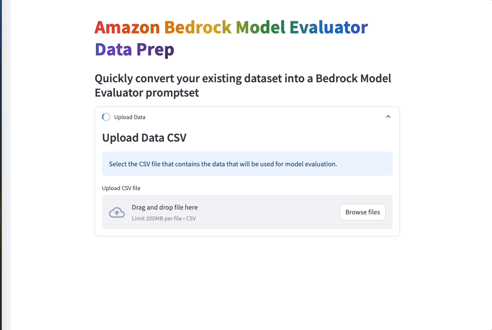

# Amazon Bedrock Model Evaluation Data Prep Tool

## Overview of Solution

This is sample code aimed to accelerate customers aiming to leverage [Amazon Bedrock Model Evaluator](https://docs.aws.amazon.com/bedrock/latest/userguide/model-evaluation.html) with custom prompt data. This Proof-of-Concept (POC) enables users to provide a CSV containing data that should be used with Amazon Bedrock Model Evaluator. The user then maps the CSV columns to the appropriate fields depending on which type of Model Evaluation being executed. This will generate one or more `.jsonl` formatted files, ready for use with Amazon Bedrock Model Evaluator.




# How to use this Repo:

## Prerequisites:

1. [AWS CLI](https://docs.aws.amazon.com/cli/latest/userguide/getting-started-install.html) installed and configured with access to Amazon Bedrock.

1. [Python](https://www.python.org/downloads/) v3.11 or greater. The POC runs on python. 


## Steps
1. Clone the repository to your local machine.

    ```
    git clone https://github.com/aws-samples/genai-quickstart-pocs.git
    ```

1. Navigate to this POC's folder in your terminal
    ```zsh
    cd 
    ```

1. Configure the python virtual environment, activate it & install project dependencies
    ```zsh
    python -m venv .env
    source .env/bin/activate
    pip install -r requirements.txt
    ```
1. Start the POC from your terminal
    ```zsh
    streamlit run app.py
    ```
This should start the POC and open a browser window to the application. 

## How-To Guide
For a details how-to guide for using this poc, visit [HOWTO.md](HOWTO.md)