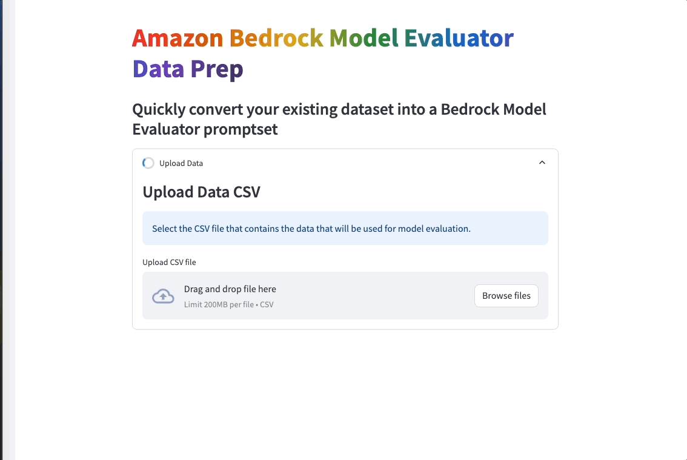

# Amazon-Bedrock-Model-Eval-POC

This is sample code aimed to accelerate customers aiming to leverage [Amazon Bedrock Model Evaluator](https://docs.aws.amazon.com/bedrock/latest/userguide/model-evaluation.html) with custom prompt data. This Proof-of-Concept (POC) enables users to provide a CSV containing data that should be used with Amazon Bedrock Model Evaluator. The user then maps the CSV columns to the appropriate fields depending on which type of Model Evaluation being executed. This will generate one or more `.jsonl` formatted files, ready for use with Amazon Bedrock Model Evaluator.



## At a glance
At a high-level, the POC workflow is:
1. Run the POC (see "How to use this Repo")
1. Upload CSV of data to use with Model Evaluator
1. Select the type of Model Evaluation being performed
1. Map CSV columns to expected fields specific to the prompt type selected
1. Download generated `.jsonl` file(s)
1. Upload the generated `.jsonl` files to an Amazon S3 bucket that Amazon Bedrock Model Evalutor can access
1. Execute Model Evaluation using custom prompts pointing to the newly uploaded prompt dataset. If you have more than 1,000 prompts, multiple files will have been generated. You can only execute model evaluation on a maximum of 1,000 records. 

    # How to use this Repo:

    ## Prerequisites:

    1. Amazon Bedrock Access and CLI Credentials. Ensure the AWS credentials have access to execute Amazon Bedrock Model Evaluation. 
    2. Ensure Python 3.11 installed on your machine, it is the most stable version of Python for the packages we will be using, it can be downloaded [here](https://www.python.org/downloads/release/python-3911/).
    3. Ensure you have access to an Amazon S3 bucket where you can upload generated data. Amazon Bedrock Model Evaluator will also need access to read and write to this bucket during Model Evaluation. 

    ## Step 1:

    The first step of utilizing this repo is performing a git clone of the repository.

    ```
    git clone https://github.com/aws-samples/genai-quickstart-pocs.git
    ```
    After cloning the repo onto your local machine, open the repo in your favorite code editor. Navigate to this POC folder within the repo. 

    The POC consists of two files: 
    * `app.py` is the frontend application that is run using streamlit
    * `logic.py` is the logic that processes the data from the front-end

    ## Step 2:

    Set up a python virtual environment in the directory of the POC and ensure that you are using Python 3.11. This can be done by running the following commands: (make sure you've set your working directory in terminal to the POC directory)

    ```zsh
    pip install virtualenv
    python3.11 -m venv venv
    ```
    The virtual environment will be extremely useful when you begin installing the requirements. If you need more clarification on the creation of the virtual environment please refer to this [blog](https://www.freecodecamp.org/news/how-to-setup-virtual-environments-in-python/).
    After the virtual environment is created, ensure that it is activated, following the activation steps of the virtual environment tool you are using. Likely:
    ```zsh
    source venv/bin/activate
    ```

    After your virtual environment has been created and activated, you can install all the requirements found in the requirements.txt file by running this command in the root of this repos directory in your terminal:

    ```zsh
    pip install -r requirements.txt
    ```

    ## Step 4:
    Your machine should now be configured to run the POC. To start the POC, execute the following from the command line (from the POC directory, with the virtual environment activated):

    ```zsh
    streamlit run app.py
    ```
    This should start the POC and open a browser window to the application. Follow the instructions in the application to generate prompt data.

# Using the Model Evaluator Data Prep tool
Once the streamlit app is up and running in your browser, it's time to complete the form in the tool with the correct details from your data. 

There are four evaluation types: **Question & Answer (Q&A)**, **Text Generation**, **Text Summarization**, and **Classification**. Depending on your data and goals, you may be able to execute different evaluations on the same data using the tool to prep the data for each evaluation type. 

*Currently, CSV data requires column headers. **Please make sure your data includes headers in your CSV file before starting with the tool.***

Once you complete the fields in the tool, it will generate `.jsonl` files for use with Amazon Bedrock Model Evaluator. Download the `.jsonl` files and follow the [guidance]((https://docs.aws.amazon.com/bedrock/latest/userguide/model-evaluation.html)) from Amazon Bedrock Model Evaluator to start evaluating models with your custom prompts. 
