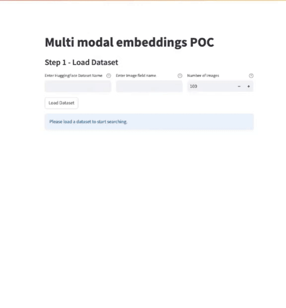

# Amazon Bedrock Multi Modal Embeddings POC

## Overview of Solution

This POC demonstrates the implementation of reverse image search using Amazon Bedrock Titan Multimodal Embeddings model and Anthropic Claude 3, with a Streamlit frontend interfacing with FAISS vector database and local file system as image store. Users can import images from Hugging Face datasets which are processed to generate vector embeddings for the database. The system enables reverse image search where users can make a query and/or upload a reference image to find similar ones, with the LLM model providing detailed analysis of the results.




## Goal of this POC
The goal of this repo is to provide users with the ability to perform reverse image search with Generative AI. This repo comes with a basic streamlit front-end to help users stand up a proof of concept and experiment with multi modal embeddings modal use-cases quickly.

The architecture & flow of the POC is as follows:


When a user interacts with the POC, the flow is as follows:

1. User initiates a request to the Streamlit app to load data.

1. App sends request to the access dataset from Hugging Face by repo name and number of records.

1. Datasets are returned to the app.

1. App extracts images from the dataset by the field name and then sends data to Amazon Bedrock (Titan Multimodal Embeddings) for processing

1. Amazon Bedrock generates embeddings and returns them to the app.

1. App stores the associated images to the Images Store (file system).

1. App saves the generated embeddings to the Vector DB (FAISS).

1. User sends a query (with or without reference image) to the Streamlit app.

1. App sends the query to Amazon Bedrock (Titan) for embedding generation.

1. Amazon Bedrock returns the query embeddings.

1. App performs similarity search in the Vector DB.

1. App retrieves matching results and sends them along with user query to Amazon Bedrock (Anthopic Claude 3 model).

1. Claude 3 performs detailed analysis and returns results to the app.


# How to use this Repo:

## Prerequisites:

1. [AWS CLI](https://docs.aws.amazon.com/cli/latest/userguide/getting-started-install.html) installed and configured with access to Amazon Bedrock.

1. [Python](https://www.python.org/downloads/) v3.11 or greater. The POC runs on python. 


## Steps
1. Clone the repository to your local machine.

    ```
    git clone https://github.com/aws-samples/genai-quickstart-pocs.git
    ```
    
    The file structure of this POC is broken into these files
    
    * `requirements.txt` - all the requirements needed to get the sample application up and running.
    * `app.py` - The streamlit frontend
    
    
    * `image_service.py` - house the logic of the application, including the interacting with vector DB, prompt formatting logic and the Amazon Bedrock API invocations.
    
    

1. Open the repository in your favorite code editor. In the terminal, navigate to the POC's folder:
    ```zsh
    cd genai-quickstart-pocs-python/amazon-bedrock-multi-modal-embeddings-poc
    ```

1. Configure the python virtual environment, activate it & install project dependencies. *Note: each POC has it's own dependencies & dependency management.*
    ```zsh
    python -m venv .env
    source .env/bin/activate
    pip install -r requirements.txt
    ```

1. Create a .env file in the root of this repo. Within the .env file you just created you will need to configure the .env to contain:

    ```zsh
    AWS_REGION=<AWS_REGION>
	AWS_ACCESS_KEY_ID=<AWS_ACCESS_KEY_ID>
	AWS_SECRET_ACCESS_KEY=<AWS_SECRET_ACCESS_KEY>
          
    ```


1. Start the POC from your terminal
    ```zsh
    streamlit run app.py
    ```
This should start the POC and open a browser window to the application. 

## How-To Guide
For a details how-to guide for using this poc, visit [HOWTO.md](HOWTO.md)

