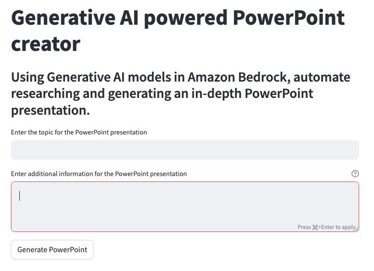

# POC Usage Guide

This guide covers how to use the Streamlit POC in the browser. 
For information guidance on downloading and running the POC, please visit the [README](README.md)
---

With the POC running, navigate to the streamlit URL provided in the console.
The default url is [http://localhost:8501](http://localhost:8501).
Now just fill out the text fields. 
* In the first field, for topic, input a clear topic that of the presentation. The topic will also be used as the title
* In the second field, for additional information, provide any use information or context you'd like included when generating content through inference. This can include who the target audience is, specific details to include, clarity on the topic, or any other helpful text.

After the fields are complete, simply click **Generate PowerPoint**

PowerPoint generation can take upwards of 5 minutes, depending on how many sections are created, how many slides in each section, speed/latency of internet connection. 

Once the PowerPoint is generated, click the **Download PowerPoint** button to download it from your browser. If you are running it locally, you can also navigate to the `temp/` directory within the POC folder to find any generated POCs. Note: downloading the POC deletes the temp file to ensure the folder doesn't build up with files. 