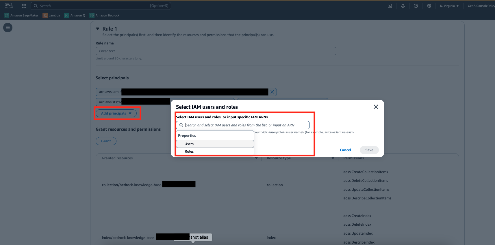

# RAG with Amazon Bedrock and Semantic Cache

This project demonstrates a Retrieval-Augmented Generation (RAG) system using Amazon Bedrock for knowledge retrieval and OpenSearch for semantic caching. It provides a Streamlit-based user interface for asking questions about data stored in Amazon Knowledge Bases.


## Goal of this Repo

The primary goal of this repository is to showcase an efficient and scalable question-answering system that combines the power of Large Language Models (LLMs) with a knowledge base and semantic caching. This approach aims to:

1. Provide fast and accurate answers to user queries
2. Reduce the load on the LLM and knowledge base by utilizing a semantic cache
3. Reduce the cost of the system by limiting calls to the LLM
4. Demonstrate the integration of Amazon Bedrock and OpenSearch for semantic caching purposes


The application flow is as follows:

1. Load documents and crawl websites to add data into knowledge base
2. User submits a question through the Streamlit UI
3. The system checks the semantic cache (OpenSearch) for similar previous queries
4. If a cache hit occurs, the stored answer is returned immediately
5. If no cache hit, the system queries the Amazon Bedrock Knowledge Base for relevant context
6. The retrieved context and user question are sent to an LLM (Claude 3) for answer generation
7. The new question-answer pair is stored in the semantic cache
8. The answer is displayed to the user in the Streamlit interface

## Project Structure

- `chat.py`: Main Streamlit application file
- `knowledge_base.py`: Functions for interacting with Amazon Bedrock Knowledge Base
- `semantic_cache.py`: Functions for semantic caching using OpenSearch
- `utils.py`: Utility functions and shared configurations

## Prerequisites
1. Amazon Bedrock Access and CLI Credentials. Ensure that the proper FM model access is provided in the Amazon Bedrock console
2. A Amazon Bedrock Knowledge Base with Amazon OpenSearch as the Vector Store. Instructions can be found [here](https://docs.aws.amazon.com/bedrock/latest/userguide/knowledge-base-create.html).
3. Ensure Python 3.10 installed on your machine, it is the most stable version of Python for the packages we will be using, it can be downloaded [here](https://www.python.org/downloads/release/python-3911/).

## Setup and Installation

1. Clone the repository:
```
git clone https://github.com/aws-samples/genai-quickstart-pocs/tree/main/genai-quickstart-pocs-python/amazon-bedrock-semantic-cache-poc.git
cd amazon-bedrock-semantic-cache-poc
```

2. Create and activate a virtual environment:
```
python -m venv venv
source venv/bin/activate  # On Windows, use venv\Scripts\activate
```

3. Install the required dependencies:
```
pip install -r requirements.txt
```

4. Set up your AWS credentials and configure your AWS CLI profile.

5. Create a `.env` file in the project root with the following variables:
```
PROFILE_NAME=your_aws_profile_name
AWS_REGION=your_aws_region
OPENSEARCH_HOST=your_opensearch_host
OPENSEARCH_INDEX=your_opensearch_index (Note: Specify a name like semantic-cache-index. This will be a seperate index than your knowledge base which will be created by the application)
KNOWLEDGE_BASE_ID=your_knowledge_base_id
```

Note: you can also export these variables via the CLI

6. Update OpenSearch permissions to allow access from the CLI and to grant delete actions

a. Navigate to OpenSearch Serverless Collections


b. Select your Collection


c. Click on Data Access Control


d. Select Edit


e. Add your CLI user as a principal  



f. Grant Delete Collection Items on the collection and Delete Index on the index and click Save


## Running the Application

To run the Streamlit application:

1. Ensure you're in the project directory and your virtual environment is activated.

2. Run the following command:
```
streamlit run app.py
```

3. Open a web browser and navigate to the URL provided by Streamlit (usually `http://localhost:8501`).

## Considerations

Other vector db's can be used to implement semantic caching. Here a a few helpful links to explore:

1. [Semantic Caching with MemoryDB](https://aws.amazon.com/blogs/database/improve-speed-and-reduce-cost-for-generative-ai-workloads-with-a-persistent-semantic-cache-in-amazon-memorydb/)
2. [Semantic Caching with LangChain](https://python.langchain.com/v0.2/docs/integrations/llm_caching/)

Please note that only specific models can be used with Amazon Bedrock Knowledge Bases and with the Amazon Bedrock Converse API.
1. Amazon Bedrock Converse API - Supported [models](https://docs.aws.amazon.com/bedrock/latest/userguide/conversation-inference.html) and model features
2. Amazon Bedrock Knowledge Bases - Supported [models](https://docs.aws.amazon.com/bedrock/latest/userguide/knowledge-base-supported.html) by action

## License

This project is licensed under the MIT License - see the LICENSE file for details.