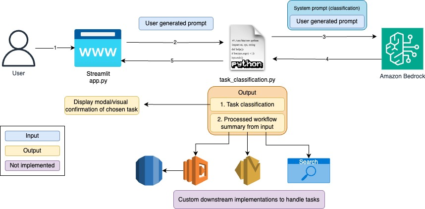

# Amazon-Bedrock-CSV-Task-Classification-POC

This smaple code demonstrating the use of Amazon Bedrock and Generation AI to implement a task classification bot. The application is constructed with a simple streamlit frontend where users can input a task and get the correct classification which then trigger appropriate downstream workflows to process the task inputted. 


# **Goal of this Repo:**

The goal of this repo is to provide users the ability to use Amazon Bedrock and generative AI to classify a task, and thus the ability to auto trigger downstream workflows that are designed to process these tasks. <br />
This repo comes with a basic front end to help users stand up a proof of concept in just a few minutes.

The architecture of this demo is show below:


When a user interacts with the app, the flow is as follow: <br /> 
1. The user input task with relevant details into the streamlit app (app.py).
2. The streamlit app, takes the task with description and pass it along to a helper file (task_classification.py).
3. This helper file calls the Bedrock API and wraps the user prompt with a system prompt, parsing user's input and add further requirements.
4. Amazon Bedrock responses to the user's task in 2 items. 
* What class the task belongs to 
* Model's further processing of task details (to then be pass on to appropriate downstream processes)
5. The application parse the two items from the model outputs to perform next steps (task_classification.py).
6. A visual confirmation on streamlit app (pop up modal) to ensure the correct class is assigned to the task inputted (app.py). 

# How to use this Repo:

## Prerequisites:

1. Amazon Bedrock Access and CLI Credentials. Ensure that the proper FM model access is provided  in the Amazon Bedrock console (Claude Haiku in this demo).
2. Ensure Python3.10 is installed in your machine, it's the most stable version of Python for the packages we will be using, it can be downloaded [here](https://www.python.org/downloads/release/python-3911/).

## Step 1:

The first step of utilizing this repo is performing a git clone of the repository:

```
git clone https://github.com/aws-samples/genai-quickstart-pocs.git
```

1. app.py - This file houses the front end application (a streamlit app)
After cloning the repo onto your local machine, open it up in your favourite code editor. The file structure of this repo is broken into 3 key files: <br />
2. task_classfication.py - This file houses the logic of the application and Amazon Bedrock API invocations.
3. requirements.txt - This file contains all the necessary dependencies for this sample application to work.

## Step 2:

Set up a pythong virtual environment in the root directory of the repository and ensure that you are using Python 3.10. This can be done my running the following commands:

```
pip install virtualenv
python3.10 -m venv venv
```

The virtual environment will be extremely useful when you begin the requirements. If you need more clarification on the creation of the virtual environment please refer to this [blog](https://www.freecodecamp.org/news/how-to-setup-virtual-environments-in-python/).
After the virtual environment is created, ensure that it is activated, following the activation steps of the virtual environment tool you are using. Likely: 

```
source venv/bin/activate
```

After your virtual environment has been created and activated, you can install al the requirements found in the requirements.txt file by running this command in the root of this repos directory in your terminal:

```
pip install -r requirements.txt
```

## Step 3:

Now that the requirements have been successfully installed in your virtual environment we can begin configuring environment variables. <br />
You will first need to create a .env file in the root of this repo. Within the .env file you just created you will need to configure the .env to contain:

```
profile_name=<AWS_CLI_PROFILE_NAME>
```

Please ensure that your AWS CLI Profile has access to Amazon Bedrock.

This sample specifically leverages Claude Haiku for its speed and affordability advantage over other Clause models (as of June 2024). You can change this source code to adapt it to the model of your choice if needed. 

## Step 4:

As soon as you have successfully cloned the repo, created a virtual environment, activated it, installed the requirements.txt, and created an .env file, your application should be ready to go. <br />
To start up the application with its basic frontend you simply need to run the following command in your terminal while in the root of the repositories' directory:
```
streamlit run app.py
```
As soon as the application is up and running in your browser of choice, you can begin inputting task description.