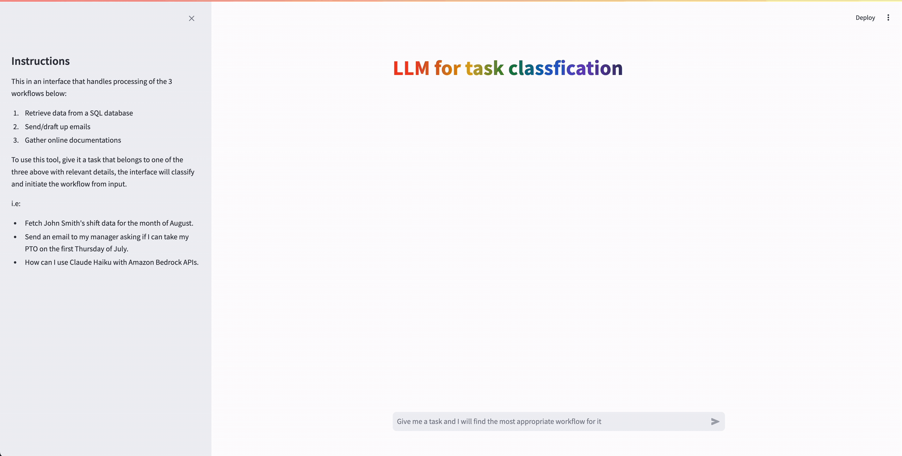

# Amazon Bedrock Task Classification POC

## Overview of Solution

This sample code demonstrates how to use Amazon Bedrock and Generative AI to implement a task classification bot. The application is constructed with a simple streamlit frontend where users can input a task and get the correct classification which then trigger appropriate downstream workflows to process the task inputted. 




## Goal of this POC
The goal of this repo is to provide users the ability to use Amazon Bedrock and generative AI to classify a task, and thus the ability to auto trigger downstream workflows that are designed to process these tasks.
This repo comes with a basic front end to help users stand up a proof of concept in just a few minutes.

The architecture & flow of the POC is as follows:


When a user interacts with the POC, the flow is as follows:

1. The user input task with relevant details into the streamlit app (app.py).

1. The streamlit app, takes the task with description and pass it along to a helper file (task_classification.py).

1. This helper file calls the Bedrock API and wraps the user prompt with a system prompt, parsing user&#39;s input and add further requirements.

1. Amazon Bedrock responses to the user&#39;s task in 2 items.
      * What class the task belongs to 
      * Model&#39;s further processing of task details (to then be pass on to appropriate downstream processes)

1. The application parse the two items from the model outputs to perform next steps (task_classification.py).

1. A visual confirmation on streamlit app (pop up modal) to ensure the correct class is assigned to the task inputted (app.py). 


# How to use this Repo:

## Prerequisites:

1. [AWS CLI](https://docs.aws.amazon.com/cli/latest/userguide/getting-started-install.html) installed and configured with access to Amazon Bedrock.

1. [Python](https://www.python.org/downloads/) v3.11 or greater. The POC runs on python. 


## Steps
1. Clone the repository to your local machine.

    ```
    git clone https://github.com/aws-samples/genai-quickstart-pocs.git
    ```
    
    The file structure of this POC is broken into these files
    
    * `requirements.txt` - all the requirements needed to get the sample application up and running.
    * `app.py` - The streamlit frontend
    
    
    * `task_classification.py` - The logic required to invoke Amazon Bedrock and parse the response
    
    

1. Open the repository in your favorite code editor. In the terminal, navigate to the POC's folder:
    ```zsh
    cd genai-quickstart-pocs-python/amazon-bedrock-task-classification
    ```

1. Configure the python virtual environment, activate it & install project dependencies. *Note: each POC has it's own dependencies & dependency management.*
    ```zsh
    python -m venv .env
    source .env/bin/activate
    pip install -r requirements.txt
    ```

1. Create a .env file in the root of this repo. Within the .env file you just created you will need to configure the .env to contain:

    ```zsh
    profile_name=<AWS_CLI_PROFILE_NAME
    ```


1. Start the POC from your terminal
    ```zsh
    streamlit run app.py
    ```
This should start the POC and open a browser window to the application. 

## How-To Guide
For a details how-to guide for using this poc, visit [HOWTO.md](HOWTO.md)

