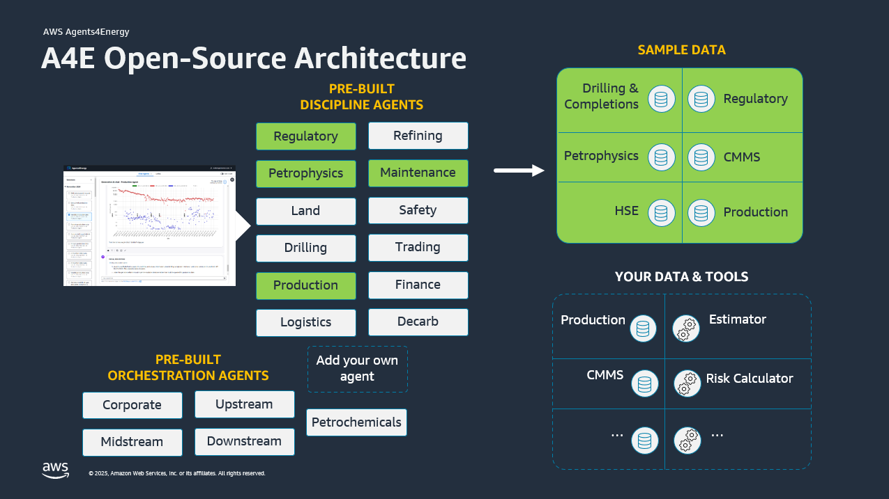
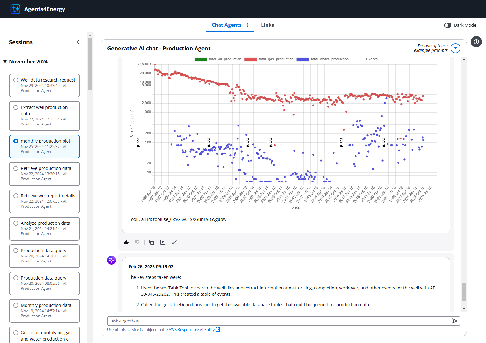
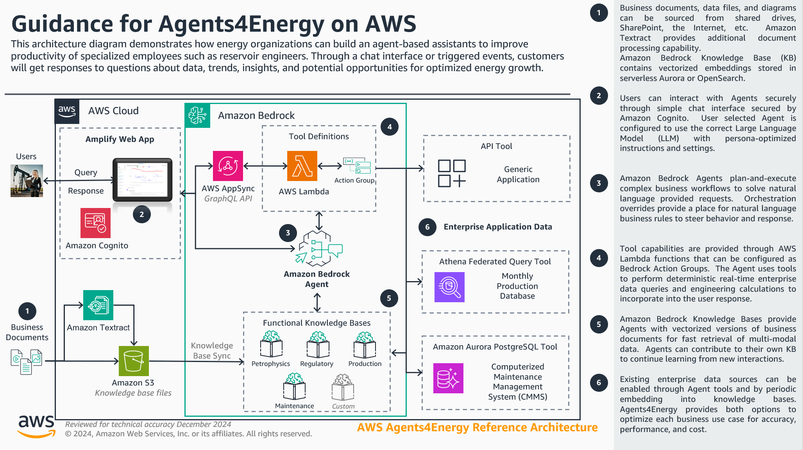
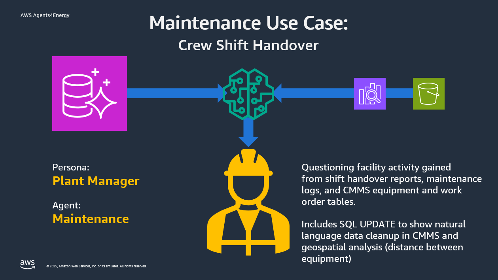

# Agents4Energy 

Getting started deploying generative AI agents for the first time? Begin by deploying [this agents4energy sample agent repository](https://github.com/aws-samples/sample-agents4energy-agent-template-alpha).

Agents4Energy (A4E) is an easily configurable and deployable, set of open-source agentic workflows to help customers in Energy industry accelerate their workloads on AWS. A4E enables industry professionals to use generative AI assistants for a range of common energy industry use cases such as reservoir characterization, well workover assessment, field data analysis, supply chain optimization, and asset integrity management.



It is no exaggeration to say that generative artificial intelligence (GenAI) is fundamentally revolutionizing the way we work.  Large Language Model (LLM) capabilities have bridged the communication gap between humans and computers fostering a new way of working that is already providing magnitiude shifts in productivity.  Agents and agentic workflows are terms that are no longer just for the techies, being mentioned every day in the news, talk shows, and around the water cooler.  This blog focuses on the energy industry, but every industry is being disrupted, and the landscape is changing on a weekly, or even daily basis.

To address the needs of the energy industry and harness the great power presented by GenAI, AWS is proud to announce Agents4Energy.  This solution makes it easy for operators and service companies to incorporate the sixth generation of computing into their existing technical environments.  Much like a travel agent handles the nitty-gritty details of booking a vacation for you, energy agents scan diverse data sources and enterprise systems to unlock insights and complete tasks on your behalf.



Agents4Energy encapsulates the industry expertise of hundreds of energy professionals and centuries of experience to simplify the daily undifferentiated tasks of operating energy assets.  Think of all the verifications, optimizations, and analysis that you and your team doesn't have time to do.  These are the perfect tasks to configure agents to work on.

# AWS Reference Architecture


# Solution Deployment
For detailed deployment instructions, please see [DEPLOYMENT.md](DEPLOYMENT.md).

## Agent Development
To begin developing in this repo, perform the following steps. These steps are independent of the deployment steps.
1. Clone the repo
1. Run `npm install` to install the required packages.
1. Run `npm run ecrAuth` to authenticate with the AWS ECR repo. This lets you pull lambda build images.
1. Run `npx ampx sandbox` to create your personal sandbox environment for development.
1. In a different ternimal run `npm run dev` to start a development server for the front end. You can reach this server by navigating to `localhost:3000` in an internet browser.
1. Now when you make code changes, they will be deployed to both the front and back end.


### Limit sign up to certain email addresses
When a user signs up for an account, the suffix of their email address is checked against an allow list.
To change which email address suffixes are allowed, follow these steps:
1. In the AWS Amplify console, navigate to your branch.
1. Click the "Functions" button on the left side bar
1. Look for the function with "preSignUp" in the function name. Click on this function.
1. Click "View in Lambda"
1. Click "Configuration" and then "Environmental Variables"
1. The variable named "ALLOWED_EMAIL_SUFFIXES" is a comma separated list of allowed email suffixes. Change this variable to reflect the email addresses you would like to allow. If you add an empty element (ex: `@amazon.com,`), any email address will be allowed.

## Production Agent

### Add new structured data
This data will be queried using Amazon Athena

Steps:
1. Upload your data to the key `production-agent/structured-data-files/` in the file drive
1. Wait 5 minutes for the AWS Glue crawler to run, and for the new table definitions to be loaded into the Amazon Bedrock Knowledge Base.
1. Now you can ask the production agent questions about the new data!

### Add new data source
You can add new data sources thorugh [Amazon Athena Federated Query](https://docs.aws.amazon.com/athena/latest/ug/connect-to-a-data-source.html)

Steps:
1. Configure a new Amazon Athena Federated Query Data Source
2. Tag the data source with key: "AgentsForEnergy" and value: "true"
3. Create a JSON object for each table in the data source. See an example below.
4. Upload the files  

Example Table Definition:
```json
{
  "dataSource": "AwsDataCatalog",
  "database": "production_db_171",
  "tableName": "crawler_pricing",
  "tableDefinition": "\"date\"\tvarchar\n\"wti_price\"\tdouble\n\"brent_price\"\tdouble\n\"volume\"\tbigint"
}
```
## Maintenance Agent

You can modify the data that is included in the Aurora Serverless v2 PostgreSQL database by altering the [INSERT SQL statements used in the DB prep Lambda function](amplify/agents/maintenance/lambda).

This Lambda function can be run at any time to reset the sample data to the original deployed state.  This can be useful if you use the agent to modify or update the data to test the read-write capabilities of the text-to-SQL tool.
