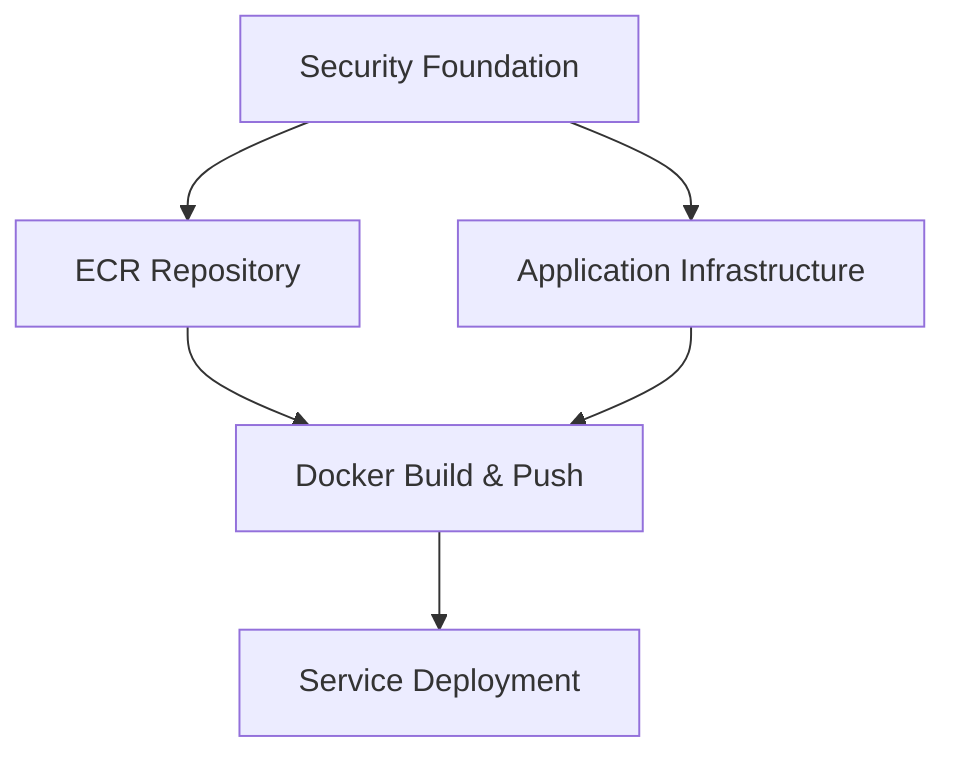

# 🚀 Deployment Guide - Complete Deployment Best Practices

## 📋 Overview

This guide provides comprehensive deployment best practices for the Advisor Assistant POC, ensuring safe, reliable, and repeatable deployments for customer demonstrations and production use.

### 🔒 Security Notice
**This POC deploys with HTTP endpoints for simplicity. For production use, HTTPS implementation with SSL/TLS certificates would be required and is not included in this POC deployment.**

### 🖥️ Platform Support
**Deployment has been tested and validated on macOS environments. Windows deployment paths are provided but have not been fully tested.**

### 🤖 AWS Bedrock Model Access Requirement
**Before deployment, you must enable Claude 3.5 Sonnet model access in your AWS account. This is a one-time setup per AWS account.**

### 🎯 Deployment Philosophy
- **Safety First**: Pre-deployment testing prevents broken deployments
- **Zero Downtime**: Rolling updates with health checks
- **Rollback Ready**: Automatic rollback on failure detection
- **Observable**: Comprehensive logging and monitoring throughout deployment
- **Repeatable**: Infrastructure as Code with version control

## 🤖 AWS Bedrock Model Access Setup (Required)

Before deploying, you must enable Claude 3.5 Sonnet model access in AWS Bedrock. This is a **one-time setup per AWS account**.

### Step-by-Step Model Access Setup

1. **Navigate to AWS Bedrock Console**
   ```bash
   # Open in browser
   https://console.aws.amazon.com/bedrock/
   ```

2. **Access Model Configuration**
   - In the left navigation pane, under **Bedrock configurations**, choose **Model access**
   - Click the **Modify model access** button

3. **Select Claude 3.5 Sonnet**
   - Find **Anthropic Claude 3.5 Sonnet** in the model list
   - Check the box to enable access
   - Review the End User License Agreement (EULA)

4. **Complete Use Case Form**
   - For Anthropic models, you must describe your use case
   - Fill out the required form with your intended usage
   - Submit the form for review

5. **Submit and Wait for Approval**
   - Review your selections and terms
   - Click **Submit** to request access
   - Approval is typically instant for most use cases

### Verify Model Access
```bash
# Test that Claude 3.5 Sonnet is accessible
aws bedrock list-foundation-models --region us-east-1 \
  --query 'modelSummaries[?contains(modelId, `claude-3-5-sonnet`)]'

# Should return model information if access is granted
```

### Troubleshooting Model Access
- **Access Denied**: Ensure your IAM user/role has `aws-marketplace:Subscribe` permissions
- **Model Not Listed**: Verify you're in a supported region (us-east-1, us-west-2, etc.)
- **Use Case Rejected**: Revise your use case description to be more specific about business needs

## 🛠️ Deployment Methods

### 1. Recommended: Safe Deployment with Tests
```bash
./deploy-with-tests.sh poc us-east-1

# What this does:
# ✅ Runs 20+ pre-deployment tests
# ✅ Validates syntax, configuration, and dependencies
# ✅ Checks existing deployment health
# ✅ Deploys infrastructure and application
# ✅ Performs post-deployment validation
```

### 2. Quick Updates (Code Changes Only)
```bash
# For application code updates without infrastructure changes
./scripts/quick-update.sh poc us-east-1

# What this does:
# ✅ Builds new Docker image
# ✅ Pushes to ECR
# ✅ Forces ECS service deployment
# ✅ Waits for health checks
```

### 3. Infrastructure Only Updates
```bash
# For CloudFormation template changes only
aws cloudformation deploy \
  --template-file cloudformation/02-application-infrastructure-poc.yaml \
  --stack-name advisor-assistant-poc-app \
  --capabilities CAPABILITY_NAMED_IAM \
  --region us-east-1
```

## 🧪 Pre-Deployment Testing

### Automated Test Suite
The `deploy-with-tests.sh` script runs comprehensive validation:

> 📖 **For detailed testing procedures and troubleshooting, see [TESTING.md](TESTING.md)**

#### Phase 1: Syntax and Structure Validation
```bash
✅ JavaScript syntax validation (all service files)
✅ JSON configuration validation (package.json, environments.json)
✅ File structure validation (essential files exist)
✅ CloudFormation template validation
```

#### Phase 2: Dependency and Import Validation
```bash
✅ Node.js service imports
✅ NPM package dependencies
✅ AWS SDK integration
```

#### Phase 3: Configuration Validation
```bash
✅ Environment file validation
✅ Docker configuration
✅ Script permissions
```

#### Phase 4: Application Health Check
```bash
✅ Existing deployment health (if deployed)
✅ API endpoint validation
✅ Database connectivity
```

#### Phase 5: Security and Best Practices
```bash
✅ No hardcoded AWS keys
✅ Environment variable usage
✅ Security configuration
```

### Manual Pre-Deployment Checklist
- [ ] AWS CLI configured with appropriate permissions
- [ ] Docker installed and running
- [ ] API keys available (optional for initial deployment)
- [ ] Target region supports all required services
- [ ] No conflicting CloudFormation stacks

## 🏗️ Infrastructure Deployment

### CloudFormation Stack Deployment Order
```
1. Security Foundation Stack
   ├── VPC and Networking
   ├── Security Groups
   ├── KMS Keys
   └── Cognito User Pool

2. ECR Repository Stack
   ├── Container Registry
   └── Lifecycle Policies

3. Application Infrastructure Stack
   ├── ECS Cluster and Service
   ├── Application Load Balancer
   ├── DynamoDB Tables
   └── IAM Roles
```

### Stack Dependencies


### Infrastructure Validation
```bash
# Check stack status
aws cloudformation describe-stacks \
  --stack-name advisor-assistant-poc-security \
  --region us-east-1

# Validate stack outputs
aws cloudformation describe-stacks \
  --stack-name advisor-assistant-poc-app \
  --query 'Stacks[0].Outputs' \
  --region us-east-1
```

## 🐳 Container Deployment

### Docker Build Process
```bash
# Multi-platform build for AWS Fargate
docker buildx build --platform linux/amd64 -t advisor-assistant-poc .

# Tag for ECR
docker tag advisor-assistant-poc:latest $ECR_URI:latest

# Push to ECR
docker push $ECR_URI:latest
```

### ECS Service Deployment
```bash
# Force new deployment with rolling update
aws ecs update-service \
  --cluster advisor-assistant-poc-cluster \
  --service advisor-assistant-poc-service \
  --force-new-deployment \
  --region us-east-1

# Wait for deployment to complete
aws ecs wait services-stable \
  --cluster advisor-assistant-poc-cluster \
  --services advisor-assistant-poc-service \
  --region us-east-1
```

### Zero-Downtime Deployment Configuration
```yaml
# ECS Service Configuration
DeploymentConfiguration:
  MaximumPercent: 200          # Allow 2 tasks during deployment
  MinimumHealthyPercent: 50    # Keep 50% healthy during deployment
  DeploymentCircuitBreaker:
    Enable: true               # Auto-rollback on failure
    Rollback: true

# ALB Target Group Health Checks
HealthCheckIntervalSeconds: 15      # Check every 15 seconds
HealthCheckTimeoutSeconds: 10       # 10 second timeout
HealthyThresholdCount: 2            # 2 successes = healthy
UnhealthyThresholdCount: 3          # 3 failures = unhealthy
```

## 🔍 Deployment Monitoring

### Real-time Monitoring During Deployment
```bash
# Monitor ECS service events
aws ecs describe-services \
  --cluster advisor-assistant-poc-cluster \
  --services advisor-assistant-poc-service \
  --query 'services[0].events[0:5]' \
  --region us-east-1

# Monitor application logs
aws logs tail /ecs/advisor-assistant-poc --follow --region us-east-1

# Check ALB target health
aws elbv2 describe-target-health \
  --target-group-arn $TARGET_GROUP_ARN \
  --region us-east-1
```

### Health Check Validation
```bash
# Application health endpoint
curl -f http://your-alb-dns/api/health

# Expected response:
{
  "status": "healthy",
  "timestamp": "2024-01-15T10:30:00.000Z",
  "version": "1.0.0",
  "services": {
    "database": "connected",
    "ai": "available",
    "external_apis": "configured"
  }
}
```

### Post-Deployment Validation
```bash
# Test core functionality
curl -X POST http://your-alb-dns/api/companies \
  -H "Content-Type: application/json" \
  -d '{"ticker": "TEST", "name": "Test Company"}'

# Verify AI integration
curl -X POST http://your-alb-dns/api/test-bedrock

# Check database connectivity
curl http://your-alb-dns/api/companies
```

## 🚨 ECS Rolling Updates & Zero Downtime

### Problem: Containers Stopping During Deployment
When ECS deployments fail, containers can stop without new ones starting properly. This guide fixes those issues.

### Solutions Implemented

#### 1. Proper ECS Service Configuration
**Before (Problematic):**
```yaml
ECSService:
  Type: AWS::ECS::Service
  Properties:
    DesiredCount: 1
    # Missing deployment configuration
```

**After (Fixed):**
```yaml
ECSService:
  Type: AWS::ECS::Service
  Properties:
    DesiredCount: 1
    # Rolling deployment configuration
    DeploymentConfiguration:
      MaximumPercent: 200          # Allow 2 tasks during deployment
      MinimumHealthyPercent: 50    # Keep 50% healthy during deployment
      DeploymentCircuitBreaker:
        Enable: true               # Auto-rollback on failure
        Rollback: true
    # Health check grace period
    HealthCheckGracePeriodSeconds: 300  # 5 minutes for app to start
```

#### 2. Optimized ALB Target Group Health Checks
**Before (Slow):**
```yaml
HealthCheckIntervalSeconds: 30      # Check every 30 seconds
HealthCheckTimeoutSeconds: 5        # 5 second timeout
UnhealthyThresholdCount: 3          # 3 failures = unhealthy
```

**After (Faster Detection):**
```yaml
HealthCheckIntervalSeconds: 15      # Check every 15 seconds
HealthCheckTimeoutSeconds: 10       # 10 second timeout (more generous)
HealthyThresholdCount: 2            # 2 successes = healthy
UnhealthyThresholdCount: 3          # 3 failures = unhealthy
TargetGroupAttributes:
  - Key: deregistration_delay.timeout_seconds
    Value: '30'                     # Stop old tasks after 30 seconds
```

#### 3. Enhanced Deployment Process
**Rolling Deployment Flow:**
1. **Start new task** with updated image
2. **Wait for health checks** to pass (up to 5 minutes)
3. **Register new task** with load balancer
4. **Wait for target to be healthy** (ALB health checks)
5. **Deregister old task** from load balancer
6. **Stop old task** after 30-second drain period

## 🚨 Troubleshooting Common Issues

### Deployment Failures

#### CloudFormation Stack Failures
```bash
# Check stack events for errors
aws cloudformation describe-stack-events \
  --stack-name advisor-assistant-poc-app \
  --region us-east-1

# Common issues and solutions:
# - IAM permissions: Ensure deployment role has necessary permissions
# - Resource limits: Check service quotas in target region
# - Naming conflicts: Ensure unique resource names
```

#### ECS Service Deployment Failures
```bash
# Check service events
aws ecs describe-services \
  --cluster advisor-assistant-poc-cluster \
  --services advisor-assistant-poc-service \
  --region us-east-1

# Common issues and solutions:
# - Task definition errors: Validate container configuration
# - Resource constraints: Check CPU/memory allocation
# - Network issues: Verify security group rules
```

#### Container Startup Failures
```bash
# Check container logs
aws logs tail /ecs/advisor-assistant-poc --region us-east-1

# Common issues and solutions:
# - Environment variables: Ensure all required variables are set
# - Dependencies: Check NPM package installation
# - Port binding: Verify application listens on port 3000
```

### Health Check Failures
```bash
# Debug health check endpoint
curl -v http://your-alb-dns/api/health

# Common issues and solutions:
# - Application not ready: Wait for full startup (up to 5 minutes)
# - Database connectivity: Check DynamoDB permissions
# - External API issues: Verify API keys and network access
```

### Performance Issues
```bash
# Check ECS task metrics
aws ecs describe-services \
  --cluster advisor-assistant-poc-cluster \
  --services advisor-assistant-poc-service \
  --region us-east-1

# Common issues and solutions:
# - High CPU/memory: Consider scaling up task resources
# - Slow responses: Check database query performance
# - Rate limiting: Verify external API quotas
```

## 🔄 Rollback Procedures

### Automatic Rollback
The ECS service is configured with automatic rollback on deployment failure:
```yaml
DeploymentCircuitBreaker:
  Enable: true
  Rollback: true
```

### Manual Rollback
```bash
# Rollback to previous task definition
PREVIOUS_TASK_DEF=$(aws ecs describe-services \
  --cluster advisor-assistant-poc-cluster \
  --services advisor-assistant-poc-service \
  --query 'services[0].deployments[1].taskDefinition' \
  --output text)

aws ecs update-service \
  --cluster advisor-assistant-poc-cluster \
  --service advisor-assistant-poc-service \
  --task-definition $PREVIOUS_TASK_DEF \
  --region us-east-1
```

### Infrastructure Rollback
```bash
# Rollback CloudFormation stack
aws cloudformation cancel-update-stack \
  --stack-name advisor-assistant-poc-app \
  --region us-east-1

# Or update to previous template version
aws cloudformation deploy \
  --template-file previous-template.yaml \
  --stack-name advisor-assistant-poc-app \
  --region us-east-1
```

## 📊 Deployment Metrics & KPIs

### Deployment Success Metrics
- **Deployment Time**: Target <15 minutes for complete deployment
- **Success Rate**: Target >95% successful deployments
- **Rollback Rate**: Target <5% deployments requiring rollback
- **Health Check Pass Rate**: Target >99% post-deployment health checks

### Performance Metrics
- **Application Startup Time**: Target <2 minutes
- **First Response Time**: Target <30 seconds after deployment
- **Error Rate**: Target <1% in first hour after deployment

### Monitoring Dashboard
```bash
# Key metrics to monitor:
# - ECS service status and task count
# - ALB target health and response times
# - CloudWatch logs for errors
# - DynamoDB connection status
# - External API connectivity
```

## 🔧 Environment-Specific Configurations

> 📖 **For detailed rate limiting configuration and optimization, see [RATE-LIMITING-GUIDE.md](RATE-LIMITING-GUIDE.md) and [RATE-LIMITING-QUICK-REFERENCE.md](RATE-LIMITING-QUICK-REFERENCE.md)**

### POC Environment
```bash
# Configured for POC demonstration
ENVIRONMENT=poc
RATE_LIMIT_AUTH_MAX=10
RATE_LIMIT_API_MAX=1000
RATE_LIMIT_AI_MAX=50
ECS_DESIRED_COUNT=1
```

### Development Environment
```bash
# Optimized for development and testing
ENVIRONMENT=dev
RATE_LIMIT_AUTH_MAX=50
RATE_LIMIT_API_MAX=5000
RATE_LIMIT_AI_MAX=100
ECS_DESIRED_COUNT=1
```

### Production Environment
```bash
# Optimized for production workloads
ENVIRONMENT=prod
RATE_LIMIT_AUTH_MAX=5
RATE_LIMIT_API_MAX=100
RATE_LIMIT_AI_MAX=10
ECS_DESIRED_COUNT=2
```

## 🛡️ Security Best Practices

### Deployment Security
- **IAM Roles**: Use least privilege principles
- **Secrets Management**: Store API keys in AWS Secrets Manager
- **Network Security**: Deploy in private subnets
- **Encryption**: Enable encryption at rest and in transit

### Access Control
```bash
# Deployment permissions required:
# - CloudFormation: Full access for stack management
# - ECS/ECR: Container deployment and registry access
# - DynamoDB: Database operations
# - S3: Document storage
# - IAM: Role and policy management
# - VPC: Network configuration
# - Secrets Manager: API key management
# - Bedrock: AI model access
# - Cognito: User authentication
```

### Audit and Compliance
- **CloudTrail**: Enable API call logging
- **Config**: Monitor resource configuration changes
- **GuardDuty**: Threat detection and monitoring
- **Security Hub**: Centralized security findings

## 🎯 Deployment Checklist

### Pre-Deployment
- [ ] AWS CLI configured and tested
- [ ] Docker installed and running
- [ ] API keys obtained (optional)
- [ ] Target region validated
- [ ] Pre-deployment tests passed

### During Deployment
- [ ] Monitor CloudFormation stack progress
- [ ] Watch ECS service deployment
- [ ] Verify health checks passing
- [ ] Check application logs for errors

### Post-Deployment
- [ ] Validate application health endpoint
- [ ] Test core API functionality
- [ ] Verify user authentication
- [ ] Confirm AI integration working
- [ ] Document deployment details

### Customer Demo Preparation
- [ ] Create test users
- [ ] Load sample data
- [ ] Prepare demo scenarios
- [ ] Test all demo workflows
- [ ] Verify performance metrics

## 📚 Deployment Timeline

**Typical successful deployment:**
- **0-1 min**: New task starts
- **1-3 min**: Application starts up, health checks begin
- **3-5 min**: Health checks pass, task becomes healthy
- **5-6 min**: Load balancer registers new target
- **6-7 min**: Old task deregistered from load balancer
- **7-8 min**: Old task stops after drain period
- **Total**: 8 minutes for zero-downtime deployment

---

**Following these deployment practices provides reliable and repeatable deployments suitable for customer demonstrations and POC evaluations.**