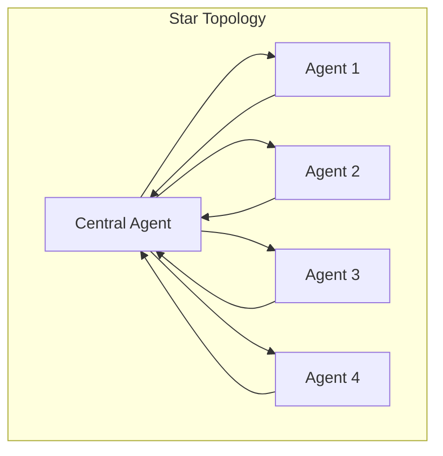
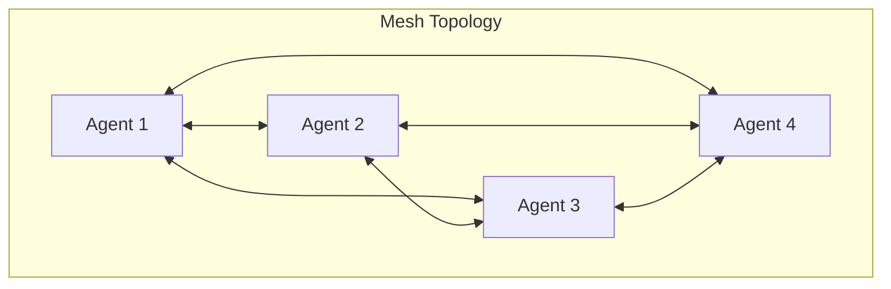
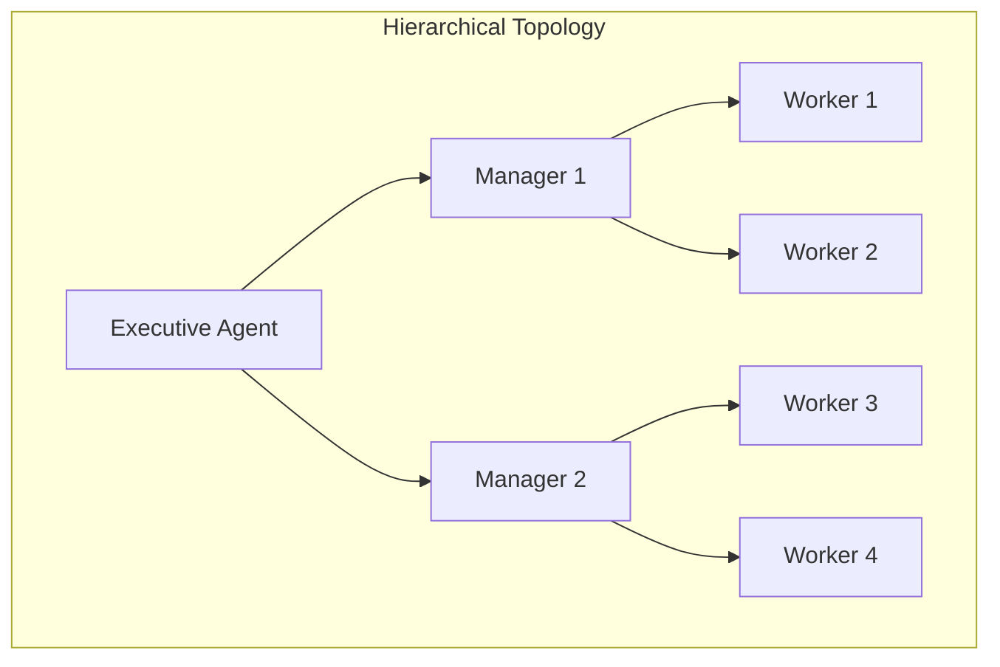

### What is an Agent Graph?

An Agent Graph is a collection of AI agents organized in a specific topology where:

- **Nodes**: Individual agents with specific roles, identity, tools and system prompts
- **Edges**: Communication paths between agents
- **Topologies**: Different network structures (star, mesh, hierarchical)

### Common Topologies

1. **Star Topology**: A central agent coordinates with multiple specialized agents

2. **Mesh Topology**: All agents can communicate directly with each other

3. **Hierarchical Topology**: Agents are organized in layers with defined reporting structures

### Example

To get started with building agents with these patterns. Navigate to `graph.ipynb` to build a graph using the **star topology**.