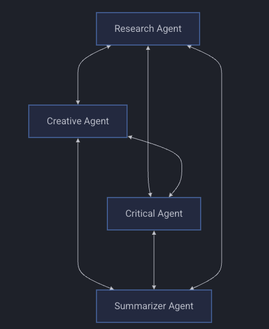

# Swarm Agents

## Overview

The Swarm pattern enables multiple AI agents to collaborate on complex tasks through parallel processing and shared memory. Agents work together using different coordination strategies to achieve emergent collective intelligence.

Here's an example of a swarm : 



## Coordination Patterns

- **Collaborative**: Agents build upon each other's insights
- **Competitive**: Agents independently seek unique solutions
- **Hybrid**: Balanced approach combining both strategies

## Usage

```python
from strands import Agent
from strands_tools import swarm

agent = Agent(tools=[swarm])

# Create a collaborative swarm
result = agent.tool.swarm(
    task="Analyze the environmental impact of renewable energy sources",
    swarm_size=5,
    coordination_pattern="collaborative"
)

# Use a competitive pattern
result = agent.tool.swarm(
    task="Generate marketing campaign concepts for a new smartphone",
    swarm_size=3,
    coordination_pattern="competitive"
)
```

## Key Features

- **Parallel Processing**: Multiple agents work simultaneously
- **Shared Memory**: Knowledge exchange between agents
- **Phase-Based Execution**: Progressive refinement of solutions
- **Agent Specialization**: Tailored roles based on coordination pattern

Read more about how it works [here](https://strandsagents.com/latest/user-guide/concepts/multi-agent/swarm/#how-the-swarm-tool-works) 

## When to Use

- Complex problem solving requiring multiple perspectives
- Creative ideation and brainstorming
- Comprehensive research and analysis
- Decision making with multiple criteria

For more detailed information, please read the [documentation](https://strandsagents.com/latest/user-guide/concepts/multi-agent/swarm/).