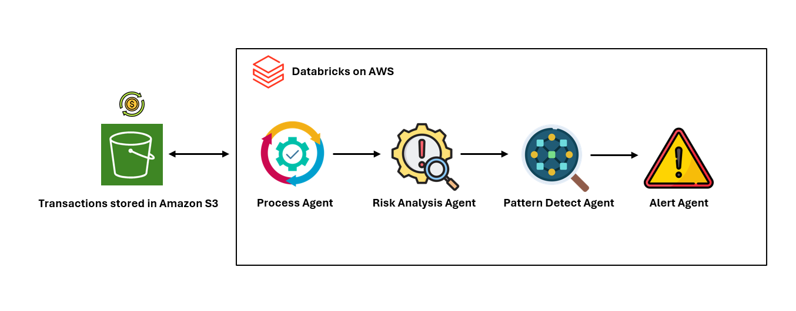

# 🛡️ Multi-Agent Fraud Detection System

This project demonstrates an advanced fraud detection system using AWS Strands SDK. It leverages a multi-agent approach to process transactions, analyze risks, detect patterns, and generate alerts in real-time.



## 🌟 Key Features

- **Multi-Agent Architecture**: Utilizes four specialized AI agents for different aspects of fraud detection
- **Real-time Processing**: Analyzes transactions as they occur
- **Risk Scoring**: Assigns risk scores (0-100) to each transaction
- **Pattern Recognition**: Detects fraud patterns across multiple transactions
- **Automated Alerting**: Generates email alerts for medium and high-risk transactions
- **Scalable**: Built on AWS infrastructure for high performance and scalability

## 🏗️ System Architecture

The system consists of four main components:

1. **Process Agent**: Fetches and validates transaction data from S3
2. **Risk Analysis Agent**: Scores individual transactions based on various risk factors
3. **Pattern Detection Agent**: Identifies suspicious patterns across multiple transactions
4. **Alert Management Agent**: Sends email notifications for high-risk activities

## 🚀 Getting Started

### Prerequisites

- Python 3.8+
- AWS account with access to S3, SES, and Bedrock
- Strands SDK and Boto3 installed

### Installation

1. Clone this repository
2. Install required packages:
   ```
   pip install strands-agents strands-agents-tools boto3
   ```
3. Provide valid email address for SES to send emails

### Configuration

Update the `AWS_CONFIG` dictionary with your AWS region and S3 bucket name:

```python
AWS_CONFIG = {
    'region_name': '<add_aws_region>',
    'aws_access_key_id': '<add_aws_access_key>',
    'aws_secret_access_key': '<add_aws_secret_key>'
}
```

## 💻 Usage

Run the main script to start the fraud detection system:

```python
python fraud_detection.py
```

The system will:
1. Fetch transactions from S3
2. Analyze each transaction for risk
3. Detect patterns across transactions
4. Send alerts for high-risk activities

## 🔍 How It Works

### Risk Scoring

Transactions are scored based on factors such as:
- Transaction amount
- User history
- Geographic location
- Merchant type
- Card presence/absence

Risk levels:
- LOW: 0-39
- MEDIUM: 40-69
- HIGH: 70-100

### Pattern Detection

The system looks for patterns such as:
- Large transactions (>$10,000)
- Foreign transactions
- High-velocity users
- Card-not-present transactions

## 📊 Output Example

```
🚀 STRANDS AI FRAUD DETECTION SYSTEM
🤖 Powered by Strands Agent Framework with Claude 3 Sonnet
📊 Risk Levels: LOW (0-39), MEDIUM (40-69), HIGH (70+)
============================================================

1️⃣ PROCESS AGENT: Fetching transactions from S3...
[Transaction details...]

2️⃣ RISK AGENT: Analyzing risk for all transactions...
[Risk analysis results...]

3️⃣ PATTERN AGENT: Detecting fraud patterns...
[Detected patterns and recommendations...]

4️⃣ ALERT AGENT: Sending alerts for medium/high risk transactions...
[Alert details...]
```

## 🛠️ Customization

You can customize the risk scoring algorithm, add new pattern detection rules, or modify the alert thresholds by updating the respective agent functions in the code.


## 🤝 Contributors

- Abhijith Nair (abhisati@)

---

**Note**: This is a proof-of-concept implementation. For production use, ensure proper security measures, extensive testing, and compliance with relevant financial regulations.