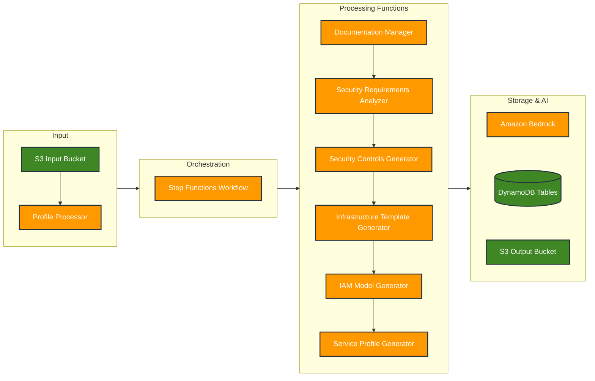

# Security Configuration System

A serverless application that automates security configuration analysis and recommendations using AWS services and Bedrock AI integration. The system processes service configurations, generates security controls, IAM models, and infrastructure templates.

## Business Value & Impact

**Accelerate AWS Service Adoption**: Transform service approval from 12 weeks to 3 validation sessions through AI-powered automation.

### Key Benefits
- **Time Savings**: Automated security control generation and compliance mapping
- **Enhanced Security**: Comprehensive coverage of security domains and threat vectors  
- **Compliance Assurance**: Automatic alignment with regulatory frameworks (NIST 800-53, etc.)
- **Consistency**: Standardized security controls across all approved services
- **Accelerated Threat Modeling**: Pre-approved services with associated threat vectors for faster workload assessments

### Process Innovation
1. Input security profile, compliance needs, and AWS service selection
2. AI analyzes against AWS documentation and best practices
3. Generate tailored detective, preventive, and proactive controls
4. Review and approve generated controls and templates
5. Automated deployment of approved artifacts

### Workload-Level Impact

By using pre-approved services with associated controls and threat vectors, customers can:

- **Rapid Assessment**: Quickly evaluate new workloads against known security baselines
- **Efficient Gap Analysis**: Identify potential vulnerabilities and compliance gaps more efficiently  
- **Proven Controls**: Implement security controls with confidence based on AI analysis
- **Focused Threat Modeling**: Concentrate efforts on workload-specific risks rather than underlying service security
- **Continuous Improvement**: AI learns from approvals and refinements, improving recommendations over time

## Architecture Overview



## Core Components

1. **ValidateAndCollectServiceData**
   - Collects AWS service documentation
   - Validates service capabilities
   - Stores documentation for reference

2. **AnalyzeSecurityRequirements**
   - Processes security configurations
   - Integrates with Bedrock AI
   - Generates initial analysis

3. **GenerateSecurityControls**
   - Creates security control recommendations
   - Maps to compliance requirements
   - Provides implementation guidance

4. **GenerateIaCTemplate**
   - Creates infrastructure templates
   - Implements security controls
   - Supports multiple IaC formats

5. **GenerateServiceProfile**
   - Generates service capability profiles (JSON + Markdown)
   - Generates Security Research Profiles for security evaluation (comprehensive Q&A)
   - Leverages IAM models and business use cases for both outputs
   - Provides configuration guidance

6. **GenerateIAMModel**
   - Creates IAM permission models
   - Implements least privilege
   - Maps service actions

### Lambda Functions

The system uses 7 Lambda functions in a decomposed architecture. For detailed documentation of each function, see [docs/lambda-functions/](docs/lambda-functions/).

| Function | Purpose | Memory | Timeout | Documentation |
|----------|---------|--------|---------|---------------|
| SecurityProfileProcessor | S3 event processing & workflow orchestration | 128 MB | 3 min | [Details](docs/lambda-functions/SecurityProfileProcessor.md) |
| AWSServiceDocumentationManager | AWS service documentation collection | 1024 MB | 15 min | [Details](docs/lambda-functions/AWSServiceDocumentationManager.md) |
| AnalyzeSecurityRequirements | AI-powered security analysis | 1024 MB | 15 min | [Details](docs/lambda-functions/AnalyzeSecurityRequirements.md) |
| GenerateSecurityControls | Security control generation | 1024 MB | 15 min | [Details](docs/lambda-functions/GenerateSecurityControls.md) |
| GenerateIaCTemplate | Infrastructure template generation | 1024 MB | 15 min | [Details](docs/lambda-functions/GenerateIaCTemplate.md) |
| GenerateIAMModel | IAM permission model generation | 1024 MB | 15 min | [Details](docs/lambda-functions/GenerateIAMModel.md) |
| GenerateServiceProfile | Security Research Profile generation | 1024 MB | 15 min | [Details](docs/lambda-functions/GenerateServiceProfile.md) |

### Storage Resources

#### DynamoDB Tables
   - Stores security control definitions
   - Maps compliance requirements
   - Tracks implementation status

   - Tracks processing requests
   - Maintains audit history
   - Enables request tracing

   - AWS service action definitions
   - IAM permission mappings

   - Service parameter documentation
   - Configuration validation

   - Service metadata and capabilities

   - Resource type definitions

   - Compliance framework mappings

   - Service capability templates

   - AWS Config managed rule definitions
   - Service-based rule categorization
   - Security compliance rule mappings

#### S3 Buckets
   - Stores service configurations
   - Triggers processing workflow via S3 events
   - Maintains version history
   - Supports security-profile/ and service-request/ prefixes

   - Stores processing results
   - Maintains documentation
   - Stores generated artifacts

### Config Rules Management

The system includes AWS Config managed rules for security control recommendations:

```bash
# Load AWS Config managed rules into DynamoDB
cd scripts/config-rules
python3 load_config_rules.py

# View baseline rules (696 rules from AWS documentation)
cat aws_config_manage_rules_baseline.json
```

**Files:**
- `scripts/config-rules/load_config_rules.py` - Extracts rules from AWS documentation and loads into DynamoDB
- `scripts/config-rules/aws_config_manage_rules_baseline.json` - Read-only baseline reference (696 rules)

**Features:**
- Extracts rules directly from AWS Config documentation
- No hardcoded rules - dynamically discovers services
- Service-based categorization via GSI
- Fallback to baseline file if documentation unavailable

### Service Name Resolution

The system includes intelligent service name resolution with 200+ aliases for seamless service identification:

**Features:**
- Resolves common service names to canonical IDs (e.g., "ELB" → "elasticloadbalancing")
- Handles complex aliases (e.g., "Gateway Load Balancer" → "elasticloadbalancingv2")
- Fuzzy matching with suggestions for typos and misspellings
- Integrated into all service processing workflows
- Automatic - no configuration required

**Location:** `layers/common-layer/python/service_name_resolver.py`

**Examples:**
- "EC2" → "ec2"
- "DynamoDB" → "dynamodb"
- "Application Load Balancer" → "elasticloadbalancingv2"
- "Gateway Load Balancer" → "elasticloadbalancingv2"
- "Lambda Functions" → "lambda"

### Performance Optimizations

The system includes several performance optimizations for faster processing and lower costs:

#### 1. Build-Time Resource Curation
- CloudFormation resources curated during configuration generation (not at runtime)
- Pre-filtered to core resources only (excludes sub-resources, associations, niche features)
- **70% reduction** in resources processed (e.g., EC2: 50+ → 15 core resources)
- Eliminates runtime discovery and filtering overhead
- Faster Lambda execution, lower Bedrock costs

**Curated Services (26 total):**
- **Compute:** ec2 (15 resources), lambda (6), ecs (5), eks (5)
- **Storage:** s3 (5), dynamodb (2), rds (7)
- **Networking:** elasticloadbalancingv2 (4), apigateway (8), cloudfront (6)
- **Security:** iam (7), kms (3), secretsmanager (3)
- **Messaging:** sns (3), sqs (2), eventbridge (5)
- **Monitoring:** cloudwatch (4), logs (5)
- **DevOps:** codepipeline (3), codebuild (3), codecommit (1), codedeploy (3)
- **Orchestration:** stepfunctions (2), cloudformation (4)

#### 2. Intelligent Content Processing
- Smart content chunking for AI processing
- Preserves complete entries across chunks
- Handles large documentation pages efficiently
- Truncation recovery for partial JSON responses

#### 3. Centralized Bedrock Client
- Shared AI client across all Lambda functions
- Consistent error handling and logging
- Configurable model selection (Nova Pro, Claude)
- Comprehensive request/response logging

## System Outputs

The security configuration system generates comprehensive outputs tailored for different teams and use cases:

| Output Type | Format | Purpose & Description | Primary Users |
|-------------|--------|----------------------|---------------|
| **Service Research Profile** (Customer form) | Markdown | • Comprehensive security documentation of AWS service<br>• Details on data protection, network/access controls, compliance<br>• Operational guidelines and best practices | • Security Architects<br>• Cloud Teams<br>• Compliance Teams |
| **IAM Review Module** (Customer request) | JSON/Markdown | • Detailed IAM configurations and policies<br>• Permission sets and role analysis<br>• Best practices and implementation guidance<br>• Approval requirements and workflows | • IAM Team<br>• Security Team<br>• Cloud Platform Team |
| **AWS Service Configuration Recommendations** | JSON | • Security configuration guidance<br>• Service-specific security parameters<br>• Compliance mappings<br>• Implementation considerations | • Security Architects<br>• Cloud Teams<br>• Implementation Teams |
| **Security Controls** (checks) | JSON | • Proactive controls (CI/CD pipeline checks)<br>• Preventive (SCPs IAM policy at the Org level)<br>• Detective controls (Custom AWS Config rules) | • Security Teams<br>• Compliance Teams<br>• Operations Teams |
| **IaC Templates** | YAML/JSON | • CloudFormation / Terraform templates<br>• Pre-configured security settings<br>• Resource and parameters definitions | • DevOps Teams<br>• Cloud Engineers<br>• Implementation Teams |
| **Security Control Library** | DynamoDB Table | • Approved configurations storage<br>• Implementation status<br>• Approval history<br>• Compliance and threat mappings<br>• Configuration and control selection rational | • All Teams<br>• Auditors<br>• Security Teams |
| **Service Request Tracking** | DynamoDB Table | • Configuration request history<br>• Processing status<br>• Approval tracking<br>• Version control | • Operations Teams<br>• Security Teams<br>• Requestors |

## Getting Started

### Prerequisites
- AWS Account with appropriate permissions
- Node.js ≥ 14.x (for CDK)
- Python 3.9 (for Lambda functions)
- AWS CDK CLI

Warning: Before deploying, make sure to build Lambda Layers
```bash
# Set up Lambda Layers
cd layers
./build-all-layers.sh
```

### Deployment
```bash
# Install CDK dependencies
cd cdk
npm install

# Build TypeScript
npm run build

# Bootstrap CDK (first time only)
cdk bootstrap

# Deploy infrastructure (defaults to us-east-1)
cdk deploy
```

### Testing the System
```bash
# Upload service mappings configuration (required for documentation collection)
# This file contains pre-curated core CloudFormation resources for 26 AWS services
# Curated at build-time for optimal performance (70% reduction in resources processed)

# To regenerate service mappings with latest AWS services:
# This script curates core resources at build-time (not runtime) for better performance
cd scripts/service-mapping && python3 extract_service_mappings.py

# The curation process:
# - Discovers all CloudFormation resources for each service
# - Filters to core resources only (excludes sub-resources, associations, niche features)
# - EC2: 15 core resources (from 50+ total)
# - Lambda: 6 core resources
# - S3: 5 core resources
# - 26 services with curated resources
# - Result: Faster Lambda execution, lower costs, consistent behavior

# Upload test security profile

# Upload test service request

# Monitor execution (decomposed workflow)
aws stepfunctions list-executions \

# Check results

# Download outputs locally
./scripts/download_outputs.py

# Validate outputs for a service
cd scripts/output-validation
./validate_service.sh ACM
```

## Project Structure

```
security-project/
├── cdk/                  # Infrastructure as Code
│   ├── bin/             # CDK app entry point
│   ├── lib/             # Stack definitions
│   │   ├── security-system-stack.ts
│   │   └── lambda-layers.ts
│   └── test/            # Infrastructure tests
├── lambda/              # Current Lambda function code (decomposed architecture)
│   ├── AWSServiceDocumentationManager/
│   │   ├── lambda_function.py
│   │   └── requirements.txt
│   ├── AnalyzeSecurityRequirements/
│   │   ├── lambda_function.py
│   │   └── requirements.txt
│   ├── GenerateSecurityControls/
│   │   ├── lambda_function.py
│   │   └── requirements.txt
│   ├── GenerateIaCTemplate/
│   │   ├── lambda_function.py
│   │   └── requirements.txt
│   ├── GenerateIAMModel/
│   │   ├── lambda_function.py
│   │   └── requirements.txt
│   ├── GenerateServiceProfile/
│   │   ├── lambda_function.py
│   │   └── requirements.txt
│   └── SecurityProfileProcessor/
│       ├── lambda_function.py
│       └── requirements.txt
├── lambda-legacy/       # Legacy Lambda functions (archived)
│   ├── [old]SecurityConfigurationHandler/
│   │   ├── lambda_function.py
│   │   └── requirements.txt
│   └── [old]SecurityProfileProcessor/
│       ├── lambda_function.py
│       └── requirements.txt
├── layers/              # Lambda layers for shared code
│   ├── bedrock-layer/   # Bedrock AI client with comprehensive logging
│   ├── common-layer/    # boto3, botocore, s3_operations, service_name_resolver
│   ├── dynamodb-operations-layer/  # DynamoDB operations
│   ├── mcp-tools-layer/ # MCP documentation collector
│   ├── requests-layer/  # HTTP operations
│   ├── validation-layer/  # validation, json_processing, yaml
│   └── web-scraping-layer/  # beautifulsoup4, lxml, content_processor
├── scripts/             # Supporting utility scripts
│   ├── download_outputs.py      # Download S3 outputs locally
│   ├── output-validation/       # Validation automation
│   └── config-rules/           # AWS Config rules management
│       ├── load_config_rules.py # Load Config rules into DynamoDB
│       └── aws_config_manage_rules_baseline.json # Baseline reference (696 rules)
├── config-example/      # Example configurations and sample files
├── tests/              # Test implementations and test files
│   └── output/         # Downloaded outputs (gitignored)
└── docs/               # Detailed documentation

```

**Note:** The `tests/output/` directory is excluded from version control (.gitignore) as it contains downloaded artifacts from S3 buckets.

## Documentation

### Core Documentation
- [Business Value & Impact](docs/BUSINESS_VALUE.md) - Executive summary and ROI analysis
- [Architecture Details](docs/ARCHITECTURE.md) - Detailed system architecture
- [Lambda Functions](docs/lambda-functions/) - Individual function documentation
- [Deployment Guide](docs/DEPLOYMENT.md) - Deployment instructions
- [Development Guide](docs/DEVELOPMENT.md) - Development guidelines
- [Documentation Guidelines](docs/DOCUMENTATION_GUIDELINES.md) - Standards for maintaining documentation

### Technical Deep Dives
- [Service Name Resolution](docs/SERVICE_NAME_RESOLUTION.md) - Alias mapping and intelligent resolution
- [Build-Time Resource Curation](docs/BUILD_TIME_RESOURCE_CURATION.md) - Performance optimization architecture
- [Architecture Refactoring Summary](docs/ARCHITECTURE_REFACTORING_SUMMARY.md) - Recent architectural improvements
- [Resource Type Filtering](docs/RESOURCE_TYPE_FILTERING.md) - Core resource filtering approach

## IAM Permissions Architecture

### Design Philosophy
All IAM permissions are defined directly in the main CDK stack (`cdk/lib/security-system-stack.ts`) following these principles:

- **Principle of Least Privilege**: Each role has only the minimum permissions required
- **Resource-Specific Scoping**: Permissions are scoped to specific resources, not wildcards
- **Function-Specific Access**: CloudWatch logs are scoped to individual Lambda function log groups
- **Clear Documentation**: Each permission block includes detailed comments explaining purpose

### Role Overview

#### 1. DocumentationManagerRole
**Purpose**: Collects AWS service documentation from external sources
- **CloudWatch Logs**: Function-specific log group access
- **S3**: Read/write access to documentation, input, and output buckets
- **DynamoDB**: Full access to service documentation tables (Actions, Parameters, Inventory, Resources)
- **Bedrock**: Model invocation for AI processing of documentation
- **VPC**: Network access for external documentation URL requests

#### 2. SecurityConfigurationHandlerRole
**Purpose**: Main AI-powered security analysis and configuration generation
- **CloudWatch Logs**: Function-specific log group access
- **Bedrock**: Full AI access (foundation models, inference profiles, agents, knowledge bases)
- **DynamoDB**: Full access to all security and service tables
- **S3**: Read/write access to all system buckets
- **VPC**: Network access for potential external integrations

#### 3. StepFunctionsWorkflowRole
**Purpose**: Orchestrates the security configuration workflow
- **Lambda**: Invoke permissions for all workflow Lambda functions
- **CloudWatch Logs**: Full logging access for workflow monitoring
- **X-Ray**: Distributed tracing for performance monitoring

#### 4. SecurityProfileProcessorRole
**Purpose**: Processes S3 uploads and triggers workflows
- **CloudWatch Logs**: Function-specific log group access
- **S3**: Read/write access to input and output buckets
- **Step Functions**: Start and monitor workflow executions

### Bedrock Model Access
The system supports both foundation models and inference profiles:
- **Foundation Models**: `arn:aws:bedrock:region::foundation-model/*`
- **Inference Profiles**: `arn:aws:bedrock:region:account:inference-profile/*`

This dual approach ensures compatibility with models like Nova Pro that require inference profiles while maintaining access to directly invokable models.

### Permission Maintenance
- All permissions are centralized in `security-system-stack.ts`
- Each permission block includes detailed comments
- Resource ARNs use CDK references for automatic updates
- Legacy table access is maintained for backward compatibility

## Contributing

1. Review the [Development Guide](docs/DEVELOPMENT.md)
2. Set up your development environment
3. Make your changes
4. Add/update tests
5. Submit a pull request

### Development Guidelines

#### Working Directory Structure
- **Production code**: `lambda/`, `cdk/`, `config-example/`
- **Development tools**: `scripts/` (gitignored)
- **Permanent docs**: `docs/`
- **Test files**: `tests/`

#### File Organization Rules
- **scripts/**: Development utilities, temporary files (NOT deployed)
- **tests/output/**: Downloaded S3 artifacts (gitignored)
- **config-example/**: Sample configurations for deployment
- **docs/**: Permanent project documentation

#### Testing Guidelines
- All test implementations should be stored in the `tests/` folder
- Example configurations belong in `config-example/`
- Test structure should mirror the main project structure
- Use `./scripts/download_outputs.py` to get latest outputs
- Use `./scripts/output-validation/validate_service.sh <SERVICE>` to validate outputs

## License

This project is licensed under the MIT License - see the LICENSE file for details.

## Documentation

### Core Documentation
- **[ARCHITECTURE.md](docs/ARCHITECTURE.md)** - System architecture and component overview
- **[EXTRACTION_METHODS.md](docs/EXTRACTION_METHODS.md)** - AI extraction methods, chunking, and pagination strategies
- **[DEPLOYMENT.md](docs/DEPLOYMENT.md)** - Deployment procedures and configuration
- **[DEVELOPMENT.md](docs/DEVELOPMENT.md)** - Development guidelines and local testing

### Technical Guides
- **[SERVICE_NAME_RESOLUTION.md](docs/SERVICE_NAME_RESOLUTION.md)** - Service identification and mapping
- **[RESOURCE_TYPE_FILTERING.md](docs/RESOURCE_TYPE_FILTERING.md)** - Build-time resource curation
- **[BUILD_TIME_RESOURCE_CURATION.md](docs/BUILD_TIME_RESOURCE_CURATION.md)** - Resource type validation
- **[BUSINESS_VALUE.md](docs/BUSINESS_VALUE.md)** - System benefits and ROI
