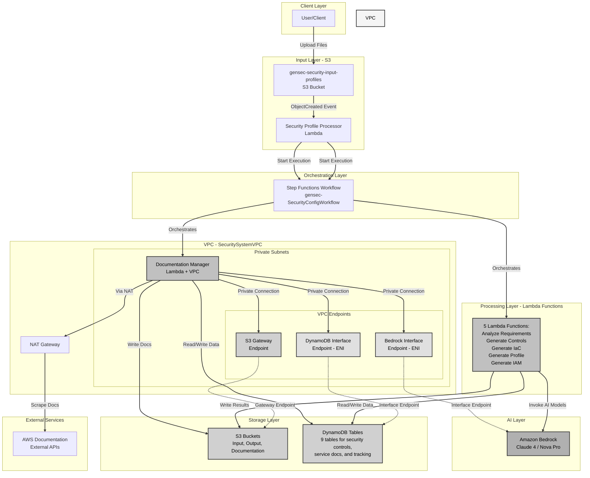
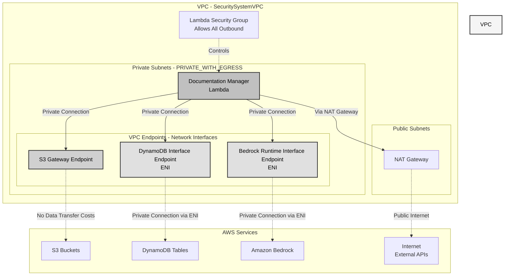
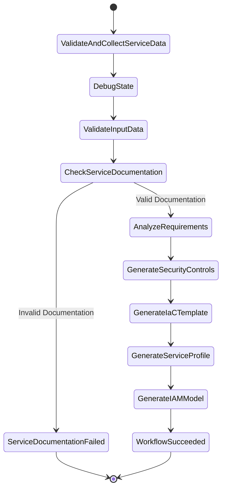
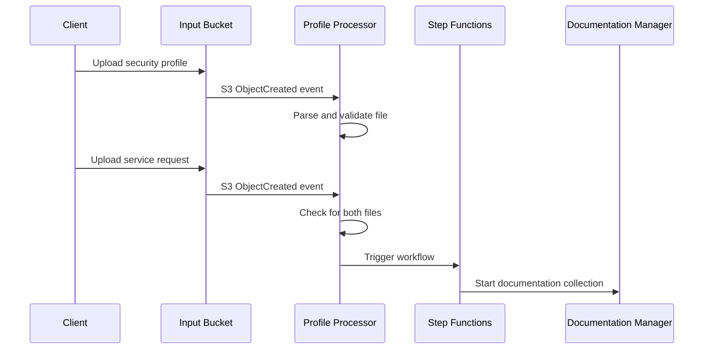
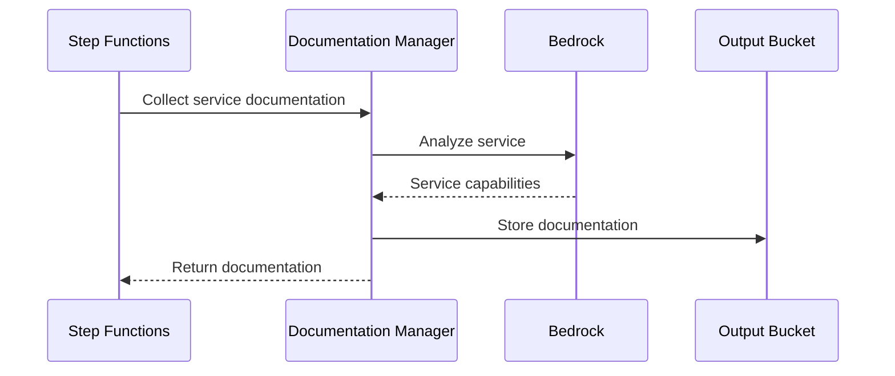
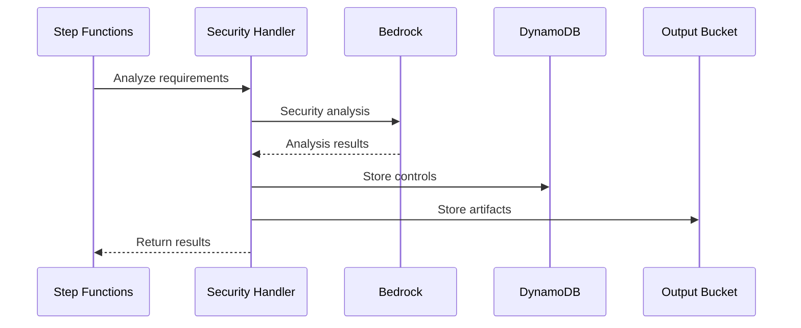

# Security Configuration System Architecture

## System Overview

The Security Configuration System is a serverless application that automates security configuration analysis and recommendations using AWS services and Bedrock AI integration. The system processes AWS service configurations, generates security controls, IAM models, and infrastructure templates.

### Complete System Architecture



**Key Architecture Features:**

1. **Event-Driven Processing**: S3 uploads trigger automated workflows
2. **VPC Isolation**: Documentation Manager runs in private subnets with VPC endpoints
3. **Cost Optimization**: VPC endpoints reduce NAT Gateway data transfer costs
4. **AI-Powered Analysis**: Bedrock integration for intelligent security recommendations
5. **Decomposed Functions**: Specialized Lambda functions for each processing step
6. **Comprehensive Storage**: DynamoDB for structured data, S3 for artifacts
7. **Flexible AI Models**: Support for Claude 4, Nova Pro, and Bedrock Agents

## System Outputs

The security configuration system generates comprehensive outputs tailored for different teams and use cases:

| Output Type | Format | Purpose & Description | Primary Users |
|-------------|--------|----------------------|---------------|
| **Service Research Profile** (customer form) | Markdown | • Comprehensive security documentation of AWS service<br>• Details on data protection, network/access controls, compliance<br>• Operational guidelines and best practices | • Security Architects<br>• Cloud Teams<br>• Compliance Teams |
| **IAM Review Module** (customer request) | JSON/Markdown | • Detailed IAM configurations and policies<br>• Permission sets and role analysis<br>• Best practices and implementation guidance<br>• Approval requirements and workflows | • IAM Team<br>• Security Team<br>• Cloud Platform Team |
| **AWS Service Configuration Recommendations** | JSON | • Security configuration guidance<br>• Service-specific security parameters<br>• Compliance mappings<br>• Implementation considerations | • Security Architects<br>• Cloud Teams<br>• Implementation Teams |
| **Security Controls** (checks) | JSON | • Proactive controls (CI/CD pipeline checks)<br>• Preventive (SCPs IAM policy at the Org level)<br>• Detective controls (Custom AWS Config rules) | • Security Teams<br>• Compliance Teams<br>• Operations Teams |
| **IaC Templates** | YAML/JSON | • CloudFormation / Terraform templates<br>• Pre-configured security settings<br>• Resource and parameters definitions | • DevOps Teams<br>• Cloud Engineers<br>• Implementation Teams |
| **Security Control Library** | DynamoDB Table | • Approved configurations storage<br>• Implementation status<br>• Approval history<br>• Compliance and threat mappings<br>• Configuration and control selection rational | • All Teams<br>• Auditors<br>• Security Teams |
| **Service Request Tracking** | DynamoDB Table | • Configuration request history<br>• Processing status<br>• Approval tracking<br>• Version control | • Operations Teams<br>• Security Teams<br>• Requestors |

## Infrastructure Overview

### Network Architecture

The system uses a VPC with private subnets and VPC endpoints to provide secure, cost-effective connectivity to AWS services:



**VPC Configuration:**
- **2 Availability Zones** for high availability
- **1 NAT Gateway** for external internet access (e.g., AWS documentation scraping)
- **Public Subnets** (/24) - Host NAT Gateway
- **Private Subnets** (/24) - Host Lambda functions with egress via NAT

**VPC Endpoints (Cost Optimization):**
- **S3 Gateway Endpoint** - Free, no data transfer charges for S3 access
- **DynamoDB Interface Endpoint** - Creates ENI, reduces NAT Gateway costs
- **Bedrock Runtime Interface Endpoint** - Creates ENI, private AI model access

**Security:**
- Lambda functions run in private subnets (no direct internet access)
- Security group allows all outbound traffic
- VPC endpoints provide private connectivity without internet exposure
- NAT Gateway used only for external documentation APIs

**Note:** DynamoDB Interface Endpoint has `privateDnsEnabled: false` because DynamoDB doesn't support private DNS resolution.

## Core Components

### 1. S3 Event Processing

#### Security Profile Processor (gensec-SecurityProfileProcessor)
- **Trigger**: S3 ObjectCreated events from input bucket
- **Purpose**: Orchestrates workflow initiation
- **Key Functions**:
  - Parses uploaded JSON files (security profiles and service requests)
  - Validates file structure and content
  - Coordinates multi-file processing
  - Triggers Step Functions workflow when both files are present

### 2. Step Functions Workflow (gensec-SecurityConfigWorkflow)

#### Workflow States


#### State Details

1. **ValidateAndCollectServiceData**
   - Function: gensec-AWSServiceDocumentationManager
   - Purpose: Collect and validate service documentation
   - Outputs: Service capabilities and documentation

2. **AnalyzeRequirements**
   - Function: gensec-AnalyzeSecurityRequirements
   - Purpose: AI-powered security analysis
   - Outputs: Security analysis and recommendations

3. **GenerateSecurityControls**
   - Function: gensec-GenerateSecurityControls
   - Purpose: Generate security controls
   - Outputs: Security control definitions

4. **GenerateIaCTemplate**
   - Function: gensec-GenerateIaCTemplate
   - Purpose: Create infrastructure templates
   - Outputs: Terraform and CloudFormation templates

5. **GenerateServiceProfile**
   - Function: gensec-GenerateServiceProfile
   - Purpose: Create service security profile
   - Outputs: Service capabilities and configurations

6. **GenerateIAMModel**
   - Function: gensec-GenerateIAMModel
   - Purpose: Generate IAM permission model
   - Outputs: IAM roles and policies

### 3. Lambda Functions

#### Security Profile Processor
```python
gensec-SecurityProfileProcessor
├── Responsibilities
│   ├── S3 event processing
│   ├── File validation and parsing
│   ├── Multi-file coordination
│   └── Step Functions triggering
├── Dependencies
│   ├── S3 (file reading)
│   └── Step Functions (workflow execution)
└── Outputs
    ├── Validated security profiles
    ├── Validated service requests
    └── Workflow execution triggers
```

#### Documentation Manager
```python
gensec-AWSServiceDocumentationManager
├── Responsibilities
│   ├── Service documentation collection
│   ├── Parameter validation
│   ├── Action validation
│   └── Documentation storage
├── Network Configuration
│   ├── VPC: SecuritySystemVPC (Private Subnets)
│   ├── Security Group: LambdaSecurityGroup
│   ├── VPC Endpoints: S3, DynamoDB, Bedrock Runtime
│   └── NAT Gateway: For external documentation APIs
├── Dependencies
│   ├── Bedrock (service analysis via VPC endpoint)
│   ├── S3 (documentation storage via VPC endpoint)
│   ├── DynamoDB (via VPC endpoint)
│   └── External APIs (via NAT Gateway)
└── Outputs
    ├── Service parameters
    ├── Service actions
    └── Service documentation
```

##### AI Extraction Methods

The Documentation Manager supports two AI extraction approaches, configurable per service:

**1. Bedrock Agents (Default)**
- Uses AWS Bedrock Agent framework with structured responses
- Agent-controlled pagination (20 actions per page)
- Output limit: 6-7K characters per response
- Best for: Services with <500 actions and concise descriptions
- Configuration: `USE_STRANDS_AGENT=true` (environment variable)

**2. Direct Model Invocation**
- Direct calls to Bedrock foundation model
- Traditional pre-chunking (one call per chunk)
- Output limit: ~50K tokens (~200K characters)
- Best for: Large services (500+ actions) with verbose descriptions
- Configuration: `USE_STRANDS_AGENT=false` or service-level override

**Service-Level Configuration**

Services can override the default extraction method via `extraction_config` in service mappings:

```json
{
  "ec2": {
    "service_id": "ec2",
    "extraction_config": {
      "use_strands_agent": false,
      "use_mcp": false,
      "reason": "EC2 actions exceed agent output limits"
    }
  }
}
```

Sub-services inherit configuration from parent services, enabling consistent extraction across service families.

For detailed information on chunking strategies, pagination approaches, and performance comparisons, see [EXTRACTION_METHODS.md](./EXTRACTION_METHODS.md).

#### Decomposed Lambda Functions

**Note**: These functions do NOT use VPC configuration. They access AWS services via public endpoints with IAM authentication. Only the Documentation Manager uses VPC for external internet access.

```python
gensec-AnalyzeSecurityRequirements
├── Responsibilities
│   ├── AI-powered security analysis
│   ├── Requirements processing
│   └── Analysis result storage
├── Network Configuration
│   └── No VPC (uses public AWS endpoints)
├── Dependencies
│   ├── Bedrock (AI analysis via public endpoint)
│   ├── DynamoDB (data storage via public endpoint)
│   └── S3 (output storage via public endpoint)
└── Outputs
    └── Security analysis results

gensec-GenerateSecurityControls
├── Responsibilities
│   ├── Security control generation
│   ├── Compliance mapping
│   └── Implementation guidance
├── Network Configuration
│   └── No VPC (uses public AWS endpoints)
├── Dependencies
│   ├── Bedrock (AI generation via public endpoint)
│   ├── DynamoDB (control library via public endpoint)
│   └── S3 (output storage via public endpoint)
└── Outputs
    └── Security control definitions

gensec-GenerateIaCTemplate
├── Responsibilities
│   ├── Infrastructure template generation
│   ├── CloudFormation/Terraform templates
│   └── Parameter validation
├── Network Configuration
│   └── No VPC (uses public AWS endpoints)
├── Dependencies
│   ├── Bedrock (template generation via public endpoint)
│   ├── DynamoDB (parameter data via public endpoint)
│   └── S3 (template storage via public endpoint)
└── Outputs
    └── IaC templates

gensec-GenerateServiceProfile
├── Responsibilities
│   ├── Service capability documentation
│   ├── Security feature mapping
│   └── Configuration guidance
├── Network Configuration
│   └── No VPC (uses public AWS endpoints)
├── Dependencies
│   ├── Bedrock (profile generation via public endpoint)
│   ├── DynamoDB (service data via public endpoint)
│   └── S3 (profile storage via public endpoint)
└── Outputs
    └── Service profiles

gensec-GenerateIAMModel
├── Responsibilities
│   ├── IAM permission model generation
│   ├── Least privilege policies
│   └── Service action mapping
├── Network Configuration
│   └── No VPC (uses public AWS endpoints)
├── Dependencies
│   ├── Bedrock (policy generation via public endpoint)
│   ├── DynamoDB (action data via public endpoint)
│   └── S3 (model storage via public endpoint)
└── Outputs
    └── IAM models
```

### 4. Network Layer

#### VPC Configuration

**VPC: SecuritySystemVPC**
- **Purpose**: Provides network isolation and secure connectivity for Lambda functions
- **CIDR**: Automatically allocated by CDK
- **Availability Zones**: 2 (for high availability)
- **NAT Gateways**: 1 (cost-optimized for external API access)

**Subnet Configuration:**

| Subnet Type | CIDR Mask | Purpose | Resources |
|-------------|-----------|---------|-----------|
| Public | /24 | Internet-facing resources | NAT Gateway |
| Private (PRIVATE_WITH_EGRESS) | /24 | Lambda functions with internet access | Documentation Manager Lambda |

**VPC Endpoints (Network Interfaces):**

| Endpoint | Type | Purpose | Cost Impact |
|----------|------|---------|-------------|
| S3 Gateway Endpoint | Gateway | S3 access without NAT Gateway | **Free** - No data transfer charges |
| DynamoDB Interface Endpoint | Interface (ENI) | Private DynamoDB access | Reduces NAT Gateway costs |
| Bedrock Runtime Interface Endpoint | Interface (ENI) | Private Bedrock AI access | Reduces NAT Gateway costs |

**Security Groups:**

```typescript
LambdaSecurityGroup
├── Inbound Rules: None (Lambda doesn't accept inbound)
├── Outbound Rules: Allow all (0.0.0.0/0)
└── Purpose: Control Lambda egress traffic
```

**Network Flow:**

1. **Private AWS Service Access**: Lambda → VPC Endpoint (ENI) → AWS Service
   - S3: Via Gateway Endpoint (free)
   - DynamoDB: Via Interface Endpoint (ENI)
   - Bedrock: Via Interface Endpoint (ENI)

2. **External Internet Access**: Lambda → NAT Gateway → Internet Gateway → Internet
   - Used for: AWS documentation scraping, external APIs
   - Cost: NAT Gateway data processing charges apply

**Cost Optimization Strategy:**

- VPC endpoints eliminate NAT Gateway charges for AWS service traffic
- S3 Gateway Endpoint is free (no hourly charge, no data processing charge)
- Interface Endpoints have hourly charges but save on NAT Gateway data processing
- Single NAT Gateway reduces costs while maintaining availability

**Security Benefits:**

- Lambda functions have no direct internet access
- All AWS service traffic stays within AWS network
- VPC endpoints provide private connectivity
- Security group controls outbound traffic
- No public IP addresses on Lambda functions

### 5. Storage Layer

#### DynamoDB Tables
```
gensec-SecurityControlLibrary
├── Partition Key: control_id (String)
├── Attributes
│   ├── control_name
│   ├── description
│   ├── compliance_mapping
│   └── implementation_guide
└── Features
    ├── Point-in-time recovery
    ├── Server-side encryption
    └── On-demand capacity

gensec-ServiceRequestTracking
├── Partition Key: request_id (String)
├── Sort Key: timestamp (String)
├── Attributes
│   ├── status
│   ├── service_id
│   └── results
└── Features
    ├── Point-in-time recovery
    ├── Server-side encryption
    └── On-demand capacity
```

### DynamoDB Tables

The system uses multiple DynamoDB tables for storing service documentation, security controls, and tracking information:

#### Core Tables
- **gensec-SecurityControlLibrary**: Security control definitions and compliance mappings
- **gensec-ServiceRequestTracking**: Processing request tracking and audit history
- **gensec-ServiceProfileLibrary**: Service capability templates
- **gensec-SecurityStandardsLibrary**: Compliance framework mappings

#### AWS Service Documentation Tables
- **gensec-AWSServiceActions**: AWS service action definitions and IAM mappings
- **gensec-AWSServiceParameters**: Service parameter documentation and validation
- **gensec-AWSServiceInventory**: Service metadata and capabilities
- **gensec-AWSServiceResources**: Resource type definitions

#### Security Compliance Tables
- **gensec-AWSConfigManagedRules**: AWS Config managed rule definitions with service-based categorization via GSI

### S3 Storage

#### S3 Buckets
```
gensec-security-input-profiles-${account}-${region}
├── Features
│   ├── Versioning
│   ├── Server-side encryption
│   ├── Public access blocking
│   └── S3 event notifications
└── Contents
    ├── security-profile/
    │   └── Security profile configurations
    └── service-request/
        └── Service request configurations

gensec-security-config-outputs-${account}-${region}
├── Features
│   ├── Versioning
│   ├── Server-side encryption
│   └── Public access blocking
└── Contents
    ├── Documentation/
    │   └── Service documentation
    ├── SecurityControls/
    │   └── Generated controls
    ├── IaC/
    │   ├── Terraform templates
    │   └── CloudFormation templates
    ├── ServiceProfiles/
    │   └── Service security profiles
    └── IAMModels/
        └── IAM permission models
```

## System Flows

### 1. File Processing Flow


### 2. Documentation Collection Flow


### 3. Security Analysis Flow


## Security Features

### 1. Data Protection
- S3 bucket encryption
- DynamoDB encryption
- TLS for data in transit
- Public access blocking

### 2. Access Control
- IAM least privilege
- Resource policies
- Service role separation
- Temporary credentials

### 3. Monitoring
- CloudWatch logging
- X-Ray tracing
- Request tracking
- Error monitoring

### 4. Compliance
- Resource versioning
- Access logging
- Backup enabled
- Retention policies

## Error Handling

### 1. Step Functions
- Retry configurations
- Error states
- State transitions
- Error notifications

### 2. Lambda Functions
- Function retries
- Error logging
- DLQ configuration
- Timeout handling

### 3. Storage
- Versioning
- Backup
- Point-in-time recovery
- Error tracking

## Monitoring

### CloudWatch Logs
- Lambda function logs
- Step Functions logs
- API access logs
- Error logs

### CloudWatch Metrics
- Lambda execution metrics
- Step Functions metrics
- DynamoDB capacity metrics
- S3 request metrics

### X-Ray Tracing
- Request tracing
- Dependency analysis
- Performance monitoring
- Error tracking

## Performance Optimization

### 1. Lambda Functions
- Memory optimization
- Timeout configuration
- Cold start mitigation
- Code optimization

### 2. DynamoDB
- On-demand capacity
- Auto-scaling
- GSI optimization
- Query optimization

### 3. Step Functions
- State optimization
- Parallel execution
- Error handling
- Timeout configuration

## Cost Optimization

### 1. Lambda
- Memory allocation
- Execution time
- Concurrency limits
- Code efficiency

### 2. DynamoDB
- On-demand pricing
- Auto-scaling
- TTL configuration
- Backup strategy

### 3. S3
- Lifecycle policies
- Storage classes
- Request optimization
- Data transfer

## Related Documentation

- [Extraction Methods and Strategies](./EXTRACTION_METHODS.md) - Detailed guide to AI extraction methods, chunking, and pagination
- [Service Name Resolution](./SERVICE_NAME_RESOLUTION.md) - Service identification and mapping
- [Resource Type Filtering](./RESOURCE_TYPE_FILTERING.md) - Build-time resource curation
- [Development Guide](./DEVELOPMENT.md) - Local development and testing
- [Deployment Guide](./DEPLOYMENT.md) - Deployment procedures
- [Business Value](./BUSINESS_VALUE.md) - System benefits and ROI
