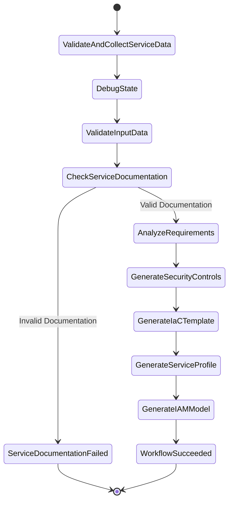
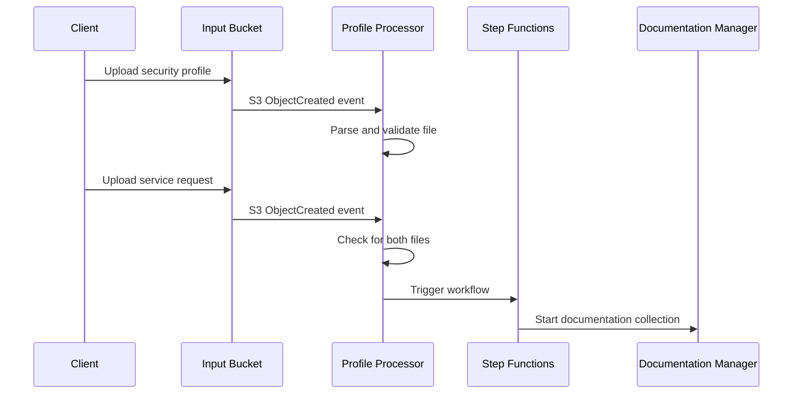
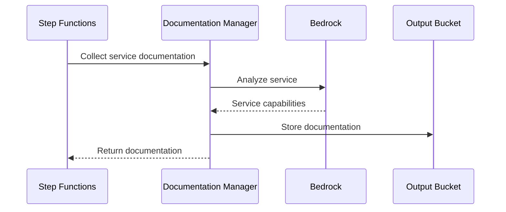
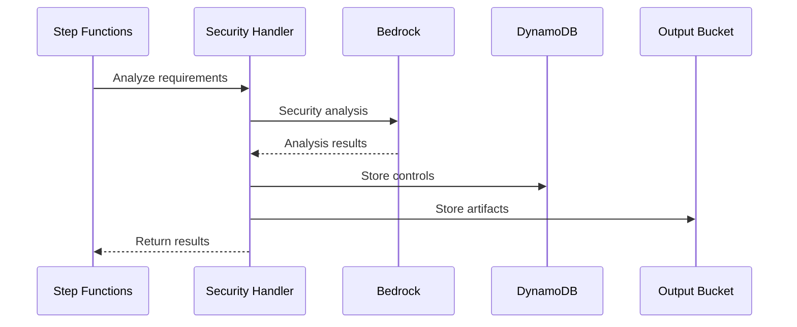

# Security Configuration System Architecture

## System Overview

The Security Configuration System is a serverless application that automates security configuration analysis and recommendations using AWS services and Bedrock AI integration. The system processes AWS service configurations, generates security controls, IAM models, and infrastructure templates.

## System Outputs

The security configuration system generates comprehensive outputs tailored for different teams and use cases:

| Output Type | Format | Purpose & Description | Primary Users |
|-------------|--------|----------------------|---------------|
| **Service Research Profile** (Equifax form) | Markdown | • Comprehensive security documentation of AWS service<br>• Details on data protection, network/access controls, compliance<br>• Operational guidelines and best practices | • Security Architects<br>• Cloud Teams<br>• Compliance Teams |
| **IAM Review Module** (Equifax request) | JSON/Markdown | • Detailed IAM configurations and policies<br>• Permission sets and role analysis<br>• Best practices and implementation guidance<br>• Approval requirements and workflows | • IAM Team<br>• Security Team<br>• Cloud Platform Team |
| **AWS Service Configuration Recommendations** | JSON | • Security configuration guidance<br>• Service-specific security parameters<br>• Compliance mappings<br>• Implementation considerations | • Security Architects<br>• Cloud Teams<br>• Implementation Teams |
| **Security Controls** (checks) | JSON | • Proactive controls (CI/CD pipeline checks)<br>• Preventive (SCPs IAM policy at the Org level)<br>• Detective controls (Custom AWS Config rules) | • Security Teams<br>• Compliance Teams<br>• Operations Teams |
| **IaC Templates** | YAML/JSON | • CloudFormation / Terraform templates<br>• Pre-configured security settings<br>• Resource and parameters definitions | • DevOps Teams<br>• Cloud Engineers<br>• Implementation Teams |
| **Security Control Library** | DynamoDB Table | • Approved configurations storage<br>• Implementation status<br>• Approval history<br>• Compliance and threat mappings<br>• Configuration and control selection rational | • All Teams<br>• Auditors<br>• Security Teams |
| **Service Request Tracking** | DynamoDB Table | • Configuration request history<br>• Processing status<br>• Approval tracking<br>• Version control | • Operations Teams<br>• Security Teams<br>• Requestors |

## Core Components

### 1. S3 Event Processing

#### Security Profile Processor (gensec-SecurityProfileProcessor)
- **Trigger**: S3 ObjectCreated events from input bucket
- **Purpose**: Orchestrates workflow initiation
- **Key Functions**:
  - Parses uploaded JSON files (security profiles and service requests)
  - Validates file structure and content
  - Coordinates multi-file processing
  - Triggers Step Functions workflow when both files are present

### 2. Step Functions Workflow (gensec-SecurityConfigWorkflow)

#### Workflow States


#### State Details

1. **ValidateAndCollectServiceData**
   - Function: gensec-AWSServiceDocumentationManager
   - Purpose: Collect and validate service documentation
   - Outputs: Service capabilities and documentation

2. **AnalyzeRequirements**
   - Function: gensec-AnalyzeSecurityRequirements
   - Purpose: AI-powered security analysis
   - Outputs: Security analysis and recommendations

3. **GenerateSecurityControls**
   - Function: gensec-GenerateSecurityControls
   - Purpose: Generate security controls
   - Outputs: Security control definitions

4. **GenerateIaCTemplate**
   - Function: gensec-GenerateIaCTemplate
   - Purpose: Create infrastructure templates
   - Outputs: Terraform and CloudFormation templates

5. **GenerateServiceProfile**
   - Function: gensec-GenerateServiceProfile
   - Purpose: Create service security profile
   - Outputs: Service capabilities and configurations

6. **GenerateIAMModel**
   - Function: gensec-GenerateIAMModel
   - Purpose: Generate IAM permission model
   - Outputs: IAM roles and policies

### 3. Lambda Functions

#### Security Profile Processor
```python
gensec-SecurityProfileProcessor
├── Responsibilities
│   ├── S3 event processing
│   ├── File validation and parsing
│   ├── Multi-file coordination
│   └── Step Functions triggering
├── Dependencies
│   ├── S3 (file reading)
│   └── Step Functions (workflow execution)
└── Outputs
    ├── Validated security profiles
    ├── Validated service requests
    └── Workflow execution triggers
```

#### Documentation Manager
```python
gensec-AWSServiceDocumentationManager
├── Responsibilities
│   ├── Service documentation collection
│   ├── Parameter validation
│   ├── Action validation
│   └── Documentation storage
├── Dependencies
│   ├── Bedrock (service analysis)
│   └── S3 (documentation storage)
└── Outputs
    ├── Service parameters
    ├── Service actions
    └── Service documentation
```

#### Decomposed Lambda Functions
```python
gensec-AnalyzeSecurityRequirements
├── Responsibilities
│   ├── AI-powered security analysis
│   ├── Requirements processing
│   └── Analysis result storage
├── Dependencies
│   ├── Bedrock (AI analysis)
│   ├── DynamoDB (data storage)
│   └── S3 (output storage)
└── Outputs
    └── Security analysis results

gensec-GenerateSecurityControls
├── Responsibilities
│   ├── Security control generation
│   ├── Compliance mapping
│   └── Implementation guidance
├── Dependencies
│   ├── Bedrock (AI generation)
│   ├── DynamoDB (control library)
│   └── S3 (output storage)
└── Outputs
    └── Security control definitions

gensec-GenerateIaCTemplate
├── Responsibilities
│   ├── Infrastructure template generation
│   ├── CloudFormation/Terraform templates
│   └── Parameter validation
├── Dependencies
│   ├── Bedrock (template generation)
│   ├── DynamoDB (parameter data)
│   └── S3 (template storage)
└── Outputs
    └── IaC templates

gensec-GenerateServiceProfile
├── Responsibilities
│   ├── Service capability documentation
│   ├── Security feature mapping
│   └── Configuration guidance
├── Dependencies
│   ├── Bedrock (profile generation)
│   ├── DynamoDB (service data)
│   └── S3 (profile storage)
└── Outputs
    └── Service profiles

gensec-GenerateIAMModel
├── Responsibilities
│   ├── IAM permission model generation
│   ├── Least privilege policies
│   └── Service action mapping
├── Dependencies
│   ├── Bedrock (policy generation)
│   ├── DynamoDB (action data)
│   └── S3 (model storage)
└── Outputs
    └── IAM models
```

### 4. Storage Layer

#### DynamoDB Tables
```
gensec-SecurityControlLibrary
├── Partition Key: control_id (String)
├── Attributes
│   ├── control_name
│   ├── description
│   ├── compliance_mapping
│   └── implementation_guide
└── Features
    ├── Point-in-time recovery
    ├── Server-side encryption
    └── On-demand capacity

gensec-ServiceRequestTracking
├── Partition Key: request_id (String)
├── Sort Key: timestamp (String)
├── Attributes
│   ├── status
│   ├── service_id
│   └── results
└── Features
    ├── Point-in-time recovery
    ├── Server-side encryption
    └── On-demand capacity
```

## Data Storage

### DynamoDB Tables

The system uses multiple DynamoDB tables for storing service documentation, security controls, and tracking information:

#### Core Tables
- **gensec-SecurityControlLibrary**: Security control definitions and compliance mappings
- **gensec-ServiceRequestTracking**: Processing request tracking and audit history
- **gensec-ServiceProfileLibrary**: Service capability templates
- **gensec-SecurityStandardsLibrary**: Compliance framework mappings

#### AWS Service Documentation Tables
- **gensec-AWSServiceActions**: AWS service action definitions and IAM mappings
- **gensec-AWSServiceParameters**: Service parameter documentation and validation
- **gensec-AWSServiceInventory**: Service metadata and capabilities
- **gensec-AWSServiceResources**: Resource type definitions

#### Security Compliance Tables
- **gensec-AWSConfigManagedRules**: AWS Config managed rule definitions with service-based categorization via GSI

### S3 Storage

#### S3 Buckets
```
gensec-security-input-profiles-${account}-${region}
├── Features
│   ├── Versioning
│   ├── Server-side encryption
│   ├── Public access blocking
│   └── S3 event notifications
└── Contents
    ├── security-profile/
    │   └── Security profile configurations
    └── service-request/
        └── Service request configurations

gensec-security-config-outputs-${account}-${region}
├── Features
│   ├── Versioning
│   ├── Server-side encryption
│   └── Public access blocking
└── Contents
    ├── Documentation/
    │   └── Service documentation
    ├── SecurityControls/
    │   └── Generated controls
    ├── IaC/
    │   ├── Terraform templates
    │   └── CloudFormation templates
    ├── ServiceProfiles/
    │   └── Service security profiles
    └── IAMModels/
        └── IAM permission models
```

## System Flows

### 1. File Processing Flow


### 2. Documentation Collection Flow


### 3. Security Analysis Flow


## Security Features

### 1. Data Protection
- S3 bucket encryption
- DynamoDB encryption
- TLS for data in transit
- Public access blocking

### 2. Access Control
- IAM least privilege
- Resource policies
- Service role separation
- Temporary credentials

### 3. Monitoring
- CloudWatch logging
- X-Ray tracing
- Request tracking
- Error monitoring

### 4. Compliance
- Resource versioning
- Access logging
- Backup enabled
- Retention policies

## Error Handling

### 1. Step Functions
- Retry configurations
- Error states
- State transitions
- Error notifications

### 2. Lambda Functions
- Function retries
- Error logging
- DLQ configuration
- Timeout handling

### 3. Storage
- Versioning
- Backup
- Point-in-time recovery
- Error tracking

## Monitoring

### CloudWatch Logs
- Lambda function logs
- Step Functions logs
- API access logs
- Error logs

### CloudWatch Metrics
- Lambda execution metrics
- Step Functions metrics
- DynamoDB capacity metrics
- S3 request metrics

### X-Ray Tracing
- Request tracing
- Dependency analysis
- Performance monitoring
- Error tracking

## Performance Optimization

### 1. Lambda Functions
- Memory optimization
- Timeout configuration
- Cold start mitigation
- Code optimization

### 2. DynamoDB
- On-demand capacity
- Auto-scaling
- GSI optimization
- Query optimization

### 3. Step Functions
- State optimization
- Parallel execution
- Error handling
- Timeout configuration

## Cost Optimization

### 1. Lambda
- Memory allocation
- Execution time
- Concurrency limits
- Code efficiency

### 2. DynamoDB
- On-demand pricing
- Auto-scaling
- TTL configuration
- Backup strategy

### 3. S3
- Lifecycle policies
- Storage classes
- Request optimization
- Data transfer
