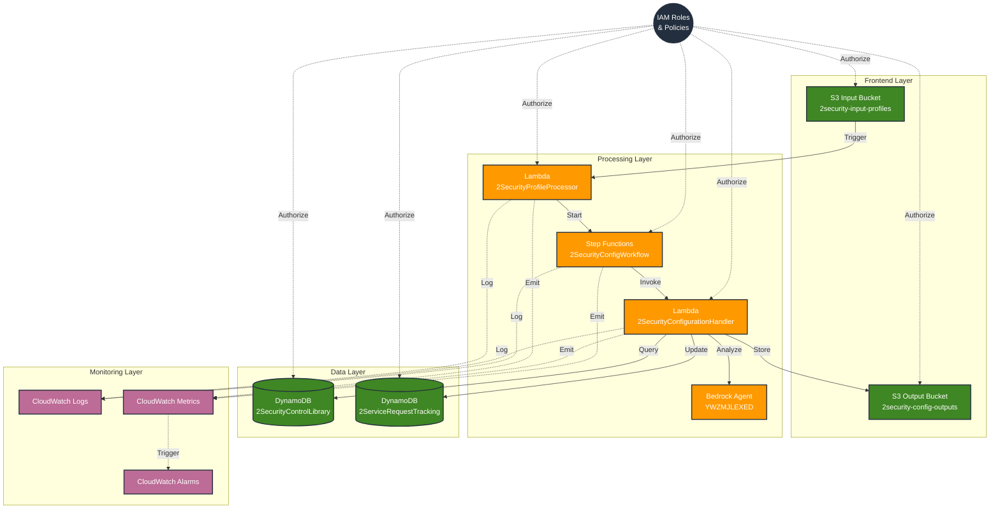

# Architecture Dependencies Overview

## Component Dependencies Diagram



## Component Dependencies Matrix

| Component | Direct Dependencies | Indirect Dependencies |
|-----------|-------------------|---------------------|
| Security Profile Processor | - S3 Input Bucket (trigger)<br>- Step Functions (invoke)<br>- CloudWatch (logging) | - IAM Roles |
| Step Functions Workflow | - Security Config Handler (invoke)<br>- CloudWatch (logging) | - IAM Roles |
| Security Config Handler | - Step Functions (execution)<br>- DynamoDB Tables (read/write)<br>- S3 Output Bucket (write)<br>- Bedrock Agent (invoke)<br>- CloudWatch (logging) | - IAM Roles |
| S3 Input Bucket | - None | - IAM Roles |
| S3 Output Bucket | - None | - IAM Roles |
| Security Control Library | - None | - IAM Roles |
| Service Request Tracking | - None | - IAM Roles |
| CloudWatch Logs | - None | None |
| CloudWatch Metrics | - CloudWatch Logs | None |
| CloudWatch Alarms | - CloudWatch Metrics | - CloudWatch Logs |

## Resource Dependencies

### IAM Role Dependencies

1. **2SecurityProfileProcessorRole**
   - Services:
     - Lambda
     - Step Functions
     - CloudWatch Logs
   - Resources:
     - Step Functions State Machine
     - CloudWatch Log Groups

2. **2SecurityConfigHandlerRole**
   - Services:
     - Lambda
     - DynamoDB
     - S3
     - Bedrock
     - CloudWatch Logs
   - Resources:
     - DynamoDB Tables
     - S3 Buckets
     - Bedrock Agent
     - CloudWatch Log Groups

3. **2SecurityConfigWorkflowRole**
   - Services:
     - Step Functions
     - Lambda
     - CloudWatch Logs
   - Resources:
     - Lambda Functions
     - CloudWatch Log Groups

### Data Flow Dependencies

1. **Input Processing**
   ```
   S3 Input → Lambda Trigger → Step Functions → Lambda Processing
   ```

2. **Data Storage**
   ```
   Lambda Processing → DynamoDB Tables
                   → S3 Output Bucket
   ```

3. **Monitoring**
   ```
   All Components → CloudWatch Logs → CloudWatch Metrics → CloudWatch Alarms
   ```

## Deployment Dependencies

### Resource Creation Order
1. IAM Roles and Policies
2. S3 Buckets
3. DynamoDB Tables
4. CloudWatch Log Groups
5. Lambda Functions
6. Step Functions State Machine
7. CloudWatch Alarms

### Update Dependencies
When updating components, consider:
1. IAM Role changes affect all dependent services
2. Lambda function changes may require Step Functions updates
3. DynamoDB schema changes affect Lambda functions
4. CloudWatch changes affect monitoring but not core functionality

## Security Dependencies

### Authentication Chain
```
AWS API → IAM Roles → Service Principals → Resource Policies
```

### Authorization Flow
```
IAM Roles → Resource Policies → Service Actions → CloudWatch Logs
```

## Scaling Dependencies

### Service Limits
1. Lambda:
   - Concurrent executions
   - Memory allocation
   - Timeout limits

2. Step Functions:
   - State transitions per second
   - Execution history retention

3. DynamoDB:
   - Read/write capacity
   - Item size limits

4. S3:
   - Request rate
   - Object size limits

### Scaling Considerations
1. Lambda scaling affects:
   - DynamoDB capacity
   - S3 request rates
   - CloudWatch log volume

2. DynamoDB scaling affects:
   - Lambda performance
   - Processing throughput

3. S3 scaling affects:
   - Lambda concurrency
   - Processing queue

## Recovery Dependencies

### Backup Chain
```
S3 Versioning → DynamoDB Backups → CloudWatch Logs → State Machine History
```

### Restore Order
1. IAM Roles and Policies
2. S3 Buckets and Objects
3. DynamoDB Tables and Items
4. Lambda Functions
5. Step Functions State Machine
6. CloudWatch Configuration
