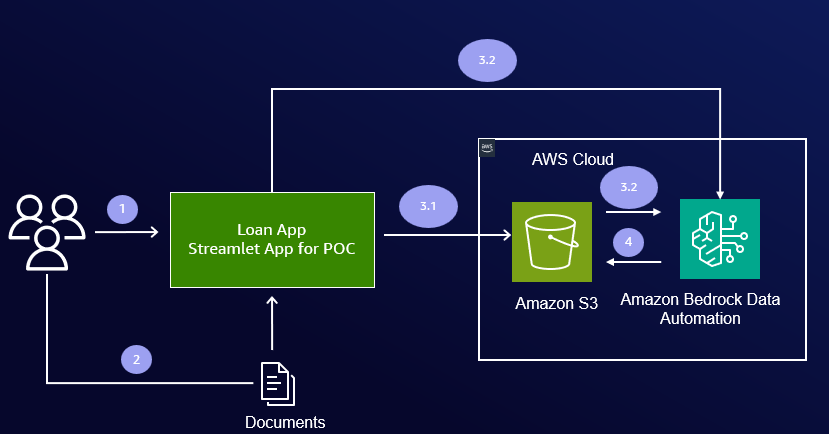

# 🏦 Loan Application Document Verification - Automated Processing

This POC demonstrates how developers can leverage [Amazon Bedrock Data Automation](https://docs.aws.amazon.com/bedrock/latest/userguide/bda.html) to build loan automation applications. The application showcases automated document classification, extraction, and validation with immediate feedback and status tracking.

## Why This Application?

Traditional loan approval processes involve laborious manual work to verify that all required documents are submitted and that document information matches the applicant's loan application details. For example:

- Verifying first and last names match across all documents
- Confirming SSN appears correctly in W2 forms and other documents
- Ensuring pay stubs cover the required time period (e.g., last three months)
- Checking that all mandatory documents are present

This manual document extraction and verification is time-consuming, error-prone, and delays the loan approval process.

**With Amazon Bedrock Data Automation, you can:**

- **Automatically extract** all information from submitted documents
- **Compare extracted data** with application information and business process requirements
- **Provide immediate feedback** to applicants about missing documents or incomplete information at the time of application
- **Reduce manual effort** significantly by automating document review
- **Accelerate the loan process** by identifying issues early, reducing back-and-forth communication

This automation enables applicants to receive immediate feedback when they apply for a loan, allowing them to correct issues immediately rather than waiting days for manual review. The result is a faster, more efficient loan application process with better customer experience.

**What This POC Demonstrates:**

This hands-on POC walks you through a complete loan document verification workflow:
1. Enter applicant information
2. Submit documents (W2, Driver License, Bank Statement, Payslip)
3. Automatically extract and classify documents using BDA
4. Cross-verify extracted data against application information
5. Review basic validation summary

By experiencing this end-to-end workflow, developers gain practical understanding of BDA capabilities and learn how to integrate automated document verification into their own loan approval processes.

## Application Architecture

**Architecture Design:** This application uses minimal AWS services (S3, Bedrock Data Automation, Streamlit) to keep the implementation simple and focused on demonstrating BDA capabilities for loan document automation.



The application is built with four progressive steps that demonstrate document classification, extraction, and validation using Amazon Bedrock Data Automation.

> **Note:** 
> - While this demo currently uses four document types, the POC can be easily expanded to handle additional document types using pre-built or custom blueprints as needed.
> - Document extraction can take up to a minute per document depending on page count. The application processes multiple documents in parallel, completing all extractions within a few minutes. Live progress tracking shows real-time status updates.

---

### 📝 Step 1: Applicant Information Collection

**What You Do:**
- Enter personal information: First name, last name, date of birth, Social Security Number (XXX-XX-XXXX format), requested loan amount ($1,000-$1,000,000)

**What the App Does:**
- Validates SSN format, age range, and loan amount range

**How It Works:**
- Stores data in [Streamlit session state](#session-state-schema)

---

### 📤 Step 2: Upload Required Documents

**What You Do:**
- Upload documents (W2, Driver License, Bank Statement, Payslip) via drag/drop or file browser
- Upload multiple documents of same category (e.g., four paystubs covering last three months)
- Choose your verification approach:
  - ⚡ **Verify individually** - Process each document immediately to see BDA's automatic classification
  - 🚀 **Defer to next step** - Upload all first, then process together (recommended - faster overall)

**What the App Does:**
- **If you upload without verify:** When you press **Continue to verification**, all documents are uploaded to S3 and you navigate to next step
- **If you press Verify:** Application extracts data, matches the [blueprint](https://docs.aws.amazon.com/bedrock/latest/userguide/bda-blueprint-info.html) to the document category, and categorizes based on BDA confidence:
  - 📋 **Extraction Complete**: High confidence (≥90%) - fully automated, no human intervention needed
  - 👁️ **Extraction Complete - Manual Review Required**: Low confidence - requires human-in-the-loop review
  - ⚠️ **Extraction Complete - Document Mismatch**: Blueprint mismatch (e.g., W2 submitted as Driver License)

> **Note**: Alternative automation approach - let application categorize based on BDA's [blueprint](https://docs.aws.amazon.com/bedrock/latest/userguide/bda-blueprint-info.html) match rather than requiring user to select specific category. This approach is used to help developers understand that documents will be classified automatically while BDA extracts the information.

**How It Works:**
- **File Upload Process**: If you press **Continue to verification**, App automatically uploads all pending documents from cache to Amazon S3 using [`upload_fileobj`](https://boto3.amazonaws.com/v1/documentation/api/latest/reference/services/s3/client/upload_fileobj.html) API:
  1. **Loan ID created** using unique 8 characters: Example: `loan_85786f43`
  2. **Each file gets unique timestamped name** so no overwrites occur: Example: `license_20241201_143022_123456.jpg`
  3. **Organized folder structure**: `loan_id/doc_type/unique_filename/input/original_name` Example: `loan_85786f43/driver_license/license_20241201_143022_123456.jpg/input/license.jpg`
  4. **Constructs S3 output URI** where output should be stored: Example: `s3://bucket/loan_85786f43/driver_license/license_20241201_143022_123456.jpg/output`
  5. **Updates [Streamlit session state](#session-state-schema)** with file metadata and S3 URIs
  6. **Navigates to Step 3** (Document Verification) automatically
- **Verification Process**: When user presses "Verify" button using Streamlit app:
  1. **Uploads document to S3** using same process as above (unique naming, folder structure, session state update)
  2. **Submits document to AWS Bedrock Data Automation** using [`invoke_data_automation_async`](https://boto3.amazonaws.com/v1/documentation/api/latest/reference/services/bedrock-data-automation-runtime/client/invoke_data_automation_async.html) API
  3. **Monitors job status** by looping through [`get_data_automation_status`](https://boto3.amazonaws.com/v1/documentation/api/latest/reference/services/bedrock-data-automation-runtime/client/get_data_automation_status.html) API until completion
  4. **Retrieves results** from S3 output URI when status changes to Success
  5. **Evaluates document status** by comparing detected blueprint name with expected blueprint name and confidence score from JSON data
  6. **Updates [Streamlit session state](#session-state-schema)** with extracted information and metadata

---

### ⚙️ Step 3: Document Extraction and Verification

**What You Do:**
- Review all uploaded documents in the status table
- Press **Verify Documents** button to process all pending documents not verified during previous step

**What the App Does:**
- Displays all documents with their workflow statuses in a table
- Processes all documents with status 'Uploaded to S3' in parallel
- Shows live progress updates (e.g., "3/5 files completed - 2 still processing...")
- Displays total processing time and auto-refreshes UI with updated statuses
- Shows **Cross-Verify Applicant Info with Submitted Documents** button when all documents are processed

> **Note**: This uses the same verification process as Step 2 **Verify** button, but processes all documents in parallel instead of one at a time, significantly reducing overall processing time.

**How It Works:**
1. Identifies all documents with workflow status 'Uploaded to S3'
2. Submits all pending documents to BDA simultaneously using [`invoke_data_automation_async`](https://boto3.amazonaws.com/v1/documentation/api/latest/reference/services/bedrock-data-automation-runtime/client/invoke_data_automation_async.html) API for parallel processing
3. **Monitors progress**: Continuously polls async process status using [`get_data_automation_status`](https://boto3.amazonaws.com/v1/documentation/api/latest/reference/services/bedrock-data-automation-runtime/client/get_data_automation_status.html) API with live progress updates showing completion percentage (e.g., "3/5 files completed - 2 still processing...")
4. **Retrieves results**: As each async process completes successfully, retrieves extracted data from S3 output URI
5. **Evaluates status**: Compares detected [blueprint](https://docs.aws.amazon.com/bedrock/latest/userguide/bda-blueprint-info.html) name with expected blueprint name and confidence score to categorize each document
6. **Updates session state**: Updates [Streamlit session state](#session-state-schema) with extracted information, metadata, and workflow status for each document
7. **Shows completion**: Displays total processing time and auto-refreshes UI to show updated document statuses
8. **Cross-Verification Navigation**: When all documents are processed, **Cross-Verify Applicant Info with Submitted Documents** button appears to proceed to final step

### ✅ Step 4: Cross-Verify Applicant Info

**What You Do:**
- Review cross-verification results between applicant information and extracted document data

**What the App Does:**
- **Cross-Verification Result**: Shows cross-verification results comparing applicant information (from Step 1) against extracted document data (from Step 3)
- **Extracted Data Display**: Allows you to browse the extracted JSON data for all the documents uploaded
- **POC Disclaimer**: Prominently displays that this is a proof of concept with basic validation only, not comprehensive verification for production use

**How It Works:**
- **Cross-Verification**: Application cross-checks applicant information (name, SSN, etc.) submitted in Step 1 against the extracted data from documents in Step 3
- **Validation Findings**: Displays validation results including:
  - Name matches/mismatches between application and documents
  - SSN matches/mismatches between application and documents
  - Missing documents warnings
  - Document-specific validation results
- **Business Rules Integration**: You can integrate your business rules here to validate and move to the next step in the approval process

> **💡 What This Means**: This POC demonstrates how to extract document data and immediately compare it against applicant information and verify required documents per your business policies. The concept shows automated cross-checking in action, but this is not exhaustive validation - production systems require comprehensive identity verification, fraud detection, compliance checks, credit verification, and manual underwriting review processes.

## Session State Schema

The application uses [Streamlit session state](#session-state-schema) to maintain data throughout the user journey. Below is the complete data structure that gets updated as users progress through steps 1-4:

```python
st.session_state.loan_application = {
    'loan_id': 'unique_loan_identifier',
    'current_step': 1-4,
    'applicant': {
        'first_name': 'John',
        'last_name': 'Doe',
        'ssn': '123-45-6789',
        'date_of_birth': '1990-01-15',
        'loan_amount': 50000
    },
    'files': [
        {
            'file_unique_name': 'timestamp_filename_hash.pdf',
            'file_name': 'original_filename.pdf',
            'doc_type': 'w2_form',
            'status': 'uploaded_to_s3|processing|completed|failed',
            'invocation_arn': 'aws_bedrock_invocation_arn',
            's3_input_uri': 's3://bucket/path/to/file',
            's3_output_uri': 's3://bucket/results/path/',
            'processing_results': None,
            'extracted_data': {
                'matched_blueprint': {
                    'arn': 'arn:aws:bedrock:us-east-1:aws:blueprint/bedrock-data-automation-public-w2-form',
                    'name': 'W2-Form',
                    'confidence': 0.9996806
                },
                'document_class': {'type': 'w2-forms'},
                'inference_result': { # Varies based on document type
                    'EMPLOYER_NAME': 'ABC Company',
                    # ... additional extracted fields
                }
            },
            'confidence_score': 95
        }
    ]
}
```

## Implementation Steps

For detailed setup and implementation instructions, please refer to [HowTO.md](HowTO.md).

## Contributing

This project follows the contributing standards from the genai-quickstart-pocs repository. Please refer to the main CONTRIBUTING.md for guidelines.

## License

This project is part of the genai-quickstart-pocs repository and follows the same licensing terms.

---

**Note**: This is a Proof of Concept (POC) implementation designed for demonstration and learning purposes. It is not intended for production use without significant enhancements and security reviews.