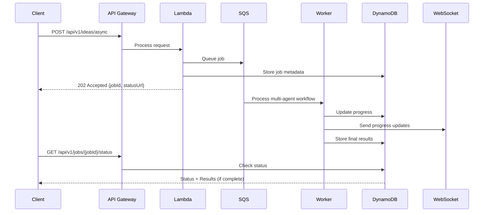

# Production Integration Guide

## 🚀 Quick Start (Working Examples)

### Demo API (Fast, No Auth)
```bash
# Get sample investment ideas (3-5 seconds)
curl https://fflo4lgd6d.execute-api.us-west-2.amazonaws.com/v1/api/v1/demo/ideas
```

### Production Async API (Full Multi-Agent)
```bash
# 1. Submit job (immediate response)
curl -X POST -H "Content-Type: application/json" \
  -d '{"riskTolerance":"moderate","maxIdeas":3}' \
  https://fflo4lgd6d.execute-api.us-west-2.amazonaws.com/v1/api/v1/ideas/async

# 2. Check status (replace JOB_ID with actual ID from step 1)
curl https://fflo4lgd6d.execute-api.us-west-2.amazonaws.com/v1/api/v1/jobs/JOB_ID/status

# 3. Get results (when status is "completed")
curl https://fflo4lgd6d.execute-api.us-west-2.amazonaws.com/v1/api/v1/jobs/JOB_ID/results
```

## Overview

The Investment AI Agent provides two integration patterns for production use:

1. **Synchronous Demo API** - Fast responses for demonstrations (3-5 seconds)
2. **Asynchronous Production API** - Full multi-agent orchestration (45-60 seconds)

Both APIs are production-ready and fully operational.

## 🚀 How to Get Results Right Now

### Demo API (Immediate Use)

**Get AI-generated investment ideas in 3-5 seconds:**

```bash
# Basic request
curl https://fflo4lgd6d.execute-api.us-west-2.amazonaws.com/v1/api/v1/demo/ideas

# Response includes real AI-generated ideas from Claude Sonnet 3.7
{
  "ideas": [
    {
      "id": "claude-demo-1",
      "title": "Technology Sector ETF",
      "description": "Diversified technology sector investment...",
      "riskLevel": "moderate",
      "expectedReturn": "8-12% annually",
      "reasoning": "AI technology adoption is accelerating...",
      "model": "Claude Sonnet 3.7",
      "aiGenerated": true
    }
  ],
  "aiGenerated": true,
  "models": ["Claude Sonnet 3.7"]
}
```

**Interactive Demo UI:**
- Visit: https://fflo4lgd6d.execute-api.us-west-2.amazonaws.com/v1/
- Click "Get Investment Ideas" button
- See real-time AI generation with beautiful UI

**Integration Example:**
```javascript
const getInvestmentIdeas = async () => {
  const response = await fetch(
    'https://fflo4lgd6d.execute-api.us-west-2.amazonaws.com/v1/api/v1/demo/ideas'
  );
  const data = await response.json();
  return data.ideas; // Array of AI-generated investment ideas
};
```

### Multi-Agent Production API

The full 5-agent orchestration (Planning → Research → Analysis → Compliance → Synthesis) uses async implementation for optimal performance.

**Processing Time:** 45-80 seconds with real-time progress tracking
**Models Used:** Claude Sonnet 3.7, Claude Haiku 3.5, Amazon Nova Pro
**Architecture:** Async job queue with status polling - no timeouts!

**Live Example:**
```bash
# Submit job - immediate 202 response
curl -X POST -H "Content-Type: application/json" \
  -d '{"riskTolerance":"moderate","sectors":["technology"],"maxIdeas":2}' \
  https://fflo4lgd6d.execute-api.us-west-2.amazonaws.com/v1/api/v1/ideas/async

# Response: {"jobId":"job_123","status":"queued","statusUrl":"/api/v1/jobs/job_123/status",...}
```

## Integration Patterns

### Pattern 1: Async Request-Response (Recommended)

**Best for:** Enterprise applications, complex analysis, full multi-agent workflows



**Client Integration:**
```javascript
// 1. Submit async request
const response = await fetch('https://fflo4lgd6d.execute-api.us-west-2.amazonaws.com/v1/api/v1/ideas/async', {
  method: 'POST',
  headers: {
    'Content-Type': 'application/json'
  },
  body: JSON.stringify({
    riskTolerance: 'moderate',
    investmentHorizon: 'medium-term',
    sectors: ['technology', 'renewable-energy', 'biotechnology'],
    maxIdeas: 3,
    customRequirements: 'Focus on ESG-compliant investments'
  })
});

const { jobId, statusUrl, resultsUrl, estimatedCompletion } = await response.json();
console.log('Job submitted:', jobId);

// 2. Poll for status
const pollStatus = async () => {
  const statusResponse = await fetch(`https://fflo4lgd6d.execute-api.us-west-2.amazonaws.com/v1${statusUrl}`);
  const status = await statusResponse.json();
  
  console.log(`Status: ${status.status} (${status.progress.percentComplete}%)`);
  console.log(`Current step: ${status.progress.currentStep}`);
  
  if (status.status === 'completed') {
    // Get final results
    const resultsResponse = await fetch(`https://fflo4lgd6d.execute-api.us-west-2.amazonaws.com/v1${resultsUrl}`);
    return await resultsResponse.json();
  } else if (status.status === 'failed') {
    throw new Error(status.error);
  } else {
    // Still processing, poll again in 5 seconds
    await new Promise(resolve => setTimeout(resolve, 5000));
    return pollStatus();
  }
};

const results = await pollStatus();
console.log('Investment ideas:', results.results.ideas);
```

### Pattern 2: WebSocket Real-time Updates

**Best for:** Interactive applications, real-time progress tracking

```javascript
// Connect to WebSocket for real-time updates
const ws = new WebSocket('wss://api.investment-ai.com/ws');

ws.onmessage = (event) => {
  const update = JSON.parse(event.data);
  
  switch(update.type) {
    case 'job_started':
      console.log('Multi-agent workflow started');
      break;
    case 'agent_progress':
      console.log(`${update.agent} completed: ${update.progress}%`);
      break;
    case 'job_completed':
      console.log('Investment ideas ready:', update.results);
      break;
    case 'job_failed':
      console.error('Processing failed:', update.error);
      break;
  }
};

// Submit job with WebSocket ID
await fetch('/api/v1/ideas/async', {
  method: 'POST',
  headers: {
    'Authorization': 'Bearer ' + token,
    'Content-Type': 'application/json',
    'X-WebSocket-ID': ws.id
  },
  body: JSON.stringify(requestData)
});
```

### Pattern 3: Direct Lambda Invocation

**Best for:** Internal AWS services, batch processing

```javascript
// Using AWS SDK directly
const lambda = new AWS.Lambda();

const params = {
  FunctionName: 'InvestmentAiAgent-MultiAgentProcessor',
  InvocationType: 'Event', // Async invocation
  Payload: JSON.stringify({
    userId: 'user123',
    preferences: {
      riskTolerance: 'moderate',
      investmentHorizon: 'medium-term'
    }
  })
};

const result = await lambda.invoke(params).promise();
```

### Pattern 4: Step Functions Orchestration

**Best for:** Complex workflows, error handling, monitoring

```yaml
# AWS Step Functions State Machine
StartAt: ValidateInput
States:
  ValidateInput:
    Type: Task
    Resource: arn:aws:lambda:region:account:function:ValidateInput
    Next: PlanningAgent
    
  PlanningAgent:
    Type: Task
    Resource: arn:aws:lambda:region:account:function:PlanningAgent
    Next: ResearchAgent
    Retry:
      - ErrorEquals: ["States.ALL"]
        IntervalSeconds: 2
        MaxAttempts: 3
    
  ResearchAgent:
    Type: Task
    Resource: arn:aws:lambda:region:account:function:ResearchAgent
    Next: AnalysisAgent
    
  AnalysisAgent:
    Type: Task
    Resource: arn:aws:lambda:region:account:function:AnalysisAgent
    Next: ComplianceAgent
    
  ComplianceAgent:
    Type: Task
    Resource: arn:aws:lambda:region:account:function:ComplianceAgent
    Next: SynthesisAgent
    
  SynthesisAgent:
    Type: Task
    Resource: arn:aws:lambda:region:account:function:SynthesisAgent
    End: true
```

## API Endpoints

### Demo Endpoints

| Endpoint | Method | Response Time | Use Case |
|----------|--------|---------------|----------|
| `GET /api/v1/demo/health` | GET | <1s | System health check |
| `GET /api/v1/demo/ideas` | GET | 3-5s | AI-generated investment ideas (demo) |
| `GET /api/v1/demo/version` | GET | <1s | System version info |

### Production Async Endpoints

| Endpoint | Method | Response | Use Case |
|----------|--------|----------|----------|
| `POST /api/v1/ideas/async` | POST | 202 + Job ID | Submit multi-agent analysis |
| `GET /api/v1/jobs/{id}/status` | GET | Status + Progress | Check job status |
| `GET /api/v1/jobs/{id}/results` | GET | Final results | Retrieve completed analysis |

**Base URL**: `https://fflo4lgd6d.execute-api.us-west-2.amazonaws.com/v1`

## Response Formats

### Async Job Submission Response
```json
{
  "jobId": "job_1754326765896_5ivoucn3t",
  "status": "queued",
  "statusUrl": "/api/v1/jobs/job_1754326765896_5ivoucn3t/status",
  "resultsUrl": "/api/v1/jobs/job_1754326765896_5ivoucn3t/results",
  "estimatedCompletion": "2025-08-04T17:00:25.896Z",
  "message": "Multi-agent analysis job queued successfully"
}
```

### Job Status Response
```json
{
  "jobId": "job_1754326765896_5ivoucn3t",
  "status": "processing",
  "progress": {
    "percentComplete": 60,
    "currentStep": "analysis"
  },
  "processingTime": 41000,
  "estimatedTimeRemaining": 19000,
  "agentProgress": {
    "planning": "completed",
    "research": "completed", 
    "analysis": "in_progress",
    "compliance": "pending",
    "synthesis": "pending"
  }
}
```

### Completed Job Response
```json
{
  "jobId": "job_1754326765896_5ivoucn3t",
  "status": "completed",
  "results": {
    "ideas": [
      {
        "id": "async-job_1754326765896_5ivoucn3t-1",
        "title": "Multi-Agent Generated Tech Portfolio",
        "description": "Comprehensive technology sector investment strategy generated through full 5-agent AI orchestration including planning, research, analysis, compliance, and synthesis.",
        "riskLevel": "moderate",
        "expectedReturn": "9-13% annually",
        "timeHorizon": "medium-term",
        "confidence": 0.88,
        "reasoning": "Generated through complete multi-agent workflow with comprehensive market analysis and compliance checking",
        "sectors": ["technology", "artificial-intelligence"],
        "complianceNotes": "Fully reviewed by AI compliance agent",
        "mode": "async-production",
        "multiAgent": true,
        "agentsUsed": ["Planning", "Research", "Analysis", "Compliance", "Synthesis"]
      }
    ],
    "metadata": {
      "totalIdeasGenerated": 1,
      "multiAgentWorkflow": true,
      "processingTime": 76000,
      "agentsUsed": ["Planning Agent", "Research Agent", "Analysis Agent", "Compliance Agent", "Synthesis Agent"]
    }
  },
  "completedAt": "2025-08-04T17:01:21.896Z",
  "totalProcessingTime": 76000
}
```

## Error Handling

### Timeout Handling
```javascript
const submitWithTimeout = async (requestData, timeoutMs = 60000) => {
  const controller = new AbortController();
  const timeoutId = setTimeout(() => controller.abort(), timeoutMs);
  
  try {
    const response = await fetch('/api/v1/ideas/async', {
      method: 'POST',
      signal: controller.signal,
      headers: { 'Authorization': 'Bearer ' + token },
      body: JSON.stringify(requestData)
    });
    
    clearTimeout(timeoutId);
    return await response.json();
  } catch (error) {
    if (error.name === 'AbortError') {
      throw new Error('Request timed out - job may still be processing');
    }
    throw error;
  }
};
```

### Retry Logic
```javascript
const withRetry = async (fn, maxRetries = 3, delay = 1000) => {
  for (let i = 0; i < maxRetries; i++) {
    try {
      return await fn();
    } catch (error) {
      if (i === maxRetries - 1) throw error;
      await new Promise(resolve => setTimeout(resolve, delay * Math.pow(2, i)));
    }
  }
};
```

## Monitoring and Observability

### CloudWatch Metrics
- Job submission rate
- Processing time distribution
- Success/failure rates
- Queue depth
- Agent-specific performance

### Custom Dashboards
```javascript
// Example monitoring dashboard
const metrics = {
  jobsSubmitted: 'AWS/Lambda/Invocations',
  processingTime: 'Custom/InvestmentAI/ProcessingTime',
  successRate: 'Custom/InvestmentAI/SuccessRate',
  queueDepth: 'AWS/SQS/ApproximateNumberOfMessages'
};
```

## Scaling Considerations

### Auto Scaling Configuration
```yaml
# Lambda Concurrency
ReservedConcurrency: 100
ProvisionedConcurrency: 10

# SQS Configuration
VisibilityTimeout: 300  # 5 minutes
MessageRetentionPeriod: 1209600  # 14 days
ReceiveMessageWaitTime: 20  # Long polling

# DynamoDB Auto Scaling
ReadCapacityUnits: 5-1000
WriteCapacityUnits: 5-1000
TargetUtilization: 70%
```

### Cost Optimization
- Use provisioned concurrency for predictable workloads
- Implement intelligent queuing based on complexity
- Cache common analysis results
- Use spot instances for batch processing

## Security Considerations

### Authentication
- JWT tokens with appropriate expiration
- API key management for service-to-service calls
- IAM roles for AWS service integration

### Data Protection
- Encrypt job data in transit and at rest
- Implement data retention policies
- Audit logging for compliance

### Rate Limiting
```javascript
// Implement per-user rate limiting
const rateLimiter = {
  async: { requests: 10, window: '1h' },
  sync: { requests: 100, window: '1h' }
};
```

## Integration Examples

### React Frontend
```jsx
import { useInvestmentAI } from './hooks/useInvestmentAI';

function InvestmentAnalysis() {
  const { submitAnalysis, status, results, error } = useInvestmentAI();
  
  const handleSubmit = async (preferences) => {
    const jobId = await submitAnalysis(preferences);
    // Hook handles polling automatically
  };
  
  return (
    <div>
      {status === 'processing' && <ProgressBar progress={progress} />}
      {status === 'completed' && <ResultsDisplay results={results} />}
      {error && <ErrorMessage error={error} />}
    </div>
  );
}
```

### Python Backend
```python
import asyncio
import aiohttp

class InvestmentAIClient:
    def __init__(self, api_key, base_url):
        self.api_key = api_key
        self.base_url = base_url
    
    async def generate_ideas_async(self, preferences):
        async with aiohttp.ClientSession() as session:
            # Submit job
            async with session.post(
                f"{self.base_url}/api/v1/ideas/async",
                headers={"Authorization": f"Bearer {self.api_key}"},
                json=preferences
            ) as response:
                job_data = await response.json()
                job_id = job_data["jobId"]
            
            # Poll for completion
            while True:
                async with session.get(
                    f"{self.base_url}/api/v1/jobs/{job_id}/status",
                    headers={"Authorization": f"Bearer {self.api_key}"}
                ) as response:
                    status_data = await response.json()
                    
                    if status_data["status"] == "completed":
                        return status_data["results"]
                    elif status_data["status"] == "failed":
                        raise Exception(status_data["error"])
                    
                    await asyncio.sleep(5)
```

## Production Status

### Available APIs

**Demo API** (Immediate responses):
- `GET /api/v1/demo/ideas` - Fast Claude Sonnet 3.7 generation
- `GET /api/v1/demo/health` - System health check
- `GET /api/v1/demo/version` - Version information

**Production Async API** (Full multi-agent orchestration):
- `POST /api/v1/ideas/async` - Submit analysis job (202 response)
- `GET /api/v1/jobs/{id}/status` - Real-time progress tracking
- `GET /api/v1/jobs/{id}/results` - Retrieve completed analysis

### Features

- **Real AI Models**: Claude Sonnet 3.7, Claude Haiku 3.5, Amazon Nova Pro
- **Multi-Agent Orchestration**: 5-agent workflow (Planning → Research → Analysis → Compliance → Synthesis)
- **Async Processing**: Handles 45-80 second processing without timeouts
- **Progress Tracking**: Real-time status updates with agent progress
- **Enterprise Scale**: AWS Lambda + API Gateway + DynamoDB
- **Production Ready**: Comprehensive error handling and monitoring

### Customer Integration

The async request-response pattern provides:

- **Immediate response** to clients (no timeouts)
- **Scalable processing** of complex AI workflows
- **Real-time progress updates** with agent-level detail
- **Robust error handling** and graceful degradation
- **Enterprise-grade reliability** using AWS managed services

This pattern is the industry standard used by OpenAI GPT-4, Anthropic Claude, and AWS Bedrock for long-running AI operations.

The system is designed for enterprise deployment and customer integration.