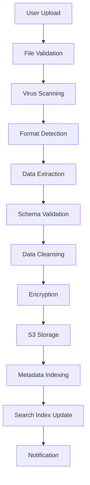
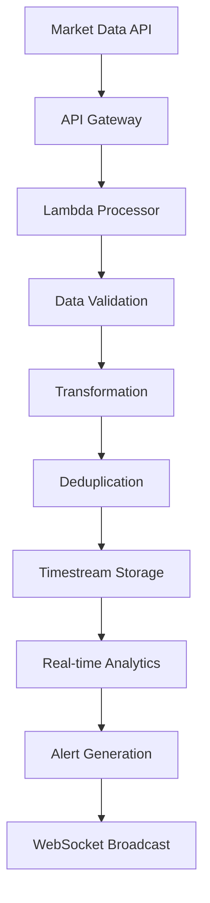
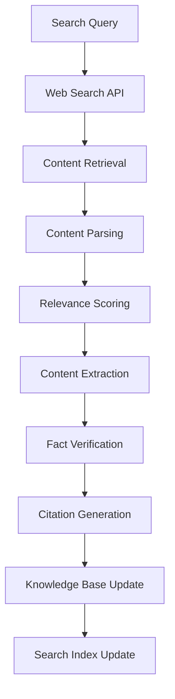
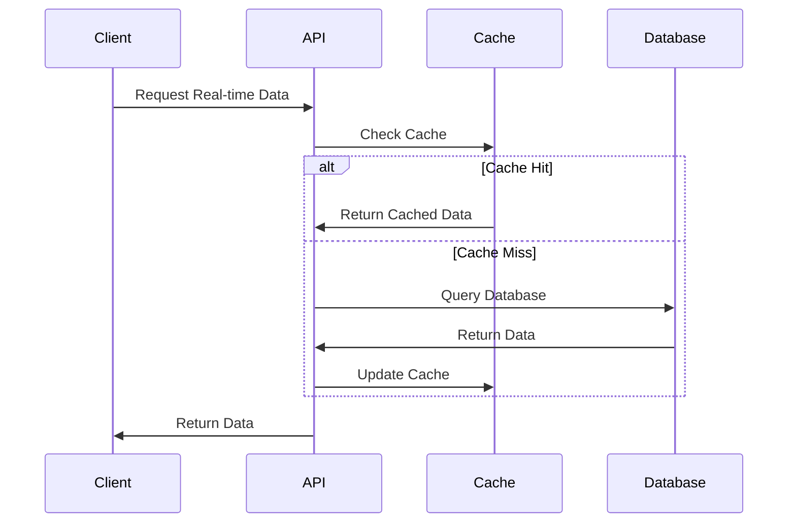
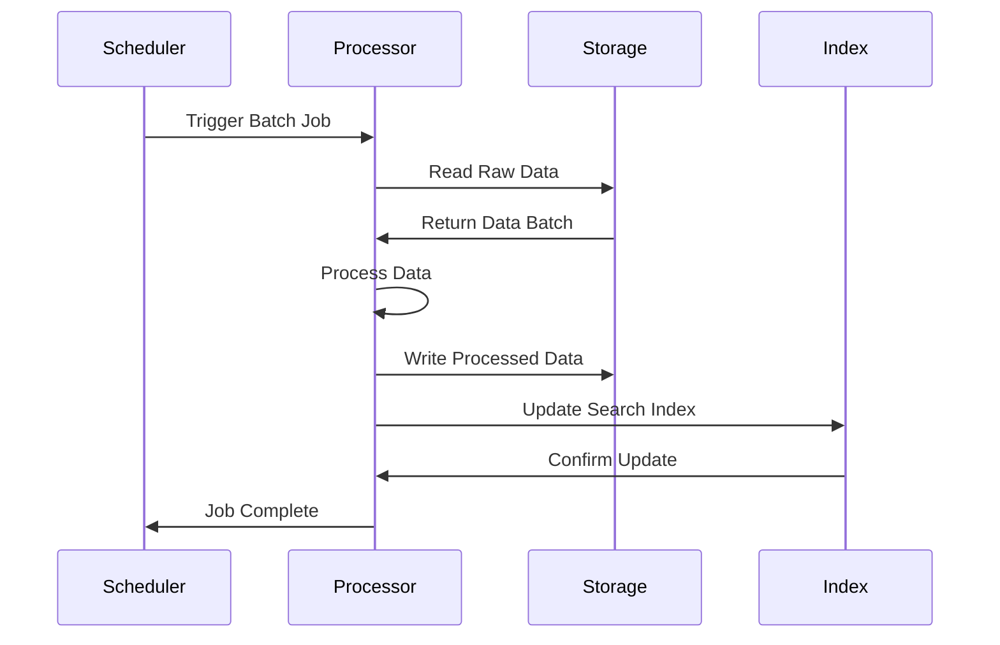
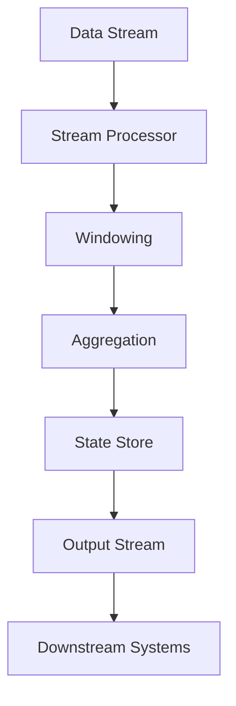
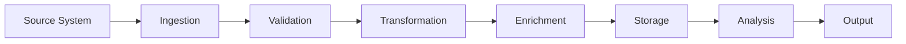

# Data Flow Architecture

## Overview

The Investment AI Agent processes data through multiple interconnected pipelines that handle different types of information sources. This document outlines the data flow patterns, processing stages, and storage strategies used throughout the system.

## Data Sources and Types

### 1. Proprietary Data
- **Format**: CSV, PDF, Excel, JSON files
- **Content**: Company financial data, internal research, proprietary models
- **Volume**: 1GB - 100GB per upload
- **Frequency**: Ad-hoc uploads by users
- **Security**: Encrypted at rest and in transit, access-controlled

### 2. Public Research Data
- **Format**: Web pages, PDF reports, structured APIs
- **Content**: Analyst reports, market research, academic papers
- **Volume**: 10MB - 1GB per source
- **Frequency**: Real-time and scheduled updates
- **Security**: Public data with source attribution

### 3. Market Data
- **Format**: JSON, CSV time-series data
- **Content**: Stock prices, trading volumes, market indicators
- **Volume**: 1MB - 10MB per day per symbol
- **Frequency**: Real-time streaming and batch updates
- **Security**: Licensed data with usage restrictions

### 4. News and Sentiment Data
- **Format**: JSON, RSS feeds, API responses
- **Content**: Financial news, social media sentiment, press releases
- **Volume**: 100KB - 10MB per article
- **Frequency**: Real-time streaming
- **Security**: Public data with rate limiting

## Data Ingestion Pipeline

### Proprietary Data Ingestion

**Processing Steps**:

1. **File Validation**: Check file size, type, and integrity
2. **Virus Scanning**: Security scan using AWS GuardDuty
3. **Format Detection**: Identify file format and structure
4. **Data Extraction**: Extract structured data from files
5. **Schema Validation**: Validate against expected data schemas
6. **Data Cleansing**: Remove duplicates, fix formatting issues
7. **Encryption**: Encrypt sensitive data using AWS KMS
8. **S3 Storage**: Store in appropriate S3 bucket with lifecycle policies
9. **Metadata Indexing**: Create searchable metadata in DynamoDB
10. **Search Index Update**: Update OpenSearch index for full-text search
11. **Notification**: Notify relevant services of new data availability

### Real-time Market Data Pipeline

**Processing Steps**:

1. **API Gateway**: Receive data from market data providers
2. **Lambda Processor**: Process incoming data streams
3. **Data Validation**: Validate data quality and completeness
4. **Transformation**: Convert to standard format and units
5. **Deduplication**: Remove duplicate data points
6. **Timestream Storage**: Store time-series data in Timestream
7. **Real-time Analytics**: Calculate derived metrics and indicators
8. **Alert Generation**: Generate alerts for significant changes
9. **WebSocket Broadcast**: Push updates to connected clients

### Web Research Data Pipeline

**Processing Steps**:

1. **Search Query**: Execute search against web APIs
2. **Content Retrieval**: Fetch relevant web pages and documents
3. **Content Parsing**: Extract text and structured data
4. **Relevance Scoring**: Score content relevance to query
5. **Content Extraction**: Extract key facts and insights
6. **Fact Verification**: Cross-reference with known sources
7. **Citation Generation**: Create proper citations and attributions
8. **Knowledge Base Update**: Store processed content
9. **Search Index Update**: Update search indexes

## Data Processing Stages

### Stage 1: Data Ingestion and Validation

**Purpose**: Ensure data quality and security before processing

**Components**:
- Input validation and sanitization
- Schema validation and type checking
- Security scanning and threat detection
- Data quality assessment and scoring

**Quality Metrics**:
- Completeness: Percentage of required fields populated
- Accuracy: Validation against known benchmarks
- Consistency: Cross-field validation and business rules
- Timeliness: Data freshness and update frequency

### Stage 2: Data Transformation and Enrichment

**Purpose**: Convert raw data into standardized, enriched formats

**Transformation Types**:
- **Format Standardization**: Convert to common data formats
- **Unit Normalization**: Standardize currencies, dates, and measurements
- **Data Enrichment**: Add calculated fields and derived metrics
- **Relationship Mapping**: Establish connections between data entities

**Enrichment Sources**:
- Reference data for company information
- Industry classification codes (GICS, NAICS)
- Geographic and demographic data
- Historical context and benchmarks

### Stage 3: Data Analysis and Feature Extraction

**Purpose**: Extract meaningful features and insights from processed data

**Analysis Types**:
- **Statistical Analysis**: Descriptive statistics and distributions
- **Trend Analysis**: Time-series analysis and pattern recognition
- **Correlation Analysis**: Relationship identification between variables
- **Anomaly Detection**: Identification of outliers and unusual patterns

**Feature Extraction**:
- Financial ratios and metrics
- Technical indicators
- Sentiment scores
- Risk measures

### Stage 4: Data Storage and Indexing

**Purpose**: Store processed data for efficient retrieval and analysis

**Storage Strategy**:
- **Hot Data**: Recent and frequently accessed data in DynamoDB
- **Warm Data**: Historical data in S3 with intelligent tiering
- **Cold Data**: Archived data in S3 Glacier for compliance
- **Search Data**: Indexed data in OpenSearch for full-text search

**Indexing Strategy**:
- Primary indexes on entity IDs and timestamps
- Secondary indexes on frequently queried attributes
- Full-text search indexes for document content
- Vector indexes for semantic similarity search

## Data Access Patterns

### Real-time Data Access

### Batch Data Processing

### Stream Processing

## Data Quality Management

### Data Quality Dimensions

1. **Accuracy**: Data correctly represents real-world values
2. **Completeness**: All required data is present
3. **Consistency**: Data is consistent across systems
4. **Timeliness**: Data is up-to-date and available when needed
5. **Validity**: Data conforms to defined formats and constraints
6. **Uniqueness**: No duplicate records exist

### Quality Monitoring

**Automated Checks**:
- Schema validation on ingestion
- Statistical outlier detection
- Cross-reference validation
- Freshness monitoring

**Quality Metrics Dashboard**:
- Data quality scores by source
- Trend analysis of quality metrics
- Alert notifications for quality issues
- Root cause analysis tools

### Data Lineage Tracking

**Lineage Components**:
- Source system identification
- Transformation history
- Processing timestamps
- Data dependencies
- Impact analysis

**Lineage Visualization**:

## Data Security and Privacy

### Encryption Strategy

**At Rest**:
- S3: Server-side encryption with KMS
- DynamoDB: Encryption at rest with customer-managed keys
- Timestream: Encryption with AWS managed keys
- OpenSearch: Encryption at rest enabled

**In Transit**:
- TLS 1.2+ for all API communications
- VPC endpoints for internal service communication
- Encrypted connections to external data sources

### Access Control

**Role-Based Access**:
- Data scientists: Read access to processed data
- Analysts: Read access to reports and insights
- Administrators: Full access to system configuration
- Auditors: Read-only access to logs and lineage

**Data Classification**:
- **Public**: Publicly available market data
- **Internal**: Company-specific analysis and insights
- **Confidential**: Proprietary data and models
- **Restricted**: Personally identifiable information

### Privacy Protection

**PII Handling**:
- Automatic PII detection and masking
- Tokenization of sensitive identifiers
- Audit logging of PII access
- Data retention policies

**Compliance Measures**:
- GDPR right to be forgotten implementation
- Data minimization principles
- Consent management
- Cross-border data transfer controls

## Performance Optimization

### Caching Strategy

**Multi-Level Caching**:
1. **Application Cache**: In-memory caching for frequently accessed data
2. **Database Cache**: Query result caching in database layer
3. **CDN Cache**: Static content caching for global distribution
4. **Browser Cache**: Client-side caching for user interface data

**Cache Invalidation**:
- Time-based expiration for market data
- Event-driven invalidation for proprietary data
- Version-based invalidation for processed results

### Data Partitioning

**Partitioning Strategies**:
- **Time-based**: Partition by date for time-series data
- **Entity-based**: Partition by company or asset for financial data
- **Geographic**: Partition by region for global data
- **Hash-based**: Distribute load evenly across partitions

### Query Optimization

**Optimization Techniques**:
- Index optimization for common query patterns
- Query result caching for expensive operations
- Materialized views for complex aggregations
- Parallel processing for large datasets

## Monitoring and Alerting

### Data Pipeline Monitoring

**Key Metrics**:
- Data ingestion rates and volumes
- Processing latency and throughput
- Error rates and failure patterns
- Data quality scores and trends

**Alerting Rules**:
- Data ingestion failures
- Quality score degradation
- Processing delays
- Storage capacity thresholds

### Performance Monitoring

**System Metrics**:
- CPU and memory utilization
- Network bandwidth usage
- Storage I/O performance
- Database query performance

**Business Metrics**:
- Data freshness and availability
- User query response times
- System uptime and reliability
- Cost per data processing unit

This data flow architecture ensures reliable, secure, and efficient processing of diverse data sources while maintaining high performance and data quality standards throughout the Investment AI Agent system.