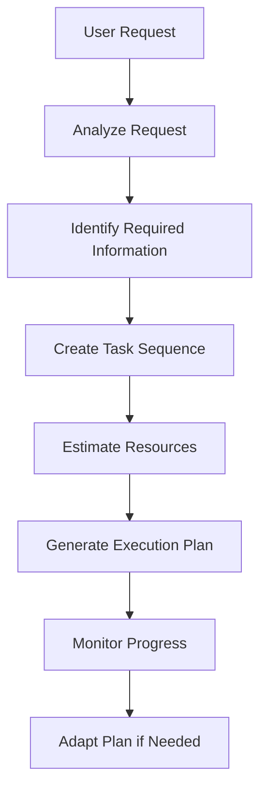
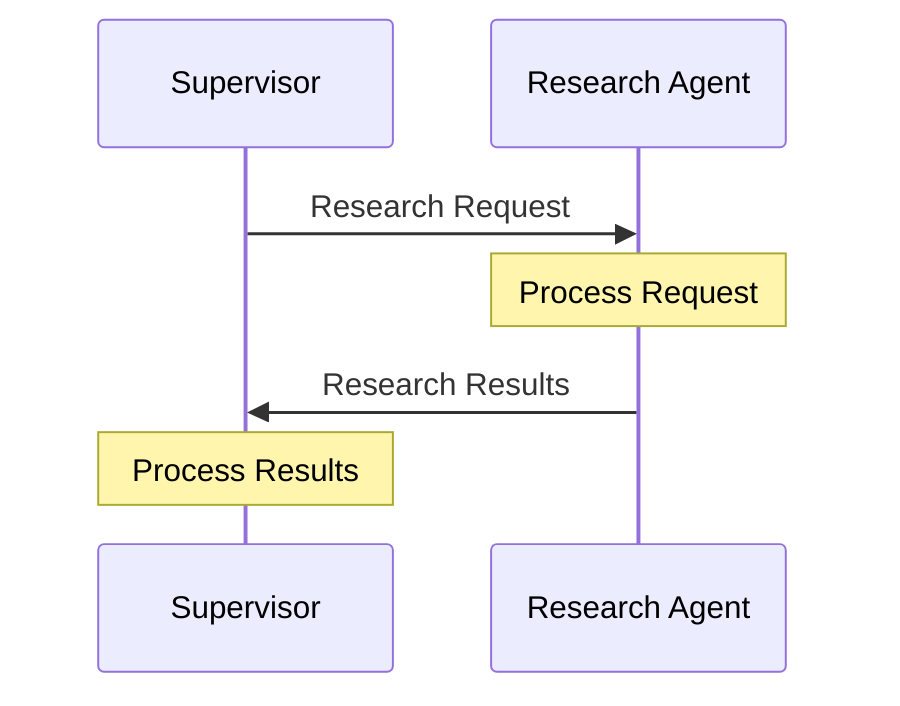
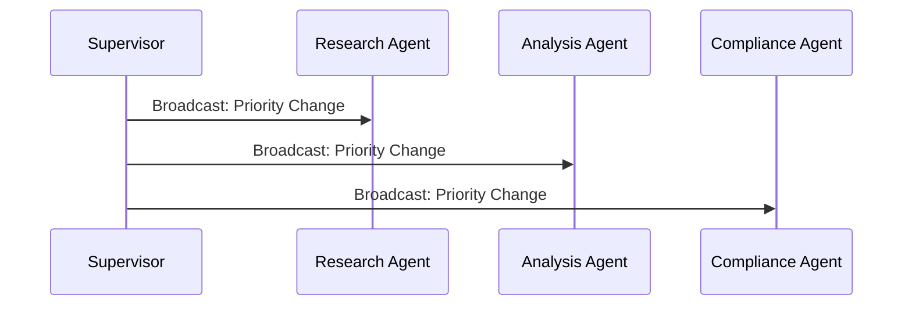
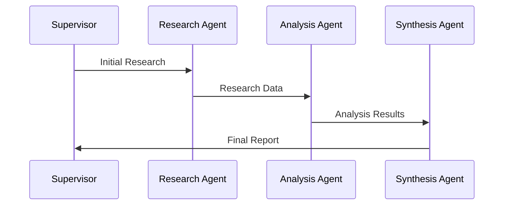
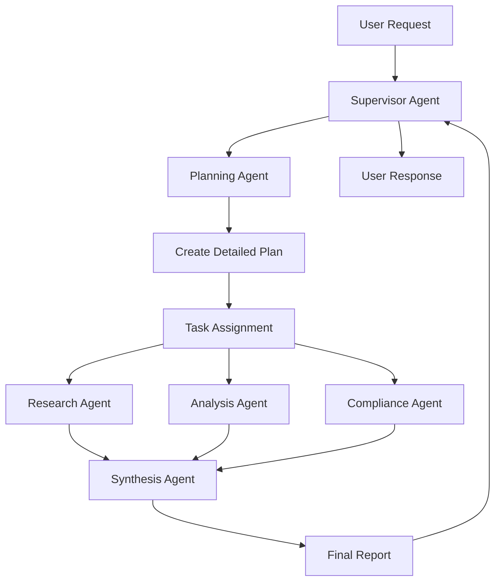
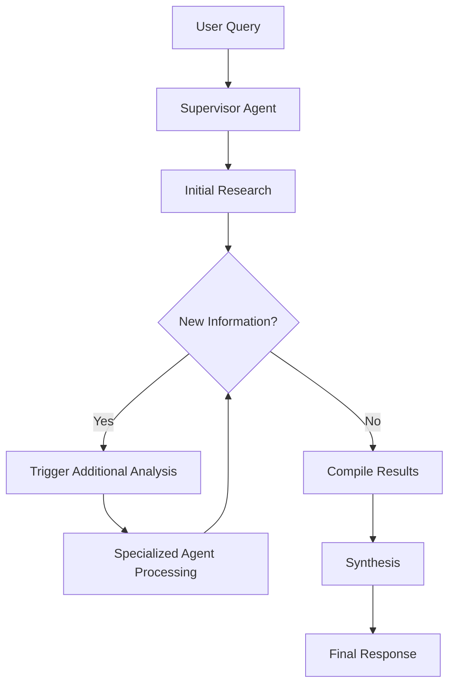

# Multi-Agent Architecture

## Overview

The Investment AI Agent implements a sophisticated multi-agent orchestration framework that coordinates specialized AI agents to handle complex investment research and analysis tasks. This architecture enables the system to break down complex investment analysis into manageable, specialized tasks while maintaining coherent overall behavior.

## Agent Hierarchy and Roles

### Supervisor Agent (Claude Sonnet 3.7)

**Primary Responsibilities**:
- Overall workflow coordination and task delegation
- User request interpretation and context management
- Conflict resolution between agent outputs
- Final response synthesis and quality assurance
- Conversation history and state management

**Key Capabilities**:
- Complex reasoning and decision-making
- Natural language understanding and generation
- Context preservation across multi-turn conversations
- Error handling and recovery strategies

**Model Selection Rationale**:
Claude Sonnet 3.7 is chosen for its superior reasoning capabilities, ability to handle complex multi-step tasks, and excellent performance in coordinating multiple information sources.

### Planning Agent (Claude Sonnet 3.7)

**Primary Responsibilities**:
- Research and analysis plan development
- Task sequencing and dependency management
- Resource allocation and timeline estimation
- Plan adaptation based on intermediate findings

**Key Capabilities**:
- Strategic thinking and planning
- Task decomposition and prioritization
- Risk assessment and contingency planning
- Dynamic plan adjustment

**Workflow Example**:


### Research Agent (Claude Haiku 3.5)

**Primary Responsibilities**:
- Web search and information retrieval
- Proprietary data extraction and analysis
- Market data collection and processing
- Trend identification and pattern recognition

**Key Capabilities**:
- Fast information processing
- Multi-source data integration
- Real-time data analysis
- Source credibility assessment

**Model Selection Rationale**:
Claude Haiku 3.5 is optimized for speed and efficiency, making it ideal for rapid information gathering and processing tasks that don't require deep reasoning.

**Data Sources**:
- Public web search results
- Proprietary company documents
- Real-time market data feeds
- News and research publications
- Regulatory filings and reports

### Analysis Agent (Amazon Nova Pro)

**Primary Responsibilities**:
- Quantitative financial analysis
- Statistical modeling and correlation analysis
- Risk assessment and scenario modeling
- Performance projection and valuation

**Key Capabilities**:
- Advanced mathematical computations
- Financial modeling expertise
- Statistical analysis and inference
- Quantitative risk assessment

**Model Selection Rationale**:
Amazon Nova Pro is specifically designed for analytical and quantitative tasks, making it the optimal choice for financial analysis and mathematical computations.

**Analysis Types**:
- Fundamental analysis (P/E ratios, DCF models, etc.)
- Technical analysis (chart patterns, indicators)
- Risk analysis (VaR, stress testing)
- Comparative analysis (peer benchmarking)
- Scenario analysis (best/worst/expected cases)

### Compliance Agent (Claude Haiku 3.5)

**Primary Responsibilities**:
- Regulatory compliance verification
- Risk assessment and flagging
- ESG factor evaluation
- Compliance documentation generation

**Key Capabilities**:
- Regulatory knowledge application
- Risk identification and categorization
- Compliance rule interpretation
- Documentation and reporting

**Compliance Areas**:
- SEC regulations and filings
- FINRA rules and guidelines
- ESG compliance requirements
- International regulatory standards
- Internal compliance policies

### Synthesis Agent (Claude Sonnet 3.7)

**Primary Responsibilities**:
- Multi-agent output integration
- Narrative generation and storytelling
- Visualization and presentation formatting
- Quality assurance and coherence checking

**Key Capabilities**:
- Information synthesis and integration
- Narrative construction
- Visual presentation design
- Consistency verification

**Output Formats**:
- Executive summaries
- Detailed investment reports
- Risk assessments
- Compliance documentation
- Interactive visualizations

## Communication Patterns

### Message Passing System

The agents communicate through a structured message passing system that ensures reliable, traceable communication.

**Message Structure**:
```typescript
interface AgentMessage {
  id: string;
  sender: AgentType;
  recipient: AgentType | 'broadcast';
  messageType: 'request' | 'response' | 'update' | 'error';
  priority: 'low' | 'medium' | 'high' | 'urgent';
  content: {
    task?: TaskDefinition;
    data?: any;
    results?: AnalysisResults;
    error?: ErrorDetails;
  };
  metadata: {
    timestamp: Date;
    conversationId: string;
    requestId: string;
    parentMessageId?: string;
    expectedResponseTime?: number;
  };
}
```

### Communication Patterns

#### 1. Direct Request-Response
Used for specific task assignments and result delivery.



#### 2. Broadcast Notifications
Used for system-wide updates and status changes.



#### 3. Chain of Responsibility
Used for sequential processing where each agent builds on previous results.



## Orchestration Patterns

### 1. Plan-and-Execute Pattern

Used for complex, multi-step analyses requiring careful coordination.



**Execution Flow**:
1. Supervisor receives and analyzes user request
2. Planning Agent creates detailed execution plan
3. Tasks are assigned to specialized agents in sequence
4. Each agent completes its assigned tasks
5. Synthesis Agent integrates all results
6. Supervisor reviews and delivers final response

### 2. Reactive Agent Pattern

Used for exploratory research and dynamic analysis scenarios.



**Execution Flow**:
1. Supervisor initiates research based on user query
2. Research Agent begins information gathering
3. As new information is discovered, additional agents are triggered
4. Agents operate semi-autonomously with supervisor oversight
5. Results are continuously integrated and refined
6. Final synthesis occurs when all relevant information is gathered

## Agent Coordination Mechanisms

### Task Queue Management

Each agent maintains a priority-based task queue:

```typescript
interface TaskQueue {
  high: Task[];
  medium: Task[];
  low: Task[];
  
  enqueue(task: Task, priority: Priority): void;
  dequeue(): Task | null;
  peek(): Task | null;
  size(): number;
}
```

### Context Sharing

Agents share context through a centralized context store:

```typescript
interface SharedContext {
  conversationId: string;
  userPreferences: UserPreferences;
  currentAnalysis: AnalysisContext;
  historicalData: HistoricalContext;
  
  updateContext(key: string, value: any): void;
  getContext(key: string): any;
  clearContext(): void;
}
```

### Conflict Resolution

When agents produce conflicting results, the Supervisor Agent employs several resolution strategies:

1. **Confidence-Based Resolution**: Higher confidence results take precedence
2. **Source Credibility**: Results from more credible sources are preferred
3. **Consensus Building**: Multiple agents vote on the best approach
4. **Human Escalation**: Complex conflicts are escalated to human reviewers

### Error Handling and Recovery

The system implements comprehensive error handling:

```typescript
interface ErrorHandling {
  retryPolicy: RetryPolicy;
  fallbackStrategies: FallbackStrategy[];
  escalationRules: EscalationRule[];
  
  handleError(error: AgentError): Promise<ErrorResolution>;
  implementFallback(strategy: FallbackStrategy): Promise<void>;
  escalateToHuman(issue: EscalationIssue): Promise<void>;
}
```

## Performance Optimization

### Load Balancing

Tasks are distributed across agents based on:
- Current workload
- Agent specialization
- Task complexity
- Response time requirements

### Caching Strategy

Results are cached at multiple levels:
- Agent-level caching for repeated queries
- Shared cache for common research topics
- User-specific cache for personalized results

### Parallel Processing

Where possible, agents work in parallel:
- Research and compliance checks run simultaneously
- Multiple analysis types execute concurrently
- Synthesis begins as soon as sufficient data is available

## Monitoring and Observability

### Agent Performance Metrics

Each agent tracks:
- Task completion time
- Success/failure rates
- Resource utilization
- Quality scores

### System-Level Metrics

The orchestration system monitors:
- End-to-end request processing time
- Agent coordination efficiency
- Error rates and recovery success
- User satisfaction scores

### Debugging and Troubleshooting

The system provides:
- Detailed execution traces
- Agent communication logs
- Performance bottleneck identification
- Error root cause analysis

## Security and Compliance

### Access Control

Each agent operates with minimal required permissions:
- Research Agent: Read access to data sources
- Analysis Agent: Compute access only
- Compliance Agent: Read access to regulatory databases
- Synthesis Agent: Write access to output storage

### Data Privacy

Sensitive data handling:
- PII is masked in agent communications
- Proprietary data access is logged and audited
- Results are sanitized before storage

### Audit Trail

Complete audit trail includes:
- All agent communications
- Decision points and rationale
- Data sources accessed
- Results generated and modified

This multi-agent architecture enables the Investment AI Agent to handle complex investment analysis tasks while maintaining high performance, reliability, and compliance with regulatory requirements.