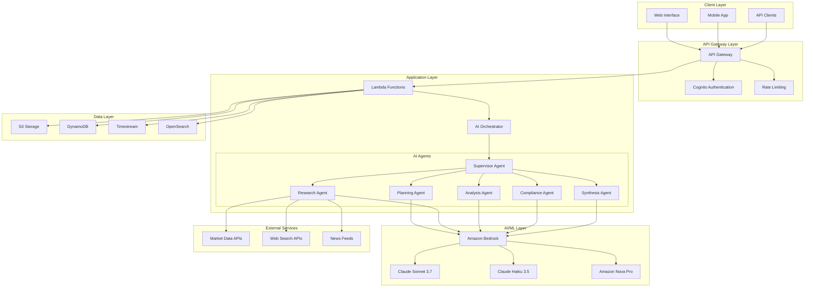
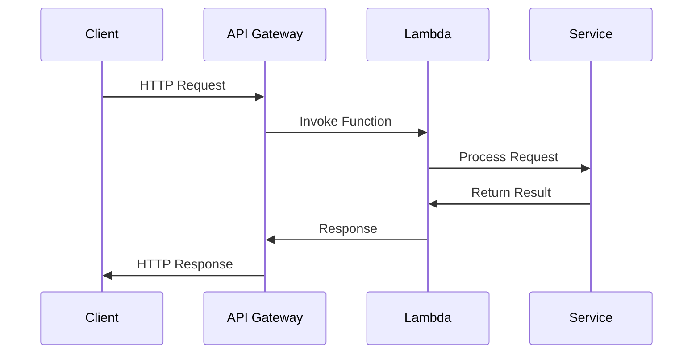
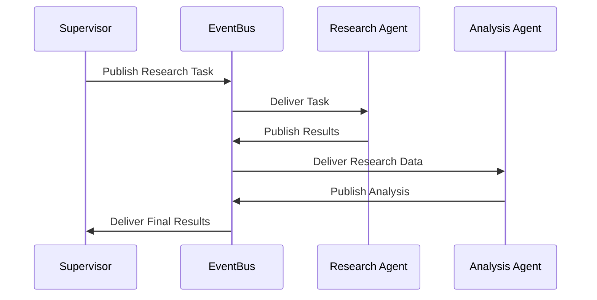
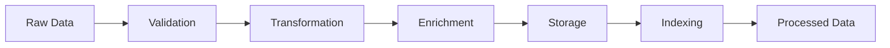

# System Architecture

## Overview

The Investment AI Agent is a sophisticated AI-powered system designed to generate investment ideas by leveraging Amazon Bedrock's foundation models, proprietary data, public research, and real-time market signals. The system follows a modular, microservices-based architecture built on AWS services.

## High-Level Architecture

## Core Components

### 1. API Gateway Layer

**Purpose**: Provides secure, scalable API access with authentication, rate limiting, and request routing.

**Components**:
- **API Gateway**: RESTful API endpoints with CORS support
- **Cognito Authentication**: User authentication and authorization
- **Rate Limiting**: Request throttling and quota management

**Key Features**:
- JWT-based authentication
- Request/response transformation
- API versioning support
- Comprehensive logging and monitoring

### 2. Application Layer

**Purpose**: Contains the core business logic and AI orchestration capabilities.

**Components**:
- **Lambda Functions**: Serverless compute for API endpoints
- **AI Orchestrator**: Coordinates multi-agent workflows
- **Service Layer**: Business logic and data processing services

**Key Features**:
- Event-driven architecture
- Auto-scaling based on demand
- Stateless design for high availability

### 3. Multi-Agent AI System

**Purpose**: Implements specialized AI agents for different aspects of investment analysis.

**Agent Roles**:

#### Supervisor Agent (Claude Sonnet 3.7)
- Coordinates overall workflow
- Interprets user requests
- Manages agent communication
- Resolves conflicts between agents

#### Planning Agent (Claude Sonnet 3.7)
- Develops research and analysis plans
- Identifies required data sources
- Creates task sequences with dependencies
- Adapts plans based on findings

#### Research Agent (Claude Haiku 3.5)
- Performs web searches
- Extracts data from proprietary sources
- Retrieves market data
- Identifies trends and patterns

#### Analysis Agent (Amazon Nova Pro)
- Performs quantitative financial analysis
- Identifies correlations and relationships
- Generates financial projections
- Calculates risk metrics

#### Compliance Agent (Claude Haiku 3.5)
- Checks regulatory compliance
- Identifies potential issues
- Suggests compliance modifications
- Documents compliance considerations

#### Synthesis Agent (Claude Sonnet 3.7)
- Integrates outputs from all agents
- Resolves contradictions
- Generates coherent narratives
- Creates visualizations

### 4. Data Layer

**Purpose**: Provides scalable, secure data storage and retrieval capabilities.

**Components**:
- **S3**: Document storage for proprietary data and reports
- **DynamoDB**: NoSQL database for investment ideas and user data
- **Timestream**: Time-series database for market data
- **OpenSearch**: Search and analytics for knowledge base

**Key Features**:
- Encryption at rest and in transit
- Automated backups and versioning
- High availability and durability
- Performance optimization

### 5. External Integrations

**Purpose**: Connects to external data sources and services.

**Integrations**:
- Market data providers (Alpha Vantage, etc.)
- Web search APIs
- News and research feeds
- Regulatory databases

## Communication Patterns

### 1. Request-Response Pattern
Used for synchronous API calls and immediate responses.

### 2. Event-Driven Pattern
Used for asynchronous processing and agent communication.

### 3. Pipeline Pattern
Used for sequential data processing workflows.

## Scalability and Performance

### Horizontal Scaling
- Lambda functions auto-scale based on demand
- DynamoDB provides on-demand scaling
- API Gateway handles traffic spikes automatically

### Vertical Scaling
- Lambda memory allocation can be adjusted
- Database read/write capacity can be increased
- Bedrock model selection optimizes for performance

### Caching Strategy
- API Gateway response caching
- Application-level caching with ElastiCache
- CDN for static content delivery

## Security Architecture

### Authentication and Authorization
- Cognito User Pools for user management
- JWT tokens for API authentication
- IAM roles for service-to-service communication

### Data Protection
- Encryption at rest using AWS KMS
- Encryption in transit using TLS 1.2+
- VPC isolation for sensitive components

### Compliance
- SOC 2 Type II compliance
- GDPR data protection measures
- Financial services regulatory compliance

## Monitoring and Observability

### Metrics and Monitoring
- CloudWatch metrics for all services
- Custom business metrics
- Real-time dashboards

### Logging
- Structured logging with JSON format
- Centralized log aggregation
- Log retention policies

### Tracing
- AWS X-Ray for distributed tracing
- Request correlation across services
- Performance bottleneck identification

## Disaster Recovery

### Backup Strategy
- Automated daily backups
- Cross-region replication
- Point-in-time recovery

### Recovery Procedures
- RTO: 4 hours
- RPO: 1 hour
- Automated failover capabilities

## Technology Stack

### Core Technologies
- **Runtime**: Node.js 18.x
- **Language**: TypeScript
- **Framework**: Express.js
- **Testing**: Jest

### AWS Services
- **Compute**: Lambda, ECS
- **Storage**: S3, DynamoDB, Timestream
- **AI/ML**: Amazon Bedrock
- **API**: API Gateway
- **Auth**: Cognito
- **Monitoring**: CloudWatch, X-Ray

### External Services
- Market data providers
- Web search APIs
- News aggregation services

## Deployment Architecture

The system supports multiple deployment environments:

- **Development**: Single-region, minimal resources
- **Staging**: Production-like environment for testing
- **Production**: Multi-region, high availability setup

Each environment is isolated and managed through Infrastructure as Code (IaC) using AWS CDK.