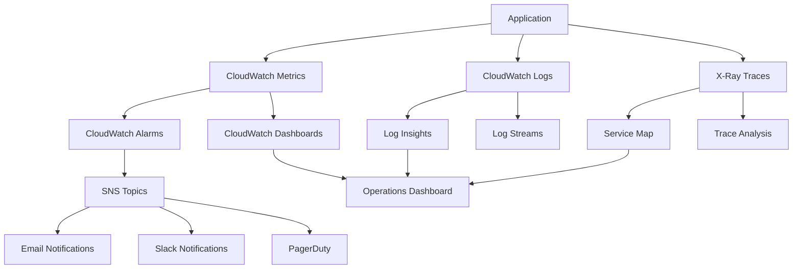

# Monitoring and Alerting

## Overview

This runbook provides comprehensive guidance for monitoring the Investment AI Agent system, setting up alerts, and responding to incidents. The monitoring strategy covers infrastructure, application performance, business metrics, and security events.

## Monitoring Architecture

### Monitoring Stack



### Key Components

1. **CloudWatch Metrics**: System and custom metrics
2. **CloudWatch Logs**: Application and system logs
3. **X-Ray**: Distributed tracing and performance analysis
4. **CloudWatch Dashboards**: Visual monitoring interfaces
5. **CloudWatch Alarms**: Automated alerting system
6. **SNS**: Notification distribution
7. **External Tools**: Slack, PagerDuty for incident management

## Metrics and KPIs

### Infrastructure Metrics

#### Lambda Functions

```yaml
Metrics:
  - Duration: Function execution time
  - Errors: Function errors and failures
  - Throttles: Concurrent execution limits hit
  - ConcurrentExecutions: Number of concurrent executions
  - DeadLetterErrors: Failed async invocations
  - IteratorAge: Stream processing lag (if applicable)

Thresholds:
  Duration:
    Warning: > 5 seconds (95th percentile)
    Critical: > 10 seconds (95th percentile)
  
  Errors:
    Warning: > 1% error rate
    Critical: > 5% error rate
  
  Throttles:
    Warning: > 0 throttles
    Critical: > 10 throttles in 5 minutes
```

#### API Gateway

```yaml
Metrics:
  - Count: Total number of API calls
  - Latency: API response time
  - 4XXError: Client errors
  - 5XXError: Server errors
  - CacheHitCount: Cache performance
  - CacheMissCount: Cache misses

Thresholds:
  Latency:
    Warning: > 2 seconds (95th percentile)
    Critical: > 5 seconds (95th percentile)
  
  4XXError:
    Warning: > 5% of total requests
    Critical: > 10% of total requests
  
  5XXError:
    Warning: > 1% of total requests
    Critical: > 3% of total requests
```

#### DynamoDB

```yaml
Metrics:
  - ConsumedReadCapacityUnits: Read capacity usage
  - ConsumedWriteCapacityUnits: Write capacity usage
  - ThrottledRequests: Throttled operations
  - SystemErrors: DynamoDB system errors
  - SuccessfulRequestLatency: Operation latency

Thresholds:
  ThrottledRequests:
    Warning: > 0 throttles
    Critical: > 5 throttles in 5 minutes
  
  SystemErrors:
    Warning: > 0 errors
    Critical: > 3 errors in 5 minutes
  
  SuccessfulRequestLatency:
    Warning: > 100ms (95th percentile)
    Critical: > 500ms (95th percentile)
```

### Application Metrics

#### Business Metrics

```yaml
Custom Metrics:
  - InvestmentIdeasGenerated: Number of ideas generated
  - UserRequests: Total user requests
  - ProcessingTime: End-to-end processing time
  - ModelInvocations: AI model usage
  - DataSourceQueries: External data source calls
  - ComplianceChecks: Compliance validations performed
  - UserSatisfactionScore: Feedback ratings

Thresholds:
  ProcessingTime:
    Warning: > 30 seconds (95th percentile)
    Critical: > 60 seconds (95th percentile)
  
  ModelInvocations:
    Warning: > 1000 per hour (cost control)
    Critical: > 2000 per hour
  
  UserSatisfactionScore:
    Warning: < 3.5 average rating
    Critical: < 3.0 average rating
```

#### Quality Metrics

```yaml
Quality Metrics:
  - DataQualityScore: Input data quality
  - ModelAccuracy: AI model performance
  - ResponseRelevance: Output relevance scores
  - CitationAccuracy: Source attribution accuracy
  - ComplianceScore: Regulatory compliance rating

Thresholds:
  DataQualityScore:
    Warning: < 85%
    Critical: < 75%
  
  ModelAccuracy:
    Warning: < 90%
    Critical: < 85%
  
  ComplianceScore:
    Warning: < 95%
    Critical: < 90%
```

### Security Metrics

```yaml
Security Metrics:
  - AuthenticationFailures: Failed login attempts
  - UnauthorizedAccess: Access denied events
  - DataAccessViolations: Inappropriate data access
  - APIAbuseAttempts: Suspicious API usage
  - SecurityScanResults: Vulnerability scan findings

Thresholds:
  AuthenticationFailures:
    Warning: > 10 failures per hour per IP
    Critical: > 50 failures per hour per IP
  
  UnauthorizedAccess:
    Warning: > 5 attempts per hour
    Critical: > 20 attempts per hour
  
  APIAbuseAttempts:
    Warning: > 100 requests per minute per IP
    Critical: > 500 requests per minute per IP
```

## Dashboard Configuration

### Executive Dashboard

**Purpose**: High-level business metrics for leadership
**Audience**: Executives, Product Managers
**Update Frequency**: Real-time

```yaml
Widgets:
  - Total Users (Active/Inactive)
  - Investment Ideas Generated (Daily/Weekly/Monthly)
  - System Availability (99.9% SLA)
  - User Satisfaction Score
  - Revenue Metrics (if applicable)
  - Cost per Request
  - Geographic Usage Distribution
  - Feature Adoption Rates
```

### Operations Dashboard

**Purpose**: System health and performance monitoring
**Audience**: DevOps, SRE, Operations Team
**Update Frequency**: Real-time

```yaml
Widgets:
  - System Health Status
  - API Response Times (P50, P95, P99)
  - Error Rates by Service
  - Lambda Function Performance
  - Database Performance
  - External Service Dependencies
  - Alert Status Summary
  - Recent Deployments
```

### Development Dashboard

**Purpose**: Application performance and debugging
**Audience**: Developers, QA Engineers
**Update Frequency**: Real-time

```yaml
Widgets:
  - Application Errors by Type
  - Slow Queries and Operations
  - Model Performance Metrics
  - Data Quality Indicators
  - Test Coverage and Results
  - Code Deployment Pipeline Status
  - Feature Flag Status
  - A/B Test Results
```

### Security Dashboard

**Purpose**: Security monitoring and threat detection
**Audience**: Security Team, Compliance Officers
**Update Frequency**: Real-time

```yaml
Widgets:
  - Authentication Events
  - Access Control Violations
  - Data Access Patterns
  - Suspicious Activity Alerts
  - Compliance Status
  - Vulnerability Scan Results
  - Security Incident Timeline
  - Audit Log Summary
```

## Alert Configuration

### Critical Alerts (P1)

**Response Time**: Immediate (< 15 minutes)
**Escalation**: On-call engineer, manager
**Notification**: Phone, SMS, Slack, PagerDuty

```yaml
Critical Alerts:
  - System Down:
      Condition: Health check failures > 3 consecutive
      Duration: 5 minutes
      
  - High Error Rate:
      Condition: Error rate > 5%
      Duration: 5 minutes
      
  - Database Unavailable:
      Condition: DynamoDB errors > 10 in 5 minutes
      Duration: 2 minutes
      
  - Security Breach:
      Condition: Unauthorized access attempts > 50/hour
      Duration: Immediate
      
  - Data Loss Risk:
      Condition: Backup failures or corruption detected
      Duration: Immediate
```

### High Priority Alerts (P2)

**Response Time**: 1 hour
**Escalation**: On-call engineer
**Notification**: Slack, Email

```yaml
High Priority Alerts:
  - Performance Degradation:
      Condition: Response time > 5 seconds (P95)
      Duration: 10 minutes
      
  - Capacity Issues:
      Condition: Lambda throttling > 5 in 10 minutes
      Duration: 5 minutes
      
  - External Service Failures:
      Condition: Bedrock API errors > 10%
      Duration: 10 minutes
      
  - Data Quality Issues:
      Condition: Data quality score < 75%
      Duration: 15 minutes
      
  - Compliance Violations:
      Condition: Compliance score < 90%
      Duration: 5 minutes
```

### Medium Priority Alerts (P3)

**Response Time**: 4 hours
**Escalation**: Team lead
**Notification**: Slack, Email

```yaml
Medium Priority Alerts:
  - Resource Utilization:
      Condition: CPU/Memory > 80%
      Duration: 30 minutes
      
  - Cost Anomalies:
      Condition: Daily cost > 120% of baseline
      Duration: 1 hour
      
  - User Experience Issues:
      Condition: User satisfaction < 3.5
      Duration: 1 hour
      
  - Model Performance:
      Condition: Model accuracy < 90%
      Duration: 30 minutes
```

### Low Priority Alerts (P4)

**Response Time**: Next business day
**Escalation**: Team notification
**Notification**: Email, Slack

```yaml
Low Priority Alerts:
  - Maintenance Reminders:
      Condition: Certificate expiry < 30 days
      Duration: Daily check
      
  - Capacity Planning:
      Condition: Storage usage > 70%
      Duration: Weekly check
      
  - Performance Trends:
      Condition: Response time increasing trend
      Duration: Weekly analysis
```

## Log Management

### Log Categories

#### Application Logs

```yaml
Log Types:
  - Request/Response Logs:
      Level: INFO
      Format: JSON
      Retention: 30 days
      
  - Error Logs:
      Level: ERROR
      Format: JSON with stack traces
      Retention: 90 days
      
  - Debug Logs:
      Level: DEBUG (development only)
      Format: JSON
      Retention: 7 days
      
  - Audit Logs:
      Level: INFO
      Format: JSON with user context
      Retention: 7 years (compliance)
```

#### System Logs

```yaml
Log Types:
  - Lambda Execution Logs:
      Source: AWS Lambda
      Retention: 30 days
      
  - API Gateway Access Logs:
      Source: AWS API Gateway
      Retention: 90 days
      
  - CloudTrail Logs:
      Source: AWS CloudTrail
      Retention: 1 year
      
  - VPC Flow Logs:
      Source: AWS VPC
      Retention: 30 days
```

### Log Analysis Queries

#### Common CloudWatch Insights Queries

```sql
-- Find errors in the last hour
fields @timestamp, @message
| filter @message like /ERROR/
| sort @timestamp desc
| limit 100

-- API response time analysis
fields @timestamp, @duration
| filter @type = "REPORT"
| stats avg(@duration), max(@duration), min(@duration) by bin(5m)

-- User activity patterns
fields @timestamp, userId, action
| filter action = "generate_investment_idea"
| stats count() by userId
| sort count desc

-- Security events
fields @timestamp, @message, sourceIP
| filter @message like /UNAUTHORIZED/ or @message like /FORBIDDEN/
| stats count() by sourceIP
| sort count desc
```

### Log Retention Policies

```yaml
Retention Policies:
  Development:
    Application Logs: 7 days
    System Logs: 14 days
    
  Staging:
    Application Logs: 30 days
    System Logs: 30 days
    
  Production:
    Application Logs: 90 days
    System Logs: 1 year
    Audit Logs: 7 years
    Security Logs: 2 years
```

## Incident Response

### Incident Classification

#### Severity Levels

```yaml
P1 - Critical:
  - System completely unavailable
  - Data loss or corruption
  - Security breach
  - Response Time: 15 minutes
  - Resolution Time: 4 hours
  
P2 - High:
  - Significant performance degradation
  - Partial system unavailability
  - Major feature not working
  - Response Time: 1 hour
  - Resolution Time: 24 hours
  
P3 - Medium:
  - Minor performance issues
  - Non-critical feature issues
  - Workaround available
  - Response Time: 4 hours
  - Resolution Time: 72 hours
  
P4 - Low:
  - Cosmetic issues
  - Enhancement requests
  - Documentation issues
  - Response Time: Next business day
  - Resolution Time: 2 weeks
```

### Incident Response Process

#### Step 1: Detection and Triage

```yaml
Detection Methods:
  - Automated alerts
  - User reports
  - Monitoring dashboard
  - Health checks
  
Triage Actions:
  1. Acknowledge alert
  2. Assess severity
  3. Create incident ticket
  4. Notify stakeholders
  5. Begin investigation
```

#### Step 2: Investigation and Diagnosis

```yaml
Investigation Steps:
  1. Check system status dashboard
  2. Review recent deployments
  3. Analyze error logs and metrics
  4. Check external dependencies
  5. Identify root cause
  
Tools:
  - CloudWatch Dashboards
  - X-Ray Service Map
  - Log Insights queries
  - AWS Personal Health Dashboard
```

#### Step 3: Resolution and Recovery

```yaml
Resolution Actions:
  1. Implement immediate fix
  2. Test fix in staging (if possible)
  3. Deploy fix to production
  4. Verify system recovery
  5. Monitor for stability
  
Rollback Procedures:
  - Automated rollback triggers
  - Manual rollback commands
  - Database restoration
  - Configuration reversion
```

#### Step 4: Post-Incident Review

```yaml
Review Process:
  1. Document incident timeline
  2. Identify root cause
  3. Assess response effectiveness
  4. Create improvement action items
  5. Update runbooks and procedures
  
Deliverables:
  - Incident report
  - Root cause analysis
  - Action item list
  - Process improvements
```

## Performance Optimization

### Performance Monitoring

```yaml
Key Performance Indicators:
  - API Response Time: < 2 seconds (P95)
  - Database Query Time: < 100ms (P95)
  - Lambda Cold Start: < 1 second
  - Model Inference Time: < 10 seconds
  - End-to-End Processing: < 30 seconds
  
Optimization Strategies:
  - Connection pooling
  - Caching implementation
  - Query optimization
  - Resource right-sizing
  - Code optimization
```

### Capacity Planning

```yaml
Capacity Metrics:
  - Request volume trends
  - Resource utilization patterns
  - Growth projections
  - Seasonal variations
  - Peak usage analysis
  
Planning Actions:
  - Auto-scaling configuration
  - Reserved capacity planning
  - Cost optimization
  - Performance testing
  - Load balancing
```

## Cost Monitoring

### Cost Tracking

```yaml
Cost Categories:
  - Compute (Lambda, ECS)
  - Storage (S3, DynamoDB)
  - AI/ML (Bedrock models)
  - Networking (API Gateway, data transfer)
  - Monitoring (CloudWatch)
  
Cost Alerts:
  - Daily spend > $X
  - Monthly projection > budget
  - Unusual cost spikes
  - Resource waste detection
```

### Cost Optimization

```yaml
Optimization Strategies:
  - Right-sizing resources
  - Reserved capacity purchasing
  - Spot instance usage
  - Data lifecycle management
  - Unused resource cleanup
  
Monitoring Tools:
  - AWS Cost Explorer
  - AWS Budgets
  - Cost anomaly detection
  - Resource tagging
  - Usage reports
```

This monitoring and alerting runbook provides comprehensive coverage for maintaining system health, performance, and reliability while ensuring rapid incident response and continuous optimization.