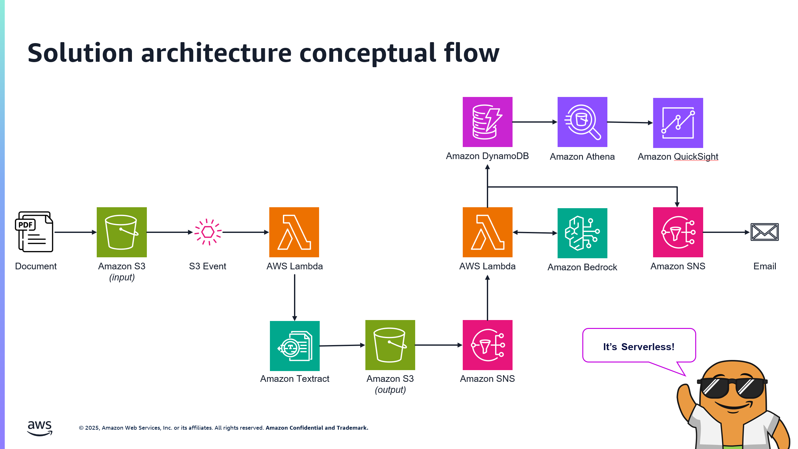

# Document Urgency Analysis Pipeline with AWS Services

This project implements an automated document processing pipeline that analyzes text documents to determine their urgency level using AWS services. It combines Amazon Textract for text extraction with AWS Bedrock's Large Language Models to provide intelligent document classification, helping organizations prioritize their document handling workflow.

The system processes documents uploaded to S3 through a two-stage pipeline. First, it extracts text content using Amazon Textract's OCR capabilities. Then, it analyzes the extracted text using AWS Bedrock's Claude LLM to classify documents as either "urgent" or "routine" based on sophisticated content analysis rules. The results are stored in DynamoDB for audit purposes and notifications are sent via SNS for immediate action.



## Repository Structure
```
.
└── src/
    ├── textract-processor/          # Lambda function for OCR text extraction
    │   ├── lambda_function.py       # Handles S3 events and initiates Textract jobs
    │   └── requirements.txt         # Python dependencies for Textract processing
    └── bedrock-processor/           # Lambda function for LLM analysis
        ├── lambda_function.py       # Processes Textract output and calls Bedrock
        └── requirements.txt         # Python dependencies for Bedrock integration
```

## Usage Instructions
### Prerequisites
- AWS Account with appropriate permissions
- Python 3.12 or later
- AWS CLI configured with appropriate credentials
- The following AWS services enabled:
  - AWS Lambda
  - Amazon S3
  - Amazon Textract
  - Amazon Bedrock
  - Amazon SNS
  - Amazon DynamoDB

### Installation

1. Clone the repository:
```bash
git clone [repository-url]
cd [repository-name]
```

2. Install required packages and .zip for Textract code Lambda deployment
```bash
# Zip up packages and lambda code for deployment
cd src/textract-processor
pip install -r requirements.txt -t package
cd package && zip -r ../lambda_package.zip . && cd ..
zip lambda_package.zip lambda_function.py
```

3. Install required packages and .zip for Bedrock code Lambda deployment
```bash
# Zip up packages and lambda code for deployment
cd src/bedrock-processor
pip install -r requirements.txt -t package
cd package && zip -r ../package.zip . && cd ..
zip lambda_package.zip lambda_function.py
```

4. Copy both zip files into an S3 bucket with seperate prefixes. Suggest the following structure
```ascii
S3Bucket
      |
      +--- textract-processor/lambda_package.zip
      +--- bedrock-processor/lambda_packag.zip
```


2. Upload a document to the input S3 bucket:
```bash
aws s3 cp sample-document.pdf s3://input-bucket-name/
```

3. Monitor the process through CloudWatch logs or SNS notifications.


### Troubleshooting

Common issues and solutions:

1. Textract Job Failures
- Problem: Textract job fails to start
- Solution: Check IAM roles and S3 bucket permissions
```bash
aws iam get-role --role-name TextractServiceRole
```

2. Bedrock Integration Issues
- Problem: LLM analysis timeout
- Solution: Increase Lambda timeout and memory
- Location of logs: CloudWatch Logs `/aws/lambda/bedrock-processor`

3. Missing Notifications
- Problem: No SNS notifications received
- Solution: Verify SNS topic subscriptions and permissions
```bash
aws sns list-subscriptions-by-topic --topic-arn <your-topic-arn>
```

## Data Flow
The system processes documents through a serverless pipeline that extracts text and performs intelligent analysis to determine document urgency.

```ascii
[S3 Upload] -> [Textract Lambda] -> [Textract Service] -> [Bedrock Lambda] -> [Bedrock LLM]
      |                                                           |
      |                                                           v
      +-----------------------------------------> [DynamoDB & SNS Notification]
```

Key Component Interactions:
1. S3 event triggers Textract Lambda when new documents are uploaded
2. Textract Lambda initiates asynchronous text extraction job
3. Textract completion triggers Bedrock Lambda via SNS
4. Bedrock Lambda retrieves extracted text and calls LLM for analysis
5. Results are stored in DynamoDB and notifications sent via SNS
6. Error handling and retries are managed at each step
7. Monitoring and logging through CloudWatch
8. Access control through IAM roles and policies
