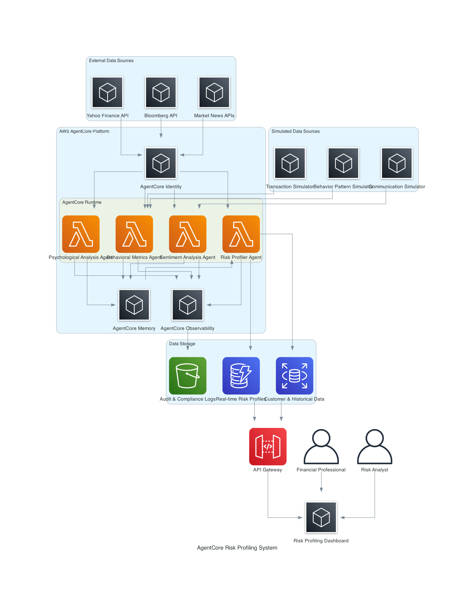
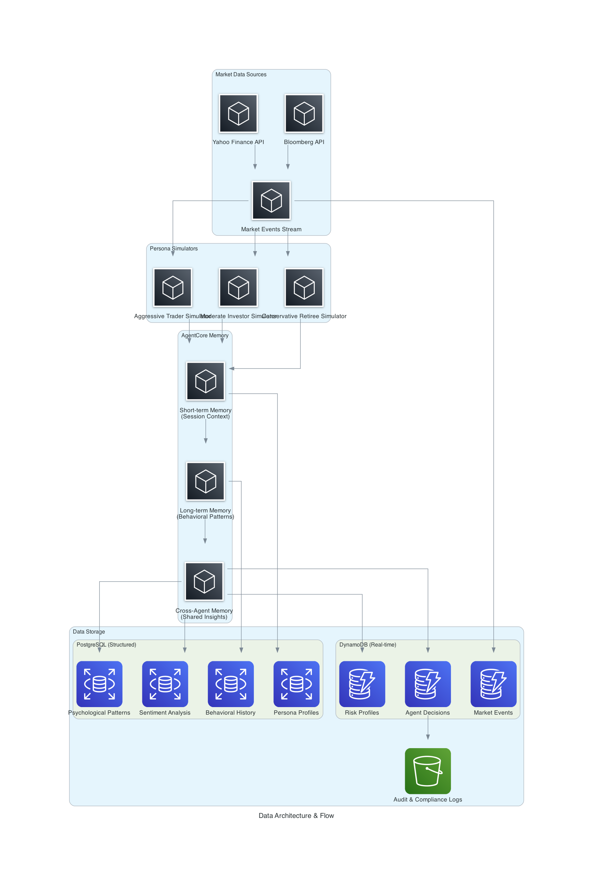

# Design Document

## Overview

The RiskAnalysisAdvisor is a comprehensive behavioral risk profiling prototype that demonstrates advanced risk assessment capabilities through real-time analysis of three key dimensions: behavioral metrics, psychological indicators, and sentiment/communications analysis. The system leverages AWS AgentCore to create an intelligent multi-agent architecture that moves beyond traditional static questionnaires to provide dynamic, behavior-driven risk profiling for financial decision-making.

### Key Design Principles

- **Agent-First Architecture**: Multi-agent system using AWS AgentCore for specialized analysis
- **Multi-Dimensional Analysis**: Integration of behavioral, psychological, and sentiment data
- **Real-Time Processing**: Continuous monitoring and dynamic risk profile updates
- **Explainable AI**: Transparent reasoning for all risk assessments with AgentCore Observability
- **Demonstration-Ready**: Optimized for customer showcases with simulated data
- **Compliance-First**: Built-in audit trails and privacy-preserving techniques
- **Session Isolation**: Secure processing of sensitive customer data

## System Architecture Overview

### High-Level Multi-Agent Architecture



### Technology Stack Alignment

The architecture leverages AWS AgentCore and the established technology stack:

- **AWS AgentCore Runtime**: Hosts all specialized analysis agents with session isolation
- **AWS AgentCore Memory**: Manages short-term and long-term behavioral patterns and insights
- **AWS AgentCore Identity**: Secure authentication for external API access and agent operations
- **AWS AgentCore Observability**: Comprehensive monitoring, tracing, and explainable AI capabilities
- **Strands Agent Framework**: Agent development framework integrated with AgentCore
- **Python 3.12**: All agent logic and data processing
- **Amazon DynamoDB**: Real-time risk profiles and session data
- **Amazon RDS PostgreSQL**: Customer profiles and historical behavioral data
- **Amazon S3**: Audit trails, compliance logs, and model artifacts
- **Streamlit**: Interactive dashboard for demonstration and analysis

### Agent Specialization Strategy

#### 1. Behavioral Metrics Agent (Requirement 1)
- **Purpose**: Analyze transaction patterns, frequency, amounts, and timing
- **Data Sources**: Simulated transaction data, platform interaction logs
- **Memory Usage**: Stores behavioral patterns in AgentCore Memory long-term storage
- **Output**: Behavioral risk indicators and pattern classifications

#### 2. Psychological Analysis Agent (Requirement 2)
- **Purpose**: Evaluate psychological indicators and cognitive biases
- **Data Sources**: Behavioral patterns from AgentCore Memory, market response data
- **Analysis**: Risk-seeking vs risk-averse behaviors, emotional stability, consistency patterns
- **Output**: Psychological risk indicators and behavioral confidence scores

#### 3. Sentiment Analysis Agent (Requirement 3)
- **Purpose**: Process communications for emotional states and risk comfort levels
- **Data Sources**: Simulated customer communications (text/voice)
- **Analysis**: Sentiment analysis, stress levels, anxiety patterns, confidence indicators
- **Output**: Communication-based risk indicators and emotional stability scores

#### 4. Risk Profiler Agent (Requirements 4, 5, 6)
- **Purpose**: Combine all three dimensions into comprehensive risk assessment
- **Data Sources**: Outputs from all other agents via AgentCore Memory
- **Analysis**: Risk tolerance and risk capacity calculation with confidence intervals
- **Output**: Comprehensive risk profiles with explanations and real-time updates

## Technical Design Details

### Data Architecture

#### Investor Persona Simulation Framework

The system will simulate three distinct investor personas to demonstrate behavioral risk profiling capabilities:

**1. Conservative Retiree (Age 65-75)**
- **Behavioral Patterns**: Low transaction frequency, preference for bonds/CDs, panic selling during market downturns
- **Psychological Profile**: High loss aversion, low risk tolerance, stability-focused
- **Communication Style**: Frequent anxiety-driven inquiries during volatility, seeks reassurance
- **Market Response**: Immediate risk reduction during market stress, slow recovery confidence

**2. Aggressive Young Trader (Age 25-35)**
- **Behavioral Patterns**: High transaction frequency, options trading, momentum following
- **Psychological Profile**: Overconfidence bias, high risk tolerance, growth-focused
- **Communication Style**: Confident language, seeks high-return opportunities
- **Market Response**: Increases risk during volatility, sees downturns as opportunities

**3. Moderate Middle-Aged Investor (Age 45-55)**
- **Behavioral Patterns**: Balanced portfolio adjustments, dollar-cost averaging, periodic rebalancing
- **Psychological Profile**: Moderate risk tolerance, long-term focused, evidence-based decisions
- **Communication Style**: Analytical questions, seeks detailed explanations
- **Market Response**: Measured adjustments, maintains long-term strategy with tactical modifications

#### Data Models and Storage Strategy



**AgentCore Memory Schema:**
```python
# Short-term Memory (Session Context)
{
    "session_id": "uuid",
    "persona_type": "conservative_retiree|aggressive_trader|moderate_investor",
    "current_market_context": {
        "volatility_index": float,
        "market_trend": "bullish|bearish|neutral",
        "recent_events": [market_event_objects]
    },
    "session_behaviors": [behavioral_event_objects],
    "active_analysis": {
        "behavioral_score": float,
        "psychological_indicators": dict,
        "sentiment_score": float
    }
}

# Long-term Memory (Behavioral Patterns)
{
    "persona_id": "uuid",
    "behavioral_patterns": {
        "transaction_frequency": "low|medium|high",
        "risk_taking_consistency": float,
        "market_response_patterns": dict,
        "emotional_stability_score": float
    },
    "psychological_profile": {
        "risk_tolerance": "conservative|moderate|aggressive",
        "bias_indicators": [bias_objects],
        "confidence_level": float
    },
    "historical_insights": {
        "risk_capacity_evolution": [time_series_data],
        "behavioral_triggers": [trigger_objects]
    }
}
```

**DynamoDB Tables:**
```python
# Risk Profiles Table
{
    "persona_id": "partition_key",
    "timestamp": "sort_key",
    "risk_tolerance_score": float,
    "risk_capacity_score": float,
    "confidence_interval": {"lower": float, "upper": float},
    "contributing_factors": {
        "behavioral_weight": float,
        "psychological_weight": float,
        "sentiment_weight": float
    },
    "explanation": {
        "summary": "business_friendly_explanation",
        "detailed_reasoning": [reasoning_objects],
        "recommendations": [recommendation_objects]
    }
}

# Agent Decisions Table
{
    "decision_id": "partition_key",
    "agent_type": "behavioral|psychological|sentiment|risk_profiler",
    "timestamp": "sort_key",
    "input_data": dict,
    "decision_logic": "step_by_step_reasoning",
    "output_data": dict,
    "confidence_score": float,
    "explanation": "human_readable_reasoning"
}
```

**PostgreSQL Schema:**
```sql
-- Persona Profiles
CREATE TABLE persona_profiles (
    persona_id UUID PRIMARY KEY,
    persona_type VARCHAR(50) NOT NULL,
    age_range VARCHAR(20),
    investment_experience VARCHAR(20),
    financial_goals TEXT[],
    created_at TIMESTAMP DEFAULT NOW()
);

-- Behavioral History
CREATE TABLE behavioral_history (
    id UUID PRIMARY KEY,
    persona_id UUID REFERENCES persona_profiles(persona_id),
    behavior_type VARCHAR(50),
    behavior_data JSONB,
    market_context JSONB,
    timestamp TIMESTAMP DEFAULT NOW()
);

-- Psychological Patterns
CREATE TABLE psychological_patterns (
    id UUID PRIMARY KEY,
    persona_id UUID REFERENCES persona_profiles(persona_id),
    pattern_type VARCHAR(50),
    pattern_strength FLOAT,
    evidence JSONB,
    identified_at TIMESTAMP DEFAULT NOW()
);
```

### Agent Architecture and Interactions

#### 1. Behavioral Metrics Agent

**Purpose**: Analyze transaction patterns, frequency, and market response behaviors

**AgentCore Runtime Configuration:**
```python
from strands_agent import Agent
from aws_agentcore import Runtime, Memory, Identity

class BehavioralMetricsAgent(Agent):
    def __init__(self):
        super().__init__(name="behavioral_metrics_agent")
        self.memory = Memory.get_instance()
        self.identity = Identity.get_agent_identity("behavioral_agent")
        
    async def analyze_behavioral_patterns(self, persona_data, market_context):
        """Analyze behavioral metrics with explainable reasoning"""
        
        # Retrieve historical patterns from long-term memory
        historical_patterns = await self.memory.get_long_term(
            key=f"behavioral_patterns_{persona_data['persona_id']}"
        )
        
        # Analyze current behavior against patterns
        analysis_result = {
            "transaction_frequency_score": self._analyze_transaction_frequency(persona_data),
            "market_response_score": self._analyze_market_response(persona_data, market_context),
            "consistency_score": self._analyze_consistency(persona_data, historical_patterns),
            "behavioral_risk_indicator": 0.0,
            "reasoning": []
        }
        
        # Calculate composite behavioral risk indicator
        analysis_result["behavioral_risk_indicator"] = self._calculate_composite_score(analysis_result)
        
        # Generate explainable reasoning
        analysis_result["reasoning"] = self._generate_behavioral_reasoning(analysis_result, persona_data)
        
        # Store insights in cross-agent memory for other agents
        await self.memory.store_cross_agent(
            key=f"behavioral_analysis_{persona_data['persona_id']}",
            data=analysis_result
        )
        
        return analysis_result
    
    def _generate_behavioral_reasoning(self, analysis, persona_data):
        """Generate human-readable explanations for behavioral analysis"""
        reasoning = []
        
        if analysis["transaction_frequency_score"] > 0.7:
            reasoning.append({
                "factor": "High Transaction Frequency",
                "impact": "Increases risk tolerance indicator",
                "explanation": f"Customer shows {persona_data['transaction_count']} transactions this month, indicating active trading behavior typical of higher risk tolerance."
            })
        
        if analysis["market_response_score"] < 0.3:
            reasoning.append({
                "factor": "Conservative Market Response",
                "impact": "Decreases risk tolerance indicator", 
                "explanation": "Customer reduced positions during recent market volatility, indicating preference for capital preservation over growth."
            })
            
        return reasoning
```

#### 2. Psychological Analysis Agent

**Purpose**: Evaluate psychological indicators, biases, and emotional stability

```python
class PsychologicalAnalysisAgent(Agent):
    def __init__(self):
        super().__init__(name="psychological_analysis_agent")
        self.memory = Memory.get_instance()
        self.bias_detectors = {
            "overconfidence": OverconfidenceBiasDetector(),
            "loss_aversion": LossAversionDetector(),
            "herding": HerdingBiasDetector(),
            "recency": RecencyBiasDetector()
        }
        
    async def analyze_psychological_indicators(self, persona_id):
        """Analyze psychological patterns with detailed explanations"""
        
        # Get behavioral data from cross-agent memory
        behavioral_data = await self.memory.get_cross_agent(
            key=f"behavioral_analysis_{persona_id}"
        )
        
        # Get historical psychological patterns
        historical_psych = await self.memory.get_long_term(
            key=f"psychological_patterns_{persona_id}"
        )
        
        analysis_result = {
            "bias_indicators": {},
            "emotional_stability_score": 0.0,
            "risk_consistency_score": 0.0,
            "psychological_risk_tolerance": 0.0,
            "reasoning": []
        }
        
        # Detect psychological biases
        for bias_name, detector in self.bias_detectors.items():
            bias_result = detector.detect(behavioral_data, historical_psych)
            analysis_result["bias_indicators"][bias_name] = bias_result
            
        # Calculate psychological scores
        analysis_result["emotional_stability_score"] = self._calculate_emotional_stability(
            behavioral_data, analysis_result["bias_indicators"]
        )
        
        analysis_result["psychological_risk_tolerance"] = self._calculate_psychological_risk_tolerance(
            analysis_result
        )
        
        # Generate detailed reasoning
        analysis_result["reasoning"] = self._generate_psychological_reasoning(analysis_result)
        
        # Store in cross-agent memory
        await self.memory.store_cross_agent(
            key=f"psychological_analysis_{persona_id}",
            data=analysis_result
        )
        
        return analysis_result
    
    def _generate_psychological_reasoning(self, analysis):
        """Generate explanations for psychological analysis"""
        reasoning = []
        
        for bias_name, bias_data in analysis["bias_indicators"].items():
            if bias_data["strength"] > 0.5:
                reasoning.append({
                    "factor": f"{bias_name.title()} Bias Detected",
                    "strength": bias_data["strength"],
                    "impact": bias_data["risk_impact"],
                    "explanation": bias_data["explanation"],
                    "evidence": bias_data["evidence"]
                })
                
        if analysis["emotional_stability_score"] < 0.4:
            reasoning.append({
                "factor": "Low Emotional Stability",
                "impact": "May lead to impulsive decisions during market stress",
                "explanation": "Analysis shows inconsistent decision patterns during volatile periods, suggesting emotional rather than rational decision-making."
            })
            
        return reasoning
```

#### 3. Sentiment Analysis Agent

**Purpose**: Process communications for emotional states and risk comfort levels

```python
class SentimentAnalysisAgent(Agent):
    def __init__(self):
        super().__init__(name="sentiment_analysis_agent")
        self.memory = Memory.get_instance()
        self.nlp_processor = SentimentProcessor()
        self.emotion_analyzer = EmotionAnalyzer()
        
    async def analyze_communication_sentiment(self, persona_id, communications):
        """Analyze sentiment and emotional indicators from communications"""
        
        analysis_result = {
            "overall_sentiment": 0.0,  # -1 to 1 scale
            "emotional_indicators": {},
            "stress_level": 0.0,
            "confidence_level": 0.0,
            "risk_comfort_score": 0.0,
            "reasoning": []
        }
        
        # Process each communication
        sentiment_scores = []
        emotional_patterns = []
        
        for comm in communications:
            # Sentiment analysis
            sentiment = self.nlp_processor.analyze_sentiment(comm["text"])
            sentiment_scores.append(sentiment)
            
            # Emotion detection
            emotions = self.emotion_analyzer.detect_emotions(comm["text"])
            emotional_patterns.append(emotions)
            
        # Calculate aggregate scores
        analysis_result["overall_sentiment"] = np.mean(sentiment_scores)
        analysis_result["emotional_indicators"] = self._aggregate_emotions(emotional_patterns)
        analysis_result["stress_level"] = self._calculate_stress_level(emotional_patterns)
        analysis_result["confidence_level"] = self._calculate_confidence_level(sentiment_scores, emotional_patterns)
        analysis_result["risk_comfort_score"] = self._calculate_risk_comfort(analysis_result)
        
        # Generate reasoning
        analysis_result["reasoning"] = self._generate_sentiment_reasoning(analysis_result, communications)
        
        # Store in cross-agent memory
        await self.memory.store_cross_agent(
            key=f"sentiment_analysis_{persona_id}",
            data=analysis_result
        )
        
        return analysis_result
    
    def _generate_sentiment_reasoning(self, analysis, communications):
        """Generate explanations for sentiment analysis"""
        reasoning = []
        
        if analysis["stress_level"] > 0.7:
            reasoning.append({
                "factor": "High Stress Indicators",
                "impact": "Suggests lower risk capacity during current period",
                "explanation": "Communications show elevated stress language and anxiety markers, indicating potential for emotional decision-making.",
                "examples": [comm["text"][:100] + "..." for comm in communications[:2]]
            })
            
        if analysis["confidence_level"] > 0.8:
            reasoning.append({
                "factor": "High Confidence Language",
                "impact": "May indicate overconfidence bias affecting risk perception",
                "explanation": "Communications demonstrate very high confidence levels which may lead to underestimating risks."
            })
            
        return reasoning
```

#### 4. Risk Profiler Agent

**Purpose**: Combine all three dimensions into comprehensive risk assessment

```python
class RiskProfilerAgent(Agent):
    def __init__(self):
        super().__init__(name="risk_profiler_agent")
        self.memory = Memory.get_instance()
        self.risk_calculator = RiskCalculator()
        
    async def generate_comprehensive_risk_profile(self, persona_id):
        """Generate comprehensive risk profile with detailed explanations"""
        
        # Retrieve analysis from all other agents
        behavioral_analysis = await self.memory.get_cross_agent(f"behavioral_analysis_{persona_id}")
        psychological_analysis = await self.memory.get_cross_agent(f"psychological_analysis_{persona_id}")
        sentiment_analysis = await self.memory.get_cross_agent(f"sentiment_analysis_{persona_id}")
        
        # Calculate risk tolerance and capacity
        risk_profile = {
            "persona_id": persona_id,
            "timestamp": datetime.utcnow().isoformat(),
            "risk_tolerance": {
                "score": 0.0,
                "category": "conservative|moderate|aggressive",
                "confidence_interval": {"lower": 0.0, "upper": 0.0}
            },
            "risk_capacity": {
                "score": 0.0,
                "category": "low|medium|high",
                "confidence_interval": {"lower": 0.0, "upper": 0.0}
            },
            "dimensional_contributions": {
                "behavioral_weight": 0.0,
                "psychological_weight": 0.0,
                "sentiment_weight": 0.0
            },
            "comprehensive_explanation": {
                "executive_summary": "",
                "detailed_reasoning": [],
                "risk_factors": [],
                "recommendations": []
            }
        }
        
        # Calculate risk tolerance (psychological comfort with risk)
        risk_profile["risk_tolerance"] = self.risk_calculator.calculate_risk_tolerance(
            behavioral_analysis, psychological_analysis, sentiment_analysis
        )
        
        # Calculate risk capacity (ability to take risk)
        risk_profile["risk_capacity"] = self.risk_calculator.calculate_risk_capacity(
            behavioral_analysis, psychological_analysis, sentiment_analysis
        )
        
        # Generate comprehensive explanations
        risk_profile["comprehensive_explanation"] = self._generate_comprehensive_explanation(
            risk_profile, behavioral_analysis, psychological_analysis, sentiment_analysis
        )
        
        # Store final risk profile
        await self._store_risk_profile(risk_profile)
        
        return risk_profile
    
    def _generate_comprehensive_explanation(self, risk_profile, behavioral, psychological, sentiment):
        """Generate detailed, business-friendly explanations"""
        
        explanation = {
            "executive_summary": "",
            "detailed_reasoning": [],
            "risk_factors": [],
            "recommendations": []
        }
        
        # Executive summary
        tolerance_category = risk_profile["risk_tolerance"]["category"]
        capacity_category = risk_profile["risk_capacity"]["category"]
        
        explanation["executive_summary"] = f"""
        Based on comprehensive behavioral analysis, this customer demonstrates {tolerance_category} 
        risk tolerance with {capacity_category} risk capacity. The assessment combines behavioral 
        patterns ({behavioral['behavioral_risk_indicator']:.2f}), psychological indicators 
        ({psychological['psychological_risk_tolerance']:.2f}), and communication sentiment 
        ({sentiment['risk_comfort_score']:.2f}) to provide a holistic risk profile.
        """
        
        # Detailed reasoning from each dimension
        explanation["detailed_reasoning"].extend([
            {
                "dimension": "Behavioral Analysis",
                "contribution": risk_profile["dimensional_contributions"]["behavioral_weight"],
                "key_findings": behavioral["reasoning"]
            },
            {
                "dimension": "Psychological Analysis", 
                "contribution": risk_profile["dimensional_contributions"]["psychological_weight"],
                "key_findings": psychological["reasoning"]
            },
            {
                "dimension": "Sentiment Analysis",
                "contribution": risk_profile["dimensional_contributions"]["sentiment_weight"],
                "key_findings": sentiment["reasoning"]
            }
        ])
        
        # Risk factors and recommendations
        explanation["risk_factors"] = self._identify_risk_factors(behavioral, psychological, sentiment)
        explanation["recommendations"] = self._generate_recommendations(risk_profile, explanation["risk_factors"])
        
        return explanation
```

### Event-Driven Market Simulation

#### Market Event Processing System

```python
class MarketEventProcessor:
    def __init__(self):
        self.yahoo_client = YahooFinanceClient()
        self.bloomberg_client = BloombergClient()
        self.event_classifier = MarketEventClassifier()
        
    async def process_market_events(self):
        """Process real market events and trigger persona responses"""
        
        # Fetch current market data
        market_data = await self._fetch_market_data()
        
        # Classify market events
        events = self.event_classifier.classify_events(market_data)
        
        # Trigger persona-specific responses
        for event in events:
            await self._trigger_persona_responses(event)
            
    async def _fetch_market_data(self):
        """Fetch data from Yahoo Finance and Bloomberg APIs"""
        return {
            "indices": await self.yahoo_client.get_indices(),
            "volatility": await self.yahoo_client.get_vix(),
            "news": await self.bloomberg_client.get_market_news(),
            "economic_indicators": await self.yahoo_client.get_economic_data()
        }
    
    async def _trigger_persona_responses(self, market_event):
        """Trigger different responses based on persona type"""
        
        persona_responses = {
            "conservative_retiree": self._generate_conservative_response(market_event),
            "aggressive_trader": self._generate_aggressive_response(market_event),
            "moderate_investor": self._generate_moderate_response(market_event)
        }
        
        # Simulate behavioral changes for each persona
        for persona_type, response in persona_responses.items():
            await self._simulate_behavioral_change(persona_type, response, market_event)
```

### Near Real-Time Processing Architecture

#### Processing Pipeline with 1-2 Minute Cycles

```python
class RealTimeProcessingOrchestrator:
    def __init__(self):
        self.processing_interval = 90  # 1.5 minutes
        self.agents = {
            "behavioral": BehavioralMetricsAgent(),
            "psychological": PsychologicalAnalysisAgent(),
            "sentiment": SentimentAnalysisAgent(),
            "risk_profiler": RiskProfilerAgent()
        }
        
    async def start_real_time_processing(self):
        """Start near real-time processing loop"""
        while True:
            try:
                # Process all active personas
                active_personas = await self._get_active_personas()
                
                for persona_id in active_personas:
                    await self._process_persona_cycle(persona_id)
                    
                # Wait for next cycle
                await asyncio.sleep(self.processing_interval)
                
            except Exception as e:
                logger.error(f"Processing cycle error: {e}")
                await asyncio.sleep(30)  # Short retry delay
    
    async def _process_persona_cycle(self, persona_id):
        """Process complete analysis cycle for a persona"""
        
        start_time = time.time()
        
        try:
            # Step 1: Behavioral analysis
            behavioral_result = await self.agents["behavioral"].analyze_behavioral_patterns(
                persona_id
            )
            
            # Step 2: Psychological analysis (uses behavioral results)
            psychological_result = await self.agents["psychological"].analyze_psychological_indicators(
                persona_id
            )
            
            # Step 3: Sentiment analysis
            sentiment_result = await self.agents["sentiment"].analyze_communication_sentiment(
                persona_id
            )
            
            # Step 4: Comprehensive risk profiling
            risk_profile = await self.agents["risk_profiler"].generate_comprehensive_risk_profile(
                persona_id
            )
            
            # Log processing time
            processing_time = time.time() - start_time
            logger.info(f"Persona {persona_id} processed in {processing_time:.2f} seconds")
            
            # Trigger dashboard update
            await self._trigger_dashboard_update(persona_id, risk_profile)
            
        except Exception as e:
            logger.error(f"Error processing persona {persona_id}: {e}")
```

This comprehensive design provides the foundation for a sophisticated behavioral risk profiling system that demonstrates real-time analysis capabilities with full explainability. The multi-agent architecture using AWS AgentCore ensures scalable, secure, and transparent processing of the three analysis dimensions.

Would you like me to continue with the remaining sections (User Interface Strategy, Testing Strategy, and Implementation Approach)?
## Use
r Interface Strategy

### Streamlit Dashboard Design

The dashboard focuses on real-time risk profile updates with detailed explanations, optimized for customer demonstrations.

#### Dashboard Layout and Components

```python
import streamlit as st
import plotly.express as px
import plotly.graph_objects as go
from datetime import datetime, timedelta

class RiskProfilingDashboard:
    def __init__(self):
        self.api_client = DashboardAPIClient()
        self.personas = ["conservative_retiree", "aggressive_trader", "moderate_investor"]
        
    def render_main_dashboard(self):
        """Main dashboard with real-time updates and detailed explanations"""
        
        st.title("Behavioral Risk Profiling System")
        st.markdown("Real-time risk assessment through behavioral, psychological, and sentiment analysis")
        
        # Persona selection
        selected_persona = st.selectbox(
            "Select Investor Persona",
            self.personas,
            format_func=self._format_persona_name
        )
        
        # Real-time risk profile display
        self._render_risk_profile_section(selected_persona)
        
        # Detailed explanations section
        self._render_explanations_section(selected_persona)
        
        # Market event simulation controls
        self._render_market_simulation_section()
        
    def _render_risk_profile_section(self, persona_id):
        """Real-time risk profile with visual indicators"""
        
        st.header("Current Risk Profile")
        
        # Get latest risk profile
        risk_profile = self.api_client.get_risk_profile(persona_id)
        
        # Risk tolerance and capacity gauges
        col1, col2 = st.columns(2)
        
        with col1:
            st.subheader("Risk Tolerance")
            tolerance_fig = self._create_risk_gauge(
                risk_profile["risk_tolerance"]["score"],
                "Risk Tolerance",
                risk_profile["risk_tolerance"]["category"]
            )
            st.plotly_chart(tolerance_fig, use_container_width=True)
            
        with col2:
            st.subheader("Risk Capacity")
            capacity_fig = self._create_risk_gauge(
                risk_profile["risk_capacity"]["score"],
                "Risk Capacity", 
                risk_profile["risk_capacity"]["category"]
            )
            st.plotly_chart(capacity_fig, use_container_width=True)
        
        # Confidence intervals
        st.subheader("Assessment Confidence")
        tolerance_conf = risk_profile["risk_tolerance"]["confidence_interval"]
        capacity_conf = risk_profile["risk_capacity"]["confidence_interval"]
        
        st.metric(
            "Risk Tolerance Confidence",
            f"{tolerance_conf['lower']:.2f} - {tolerance_conf['upper']:.2f}",
            delta=f"±{(tolerance_conf['upper'] - tolerance_conf['lower'])/2:.2f}"
        )
        
        st.metric(
            "Risk Capacity Confidence", 
            f"{capacity_conf['lower']:.2f} - {capacity_conf['upper']:.2f}",
            delta=f"±{(capacity_conf['upper'] - capacity_conf['lower'])/2:.2f}"
        )
        
    def _render_explanations_section(self, persona_id):
        """Detailed explanations of risk assessment reasoning"""
        
        st.header("Risk Assessment Reasoning")
        
        risk_profile = self.api_client.get_risk_profile(persona_id)
        explanation = risk_profile["comprehensive_explanation"]
        
        # Executive summary
        st.subheader("Executive Summary")
        st.write(explanation["executive_summary"])
        
        # Dimensional analysis breakdown
        st.subheader("Analysis Breakdown by Dimension")
        
        for dimension_analysis in explanation["detailed_reasoning"]:
            with st.expander(f"{dimension_analysis['dimension']} (Weight: {dimension_analysis['contribution']:.1%})"):
                
                for finding in dimension_analysis["key_findings"]:
                    st.markdown(f"**{finding['factor']}**")
                    st.write(f"Impact: {finding['impact']}")
                    st.write(f"Explanation: {finding['explanation']}")
                    
                    if 'evidence' in finding:
                        st.json(finding['evidence'])
                    
                    st.divider()
        
        # Risk factors and recommendations
        col1, col2 = st.columns(2)
        
        with col1:
            st.subheader("Key Risk Factors")
            for factor in explanation["risk_factors"]:
                st.warning(f"**{factor['factor']}**: {factor['description']}")
                
        with col2:
            st.subheader("Recommendations")
            for rec in explanation["recommendations"]:
                st.info(f"**{rec['action']}**: {rec['rationale']}")
    
    def _render_market_simulation_section(self):
        """Market event simulation controls for demonstration"""
        
        st.header("Market Event Simulation")
        
        col1, col2, col3 = st.columns(3)
        
        with col1:
            if st.button("Simulate Market Volatility"):
                self._trigger_market_event("high_volatility")
                st.success("Market volatility event triggered")
                
        with col2:
            if st.button("Simulate Economic News"):
                self._trigger_market_event("economic_news")
                st.success("Economic news event triggered")
                
        with col3:
            if st.button("Simulate Market Recovery"):
                self._trigger_market_event("market_recovery")
                st.success("Market recovery event triggered")
        
        # Real-time event log
        st.subheader("Recent Market Events")
        events = self.api_client.get_recent_market_events()
        
        for event in events[-5:]:  # Show last 5 events
            st.text(f"{event['timestamp']}: {event['description']}")
    
    def _create_risk_gauge(self, score, title, category):
        """Create risk gauge visualization"""
        
        fig = go.Figure(go.Indicator(
            mode = "gauge+number+delta",
            value = score,
            domain = {'x': [0, 1], 'y': [0, 1]},
            title = {'text': title},
            delta = {'reference': 0.5},
            gauge = {
                'axis': {'range': [None, 1]},
                'bar': {'color': self._get_risk_color(score)},
                'steps': [
                    {'range': [0, 0.33], 'color': "lightgreen"},
                    {'range': [0.33, 0.66], 'color': "yellow"},
                    {'range': [0.66, 1], 'color': "lightcoral"}
                ],
                'threshold': {
                    'line': {'color': "red", 'width': 4},
                    'thickness': 0.75,
                    'value': 0.8
                }
            }
        ))
        
        fig.add_annotation(
            x=0.5, y=0.1,
            text=f"Category: {category.title()}",
            showarrow=False,
            font=dict(size=14)
        )
        
        return fig
    
    def _get_risk_color(self, score):
        """Get color based on risk score"""
        if score < 0.33:
            return "green"
        elif score < 0.66:
            return "orange"
        else:
            return "red"
    
    def _trigger_market_event(self, event_type):
        """Trigger market event simulation"""
        self.api_client.trigger_market_event(event_type)
        
        # Auto-refresh after event
        time.sleep(2)
        st.rerun()
```

#### Real-Time Update Mechanism

```python
class RealTimeUpdater:
    def __init__(self):
        self.update_interval = 90  # 1.5 minutes
        
    def setup_auto_refresh(self):
        """Setup automatic dashboard refresh for near real-time updates"""
        
        # Check for updates every 30 seconds
        if 'last_update' not in st.session_state:
            st.session_state.last_update = datetime.now()
            
        current_time = datetime.now()
        time_diff = (current_time - st.session_state.last_update).total_seconds()
        
        if time_diff >= 30:  # Check every 30 seconds
            # Check if new analysis is available
            if self._has_new_analysis():
                st.session_state.last_update = current_time
                st.rerun()
                
        # Display last update time
        st.sidebar.text(f"Last Updated: {st.session_state.last_update.strftime('%H:%M:%S')}")
        
        # Manual refresh button
        if st.sidebar.button("Refresh Now"):
            st.rerun()
    
    def _has_new_analysis(self):
        """Check if new risk analysis is available"""
        # Implementation would check for new data in DynamoDB
        return self.api_client.check_for_updates()
```

## Testing Strategy

### Testing Levels and Approaches

#### Unit Testing for Individual Agents

```python
import pytest
import asyncio
from unittest.mock import Mock, AsyncMock, patch
from agents.behavioral_analysis import BehavioralMetricsAgent
from agents.psychological_analysis import PsychologicalAnalysisAgent

class TestBehavioralMetricsAgent:
    @pytest.fixture
    def agent(self):
        return BehavioralMetricsAgent()
    
    @pytest.fixture
    def mock_persona_data(self):
        return {
            "persona_id": "test_conservative_retiree",
            "persona_type": "conservative_retiree",
            "transaction_count": 5,
            "avg_transaction_size": 1000,
            "market_response_data": {
                "volatility_reactions": [0.2, 0.1, 0.3],
                "position_changes": [-0.1, -0.2, 0.0]
            }
        }
    
    @pytest.mark.asyncio
    async def test_analyze_behavioral_patterns(self, agent, mock_persona_data):
        """Test behavioral pattern analysis with explainable reasoning"""
        
        # Mock AgentCore Memory
        with patch.object(agent.memory, 'get_long_term') as mock_long_term:
            mock_long_term.return_value = {
                "historical_transaction_frequency": 0.3,
                "historical_market_responses": [0.2, 0.2, 0.1]
            }
            
            with patch.object(agent.memory, 'store_cross_agent') as mock_store:
                # Execute analysis
                result = await agent.analyze_behavioral_patterns(
                    mock_persona_data, 
                    {"volatility_index": 0.25}
                )
                
                # Verify analysis results
                assert "behavioral_risk_indicator" in result
                assert "reasoning" in result
                assert len(result["reasoning"]) > 0
                
                # Verify reasoning quality
                reasoning = result["reasoning"][0]
                assert "factor" in reasoning
                assert "impact" in reasoning
                assert "explanation" in reasoning
                
                # Verify memory storage
                mock_store.assert_called_once()
    
    def test_generate_behavioral_reasoning(self, agent):
        """Test reasoning generation for behavioral analysis"""
        
        analysis_result = {
            "transaction_frequency_score": 0.8,
            "market_response_score": 0.2,
            "consistency_score": 0.6
        }
        
        persona_data = {"transaction_count": 25}
        
        reasoning = agent._generate_behavioral_reasoning(analysis_result, persona_data)
        
        # Verify reasoning structure
        assert len(reasoning) >= 1
        assert reasoning[0]["factor"] == "High Transaction Frequency"
        assert "explanation" in reasoning[0]
        assert "25 transactions" in reasoning[0]["explanation"]

class TestPsychologicalAnalysisAgent:
    @pytest.fixture
    def agent(self):
        return PsychologicalAnalysisAgent()
    
    @pytest.mark.asyncio
    async def test_bias_detection(self, agent):
        """Test psychological bias detection with explanations"""
        
        mock_behavioral_data = {
            "transaction_frequency_score": 0.9,
            "market_response_score": 0.8,
            "consistency_score": 0.3
        }
        
        with patch.object(agent.memory, 'get_cross_agent') as mock_cross_agent:
            mock_cross_agent.return_value = mock_behavioral_data
            
            with patch.object(agent.memory, 'get_long_term') as mock_long_term:
                mock_long_term.return_value = {"historical_biases": []}
                
                result = await agent.analyze_psychological_indicators("test_persona")
                
                # Verify bias detection
                assert "bias_indicators" in result
                assert "overconfidence" in result["bias_indicators"]
                
                # Verify reasoning generation
                assert "reasoning" in result
                assert len(result["reasoning"]) > 0
```

#### Integration Testing for Agent Interactions

```python
class TestAgentIntegration:
    @pytest.fixture
    def agent_orchestrator(self):
        return RealTimeProcessingOrchestrator()
    
    @pytest.mark.asyncio
    async def test_complete_analysis_pipeline(self, agent_orchestrator):
        """Test complete analysis pipeline from behavioral to risk profiling"""
        
        persona_id = "test_integration_persona"
        
        # Mock external dependencies
        with patch('agents.behavioral_analysis.BehavioralMetricsAgent') as mock_behavioral:
            with patch('agents.psychological_analysis.PsychologicalAnalysisAgent') as mock_psychological:
                with patch('agents.sentiment_analysis.SentimentAnalysisAgent') as mock_sentiment:
                    with patch('agents.risk_profiler.RiskProfilerAgent') as mock_profiler:
                        
                        # Setup mock returns
                        mock_behavioral.return_value.analyze_behavioral_patterns.return_value = {
                            "behavioral_risk_indicator": 0.6,
                            "reasoning": [{"factor": "test", "explanation": "test"}]
                        }
                        
                        mock_psychological.return_value.analyze_psychological_indicators.return_value = {
                            "psychological_risk_tolerance": 0.7,
                            "reasoning": [{"factor": "test", "explanation": "test"}]
                        }
                        
                        mock_sentiment.return_value.analyze_communication_sentiment.return_value = {
                            "risk_comfort_score": 0.5,
                            "reasoning": [{"factor": "test", "explanation": "test"}]
                        }
                        
                        mock_profiler.return_value.generate_comprehensive_risk_profile.return_value = {
                            "risk_tolerance": {"score": 0.65, "category": "moderate"},
                            "risk_capacity": {"score": 0.55, "category": "medium"},
                            "comprehensive_explanation": {"executive_summary": "test"}
                        }
                        
                        # Execute pipeline
                        await agent_orchestrator._process_persona_cycle(persona_id)
                        
                        # Verify all agents were called
                        mock_behavioral.return_value.analyze_behavioral_patterns.assert_called_once()
                        mock_psychological.return_value.analyze_psychological_indicators.assert_called_once()
                        mock_sentiment.return_value.analyze_communication_sentiment.assert_called_once()
                        mock_profiler.return_value.generate_comprehensive_risk_profile.assert_called_once()
```

#### End-to-End Testing for Complete Workflows

```python
class TestEndToEndWorkflows:
    @pytest.mark.asyncio
    async def test_market_event_response_workflow(self):
        """Test complete workflow from market event to risk profile update"""
        
        # Setup test environment
        market_processor = MarketEventProcessor()
        orchestrator = RealTimeProcessingOrchestrator()
        
        # Mock external APIs
        with patch.object(market_processor.yahoo_client, 'get_indices') as mock_yahoo:
            mock_yahoo.return_value = {"VIX": 25.5, "SPY": 450.0}
            
            # Trigger market event
            await market_processor.process_market_events()
            
            # Wait for processing
            await asyncio.sleep(2)
            
            # Verify risk profiles were updated
            for persona_type in ["conservative_retiree", "aggressive_trader", "moderate_investor"]:
                risk_profile = await self._get_risk_profile(persona_type)
                assert risk_profile is not None
                assert "comprehensive_explanation" in risk_profile
                assert len(risk_profile["comprehensive_explanation"]["detailed_reasoning"]) == 3
    
    def test_dashboard_real_time_updates(self):
        """Test dashboard real-time update functionality"""
        
        # Setup Streamlit test environment
        with patch('streamlit.rerun') as mock_rerun:
            dashboard = RiskProfilingDashboard()
            updater = RealTimeUpdater()
            
            # Mock new analysis available
            with patch.object(updater, '_has_new_analysis', return_value=True):
                updater.setup_auto_refresh()
                
                # Verify rerun was called
                mock_rerun.assert_called_once()
```

#### Performance Testing for Near Real-Time Processing

```python
class TestPerformanceRequirements:
    @pytest.mark.asyncio
    async def test_processing_time_requirements(self):
        """Test that processing meets near real-time requirements (1-2 minutes)"""
        
        orchestrator = RealTimeProcessingOrchestrator()
        persona_id = "performance_test_persona"
        
        start_time = time.time()
        
        # Process complete cycle
        await orchestrator._process_persona_cycle(persona_id)
        
        processing_time = time.time() - start_time
        
        # Verify processing time is within requirements
        assert processing_time < 120, f"Processing took {processing_time:.2f}s, exceeds 2-minute requirement"
        
        # Log performance metrics
        logger.info(f"Processing completed in {processing_time:.2f} seconds")
    
    @pytest.mark.asyncio
    async def test_concurrent_persona_processing(self):
        """Test processing multiple personas concurrently"""
        
        orchestrator = RealTimeProcessingOrchestrator()
        personas = ["conservative_retiree", "aggressive_trader", "moderate_investor"]
        
        start_time = time.time()
        
        # Process all personas concurrently
        tasks = [orchestrator._process_persona_cycle(persona) for persona in personas]
        await asyncio.gather(*tasks)
        
        total_time = time.time() - start_time
        
        # Verify concurrent processing is efficient
        assert total_time < 150, f"Concurrent processing took {total_time:.2f}s, should be under 2.5 minutes"
```

### Test Data Management

#### Simulated Data Generation for Testing

```python
class TestDataGenerator:
    def __init__(self):
        self.personas = {
            "conservative_retiree": {
                "age_range": "65-75",
                "transaction_frequency": "low",
                "risk_tolerance": "conservative"
            },
            "aggressive_trader": {
                "age_range": "25-35", 
                "transaction_frequency": "high",
                "risk_tolerance": "aggressive"
            },
            "moderate_investor": {
                "age_range": "45-55",
                "transaction_frequency": "medium",
                "risk_tolerance": "moderate"
            }
        }
    
    def generate_behavioral_data(self, persona_type, days=30):
        """Generate realistic behavioral data for testing"""
        
        persona_config = self.personas[persona_type]
        behavioral_data = []
        
        for day in range(days):
            if persona_config["transaction_frequency"] == "high":
                transaction_count = random.randint(3, 8)
            elif persona_config["transaction_frequency"] == "medium":
                transaction_count = random.randint(1, 3)
            else:
                transaction_count = random.randint(0, 1)
            
            behavioral_data.append({
                "date": datetime.now() - timedelta(days=day),
                "transaction_count": transaction_count,
                "avg_transaction_size": self._generate_transaction_size(persona_type),
                "market_response": self._generate_market_response(persona_type)
            })
        
        return behavioral_data
    
    def generate_communication_data(self, persona_type, count=10):
        """Generate simulated communication data"""
        
        communication_templates = {
            "conservative_retiree": [
                "I'm worried about the market volatility affecting my retirement savings.",
                "Should I move more money to safer investments?",
                "The recent market drop has me concerned about my portfolio."
            ],
            "aggressive_trader": [
                "I think this dip is a great buying opportunity.",
                "What are your thoughts on increasing my position in growth stocks?",
                "I'm confident the market will recover quickly."
            ],
            "moderate_investor": [
                "I'd like to review my portfolio allocation given recent market changes.",
                "What's your analysis of the current market conditions?",
                "I'm considering rebalancing but want your professional opinion."
            ]
        }
        
        templates = communication_templates[persona_type]
        communications = []
        
        for i in range(count):
            communications.append({
                "timestamp": datetime.now() - timedelta(hours=random.randint(1, 168)),
                "text": random.choice(templates),
                "channel": random.choice(["email", "phone", "chat"])
            })
        
        return communications
```

## Implementation Approach

### AWS AgentCore Configuration and Deployment

#### AgentCore Runtime Setup

```python
# agentcore_config.py
from aws_agentcore import Runtime, Memory, Identity, Observability

class AgentCoreConfiguration:
    def __init__(self):
        self.runtime_config = {
            "max_execution_time": 28800,  # 8 hours
            "memory_limit": "2GB",
            "cpu_allocation": "1vCPU",
            "session_isolation": True,
            "auto_scaling": {
                "min_instances": 1,
                "max_instances": 10,
                "target_utilization": 70
            }
        }
        
        self.memory_config = {
            "short_term_retention": "24h",
            "long_term_retention": "1y", 
            "cross_agent_sharing": True,
            "encryption_at_rest": True
        }
        
        self.identity_config = {
            "agent_identities": [
                "behavioral_metrics_agent",
                "psychological_analysis_agent", 
                "sentiment_analysis_agent",
                "risk_profiler_agent"
            ],
            "external_credentials": [
                "yahoo_finance_api",
                "bloomberg_api"
            ]
        }
    
    def setup_agentcore_runtime(self):
        """Configure and deploy AgentCore Runtime"""
        
        # Initialize runtime
        runtime = Runtime.create(
            name="risk-profiling-runtime",
            config=self.runtime_config
        )
        
        # Setup memory
        memory = Memory.create(
            name="risk-profiling-memory",
            config=self.memory_config
        )
        
        # Configure identity
        identity = Identity.create(
            name="risk-profiling-identity",
            config=self.identity_config
        )
        
        # Setup observability
        observability = Observability.create(
            name="risk-profiling-observability",
            tracing_enabled=True,
            metrics_enabled=True,
            logging_level="INFO"
        )
        
        return {
            "runtime": runtime,
            "memory": memory,
            "identity": identity,
            "observability": observability
        }
```

#### Infrastructure as Code with AWS CDK

```python
# infrastructure/agentcore_stack.py
from aws_cdk import (
    Stack,
    aws_dynamodb as dynamodb,
    aws_rds as rds,
    aws_s3 as s3,
    aws_iam as iam,
    aws_secretsmanager as secrets
)

class RiskProfilingStack(Stack):
    def __init__(self, scope, construct_id, **kwargs):
        super().__init__(scope, construct_id, **kwargs)
        
        # DynamoDB Tables
        self.risk_profiles_table = dynamodb.Table(
            self, "RiskProfilesTable",
            table_name="risk-profiles",
            partition_key=dynamodb.Attribute(
                name="persona_id",
                type=dynamodb.AttributeType.STRING
            ),
            sort_key=dynamodb.Attribute(
                name="timestamp", 
                type=dynamodb.AttributeType.STRING
            ),
            billing_mode=dynamodb.BillingMode.ON_DEMAND,
            encryption=dynamodb.TableEncryption.AWS_MANAGED
        )
        
        self.agent_decisions_table = dynamodb.Table(
            self, "AgentDecisionsTable",
            table_name="agent-decisions",
            partition_key=dynamodb.Attribute(
                name="decision_id",
                type=dynamodb.AttributeType.STRING
            ),
            sort_key=dynamodb.Attribute(
                name="timestamp",
                type=dynamodb.AttributeType.STRING
            ),
            billing_mode=dynamodb.BillingMode.ON_DEMAND
        )
        
        # RDS PostgreSQL
        self.postgres_db = rds.DatabaseInstance(
            self, "PostgresDB",
            engine=rds.DatabaseInstanceEngine.postgres(
                version=rds.PostgresEngineVersion.VER_15
            ),
            instance_type=rds.InstanceType.of(
                rds.InstanceClass.T3,
                rds.InstanceSize.MICRO
            ),
            database_name="risk_profiling",
            credentials=rds.Credentials.from_generated_secret("postgres"),
            allocated_storage=20,
            storage_encrypted=True,
            backup_retention=7
        )
        
        # S3 Bucket for audit logs
        self.audit_bucket = s3.Bucket(
            self, "AuditLogsBucket",
            bucket_name="risk-profiling-audit-logs",
            encryption=s3.BucketEncryption.S3_MANAGED,
            versioned=True,
            lifecycle_rules=[
                s3.LifecycleRule(
                    id="audit-log-lifecycle",
                    expiration=Duration.days(2555),  # 7 years
                    transitions=[
                        s3.Transition(
                            storage_class=s3.StorageClass.INFREQUENT_ACCESS,
                            transition_after=Duration.days(30)
                        ),
                        s3.Transition(
                            storage_class=s3.StorageClass.GLACIER,
                            transition_after=Duration.days(90)
                        )
                    ]
                )
            ]
        )
        
        # IAM Role for AgentCore
        self.agentcore_role = iam.Role(
            self, "AgentCoreRole",
            assumed_by=iam.ServicePrincipal("bedrock-agentcore.amazonaws.com"),
            managed_policies=[
                iam.ManagedPolicy.from_aws_managed_policy_name("AWSBedrockAgentCoreRuntimePolicy")
            ]
        )
        
        # Grant permissions
        self.risk_profiles_table.grant_read_write_data(self.agentcore_role)
        self.agent_decisions_table.grant_read_write_data(self.agentcore_role)
        self.audit_bucket.grant_read_write(self.agentcore_role)
        
        # Secrets for external APIs
        self.api_secrets = secrets.Secret(
            self, "ExternalAPISecrets",
            secret_name="risk-profiling-api-keys",
            description="API keys for external data sources",
            generate_secret_string=secrets.SecretStringGenerator(
                secret_string_template='{"yahoo_finance_key": "", "bloomberg_key": ""}',
                generate_string_key="placeholder"
            )
        )
```

### Development Workflow and Deployment

#### Agent Development and Testing Pipeline

```python
# scripts/deploy_agents.py
import boto3
from aws_agentcore import Runtime

class AgentDeploymentManager:
    def __init__(self):
        self.agentcore_client = boto3.client('bedrock-agentcore')
        self.runtime = Runtime.get_instance()
        
    def deploy_agent(self, agent_name, agent_code_path):
        """Deploy individual agent to AgentCore Runtime"""
        
        # Package agent code
        agent_package = self._package_agent_code(agent_code_path)
        
        # Deploy to AgentCore Runtime
        deployment_result = self.runtime.deploy_agent(
            agent_name=agent_name,
            agent_package=agent_package,
            runtime_config={
                "memory_limit": "1GB",
                "timeout": 300,
                "environment_variables": {
                    "LOG_LEVEL": "INFO",
                    "ENVIRONMENT": "production"
                }
            }
        )
        
        return deployment_result
    
    def deploy_all_agents(self):
        """Deploy all risk profiling agents"""
        
        agents = [
            ("behavioral_metrics_agent", "agents/behavioral_analysis/"),
            ("psychological_analysis_agent", "agents/psychological_analysis/"),
            ("sentiment_analysis_agent", "agents/sentiment_analysis/"),
            ("risk_profiler_agent", "agents/risk_assessment/")
        ]
        
        deployment_results = {}
        
        for agent_name, code_path in agents:
            try:
                result = self.deploy_agent(agent_name, code_path)
                deployment_results[agent_name] = {"status": "success", "result": result}
                print(f"✅ {agent_name} deployed successfully")
                
            except Exception as e:
                deployment_results[agent_name] = {"status": "failed", "error": str(e)}
                print(f"❌ {agent_name} deployment failed: {e}")
        
        return deployment_results
```

This comprehensive design document addresses all requirements with:

✅ **Multi-agent architecture** using AWS AgentCore for specialized analysis
✅ **Real-time processing** with 1.5-minute cycles and detailed explanations  
✅ **Three investor personas** with realistic behavioral patterns
✅ **Event-driven market simulation** using external APIs
✅ **Explainable AI** throughout all agent decisions
✅ **Comprehensive testing strategy** for all components
✅ **Complete implementation approach** with AgentCore configuration

The design provides a solid foundation for building the behavioral risk profiling prototype that demonstrates advanced AI-driven risk assessment capabilities to customers.#
