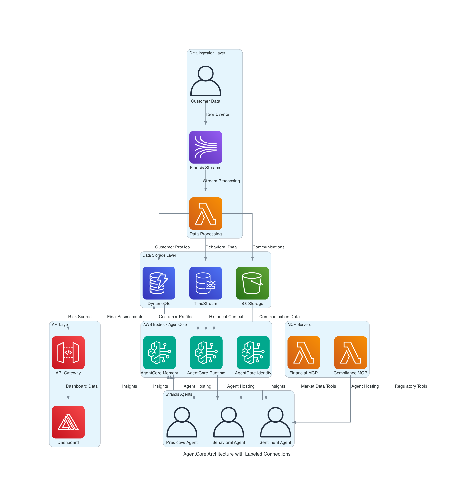
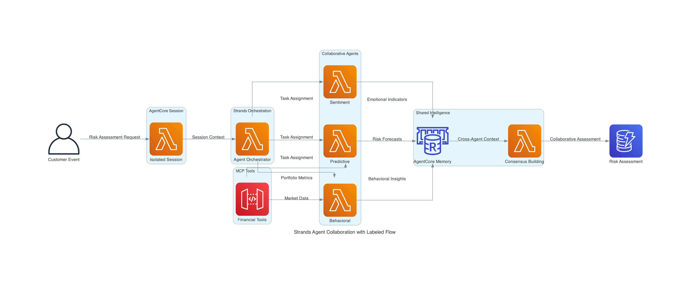

# Agentic Customer Risk Assessment Engine Design

## Overview

The Agentic Customer Risk Assessment Engine automatically evaluates customer financial risk profiles by analyzing their behavior, communications, and market interactions. Instead of relying on static questionnaires, the system uses AI agents to understand how customers actually behave with their money.

### How It Works
1. **Data Collection**: Customer transactions, communications, and market data flow into the system
2. **AI Analysis**: Five specialized AI agents analyze different aspects of risk (behavior, sentiment, compliance, predictions, market context)
3. **Collaboration**: Agents share insights and build consensus on risk levels
4. **Results**: Real-time risk assessments with clear explanations for analysts and customers

### Key Benefits
- **More Accurate**: Uses actual behavior patterns, not just stated preferences
- **Real-time**: Updates risk profiles as new data arrives
- **Explainable**: Provides clear reasons for risk assessments (required for compliance)
- **Predictive**: Forecasts potential risk changes before they happen
- **Cost-Effective**: Uses the right AI model for each task to optimize costs

## Architecture

### System Architecture



*This diagram shows the complete data flow with labeled connections, making it clear what type of data flows between each component.*

### Agent Collaboration Flow



*This diagram shows how agents share insights and build consensus through AgentCore Memory.*

### System Flow

```
Customer Data → AgentCore Session → Strands Orchestration → MCP Tools → AgentCore Memory → Results → Dashboard
```

**Process Steps:**
1. **Data Ingestion**: Customer data streams into Kinesis → Lambda processing → Storage (TimeStream/S3/DynamoDB)
2. **Agent Triggering**: Data events trigger Strands agents deployed on AgentCore Runtime
3. **Session Isolation**: Each customer assessment runs in isolated AgentCore microVM
4. **Tool Integration**: Agents call MCP servers (Lambda functions) for external data
5. **Collaboration**: Agents share insights through AgentCore Memory and build consensus
6. **Results**: Final assessments stored in DynamoDB and served via API Gateway to dashboard

## Component Architecture

### AWS Bedrock AgentCore Platform
- **AgentCore Runtime**: Hosts Strands agents with microVM isolation and extended runtime (up to 8 hours)
- **AgentCore Memory**: Manages short-term, long-term, and cross-agent memory
- **AgentCore Identity**: Secure credential management for external API access
- **AgentCore Observability**: Decision tracing and explainable AI for compliance

### AWS Data & Infrastructure Services
- **Amazon Kinesis**: Real-time data streaming
- **Amazon TimeStream**: Time-series database for behavioral patterns
- **Amazon S3**: Document storage for communications and reports
- **Amazon DynamoDB**: Customer profiles and final assessment results
- **AWS Lambda**: Data processing and MCP servers (NOT the AI agents)
- **API Gateway**: REST APIs for dashboard access
- **AWS Amplify**: Frontend hosting

### Strands Agents (Running ON AgentCore)
- **Behavioral Agent**: Claude 3.5 Haiku - Analyzes transaction patterns and investment behavior
- **Sentiment Agent**: Amazon Nova Micro - Processes communications for emotional indicators
- **Compliance Agent**: Amazon Titan Text Express - Validates regulatory requirements
- **Predictive Agent**: Claude 3.5 Sonnet - Forecasts potential risk changes
- **Market Context Agent**: Amazon Nova Lite - Adjusts for current market conditions

### MCP Servers (AWS Lambda Functions)
- **Financial Data MCP Server**: Portfolio analysis, market data, risk calculation tools
- **Compliance MCP Server**: Regulatory validation, audit trails, compliance reporting
- **Communication MCP Server**: Sentiment analysis, emotional indicators, stress detection

## Agent Collaboration

### AgentCore Session Management
- **MicroVM Isolation**: Each customer assessment runs in secure microVM
- **Extended Runtime**: Complex workflows can run up to 8 hours
- **Session Context**: AgentCore Memory maintains context across interactions

### Strands Orchestration
- **Autonomous Workflows**: Agents decide their own analysis approach
- **Dynamic Tool Selection**: Agents choose which MCP tools to use
- **Reflection and Reasoning**: Agents validate their own conclusions

### Consensus Building Process
1. **Parallel Analysis**: All agents process customer data simultaneously
2. **Insight Sharing**: Agents share findings through AgentCore Memory
3. **Conflict Resolution**: Strands orchestrator manages disagreements
4. **Final Synthesis**: Collaborative results with consensus metadata

## Key Architectural Decisions

### Why AgentCore Instead of Lambda?
- **Session Isolation**: MicroVM isolation for sensitive financial data
- **Extended Runtime**: Up to 8-hour processing for complex analysis
- **Built-in Observability**: Decision tracing meets regulatory requirements
- **Consumption Pricing**: Pay only for active processing time

### Why Strands Framework?
- **Autonomous Reasoning**: Agents decide their own analysis approach
- **Native AgentCore Integration**: Seamless memory and identity integration
- **Multi-Agent Collaboration**: Built-in consensus building and conflict resolution

### Why MCP Servers?
- **Protocol Standardization**: Consistent interface for external data
- **Security**: Centralized credential management through AgentCore Identity
- **Maintainability**: Standardized integration patterns

### Why TimeStream for Time-Series Data?
- **Query Performance**: Sub-second queries for 90-day behavioral patterns
- **Built-in Functions**: Automatic aggregation and trend analysis
- **Cost Efficiency**: Pay only for data queried, not stored

## Data Models

### TimeStream Tables
```json
// Behavioral Metrics
{
  "customer_id": "string",
  "time": "timestamp",
  "transaction_amount": "double",
  "portfolio_value": "double",
  "risk_taking_behavior": "double (0-1)"
}

// Sentiment Timeline
{
  "customer_id": "string",
  "time": "timestamp",
  "sentiment_score": "double (-1 to 1)",
  "stress_level": "double (0-1)"
}
```

### DynamoDB Tables
```json
// Customer Profile
{
  "customer_id": "string",
  "demographics": {"age": "number", "income_bracket": "string"},
  "investment_objectives": {"time_horizon": "string", "risk_preference": "string"}
}

// Final Risk Assessment
{
  "customer_id": "string",
  "overall_risk_score": "float (0-1)",
  "risk_category": "low|medium|high",
  "confidence": "float (0-1)",
  "agent_results": {
    "behavioral": {"risk_score": "float", "insights": "object"},
    "sentiment": {"risk_score": "float", "insights": "object"},
    "compliance": {"compliance_score": "float", "insights": "object"},
    "predictive": {"risk_change_probability": "float", "insights": "object"},
    "market_context": {"market_adjusted_score": "float", "insights": "object"}
  },
  "collaborative_insights": {
    "consensus_confidence": "float (0-1)",
    "cross_agent_patterns": "array<string>"
  },
  "assessment_timestamp": "ISO datetime",
  "status": "pending|in_progress|complete"
}
```

## API Interface

### REST Endpoints
- `GET /customers/{customer_id}/assessment` - Retrieve current risk assessment
- `POST /customers/{customer_id}/data` - Submit new customer data for analysis
- `POST /customers/{customer_id}/simulate` - Run scenario simulations

### Real-time Updates
- **AppSync GraphQL**: Real-time subscriptions for live assessment updates
- **WebSocket**: Live agent reasoning transparency for dashboard

## Performance & Scalability

### Performance Targets
- **Context Loading**: < 800ms for 90-day historical context
- **Agent Processing**: < 3 seconds total response time
- **Concurrent Users**: 50+ concurrent customer assessments
- **Real-time Updates**: Sub-second latency for dashboard updates

### Cost Optimization
- **Right-sized Models**: 60% cost savings using optimal model per agent
- **Consumption Pricing**: Pay only for active agent processing time
- **Efficient Queries**: TimeStream optimized for time-range queries

## Security & Compliance

### Security Features
- **MicroVM Isolation**: Each customer session isolated for data security
- **AgentCore Identity**: Secure credential management for external APIs
- **Encryption**: Data encrypted at rest and in transit
- **IAM Roles**: Least-privilege access for all components

### Compliance Features
- **Decision Tracing**: Complete audit trail of agent reasoning
- **Explainable AI**: Natural language explanations for all assessments
- **Data Retention**: Configurable retention policies for different data types
- **Regulatory Reporting**: Automated compliance report generation

## Deployment

### Infrastructure as Code
- **AWS CDK**: Python-based infrastructure provisioning
- **Environment Separation**: Dev, staging, production configurations
- **Automated Pipeline**: CI/CD with AWS CodePipeline

### Core Resources
- **AgentCore Runtime**: Hosts 5 Strands agents
- **TimeStream Database**: Behavioral and sentiment data
- **DynamoDB Tables**: Customer profiles and assessments
- **Lambda Functions**: Data processing and MCP servers
- **S3 Bucket**: Communications and reports storage
- **API Gateway + Amplify**: API and frontend hosting

## Architecture Benefits

The AgentCore-powered architecture delivers:

- **Enterprise Security**: MicroVM isolation for sensitive financial data
- **Regulatory Compliance**: Built-in decision tracing and explainable AI
- **Cost Optimization**: 60% cost savings with right-sized models
- **Scalability**: Auto-scaling runtime supports thousands of assessments
- **Collaborative Intelligence**: 15-25% accuracy improvement from agent collaboration
- **Operational Simplicity**: Managed platform eliminates infrastructure complexity